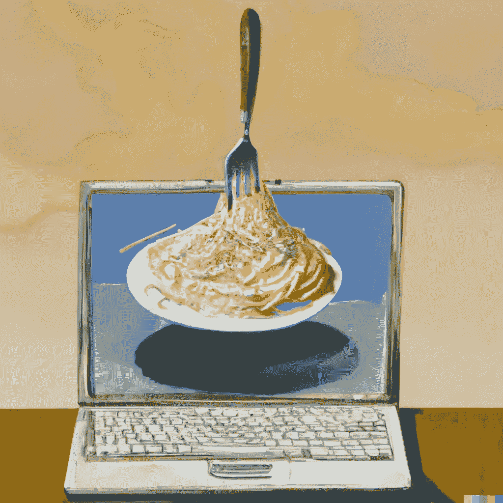

# 千禧一代和 Z 世代的程序员拒绝他们父母的意大利面条式代码。

> 原文：<https://levelup.gitconnected.com/millennial-and-gen-z-programmers-reject-their-parents-spaghetti-code-cf481bff8cdd>

年轻一代正在采取大胆的措施拒绝不良代码，也就是众所周知的意大利面条代码。

“我们完全把意大利菜从菜单上删除了，”一名训练营主管说。“我们不希望我们的学生再受那种想法的影响。”

一项突破性研究发表在*《妈妈咪呀！JavaScript in italiano absolute "*发现，当在两段代码之间做出选择时，千禧一代和 Z 世代的程序员会一致选择不太像意大利面条的代码，意大利面条是上一代的巨大叉子。

“我们不在乎评论是实际代码行的两倍多，”加州大学戴维斯分校(UC Davis)大三学生迈克尔(他们)说，“只要它看起来不像一碗意大利面，我们就很高兴。”

并非每个人都对这一新发展感到高兴。“有很多好的代码看起来像意大利面条，”谷歌的第 33 学位软件工程师约翰说，“例如，Linux 内核就是将大量硬件面条放在一起的肉酱面。我不想让下一代程序员变得如此保守。”

“我们的制度是由意大利面条法典塑造的，”一位社会科学家说，“要解开现代文明中黏糊糊、热气腾腾的意大利面条的叉子，需要很大的努力。”

我们看了看年轻人如此强烈拒绝的意大利面条代码。这里有一个例子:

## 两人份的意大利面条代号 alla carbonara。

**配料:**

1.  嵌套三元运算符。
2.  钻石式多重继承。
3.  全局变量。
4.  eval()。

**方向:**

1.  将 CPU 预热到 375 度。
2.  在一个大锅里，将水烧开，煮 10 分钟。
3.  排出代码，混合三元运算符、类和全局变量。
4.  将代码放在烤盘中，并评估()两个小时。
5.  用更多的三元运算符装饰。

## 关于意大利面水中的盐的一个简短的题外话。

有一件事，也只有一件事，是老程序员和新程序员都能认同的。这就是意大利面水里要加的盐量。

答案是:大量的盐。

盐水会产生化学反应，分解意大利面中的纤维素，使其变得更嫩。反过来，这种反应会向意大利面的水中添加更多的淀粉，如果你是一名摇滚明星厨师，这些淀粉可以用来增加酱汁的浓度。

此外，对健康的担忧可以忽略不计，因为大部分盐在烹饪结束时会随水一起被丢弃。

程序员喜欢这种烹饪方式，因为它能缓解心理压力；用大量的盐烹饪意大利面会软化每个编码者脑海中像十字架一样的意大利面结构。

如果你是一名 JavaScript 开发人员，可以考虑在你的意大利面上配一份花椰菜沙拉。花椰菜的分形结构看起来就像 Node.js 早期的回调地狱。

更多烹饪技巧，请支持我在 Kickstarter 上的书《程序员的烹饪:忙碌的开发人员的代码食谱》。

## 结论

只有时间能告诉我们这对这个行业是好是坏。至少，我们都应该努力写出不那么像意大利面条，而更像组织良好的砂锅菜的代码。

*感谢阅读！如果你喜欢这些幽默的科技故事，并想支持我永远坚持写作，可以考虑* [*报名成为中等会员*](https://sebastiancarlos.medium.com/membership) *。每月 5 美元，你可以无限制地阅读媒体上的故事。如果你* [*用我的*](https://sebastiancarlos.medium.com/membership) *链接注册，我会赚一小笔佣金。也可以关注我的* [*中*](https://sebastiancarlos.medium.com/) *和* [*推特*](https://twitter.com/5ebastiancarlo5) *。*

 [## 加入我的介绍链接媒体-塞巴斯蒂安卡洛斯

### 作为一个媒体会员，你的会员费的一部分会给你阅读的作家，你可以完全接触到每一个故事…

sebastiancarlos.medium.com](https://sebastiancarlos.medium.com/membership)