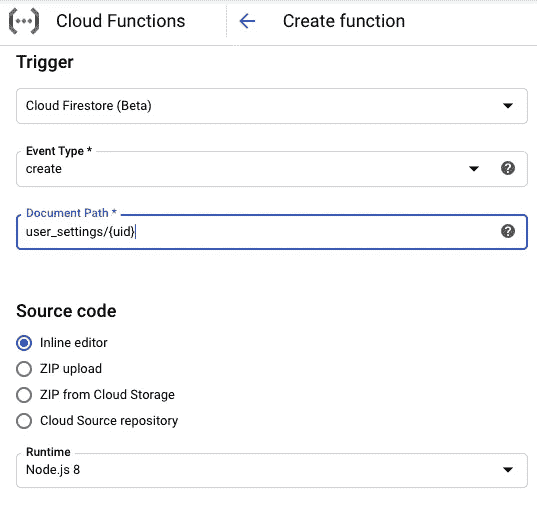

# 使用 Firebase 和 Cloud 函数模拟 Laravel 模型事件

> 原文：<https://levelup.gitconnected.com/mimic-laravel-model-events-using-firebase-and-cloud-functions-70357b5ac6f7>

如果你正在读这篇文章的标题，并且在想:

> 什么？敬哈？

那也许我忽略了这一点。但是如果你想的更多的是:

> 哦，我是一个使用传统后端的人，也对无服务器后端感兴趣。

然后继续读下去。

我将谈谈为什么我如此喜欢使用 [Laravel 模型事件](https://laravel-news.com/laravel-model-events-getting-started)，然后通过一个非常基本的例子来说明如何在基于 Firebase 的应用程序中使用类似的方法来驱动事件。

# 为什么我喜欢模特活动

如果您熟悉 Laravel，那么您可能会遇到一个方便的工具，用于在您的模型发生某些事情时触发事件。比如，你创建一个新的`User`:

```
/*
 * from a function somewhere in your Controller
 */\App\User::create([/*user data*/]);
```

现在怎么办？也许他们会收到一封电子邮件:

```
/*
 * from a Listener that you registered
 */User::created(function($user) {
  Mail::to($user->email)->send(new WelcomeEmail($user));
});
```

我的过度简化的代码代表了 Laravel 的因果功能，这使得确保某些事情总是发生变得简单，无论您在代码中的什么地方调用更改，这是一种提取复杂代码并将其划分的好方法。

# 使用云函数和 Firebase 获得相同的行为

如果你用过 Firebase，那么你已经准备好了。如果没有，让我们花点时间讨论一下 Firebase。

Firebase 对我来说是相当新的，但是到目前为止，它为我提供了良好的服务。

Firebase 是 web 和应用程序开发人员的梦想，如果使用 Flutter 就更好了。它允许您非常快速、轻松地处理应用程序身份验证、数据库和存储。我还尝试了 Android 的应用分发功能，发现它比使用 Play Store 的 Publisher dashboard 要高效得多。

Firebase 的另一个伟大特性是与 Google Cloud 的直接集成，也就是说，在这里是云功能。

# 选择一个数据库

在你[创建了你的 Firebase 项目](https://firebase.google.com/)之后，你可能会想要选择一个数据库。查看[这篇文章](https://firebase.google.com/docs/database/rtdb-vs-firestore)了解如何设置。在下一步中，您将看到，基于 [Firebase 身份验证](https://firebase.google.com/docs/auth)服务触发事件也是可能的，根本不需要数据库设置。

但是因为我在这里的目标是演示一个类似于 Laravel 模型事件的功能，所以我将用一个使用 Cloud Firestore(一个非常好的 NoSQL 选项)的例子来说明。

# 创建云函数

让我们直接创建一个云函数来监听它发出电子邮件的提示。如果你以前没有这样做过，试试这个关于[让设置开始使用云功能](https://cloud.google.com/functions/docs/quickstart-console)的有用的小技巧。在“创建函数”部分，返回到这里了解设置触发器的详细信息。

好了，扳机！

这是有趣的部分，这就是为什么我把你链接到所有其他无聊的东西，而不是在这里一步一步地看🤭。



设置一个云函数来监听 user_settings 集合中文档的创建。

如前所述，我使用云 Firestore 作为我的数据库。在这个例子中，假设在您的项目的 Firebase 身份验证服务中创建了一个新用户，您还创建了一个名为`user_settings`的集合文档(例如表条目),其中包含了这个用户的一些附加属性。设置文档的输入现在将导致上面定义的函数启动。

我真正喜欢的是另一件小事:安全。如果你从你的应用程序中与外部 API 来回通信，把访问和 API 密匙留在你的应用程序代码之外，并把它整齐地保存在云中。

回到我们的例子，让我们发送电子邮件！我将展示一个使用我强烈推荐的[邮戳](https://postmarkapp.com/)的例子。

我将使用 Node.js 8 作为上面选择的运行时来展示我的例子。

现在在包裹里。JSON 选项卡中的代码编辑器部分设置了几个库:

```
{
  "name": "sample-firestore",
  "version": "0.0.1",
  "dependencies": {
    "nodemailer": "^6.4.0",
    "nodemailer-postmark-transport": "^2.2.0",
    "postmark": "^2.3.5"
  }
}
```

在索引中。JS 编辑器:

```
const nodemailer = require('nodemailer');
const postmarkTransport = require('nodemailer-postmark-transport')
const postmark = require("postmark");/**
 * Triggered by a change to a Firestore document.
 *
 * [@param](http://twitter.com/param) {!Object} event Event payload.
 * [@param](http://twitter.com/param) {!Object} context Metadata for the event.
 */
exports.helloFirestore = (event, context) => {
  const resource = context.resource;
  // log out the resource string that triggered the function
  console.log('Function triggered by change to: ' +  resource);
  // now log the full event object
  console.log(JSON.stringify(event));

  // Send an email:
  var client = new postmark.ServerClient("[ENTER YOUR SERVER CLIENT KEY HERE]");if (event.value.fields.email.stringValue != '') {
    client.sendEmailWithTemplate({
      "From": "welcome[@your-app-name.com](mailto:hello@your-app-name.com)",
      "To": event.value.fields.email.stringValue,
      "TemplateAlias": "welcome-email",
      "TemplateModel": {
        "content": "Welcome to Your-App-Name!",
        "name": event.value.fields.name.stringValue,
        "email": event.value.fields.email.stringValue
      }
    });
  }
};
```

这里我在邮戳中设置了一个名为`welcome-email`的模板，我只是使用`TemplateModel`属性发送一些信息。你可能想要利用任意数量的可用服务来处理你的事务性电子邮件，比如 [Sendgrid](https://sendgrid.com/) 或 [Mailgun](https://www.mailgun.com/) 。我特别喜欢在邮戳中管理电子邮件模板的方式。

现在，只需部署您的函数，您就可以开始构建基础了！受够了这种欢迎邮件的东西…

你手上有这么多权力，你会建造什么？无论您是刚刚开始云开发，还是云专家，我都希望听到您的反馈。你用什么服务来完成我正在讨论的事情？比起谷歌云函数，你更喜欢 AWS Lambda 函数吗？直接联系我或者在下面留下你的评论。


泰勒·尼克斯在 [Unsplash](https://unsplash.com?utm_source=medium&utm_medium=referral) 上的照片