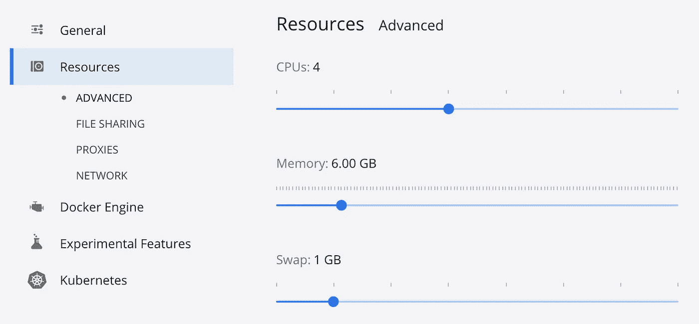
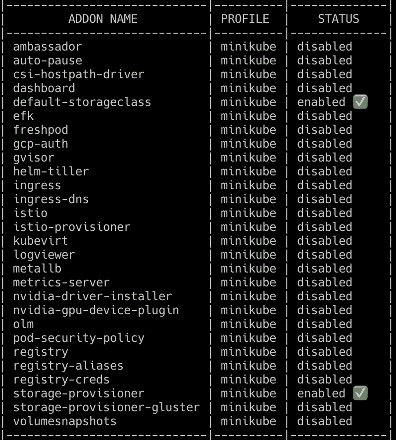
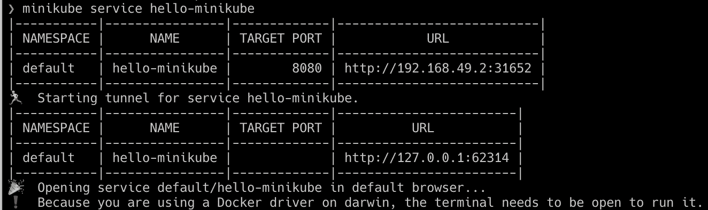
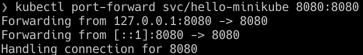

# Minikube 提示和技巧

> 原文：<https://levelup.gitconnected.com/minikube-tips-tricks-739f4b00ac17>

minikube 最佳实践和技巧的集合，用于改善运行本地 Kubernetes 集群的开发人员体验。


Minikube 是在 macOS、Linux 和 Windows 上运行本地 Kubernetes 集群的一个流行选项。虽然它拥有丰富的功能集和跨平台支持，但 minikube 的行为与全功能的 Kubernetes 集群略有不同，后者经常让开发人员和希望在本地测试其应用程序的 Kubernetes 新用户感到困惑。在本帖中，我们将介绍一些常见的陷阱和技巧，让你的开发团队更好地体验 minikube。

(*注:有关 Kubernetes 的替代解决方案，请参见“*[*【Kubernetes for Local Development】*](https://blog.devgenius.io/kubernetes-for-local-development-a6ac19f1d1b2)*”*)

# 给 Minikube 更多的 CPU 和内存

默认情况下，minikube 启动时有 2 个 CPU 和 2gb 的内存，这对于测试一些微服务的较小团队来说可能足够了。然而，一旦 minikube 被用于运行与数据库(例如 PostgreSQL、Redis)和消息队列(例如 Kafka)的集成测试，minikube 就会因为耗尽资源限制而崩溃。要避免这种情况，首先要为底层驱动程序(如 VirtualBox、Docker 等)提供更多资源:



然后通过以下方式设置内存和 cpu 配置:

```
$ minikube config set memory 6144
$ minikube config set cpus 4
```

或者在启动时通过命令行标志:

```
$ minikube start --memory 6144 --cpus 4
```

要最大限度地利用可用资源:

```
$ minikube start --memory=max --cpus=max
```

# 设置 Kubernetes 版本

Minikube 最多支持六个以前的 Kubernetes 次要版本。如果您的组织使用的是托管的 Kubernetes 服务(例如 GKE、EKS、AKS)，那么在生产环境中运行的版本很可能不是 Kubernetes minikube 默认运行的最新版本。虽然这通常不是问题，但一些 Kubernetes 版本有突破性的变化(例如， [1.20 用 containerd](https://blog.devgenius.io/no-docker-isnt-dead-2b9ee45d5833) 替换 docker-shim)和弃用(例如， [1.16 删除了](https://blog.devgenius.io/upgrading-to-kubernetes-1-16-ad977933694d) `[extensions/v1beta1](https://blog.devgenius.io/upgrading-to-kubernetes-1-16-ad977933694d)` [到稳定的 API 版本](https://blog.devgenius.io/upgrading-to-kubernetes-1-16-ad977933694d))。您可以使用以下选项设置所需的 Kubernetes 版本:

```
$ minikube start --kubernetes-version=v1.19.0
```

当您需要测试运行不同版本的多个集群时，设置 Kubernetes 版本也很有用。结合使用`--profile`标志来创建不同的集群:

```
$ minikube start -p dev --kubernetes-version=v1.19.0
$ minikube start -p stage --kubernetes-version=v1.18.0
```

# 使用本地 Docker 图像

除非您使用类似于 [skaffold](https://skaffold.dev/) 的工作流自动化工具，否则您需要手动将容器图像推送到 minikube 以使用本地构建的工件。对于使用 Docker 容器运行时构建的集群(与 cri-o 或 containerd 相反)，让您的终端使用集群内 Docker 守护进程:

```
$ eval $(minikube docker-env)
```

现在，所有 Docker 命令都将针对集群中的 Docker 守护进程运行:

```
$ docker build -t my_awesome_image .
```

一旦构建了映像，任何请求该映像的 Kubernetes 工作负载都可以使用它。但是，请确保将`imagePullPolicy`设置为`Never`，否则 Kubernetes 将试图从远程存储库中提取图像，从而导致失败。

要返回使用您的电脑自己的 Docker 守护程序，请打开一个新的终端窗口或运行:

```
$ eval $(minikube docker-env -u)
```

对于其他运行时，请查看:

 [## 推送图像

### 比较将您的映像推入 minikube 集群的 8 种方式。术语表:拉意味着下载一个容器映像…

minikube.sigs.k8s.io](https://minikube.sigs.k8s.io/docs/handbook/pushing/) 

# 明智地使用 Minikube 插件

Minikube 维护了几个附加功能的扩展，默认情况下启用了`default-storageclass`和`storage-provisioner`:



要启用其他插件，请运行:

```
$ minikube addons enable <name-of-addon>
```

虽然这为开发人员提供了一种快速安装调试工具(如 dashboard、efk、metrics-server)或网络工具(如 ingress、istio)的简单方法，但我不建议启用这些工具，原因有二:

1.  对于拥有资源受限机器的开发者来说，这些插件会蚕食可用资源。如果可能，使用替代解决方案为应用程序单元预留资源。例如，不是直接运行 Kubernetes 仪表板，而是与 [Lens](https://k8slens.dev/) 或 [K9s](https://k9scli.io/) 集成以满足仪表板需求。
2.  为了保持在 minikube 和生产集群之间安装这些扩展服务的一致方式，请利用现有方法来安装它们(例如，用于 nginx 入口的 Helm chart，而不是 minikube 的入口)。

# 访问应用程序

虽然 Kubernetes 支持`NodePort`和`LoadBalancer`服务类型以将内部应用程序暴露给外部流量，但 minikube 如何实现这些取决于操作系统(例如 macOS 与 Linux)和部署选项(例如 Docker、VirtualBox、VMWare)。

我看到的最常见的问题是 macOS 用户使用 Docker 驱动程序运行 minikube。由于 macOS 上没有 [docker0 桥，这使得主机无法访问容器 IP。换句话说，当我通过 NodePort 公开一个 Kubernetes 服务时，我不能直接从我的终端点击`$(minikube ip):<port>`。为了举例说明，让我们以来自](https://docs.docker.com/docker-for-mac/networking/#there-is-no-docker0-bridge-on-macos) [minikube quickstart](https://minikube.sigs.k8s.io/docs/start/) 的 echoserver 为例。在 macOS 上点击 minikube 端点会挂起，而在 Linux 上，它会返回预期的结果:

```
# Echo server example with nodeport 31652$ kubectl create deployment hello-minikube --image=k8s.gcr.io/echoserver:1.4
$ kubectl expose deployment hello-minikube --type=NodePort --port=8080# on macOS this hangs
$ curl $(minikube ip):31652curl: (7) Failed to connect to 192.168.49.2 port 31652: Network is unreachable# on Linux, this returns
$ curl $(minikube ip):31652CLIENT VALUES:
client_address=172.17.0.1
command=GET
real path=/
...
```

有三种方法可以访问服务的节点端口:

1.  使用`minikube service <service-name>`命令让 minikube 创建一个隧道并分配一个随机节点端口值:



2.使用`port-forward`命令将服务映射到本地主机:



3.或者在启动 minikube 时预先暴露端口(或端口范围)

```
$ minikube start --extra-config=apiserver.service-node-port-range=32760-32767 --ports=127.0.0.1:32760-32767:32760-32767
```

对于习惯于使用`docker -p`命令或通过 docker-compose 文件设置端口的开发人员来说，最后一种方法可能感觉更自然。如果应用程序有几个预期的端口范围要导出(例如，PostgreSQL 的端口范围是 5432，Kafka 的端口范围是 9092)，那么只开放单个端口也可以满足需求。否则，使用 port-forwarding 命令不仅可以与 minikube 交互，还可以与远程集群交互。对于那些寻找一个完美的用户界面来管理这些的人来说， [Kube Forwarder](https://kube-forwarder.pixelpoint.io/) 是一个很好的解决方案。

对于`LoadBalancer`类型的服务，可以通过`minikube tunnel`命令公开。它作为一个进程运行，并使用群集的 IP 地址作为网关在主机上创建一个网络路由。虽然这有助于公开单个服务，但最常见的用例是公开入口控制器(例如 nginx、ambassador、traefik)并通过入口路由传入流量。修改`/etc/hosts`文件以将`minikube ip`映射到一个 DNS 名称也可以模拟命中外部 DNS 端点。

*(注意:还有一种方法可以通过设置* `*--listen-address=0.0.0.0*` *来配置 minikube 监听远程网络，即将 minikube 暴露给外界。虽然这对于测试来说很方便，但是考虑到安全隐患，请谨慎使用。)*

# 通过主机装载和文件同步进行热重装

Minikube 支持将主机目录挂载到 VM 中，类似于`docker -v`命令。要装载目录，请运行:

```
$ minikube mount <src dir on host>:<target dir on minikube>
```

这可以被任何 Kubernetes 容器引用:

```
volumeMount:
- name: configs
  mountPath: /usr/app/configs
volumes:
- name: configs
  hostPath:
    path: <target-dir-from-minikube-mount>
```

这对于挂载各种配置或机密进行测试非常有用，而不必依赖重新加载机制来重新挂载 pod 上的值。

要在启动时将文件同步到 minikube，您也可以将文件放在`$MINIKUBE_HOME/files`下。一个很好的用例是安装定制的 DNS 配置或 SSL 证书。

```
$ mkdir -p ~/.minikube/files/etc
$ echo nameserver 8.8.8.8 > ~/.minikube/files/etc/resolv.conf
$ minikube start
```

# 最后的想法

对于大多数从 Docker 到 Kubernetes 的开发人员来说，minikube 为“简单地”测试他们的应用程序带来了一些复杂性和挑战。Minikube 与迭代应用程序开发解决方案(如 [Draft](https://draft.sh/) 、 [Okteto](https://github.com/okteto/okteto) 和 [Skaffold](https://github.com/GoogleContainerTools/skaffold) )配合得最好，但即使没有这些工具，了解如何设置适当的资源、推送图像和从外部访问应用程序也有助于使本地 Kubernetes 体验更加无缝。