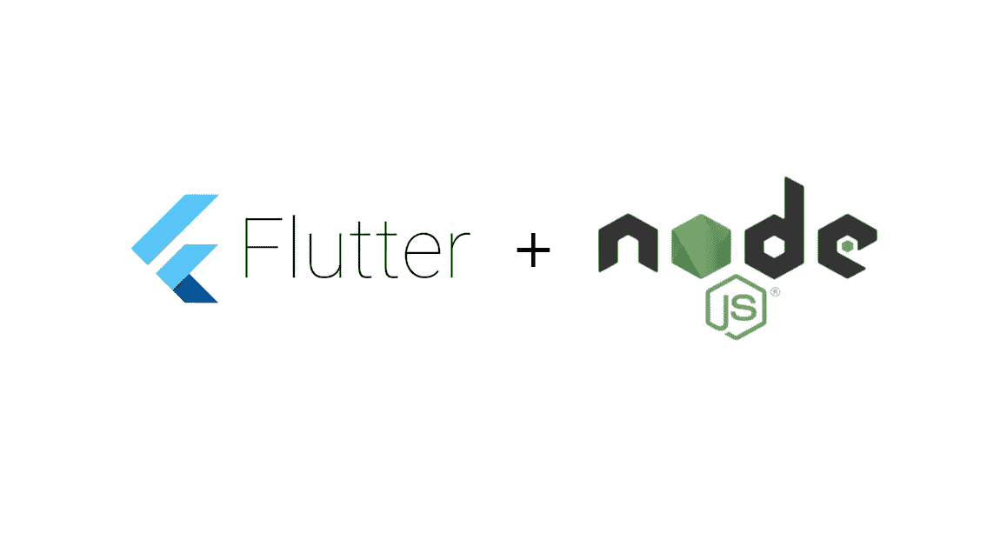
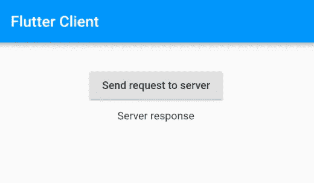
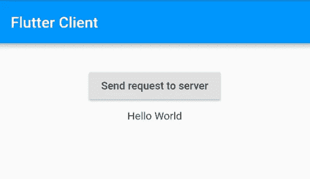

# Flutter 和 Node.js 的最小客户端-服务器示例

> 原文：<https://levelup.gitconnected.com/minimal-client-server-example-for-flutter-and-node-js-3e1b376f1093>



在本教程中，我将向您展示如何设置 Node.js 服务器和与之交互的 Flutter 应用程序。服务器代码将在您的本地机器上运行，而 Flutter 应用程序将在 Android 模拟器或 iOS 模拟器上运行。

# 节点. js

我们将从设置服务器开始。本节基于[安卓版的本教程](https://medium.com/@studymongolian/minimal-client-server-example-for-android-and-node-js-343780f28c28)。

[下载](https://nodejs.org/en/)并安装 Node.js

为您的 server 应用程序创建目录。姑且称之为 **node_server** 。

```
mkdir node_server
cd node_server
```

使用节点包管理器设置新项目:

```
npm init
```

接受除入口点之外的默认值。我就用名字 **app.js** 代替 **index.js** 。然后创建一个名为 **app.js** 的文件。

```
touch app.js
```

在您喜欢的编辑器中打开该文件。很多人用 [Visual Studio 代码](https://code.visualstudio.com/)。

让我们使用[入门指南](https://nodejs.org/en/docs/guides/getting-started-guide/)中的代码。将其粘贴到您的 **app.js** 文件中。

```
const http = require('http');const hostname = '127.0.0.1';
const port = 3000;const server = http.createServer((req, res) => {
  res.statusCode = 200;
  res.setHeader('Content-Type', 'text/plain');
  res.end('Hello World\n');
});server.listen(port, hostname, () => {
  console.log(`Server running at http://${hostname}:${port}/`);
});
```

现在运行应用程序。

```
node app.js
```

您可以通过在浏览器栏中粘贴以下内容来测试它是否正常工作:

```
[http://localhost:3000/](http://localhost:3000/)
```

您应该会看到显示的`Hello World`。

# 摆动

现在让我们继续设置一个 Flutter 应用程序来测试服务器。

## 1.布局

我们将创建以下 UI 布局。您还不需要做任何事情，因为下面将包含相关代码。



## 2.密码

将 http 库添加到 **pubspec.yaml** :

```
dependencies:
  http: ^0.13.3
```

用以下代码替换**主镖**:

```
import 'dart:io';

import 'package:flutter/material.dart';
import 'package:http/http.dart';

void main() => runApp(MyApp());

class MyApp extends StatelessWidget {
  @override
  Widget build(BuildContext context) {
    return MaterialApp(
      title: 'Node server demo',
      debugShowCheckedModeBanner: false,
      theme: ThemeData(
        primarySwatch: Colors.*blue*,
      ),
      home: Scaffold(
        appBar: AppBar(title: Text('Flutter Client')),
        body: BodyWidget(),
      ),
    );
  }
}

class BodyWidget extends StatefulWidget {
  @override
  BodyWidgetState createState() {
    return new BodyWidgetState();
  }
}

class BodyWidgetState extends State<BodyWidget> {
  String serverResponse = 'Server response';

  @override
  Widget build(BuildContext context) {

    return Padding(
      padding: const EdgeInsets.all(32.0),
      child: Align(
        alignment: Alignment.*topCenter*,
        child: SizedBox(
          width: 200,
          child: Column(
            crossAxisAlignment: CrossAxisAlignment.center,
            children: <Widget>[
              ElevatedButton(
                child: Text('Send request to server'),
                onPressed: () {
                  _makeGetRequest();
                },
              ),
              Padding(
                padding: const EdgeInsets.all(8.0),
                child: Text(serverResponse),
              ),
            ],
          ),
        ),
      ),
    );
  }

  _makeGetRequest() async {
    final url = Uri.parse(_localhost());
    Response response = await get(url);
    setState(() {
      serverResponse = response.body;
    });
  }

  String _localhost() {
    if (Platform.*isAndroid*)
      return 'http://10.0.2.2:3000';
    else // for iOS simulator
      return 'http://localhost:3000';
  }
}
```

## 3.测试颤振应用程序

运行应用程序。按下按钮，您应该会看到`Hello World`响应。



成功！Node.js 和 Flutter 之间的客户端-服务器通信。

# 发生

为了创建一个更完整的应用程序，您需要了解以下主题的更多信息。

*   [解析 Flutter 中的简单 JSON](https://medium.com/@studymongolian/parsing-simple-json-in-flutter-83ee1809a6ab)
*   [简单的 JSON 例子](https://medium.com/@studymongolian/easy-json-examples-7c70785b4707)
*   [如何在 Flutter 中进行 HTTP 请求](https://stackoverflow.com/a/54915614/3681880)
*   [创建 REST API](https://www.youtube.com/watch?v=F7NVpxxmmgM&list=PL0dzCUj1L5JE4w_OctDGyZOhML6OtJSqR)
*   [如何获得免费 SSL 证书并配置 HTTPS](https://www.youtube.com/watch?v=d4QDyHLHZ9c)