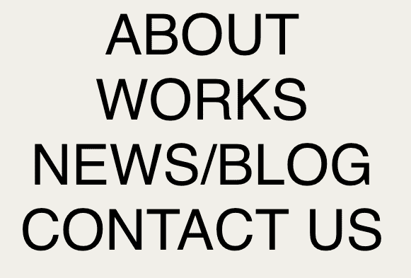
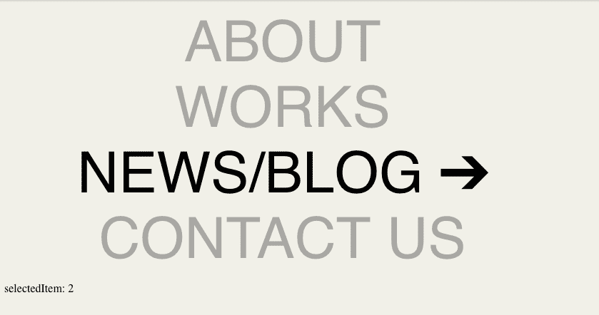
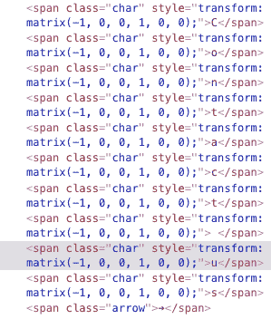

# 带有 Vue.js 和 GSAP 的最小导航菜单— WotW

> 原文：<https://levelup.gitconnected.com/minimalistic-nav-menu-wit-vue-js-and-gsap-wotw-5cf9833bbdb5>

欢迎来到本周系列的[部件的第二季，在这里我拍摄了令人敬畏的 UI/UX 组件的 gif 或视频，并用代码将它们赋予生命。](https://levelup.gitconnected.com/wotw/home)

> 距离我上次发帖已经很久了。我一直忙于一些项目(包括生一个女孩)，但我带着更多的知识和小工具回来了。

今天我们将创建一个极简的导航菜单，当鼠标悬停在一个选项上时，它会显示动画。灵感来自于 [Zhenya Rynzhuk](https://dribbble.com/Zhenya_Artem) 创作的这个[投稿](https://dribbble.com/shots/6109210-Chez-Studio-Menu-Hover-Animation)，看起来是这样的:

# **这是给谁的？**

本教程面向希望提升技能的前端开发人员。建议你先有一些 HTML，CSS，JS 的知识。

我将使用 [Vue.js](https://vuejs.org/) 来制作这个小部件，如果你不熟悉这个框架，这些精彩的帖子可以帮助你快速上手:

*   [用 Vue.js 替换 jQuery](https://www.smashingmagazine.com/2018/02/jquery-vue-javascript/)
*   [从 React 切换到 Vue.js](https://medium.com/js-dojo/switching-from-react-to-vue-js-badf34565a2d)

# 准备

对于今天的小部件，我们将使用 [Vue.js](https://vuejs.org/) ，对于一些动画，我们将使用 [TweenMax](https://greensock.com/tweenmax) 。如果你想继续，你可以派生这个已经有依赖关系的 [codepen 模板](https://codepen.io/ederdiaz/pen/gzyxWv)。

# 搭配外观

这个组件我想做的第一件事就是搭配设计。这可能是最简单的部分，因为没有复杂的图形需要`SVG`或图标。

在我们的应用程序节点中，我将首先为菜单创建标记。由于这将是一个导航菜单，我们应该使用语义正确的 HTML 节点:

在下一步中，我将添加`class="menu-item"`来设计容器和菜单项的样式。此外，`id="app"`将在稍后使用`Vue.js`添加功能和动画。

菜单现在看起来很难看，让我们改变一下:

现在我们应该有这样的东西:

让我解释一下最重要的规则…

*   正在帮助从列表中删除项目符号。
*   `text-transform: uppercase;`在我们不想用屏幕阅读器显式地“吼”用户，只想为了设计目的显示大写字符的时候很有用。
*   `cursor: pointer;`让鼠标表现得好像每个元素都是一个链接。

# 设置 Vue.js

在进入更多细节之前，让我们将 Vue.js 添加到组件中，以便能够动态呈现菜单项。

> *我将元素添加为常量的计算属性，而不是组件中的数据，因为我需要将它们绑定到我的模板，但它们不会随时间而改变。*

现在我们已经有了一个列表，并且它们已经准备好被用作计算属性，我们可以简化我们的模板，用一个`v-for`来呈现所有的菜单项:

现在我们应该有相同的元素，只是绑定到我们的 Vue.js 实例。

# 悬停和动画

参考文献中的菜单动画可以分为两部分，第一部分是向左移动菜单项，第二部分是翻转字符。

让我们从第一个开始，将鼠标光标下方的菜单向左移动。为此，我们将在菜单项中添加一个`@mouseover`事件，该事件将触发一个我们尚未声明的名为`selectedItem()`的函数:

现在对于`selectItem()`方法，我们想要跟踪悬停的项目，所以我们将在组件数据中添加一个`selectedItem`变量。对于没有选择的项目，该属性将从`-1`开始，当鼠标悬停时，它的值将变为所选按钮的索引。

要查看`selectedItem`的变化，您可以在模板中添加下一行:

知道哪个按钮当前被选中将让我们添加一个类来“移动”我们的按钮。为此，我们可以将一个`selected`属性添加到我们计算的`menuItems`中，如下所示:

并在 HTML 中利用这个新属性:

> *注意这里有两个类属性，它们相互连接而不是相互覆盖。当“item.selected”为“true”时，该菜单项将同时具有“menu-item”和“selected”类。*

让我们添加 CSS 类来处理移动:

> *transition 属性表示对该值的任何更改都应该是动态的。*

我们几乎完成了这一部分，但是还缺少一些东西。将鼠标移出所有元素后，最后一个元素保持选中状态，这是我们不希望的。为了解决这个问题，我们可以使用`@mouseleave`事件:

# 添加箭头并使其他项目变暗

在进入角色的动画之前，仍然有一些细节，应该有一个箭头出现在选中的项目上，并且未选中的项目应该变暗或半透明。

让我们快速添加一个箭头字符到我们的菜单项。

> *箭头看起来与参考略有不同，因为它是一个常规的➔字符，而不是一个与设计完全匹配的向量，但对于我们的目的来说已经足够好了。*

我们想要隐藏所有的箭头，除非它们是一个被选择的项目的子项目，我们可以用 CSS 规则来做到这一点，就像我们之前对被选择的项目所做的一样:

现在箭头出现又消失，让我们将未选择的项目变暗。我们可以计算暗显项目，就像我们对选定项目所做的那样:

…将`.dimmed`类添加到我们的 HTML 中的项目:

…最后但同样重要的是，创建`.dimmed` CSS 规则:

我们越来越接近最终产品。

# 角色翻转动画

翻转每个菜单项字符可能是这个小部件中最有趣和最复杂的部分。我们不能只是翻转整个菜单，每个字符都应该单独水平翻转(`scaleX: -1`)。

为了能够“控制”每一个字符，我们需要拆分菜单字符:

…使用`chars`属性，我们现在可以呈现``节点中的每个字符:

> *注意“ref”属性，它将帮助我们使用菜单项的“index”和“charIndex”来“引用”所有这些字符。*

此时，视觉上应该没有什么变化，但是我们应该把菜单分成字符。

我们将添加几个常量，帮助我们更好地阅读代码的下一部分

在那之后，每当`selectedItem`改变，我们想要开始正确地制作所有角色的动画。我们将遍历每个`menuItem`，根据它们是否被选中，我们将翻转它们`LEFT`或`RIGHT`:

`animateChars()`方法还没有声明，但是现在应该不难创建，因为我们有了项目的索引、项目的字符数和翻转字母的方向:

> *在这个方法中，我们基本上是为每个角色获取参考，杀死当前拥有的动画(如果有的话),然后将角色翻转到我们之前计算的方向。*

看起来一切都应该看起来像参考，但它没有😰。

如果我们查看控制台，我们会看到字符被正确转换，正如我所料，TweenMax 正在更改它们的转换矩阵:

在抓了一会儿脑袋并寻找任何错误之后，我发现我们正在制作动画的``节点，默认情况下将它们的`display`属性设置为`inline`。转换似乎不适用于这种类型的显示属性，所以让我们利用添加到这些元素中的`.char`类来解决这个问题:

> *添加了“最小宽度”属性以使文本看起来正确，当添加“内嵌块”显示属性时，像空格这样的字符会失去它们的宽度。*

而现在最后的结果！

我知道还有改进的空间，有时动画运行不流畅是因为所有不同的元素渲染。如果你有任何改进的想法，我很乐意在评论中看到。

这就是本周的**小部件。**

如果你想知道更多，你可以去看看其他的 WotW:

*   [密码验证器](/making-an-interactive-password-validator-wotw-77b677548b75)
*   [动画滑块控件](/making-an-animated-slider-wotw-a98f71438b33)
*   [3D 面对微件](/making-a-3d-facing-widget-8ab51a9eb573)

*最初发布于*[*http://ederdiaz . dev*](http://ederdiaz.dev)*。*

 [## 学习 Vue.js -最佳 Vue.js 教程(2019) | gitconnected

### 27 大 Vue.js 教程-免费学习 Vue.js。课程由开发人员提交并投票，使您能够…

gitconnected.com](https://gitconnected.com/learn/vue-js)