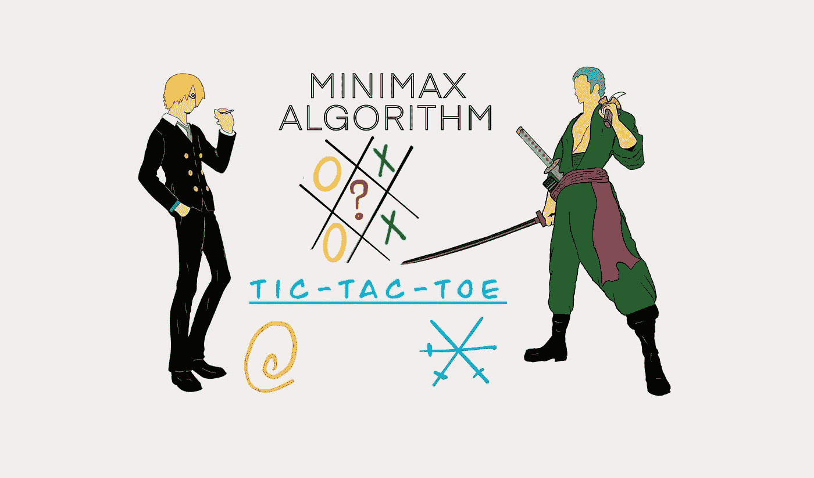
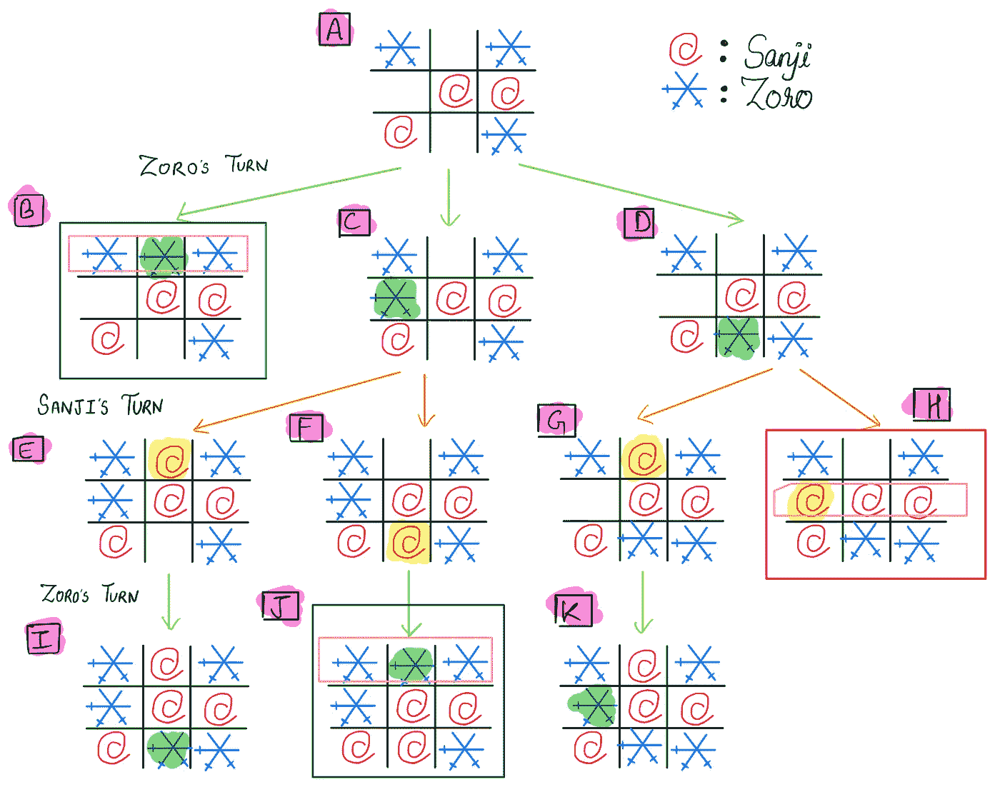
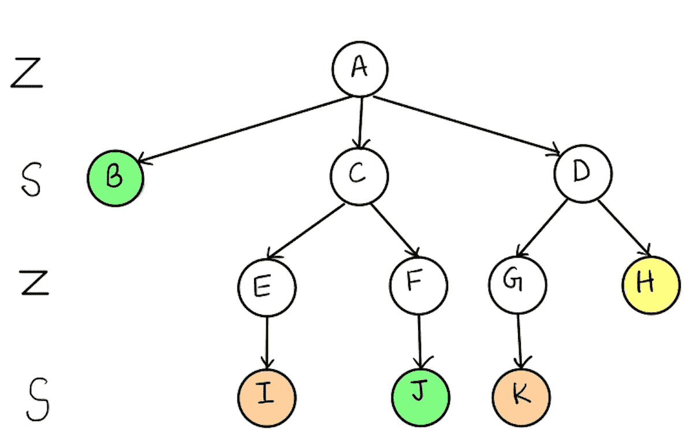
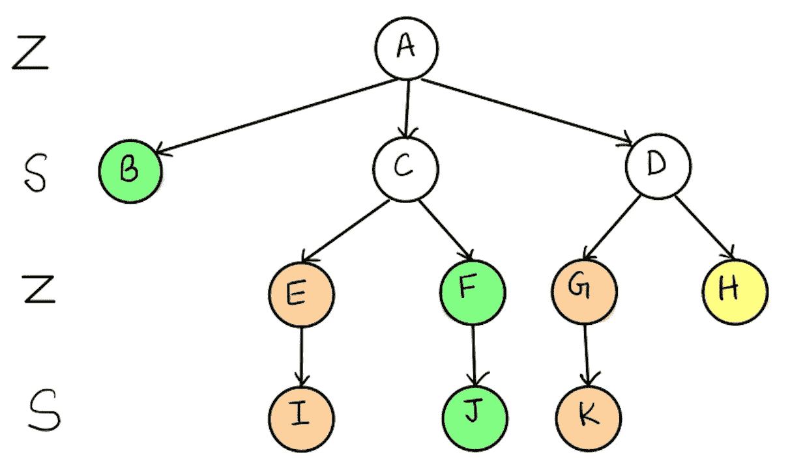
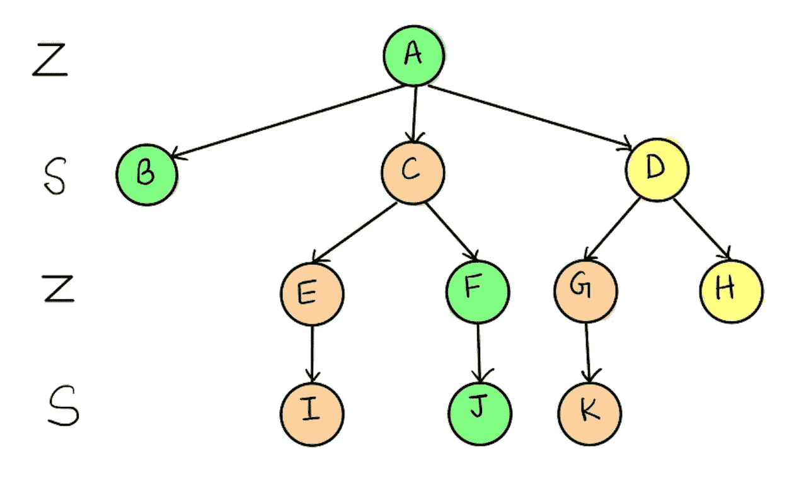
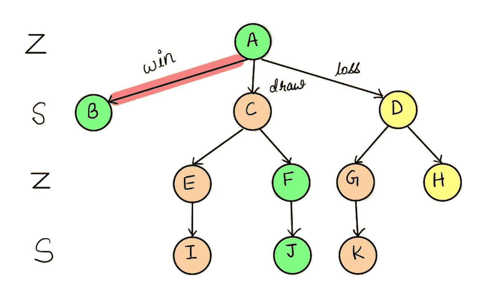

# 用井字游戏解释极大极小算法

> 原文：<https://levelup.gitconnected.com/minimax-algorithm-explanation-using-tic-tac-toe-game-22668694aa13>

本文用井字游戏来解释博弈论中的极大极小算法。

描绘两位玩家和井字游戏的封面艺术。

在人工智能和博弈论中，我们会遇到搜索问题，这些问题可以通过一个相互连接的节点图来解释，每个节点代表一种可能的状态。智能代理必须通过评估每个节点来遍历图，以达到最佳状态。然而，存在标准图搜索算法不能应用的特定问题。在这篇文章中，我将讨论一个可能的解决方案，即极大极小算法。

## 极大极小算法

极大极小算法是决策和博弈论中使用的递归算法。它为玩家提供了一个最优的移动，考虑到竞争对手也在最优地进行游戏。该算法广泛用于人工智能中的游戏，例如国际象棋、井字游戏和无数双人游戏。

在这个算法中，两个玩家玩游戏；一个叫 **' *MAX'*** ，一个叫 **' *MIN* 。**‘玩家的目标是对手利益最小化，自身利益最大化。MiniMax 算法进行深度优先搜索以探索完整的游戏树，然后向下进行到树的叶节点，然后使用递归调用回溯树。

为了更好地理解，我们来看一个井字游戏的例子，这是一个两人游戏，每个人轮流玩。

## 井字游戏的状态空间表示

每种状态都用 3×3 矩阵中两个玩家的字母所占据的位置和其他空的地方来表示。

1. ***初始状态:*** 一个空的 3x3 矩阵。

2. ***中间状态:*** 对当前状态应用有效规则后得到的 3×3 矩阵的任意排列。

3. ***最终状态:*** 相同的字母在一个完整的行或完整的列中，或者完整的对角线赢得比赛。

4. ***规则:*** 玩家将依次获得回合；他们可以在空的格子上标记他们的字母。

## 最小最大插图使用井字游戏

首先，我们考虑的是《海贼王》(日本著名漫画系列)中的两个对手佐罗和山治。他们决定玩井字游戏来解决争论。佐罗选择“X”开始游戏，山治选择“O”开始游戏。在这个例子中，佐罗将试图得到最大可能的分数，而山治将试图使佐罗的可能分数最小化。图 1 显示了中间阶段之后的游戏树。

图一。井字游戏的博弈树经过一定的状态。

在游戏的中间状态(A)中，佐罗有三个选择，即状态' *B* 、' ' *C* 、'和' *D* '挑选状态' *B'* 将导致佐罗的胜利，而选择 *'C'* 和 *'D'* 将导致游戏的进一步回合。如果佐罗试图进入*‘C’*和*‘D’*状态，山治将相应地上场，以此类推。当山治在状态*‘H’，*中获胜而佐罗在状态*‘j’，*中获胜时，将会出现两者不联合获胜的情况，其他叶节点将会导致平局。

在叶节点，我们给出值用于回溯目的，直到到达初始状态。例如，如果佐罗赢了，我们给+1 ( *绿色*)；如果山治赢了，那么佐罗将得到-1 ( *黄色*)，如果没有赢家将得到 0 ( *浅棕色*)。

以下是解决双人游戏树的主要步骤:

图二。第一步的游戏树。

**第一步:**第一步，算法生成整个博弈树，对叶节点应用效用值(+1/-1/0)。首先，我们将为节点 *'E.'* 填充效用值，因为轮到佐罗了，他将试图通过从 *'I.'* 中选取 0 来最大化得分。类似地，对于节点 *'G，*，效用值将为 0。对于节点*‘F，’*佐罗将选择+1。图 3 显示了更新后的游戏树。

图三。第二步的游戏树。

**第 2 步**:现在，我们将填写*‘C’*和*‘D’*的效用值，因为轮到山治了，所以他将尝试最小化佐罗的分数，所以对于*‘C’，*他将选择最小的*‘E’，*和【T46’，【F】，为 0，对于*‘D’*他将从更新后的游戏树如图 4 所示。

图 4。第三步的游戏树。

**步骤 3:** 图 4 展示了最终的树，每个节点都有其效用值。在节点*‘A’，*处，我们轮到佐罗了，所以他会从*‘B’，【C’，*和*‘D’，*中选择最大值，即+1。因此，佐罗可以赢得这场比赛。

因此，为了在提到的给定状态之后获胜，Zoro 有一条他可以选择的路径，即 *A → B，*，在图 5 中用红色突出显示了。路径 A → C 将导致平局，路径 A → D 将导致山治获胜。

图五。佐罗要赢得对山治的比赛应该走的路。

本文以井字游戏为例讨论了极大极小算法的功能。

# 参考

 [## 人工智能|最小最大算法-Java point

### Mini-max 算法是一种递归或回溯算法，用于决策和博弈论。它…

www.javatpoint.com](https://www.javatpoint.com/mini-max-algorithm-in-ai)