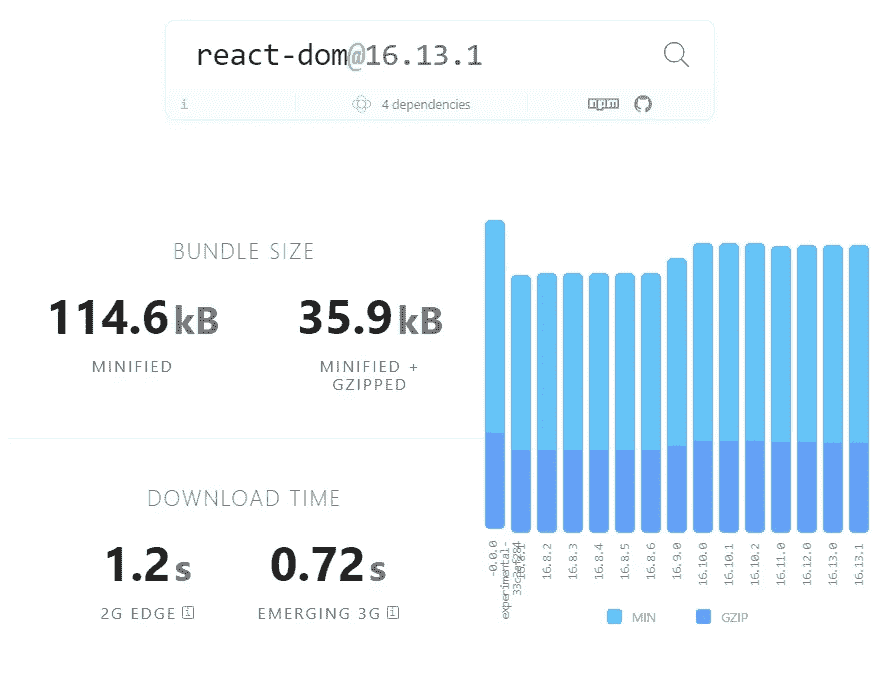

# 通过 Preact 最小化您的包大小

> 原文：<https://levelup.gitconnected.com/minimize-your-bundle-size-via-preact-a2f9fa7c8ce9>

今天我们将讨论捆绑包的大小、它的影响、我们如何减少它、测量它，以及使用 [Preact](https://preactjs.com/) 获得更好的结果。

# 为什么我们应该关心包的大小？

谷歌做的一项关于移动网站加载的基准测试揭示了移动用户加载一个网站需要多长时间([来源](https://think.storage.googleapis.com/docs/mobile-page-speed-new-industry-benchmarks.pdf)):

> 不管怎样，越快越好，越少越好。有时候，越瘦越好。我们发现 70%的页面超过 1MB，36%超过 2MB，12%超过 4MB。这对于一个手机页面来说是巨大的，因为 1.49MB 的文件在使用快速 3G 连接的情况下需要 7 秒钟才能加载。

左边是全球范围内的移动使用情况，右边是加载时间与使用量反弹百分比

# 让我们检查一个全球使用的 react 样板文件

让我们从最常用的 react 样板项目之一开始， [create-react-app](https://github.com/facebook/create-react-app) 。我们将采用一个简单的示例项目[React Hooks to dolist with Mobx](/react-hooks-mobx-todolist-c138eb4f3d04)使用样板文件，并在构建后检查它的包大小。

创建-反应-应用程序构建后的统计数据

因此，我们可以看到 javascript 文件的主要部分重量为 **54.13KB，**这是一个很好的包大小，但我们没有任何代码，它只是一个 todo 列表示例，而不是一个真正的项目。

我想给你介绍一下 [Preact](https://preactjs.com/) :

> 快速 3kB 替代方案，可与相同的现代 API 反应

正如他们主页上写的，这是一个最小尺寸的 JSX 和相同的 API 和能力。

现在，我将尝试使用完全相同的工具和库(typescript、mobx、mobx-react-lite)将我们的 [react-hooks -mobx](https://github.com/stolenng/react-hooks-mobx) todo 列表转换为 preact，唯一的变化是渲染库。

我将给出一个文件示例，看看从 React 到 Preact 的转换有多简单(链接到这里的库):

在左边行动，在右边反应

正如你在上面的图片中看到的，两者之间唯一的区别是从库中导入，而不是从`react`库中导入，我们是从`preact`和`preact/hooks`中导入相同的函数名，就这么简单。

现在让我们继续进行真正的测试并构建项目:

预测生成结果

我们可以看到这里的主 javascript 文件是 **22.2KB** 。我们用之前一半的构建规模取得了相同的结果。

我们使用相同的 API、相同的能力、库，并且我们得到了几乎一半的包大小！

# 利弊

## 赞成的意见

1.  Bundle size，正如上面所演示的，通过替换 React，我们已经成功地将项目的 Bundle 大小减少了一半。
2.  同样的 API。Preact 保留了 react 的 API，因此不存在学习曲线或适应新库的问题。

## **缺点**

1.  一个小社区，所以没有很多为 Preact 编写的库，但是因为 Preact 意识到了这一点，他们提供了自己的兼容性层`preact/compact`。

# 如何测量束尺寸

我们将集中讨论两个主要的高级工具，但是这个主题还有更多内容需要进一步阅读。

[**恐布症**](https://bundlephobia.com/)

这个网站允许我们检查 npm 公共库的包大小，我们可以很容易地搜索并找到我们想要使用的包的大小:

反应随机束大小

**web pack-bundle-analyzer(**[**链接**](https://github.com/webpack-contrib/webpack-bundle-analyzer) **)**

我们可以使用这个工具在构建结果上运行它。它将向我们显示应用程序中每个块和库的大小，从我们的代码到 node_modules 等等。

webpack 捆绑包分析器

Preact 用`preact build --analyze`支持它的开箱即用，create-react-app 有它的这个指南([链接](https://create-react-app.dev/docs/analyzing-the-bundle-size/))。

# **总结**

综上所述，我们了解了包的大小有多重要，为什么我们应该尽可能地保持它，以及我们如何使用 Preact 来轻松实现它。就我个人而言，我肯定会建议尝试 Preact，特别是对于致力于小规模捆绑包的项目，如果您甚至喜欢您的仪表板:)

感谢 [Aviv Moshe](https://www.linkedin.com/in/avivmoshe/) ，一个了不起的全栈开发者帮我写这篇文章。❤

以下是一些关于该主题的有用链接:

*   [https://bundlephobia.com/](https://bundlephobia.com/)
*   [https://preactjs.com/](https://preactjs.com/)
*   [https://github.com/stolenng/preact-hooks-mobx](https://github.com/stolenng/preact-hooks-mobx)
*   [https://github.com/stolenng/react-hooks-mobx](https://github.com/stolenng/preact-hooks-mobx)
*   [https://think . storage . Google APIs . com/docs/mobile-page-speed-new-industry-benchmarks . pdf](https://think.storage.googleapis.com/docs/mobile-page-speed-new-industry-benchmarks.pdf)
*   [http://www . mcrinc . com/Documents/newslettes/2011 10 _ why _ web _ performance _ matters . pdf](http://www.mcrinc.com/Documents/Newsletters/201110_why_web_performance_matters.pdf)