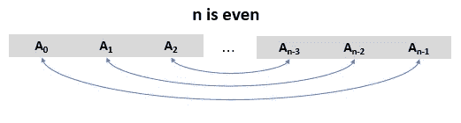
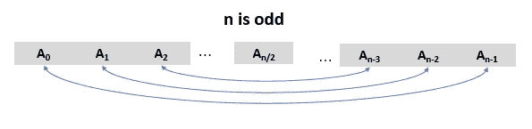

# 使数组相等的最小运算:理解面试和 Leetcoding 的思维过程

> 原文：<https://levelup.gitconnected.com/minimum-operations-to-make-array-equal-understanding-the-thought-process-for-interviews-5dd15d7390e7>

照片由 [Cytonn 摄影](https://unsplash.com/@cytonn_photography?utm_source=medium&utm_medium=referral)在 [Unsplash](https://unsplash.com?utm_source=medium&utm_medium=referral) 上拍摄

这是一个标准的算法问题，被证实在许多技术访谈中被问过。[这个问题出现在 2021 年 4 月 Leetcode 月度挑战赛](https://leetcode.com/problems/minimum-operations-to-make-array-equal/#:~:text=Minimum%20Operations%20to%20Make%20Array%20Equal%20%2D%20LeetCode&text=You%20have%20an%20array%20arr,arr%5By%5D%20%2B%3D%201%20))中，难度为**中等**。无论你是在准备技术面试，还是像我一样只是一个算法爱好者，我都坚信这篇文章会很有意思。

**问题陈述**
你有一个长度为`n`的数组`arr`，其中`arr[i] = (2 * i) + 1`为`i`(即`0 <= i < n`的所有有效值。
在一次操作中，您可以选择两个指标`x`和`y`，其中`0 <= x, y < n`从`arr[x]`中减去`1`并将`1`加到`arr[y]`(即执行`arr[x] -=1` 和`arr[y] += 1`)。目标是使数组**的所有元素都等于**。保证使用一些操作可以使数组的所有元素相等。

给定一个整数`**n**`、**、**数组的长度。Return *使 arr 的所有元素相等所需的最小操作数*。

**例**
**输入:** n = 3
**输出:** 2
**解释:** arr = [1，3，5]
第一次运算选择 x = 2，y = 0，这就导致 arr 为[2，3，4]
第二次运算再次选择 x = 2，y = 0，于是 arr = [3，3，3]。

**解决方案**
在面试中面对这类问题时，你的第一步会是什么？给定这样一个数组，
**1** )如何求**目标数**，即所有其他元素应该等于的数？

识别模式:强力
解决任何对你来说是新的算法问题的第一步，也是最好的一步，就是总是尝试使用少量的测试用例来观察一些常见的模式。
现在，我们将通过考虑每个数组中元素对的所有可能排列来研究两个测试数组。这样，每个排列中的第一对将用于生成**目标数**，我们将尝试将排列中的其他对减少到生成的目标数**。**

**测试 1** :当`**n**`为偶数时。设`n = 4`、`arr=[1,3,5,7]`、
对于这个数组有`6` 个不同的排列对。
{1，3}，{5，7}
{1，5}，{3，7}
{1，7}，{3，5}
{3，5}，{1，7}
{5，7}，{1，3}

**i.** `{1,3}`在`1`操作中还原为`{2,2}`。然后**目标数** = `2`
`{5,7}` →无法将这一对的元素减少到`2`。

**二。** `{1,5}`在 2 次操作中减少为`{3,3}`。然后**目标数** = `3` `{3,7}` →无法将`7`减少为`3`。

**iii。** `{1,7}`在`3`操作中还原为`{4,4}`。然后**目标数** =4
`{3,5}`在`1`操作中减少为`{4,4}`。
因此，需要`4`操作将所有元素减少到`4`。

**四。** `{3,5}`在`1`操作中还原为`{4,4}`。然后**目标数** = `4`
`{1,7}`在`3`操作中减少为`{4,4}`。
因此，需要`4`操作将所有元素减少到`4`。

**v** 。`{3,7}`在`2`操作中还原为`{5,5}`。然后**目标号** = `5`
`{1,5}` →不能把`1`改成`5`。

**六**。`{5,7}`在`1`操作中还原为`{6,6}`。那么目标数= `6`
`{1,3}` →不可能把这一对的元素改成`6`

**我们发现了一个图案**
瞧！我们找到了我们要找的模式。**步骤 iii 和 iv** 给出所需的解决方案。请注意，步骤 iii 和 iv 是方向相反的相同过程。无论你采取哪种模式，都会给你一个解决方案。到第 **iii** 步，下面是需要注意的要点:
1)**目标数**是使两个中间元素相等所需的运算次数。那么当所有其他剩余的线对都减少到这个目标数时，就实现了最小操作。
2)一对由 2 个元素组成，它们与阵列的**中心距离**相同。见下图。
3)给定一对数组元素，比如{a，b}，使它们等于目标数所需的运算次数是该对中两个元素之间正差的一半，即`(b-a)/2 where b > a`。
4)从下图来看，`arr[i]`与`arr[n-i-1]`形成一对。由于`arr[i]=(2*i)+1`和`arr[n-i-1] > arr[i]`，将对`{arr[i], arr[n-i-1)}`减少到目标数所需的操作数计算如下****

`=(arr[n-i-1]-arr[i])/2
= (2(n-i-1) — (2i +1))/2
= n-2i-1`
由于有效对的总数总是等于数组大小的一半，即`n/2`，所以使一个`n`大小的数组的所有元素相等所需的最小操作总数是所有`n-2i-1`的总和，其中`i= 0,1,...,(n/2)-1`。

当 **n** 为偶数时，需要最少运算次数才能使数组中所有元素相等的元素对

**测试 2** :当`**n**`**为奇数时。例如让`n= 5`，然后`arr = [1,3,5,7,9]`。注意，在这种情况下，除了一个元素之外，所有元素都可以成对出现。这意味着，由于一个元素不可能有一对，这样的元素将作为**目标数**。问题是哪些元素可以作为目标数？事实证明，我们必须考虑所有可能的配对排列，将每个元素作为目标数。注意，每当一个元素被作为目标数时，剩下的四个元素只能形成三种不同的配对排列。例如，当目标数为`1`时，考虑以下几对:`{3,5},{7,9}`、`{3,7},{5,9}`、`{3,9},{7,5}`。**

*注意* `*n*` *为偶数时与之前排列的区别。目标数未知，因此配对排列的* ***顺序*** *很重要，因为第一对总是用于生成目标数。*

因此，对于每个`5`可能的目标号码，有`3`个可能的配对排列。这意味着有`5*3 = 15`安排要检查。这可能很耗时，而且在实际面试中容易出错。相反，我想应用我们在测试 1 中发现的相同步骤。由于有效的配对是围绕数组中心对称的，所以数组中心的元素将总是**目标数**。

对于当前数组`Target number = 5`，对`{3,7}`需要`2`操作来将其元素更改为`5`。此外，对`{1,9}`需要`4`操作来将其元素改变为`5`。如果您能够检查所有其他可能的安排，您将会注意到，将中间的元素作为目标数字将会给出最佳解决方案。因此，当`n`为奇数时，配对形式如下图所示。

当 **n** 为奇数时，需要最少运算次数才能使数组中所有元素相等的元素对

有了有效的模式，我们就可以编写解决方案的第一个实现了。

Java 实现

**上述方法的分析**
上述方法的**时间复杂度**为`**O(n**)`。**空间复杂度是常数**，因为实际的数组从未被创建。我们能做得比这更好吗？

高效改进
令人惊讶的是，这个看起来很难的问题竟然被简化成了几行可以理解的代码。但是我们可以做得更多。这一次，我们更加关注每一步所需的**操作数以及这些操作数遵循的模式**。

1)当`n`为偶数时。如果取一个较大的偶数作为`n`，从`i=0,1,2,...,(n/2)-1`开始计算运算次数即`n-2i-1`，会得到如下数列`n-1, n-3, ..., 7, 5, 3, 1`。当系列反转时，您将获得`1, 3, 5, 7, ..., n-3, n-1`。如果你还记得数学课的话，这只是一个从`1`开始的奇数序列或者是一个有`first element = 1`和`common difference = 2`的算术序列。数列中元素的个数正好是`n/2`。所需的结果是这一系列的总和。利用含有`n`个元素`Sum of A.S = n(2a + (n-1)d)/2, where a= first element, d = common difference`的等差数列求和公式，我们可以通过在`Sum of A.S`公式中代入`n = n/2, a= 1, and d= 2`来计算最小运算次数。于是，`Result = (n/2)(2a + (n/2 — 1)d)/2`。再进一步简化，`Result = (n*n)/4`。

2)当`n`为奇数时。使用与上述相同的方法，生成以下序列:`2, 4, 6, ..., n-3, n-1`。这是从`2`开始的偶数序列。它也是一个有`n/2`个元素的等差数列，其中`first number, a = 2, commonn difference, d = 2`。使用上面的`Sum of A.S`公式，使数组中所有元素相等所需的总运算次数也是`(n*n)/4\.` 下面是 Java 中的代码实现。

**分析**
这简直不可思议的惊人！。只有一行代码并且时间和空间复杂度都是常数。

**结论**
如果你走到了这一步，功不可没！我相信你学到了一两个。每当你遇到不熟悉的问题时，永远记住寻找模式。[你还可以找到如何从一个没有排序的数组中找到一个元素](/find-the-location-of-the-max-element-in-an-unsorted-array-using-binary-search-96b6d2c9a547)，或者[如何找到应该排序的最短子数组以保持整个数组排序](/shortest-unsorted-continuous-subarray-b7401e839b7e)。

威尔逊:-)