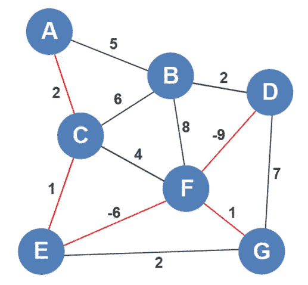

# 直观解释最小生成树(MST)

> 原文：<https://levelup.gitconnected.com/minimum-spanning-trees-mst-visually-explained-1d95d0874810>

最小生成树利用最短路径连接所有顶点。这只是一个简单的介绍，因为我们将在后面的几篇文章中详细介绍 MST，但是我们将快速展示一个 MST 的例子。在这个例子中，我们不打算采用任何算法，而是使用直觉。

我们可以看到图中有两条负边，所以它们很可能是最小生成树的一部分。我们将从添加这些边开始。

从那里，我们可以添加来自顶点 D、E 和 F 的边。顶点 D 和顶点 F 都有权重为 1 的边，因此我们将这两条边都添加到图中。

我们必须确保每次向最小生成树添加边时，不会出现循环。什么是循环？想象我们接下来添加边 edgeE-F-G 循环出现。

我们将删除该边，因为它不是最小生成树的一部分。如果我们观察该图，顶点 C、D、E、F 和 G 已经被添加，但是顶点 A 和 B 没有被添加。顶点 A 可以通过边 A-C 或边 A-B 连接。由于边 A-C 的权重较低，我们将添加该边。

Edge B 有几个选项。它可以通过 edge A-B、B-C、B-D 或
B-F 进入 MST。由于 B-D 的权重最小，它被添加到树中。

让我们仔细检查一下，以确保我们的解决方案是正确的。为此，我们将尝试找到从另一个顶点(即顶点 A)到每个顶点的其他最佳路径。如果我们想从 A 到 B，我们可以利用权重为 5 的边 A-B，或权重为-10 的一系列边 A-C-E-F-D-B。我们可以对到 B 的其他路线以及到其他顶点的其他路线重复这一过程。我们将很快看到我们选择包含在 MST 中的边是最佳边。这些边在所有顶点之间创建最佳路径。在接下来的几篇文章中，我们将采用一种更加算法化的方法来寻找最小生成树。

*如果你喜欢你所读的，我的书，* [*算法的说明性介绍*](https://www.amazon.com/Illustrative-Introduction-Algorithms-Dino-Cajic-ebook-dp-B07WG48NV7/dp/B07WG48NV7/ref=mt_kindle?_encoding=UTF8&me=&qid=1586643862) *，涵盖了这个算法和更多。*

 [## 编写面试问题

### 一个完整的平台，在这里我会教你找到下一份工作所需的一切，以及…

技术开发](https://skilled.dev) 

迪诺·卡伊奇目前是 [LSBio(生命周期生物科学公司)](https://www.lsbio.com/)、[绝对抗体](https://absoluteantibody.com/)、 [Kerafast](https://www.kerafast.com/) 、[珠穆朗玛生物](https://everestbiotech.com/)、[北欧 MUbio](https://www.nordicmubio.com/) 和 [Exalpha](https://www.exalpha.com/) 的 IT 主管。他还担任我的自动系统的首席执行官。他有十多年的软件工程经验。他拥有计算机科学学士学位，辅修生物学。他的背景包括创建企业级电子商务应用程序、执行基于研究的软件开发，以及通过写作促进知识的传播。

你可以在 [LinkedIn](https://www.linkedin.com/in/dinocajic/) 上联系他，在 [Instagram](https://instagram.com/think.dino) 上关注他，或者[订阅他的媒体出版物](https://dinocajic.medium.com/subscribe)。

[*阅读迪诺·卡吉克(以及媒体上成千上万其他作家)的每一个故事。你的会员费直接支持迪诺·卡吉克和你阅读的其他作家。你也可以在媒体上看到所有的故事。*](https://dinocajic.medium.com/membership)