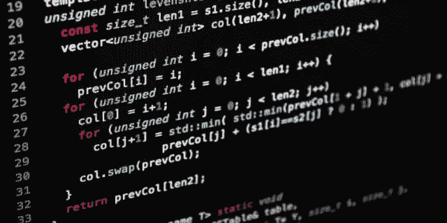

# 使序列增加的最小交换

> 原文：<https://levelup.gitconnected.com/minimum-swaps-to-make-sequences-increasing-3dfac67f26f2>

## 一个 LeetCode 中级问题



这是来自 LeetCode 的一个有趣的问题。这是一个中级问题。它在谷歌被问了 9 次，在亚马逊编码面试中被问了两次。

# 那么问题是什么呢？

我们有两个非零长度的整数序列 A 和 B。

我们可以交换元素 A[i]和 B[i]。请注意，这两个元素在各自的序列中位于相同的索引位置。

在一定数量的互换结束时，A 和 B 都在严格增加。

> 一个序列是严格递增的当且仅当
> A[0]<A[1]<A[2]<…<A[A . length—1]

给定 A 和 B，我们必须返回最小数量的交换，以使两个序列严格递增。保证给定的输入总是使其成为可能。

```
**Example:**
**Input:** A = [1,3,5,4], B = [1,2,3,7]
**Output:** 1
**Explanation:** 
Swap A[3] and B[3].  Then the sequences are:
A = [1, 3, 5, 7] and B = [1, 2, 3, 4]
which are both strictly increasing.
```

> **注:**
> 
> a、B 是长度相同的数组，长度会在
> 【11000】范围内。
> 
> A[i]，B[i]是范围[0，2000]内的整数值。

# 找到解决方案:

## 采取的方法:**动态规划**

让我们考虑以下情况-

> **ni →** 自然递增序列，因此在位置 I 处**而不是**完成交换。
> **si →** 表示直到位置 I 的交换次数，考虑在位置 I 处完成交换。

1.  让变量 **n1** 表示直到第(i-1)个位置没有交换的成本，在这种情况下，元素自然地按顺序增加。这意味着 n1 将是自然增加的元素的数量，直到(i-1)的位置。
2.  设变量 **n2** 表示自然增加到第(I)个位置的成本，因此在第 I 个位置不需要执行交换。
3.  让变量 **s1** 代表在第(i-1)个位置进行交换时的成本。
4.  让变量 **s2** 代表在第(I)个位置进行交换时的成本。

## 初始值

**n1=0** → n1 自然会是 0，因为第一个元素之前没有更大的元素，所以所需的交换次数会是 0

**s1=1** →考虑到第一个元素被交换，所以 1 交换到第一个位置

# 现在，对于每个循环迭代，我们基本上需要考虑两种方法:

## 案例 1:

当数组 a[]和 b[]的相邻元素严格递增时

```
**if(a[i-1]<a[i] && b[i-1]<b[i])**
```

**n2=Math.min(n1，N2)；**

**s2=Math.min(s2，S1+1)；** →考虑在位置 I 进行交换。第(I)个位置的交换可能需要用于第(i+1)个位置元素，以保持严格递增的属性。

## 案例二:

当对角线元素也严格增加时

```
**if(a[i-1]<b[i] && b[i-1]<a[i])**
```

> **注:**如果对角元素是严格递增的，那么两个数组的相邻元素可能是也可能不是严格递增的。

如果情况 1 和情况 2 都成立..即，如果相邻元素严格增加，对角元素也严格增加，那么 **n2** 和 **s2** 的值需要被 floored。

**n2=Math.min(n2，S1)；** →考虑到我们没有交换，n2 将是第(I)个位置之前的自然 n2 和第(i-1)个位置之前的交换次数 s2 之间的最小值。这适用于相邻元素没有严格增加，但对角线元素严格增加，因此需要进行交换的情况。

**s2=Math.min(s2，n1+1)** →最小的(直到第 I 个位置完成的交换)和(直到第(i-1)个位置的自然计数+对于第 I 个位置完成的 1 次交换)。(n1+1)被作为第二个参数，因为即使对于对角线元素，元素也是严格递增的，所以即使我们交换第(I)个元素，成本最终也是(n1+1)。

在循环开始考虑下一对元素的迭代之前，
n1 = N2；
S1 = S2；

## 最后，

```
return Math.min(n1,s1);
```

返回最小的自然数和交换数。

## **下面是用 Java 编写的函数，供你参考:**

计算使序列递增的最小交换次数的函数

> **资源:**
> 1。 [LeetCode 问题编号 801](https://leetcode.com/problems/minimum-swaps-to-make-sequences-increasing/solution/)2
> 。GitHub 知识库提供其他类似 LeetCode 问题的解决方案

> 仅此而已！感谢您一路阅读！请留下您的反馈。如果你喜欢这个博客，请留下一些掌声👏也是。
> 
> 你可以在—
> Github:[https://github.com/Spreeha](https://github.com/Spreeha)
> LinkedIn:[https://www.linkedin.com/in/spreehadutta/](https://www.linkedin.com/in/spreehadutta/)
> Twitter:[https://twitter.com/DuttaSpreeha](https://twitter.com/DuttaSpreeha)上联系我