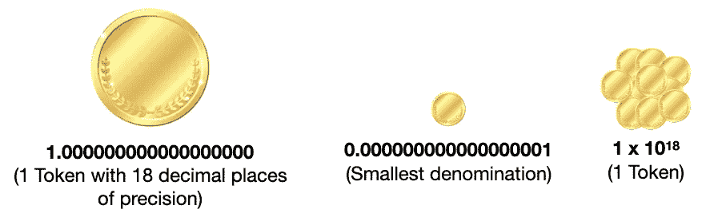
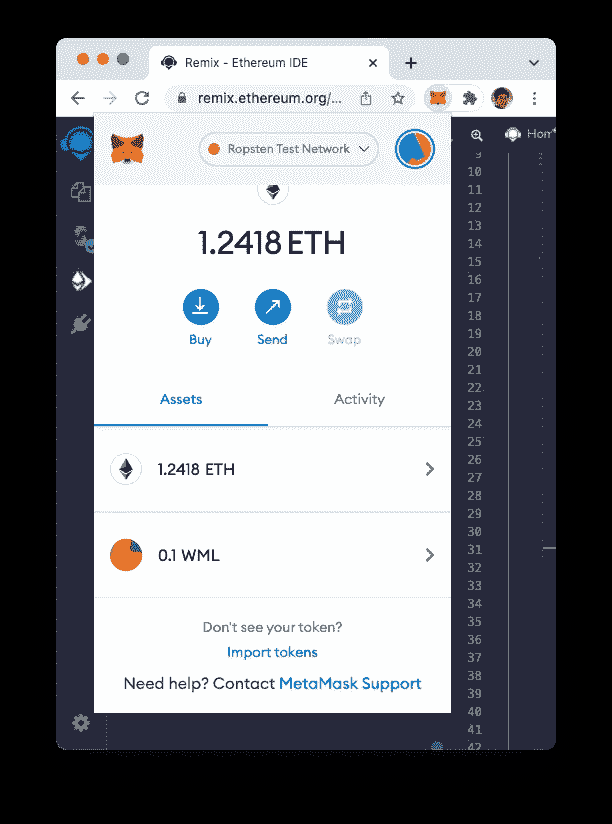

# 在以太坊铸造您自己的 ERC 20 代币

> 原文：<https://levelup.gitconnected.com/minting-your-own-erc-20-tokens-in-ethereum-a477bd38c135>

## 学习如何写代币合同，并出售它们！


由 [Unsplash](https://unsplash.com?utm_source=medium&utm_medium=referral) 上的 [Shubham Dhage](https://unsplash.com/@theshubhamdhage?utm_source=medium&utm_medium=referral) 拍摄的照片

近年来，人们对 T4 的缺乏有很多看法。但是在讨论 DeFi 和它是什么之前，理解 DeFi 中的一项基本技术是很重要的— ***令牌*** 。那么令牌到底是什么呢？

**代币是一种加密货币，代表可用于支付或投资目的的资产。**

你可能在现实生活中有处理代币的经验。记得你上次去嘉年华是什么时候吗？在你玩游戏之前，你可能必须把你的钱换成代币，以便在各种摊位使用:


对于嘉年华的摊位，他们只接受代币作为支付方式——绝对不接受现金。

在区块链世界，代币与你在狂欢节上使用的代币非常相似。第一，你用法币换成加密货币，比如以太。然后，你用乙醚换成一个*令牌*。然后，该令牌可用于在以太坊区块链上运行的智能合约的支付:


有道理吗？在这篇文章中，我将带你在以太坊区块链创建你自己的代币的步骤。会需要一些编程，但如果你有一些编程背景，这应该是可以管理的。在本文结束时，您应该对什么是令牌以及如何使用令牌进行交易有了更清晰的认识。

# 硬币和代币的区别

大多数时候，人们很容易认为代币和硬币是一样的，但它们的区别是微妙的。这里有一些区分硬币和代币的简单标准:

*   一枚**硬币**在它自己的区块链上运行。根据这个定义，很容易指出硬币的例子有*比特币*和*以太*。硬币也像货币一样，可以代替法定货币进行支付。最后，可以在区块链上开采一枚硬币。
*   另一方面，**令牌**没有自己的区块链。相反，它运行在现有的区块链上，比如以太坊。令牌通常使用智能合同来维护谁拥有什么的记录。与区块链上各种服务普遍接受的**硬币**不同，**代币**在使用上要严格得多，特定的代币只接受特定的服务(想想嘉年华的例子)。
*   硬币本质上是货币的数字版本，而代币不仅仅代表货币；它可能代表资产或行为。
*   可以用**币**买**代币**，但不能反过来。

# 象征性合同

令牌是使用以太坊中的智能合约创建的。令牌智能合约本质上是一个包含帐户地址及其余额的映射的智能合约:


在以太坊区块链上，大多数代币都是基于 **ERC-20** 的提议。ERC-20 定义了一个*可替换的*令牌标准，令牌实现者必须遵守该标准。

> 可替换令牌意味着令牌是可分的，并且可以被分解成更小的分数。例如 1 个令牌相当于 0.5 个令牌、0.3 个令牌和 0.2 个令牌之和。

从程序上讲，符合 ERC-20 标准的令牌必须实现以下功能:

*   `totalSupply` —返回令牌供应总量
*   `balanceOf(address _owner)` —返回`_owner`的账户余额
*   `transfer(address _to, uint256 _value)` —将`_value`转移到`_to`并触发`Transfer`事件。如果`_from`账户没有足够的代币来消费，该功能应该会恢复
*   `approve(address _spender, uint256 _value)` —允许`_spender`多次从账户中提款，最高可达`_value`金额
*   `transferFrom(address _from, address _to, uint256 _value)` —将`_value`从`_from`转移到`_to`并触发`Transfer`事件。除非`_from`账户通过某种机制有意授权消息发送者，否则该功能应该恢复
*   `allowance(address _owner, address _spender)` —返回`_spender`仍然可以从`_owner`中提取的金额

ERC 协议 20 还定义了以下事件:

*   `Transfer(address indexed _from, address indexed _to, uint256 _value)` —令牌转移时必须触发，包括零值转移
*   `Approval(address indexed _owner, address indexed _spender, uint256 _value)` —必须在成功调用`approve(address _spender, uint256 _value)`时触发

当您使用代币支付服务费用时，会用到很多这些功能。在本文中，我将重点关注以下内容:

*   如何创建您的令牌，以及如何将它们传送给您的朋友
*   如何通过用乙醚交换代币来出售代币

# 创建您的令牌合同

为了方便创建令牌，我使用了来自 **OpenZeppelin** 的令牌库([https://github . com/open zeppelin/open zeppelin-contracts/tree/v 4 . 0 . 0](https://github.com/OpenZeppelin/openzeppelin-contracts/tree/v4.0.0))。OpenZeppelin 已经实现了基本令牌契约，您需要做的就是将这个基本实现导入到您自己的契约中，并将其添加到您自己的实现中，就像这样:

```
// SPDX-License-Identifier: MIT
pragma solidity ^0.8.10;import "[https://github.com/OpenZeppelin/openzeppelin-contracts/blob/v4.0.0/contracts/token/ERC20/ERC20.sol](https://github.com/OpenZeppelin/openzeppelin-contracts/blob/v4.0.0/contracts/token/ERC20/ERC20.sol)";contract MyToken is ERC20 {
    constructor(string memory name, string memory symbol) 
        ERC20(name, symbol) {
        // ERC20 tokens have 18 decimals 
        // number of tokens minted = n * 10^18
        uint256 n = 1000;        _mint(msg.sender, n * 10**uint(decimals()));
    }
}
```

> 通过使用 OpenZeppelin 的基本令牌契约，这意味着您不必担心实现我上面描述的所有 ERC20 函数。

在上述令牌合同中:

*   您从 OpenZeppelin 导入了基本的 **ERC20.sol** ( `ERC20`)合同
*   您的令牌契约(`MyToken`)继承自`ERC20`基础契约
*   在契约的构造函数中，您(契约所有者)正在使用`_mint()`函数(在`ERC20`契约中定义)铸造 1000 个令牌。在内部，您将把这 1000 个令牌表示为 1000 x 10 个⁸.

如果你正在跟进，继续把上面的代码粘贴到 Remix IDE 中([https://remix.ethereum.org/](https://remix.ethereum.org/)):


## 了解令牌如何在令牌合约中表示

ERC20 令牌的精度最高可达 18 位小数。这意味着您的代币可以有低至 0.000000000000001 的面额。

考虑下面的例子。你有一个一美元的硬币——1 美元。但最小面额是 1 美分，等于 0.01 美元。所以你的 1 美元可以精确到小数点后 2 位，等于 1 x 10 美分(其中 2 是小数位数):


当你记录你的钱的时候，你用美元记录它。例如，如果你有 5 美元，你记为 5 美元，而不是 500 美分。然而，对于坚固性来说，问题就在这里。Solidity 不支持浮点数，所以当你记录你的令牌数时，Solidity 无法使用浮点数存储，比如 2.5 个令牌。相反，你必须根据最小的面额来存储代币。例如，假设您希望您的令牌最多支持 18 位小数。所以最小的令牌是 0.0000000000000001。在令牌协定内部，您将把它存储为 1。对于一个令牌，您需要将其存储为 1 x 10 ⁸:



## 使用元掩码部署协定

在 Remix IDE 中，确保令牌协定已编译并且没有任何错误:


接下来，在 Remix IDE 的 **DEPLOY AND TRANSACTIONS** 选项卡中，找到 **Deploy** 按钮(橙色)，并输入以下用逗号分隔的字符串:

```
"LWM Token","LWM"
```


这两个字符串被传递给令牌协定的构造函数:

```
 constructor(string memory **name**, string memory **symbol**)    
    }
```

所以在这种情况下， **LWM token** 将是令牌的名称， **LWM** 将是令牌的符号。

点击 **Deploy** 将令牌契约部署到 Ropsten testnet 上。现在将出现元掩码，因此请继续操作并确认交易。

一旦令牌合同被挖掘和确认，您将在页面底部看到该合同。点击**复制**按钮，将合同地址复制到剪贴板:


> 我的代币合同地址是`0xFBFf85E2b52A498092Ec11e14605c86A8173C8EB`

## 将令牌导入元掩码

在 MetaMask 中，单击**资产**部分:


输入代币合同的地址，等待**代币符号**填充。然后，点击**添加自定义令牌**:


你现在可以看到你的代币和余额。点击**导入令牌**:


就是这样！你现在将自豪地拥有你自己的令牌！


## 将代币转移到另一个帐户

要向另一个帐户发送令牌，请选择令牌，然后单击**发送**按钮:


您可以输入您想要发送到的帐户的地址，或者单击**我的帐户间转账**将令牌发送到您拥有的另一个帐户:


选择您想要发送代币的帐户后，输入您想要发送的代币数量，然后单击**下一步**:


你需要支付交易费用。点击**确认**。交易被挖掘后，你会看到你的代币余额会减少 1。


在帐户 2 中，您可以将令牌添加到您的资产列表中，并且您将能够在那里看到 1 LWM 令牌。

# 用乙醚购买代币

在前面的令牌合同中，您看到了在将合同部署到区块链时如何铸造令牌，以及如何将令牌从一个帐户转移到另一个帐户。一旦一个帐户有了令牌，它可以转移到任何帐户。

但是你如何从代币中赚钱呢？在现实世界中，你可能想卖掉代币来换取乙醚。事实上，您可以通过将它编程到令牌契约中来实现这一点。出售代币的行为通常被称为*初始硬币发售* (ICO)。

这是我们代币合约的改进版本，允许代币与乙醚一起购买:

```
// SPDX-License-Identifier: MIT
pragma solidity ^0.8.10;import "[https://github.com/OpenZeppelin/openzeppelin-contracts/blob/v4.0.0/contracts/token/ERC20/ERC20.sol](https://github.com/OpenZeppelin/openzeppelin-contracts/blob/v4.0.0/contracts/token/ERC20/ERC20.sol)";contract MyToken is ERC20 {
 **uint256 public unitsOneEthCanBuy  = 10;
    address public tokenOwner;         // the owner of the token** // constructor will only be invoked during contract 
    // deployment time
    constructor(string memory name, string memory symbol) 
    ERC20(name, symbol) {
 **tokenOwner = msg.sender;       // address of the token owner**        uint256 n = 1000;
        // mint the tokens
        _mint(msg.sender, n * 10**uint(decimals()));        
    } **// this function is called when someone sends ether to the 
    // token contract
    receive() external payable {        
        // msg.value (in Wei) is the ether sent to the 
        // token contract
        // msg.sender is the account that sends the ether to the 
        // token contract** **// amount is the token bought by the sender
        uint256 amount = msg.value * unitsOneEthCanBuy;** **// ensure you have enough tokens to sell
        require(balanceOf(tokenOwner) >= amount, 
            "Not enough tokens");** **// transfer the token to the buyer
        _transfer(tokenOwner, msg.sender, amount);** **// emit an event to inform of the transfer        
        emit Transfer(tokenOwner, msg.sender, amount);

        // send the ether earned to the token owner
        payable(tokenOwner).transfer(msg.value);
    }** }
```

我们来剖析一下上面的代币契约。首先，我们用关键字`payable`添加了一个名为`received()`的新函数:

```
receive() external payable {
}
```

当醚被发送到契约时，调用`receive()`函数。在这个函数内部，会自动为您创建两个变量:

*   `msg.value` —这是发送给合同的魏的金额
*   `msg.sender` —这是调用合同的发送方的地址

在代币合同中，您将定义代币的价格。在这里，我们定义 1 以太可以购买 10 代币:

```
 uint256 public unitsOneEthCanBuy  = 10;
```

您还需要保存这个令牌契约的所有者的地址，因此您声明了一个名为`tokenOwner`的变量，您将在令牌契约的构造函数中初始化该变量:

```
 **address public tokenOwner;         // the owner of the token** constructor(string memory name, string memory symbol) 
    ERC20(name, symbol) {
 **tokenOwner = msg.sender;       // address of the token owner**        ... 
    }
```

## 计算购买的代币数量

为了出售代币，你需要给它定价。正如您在前面看到的，您定义了`unitsOneEthCanBuy` 变量来间接表示代币的价格，表示为您可以用一个以太购买的代币数量。下图说明了如何推导出最终公式，其中 1 个魏可以购买 10 个代币(使用基于精度的 18 位小数的内部表示)。


基于这个公式，你现在可以很容易地计算出当一个用户向你的令牌合约发送醚时，他可以购买多少令牌。例如，假设用户向您发送令牌合同 2 醚:


根据以上内容，您现在知道用户可以购买的令牌数量为:

```
// amount is the token bought by the sender
        **uint256 amount = msg.value * unitsOneEthCanBuy;**
```

为了向用户出售令牌，您需要确保您的合同有足够的令牌，因此您使用`require()`函数进行检查。`require()`函数中的第一个参数是被评估的条件—如果条件评估为`false`，它将引发一个异常，第二个参数作为原因:

```
// ensure you have enough tokens to sell
        require(balanceOf(tokenOwner) >= amount, 
            "Not enough tokens");
```

如果令牌契约有足够的令牌，现在您将使用`_transfer()`函数将令牌传输给用户:

```
 // transfer the token to the buyer
        _transfer(tokenOwner, msg.sender, amount);
```

传输完成后，发出`Transfer()`事件:

```
 // emit an event to inform of the transfer        
        emit Transfer(tokenOwner, msg.sender, amount);
```

最后，收到以太网后，您需要将其转移给令牌所有者:

```
// send the ether earned to the token owner
        payable(tokenOwner).transfer(msg.value);
```

> 这部分很重要！如果你不这样做，以太将永远被令牌契约所束缚，并且没有办法取回它——它们将永远丢失。吻别你的醚吧！

## 部署令牌协定

再来部署一下合同。这一次，为您的令牌使用以下名称和符号:


挖掘令牌合同后，复制其令牌地址:


> 该令牌合同的地址为`0x7E74A178695C32fA6a008D1bd9c0e73ca1127356`。

## 将新令牌添加到元掩码

还记得我们之前在元掩码中添加了 LWM 令牌吗？您可以通过选择令牌，然后单击 3 个垂直点，将其从元掩码中移除。然后，点击**隐藏 LWM** :


> 在开发阶段，移除现有的令牌是很有用的，在这个阶段，由于错误修复，您可能要将令牌契约部署到 testnet 几次。

现在，您可以将您新挖掘的 **WML** 令牌合同添加到元掩码:


## 向令牌契约发送以太网

切换到 MetaMask 中的另一个帐户(比如帐户 2 ),然后单击**发送**按钮:


进入令牌合约，向其发送 **0.01** 以太。点击**下一个**:


> 按照 WML 代币的定价，1 以太可以买 10 代币，那么 0.01 以太可以买 0.01x10 代币= **0.1 代币**。

对于帐户 2，将令牌添加到您的资产中，您现在应该看到 0.1 WML:



# 检查以太网扫描中的令牌合同

您可以使用诸如 Etherscan 之类的区块链浏览器来检查在令牌合约上执行的各种交易。因为我们使用的是 Ropsten 测试网络，所以以太网扫描网址是:[https://ropsten.etherscan.io/](https://ropsten.etherscan.io/)。

首先使用其地址搜索令牌合同(在本例中，令牌合同为`0x7E74A178695C32fA6a008D1bd9c0e73ca1127356`)。您将看到如下内容:


观察上面突出显示的部分:

*   代币合约余额为 0。请记住，当用户向您的令牌合约发送醚时，醚会立即转移到令牌所有者。因此，代币契约本身不会持有任何醚。
*   页面底部显示了在合同上执行的各种交易。这里，它显示一个帐户已经向合同发送了 0.01 乙醚
*   您也可以单击令牌跟踪器旁边显示的名称( **WML 令牌(WML)** )来查看令牌的详细信息(参见下面的*令牌跟踪器*部分)。
*   您还可以点击**交易散列**列下列出的各种交易散列，查看合同上执行的交易的详细信息(参见下面的*交易详细信息*部分)。

## 交易详细信息

当您点击交易散列时，您将被带到**交易详细信息**页面:


从上图可以看出，在内部，令牌合约将收到的以太(0.01 以太)发送到另一个账户(令牌合约所有者)。此页面还显示转移给用户的令牌数量。

## 令牌跟踪器

令牌跟踪器页面显示令牌的所有当前状态，如持有者数量、转移数量、精度位数等。下图显示了对令牌执行大量事务后的令牌状态:


请特别注意最后一行，这里有一个地址`0x000000…`。这个地址(缩写为`0x0`)被称为*空地址*。当您铸造您的令牌时，此空地址将被用作原始帐户，令牌将从该帐户转移到令牌所有者。

> 请**不要**发送醚到这个空地址。所有寄到这个地址的乙醚都将永远丢失。幸运的是，像 MetaMask 这样的钱包会自动阻止您向该地址发送乙醚或代币。

我希望你喜欢这篇文章！下次见！

[](https://weimenglee.medium.com/membership) [## 加入媒介与我的介绍链接-李伟孟

### 作为一个媒体会员，你的会员费的一部分会给你阅读的作家，你可以完全接触到每一个故事…

weimenglee.medium.com](https://weimenglee.medium.com/membership)