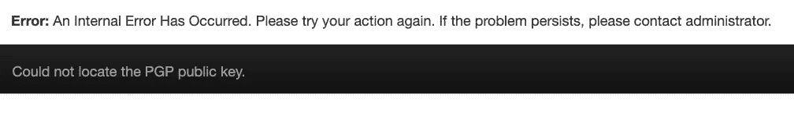
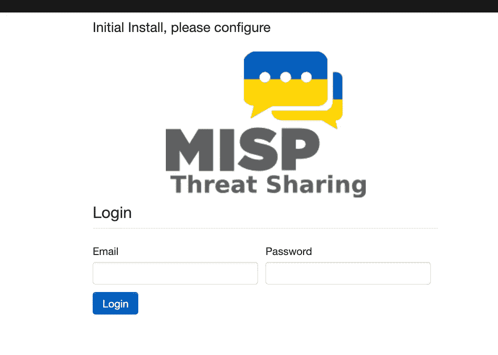

# RedHat Enterprise Linux 7.9 的 MISP 安装

> 原文：<https://levelup.gitconnected.com/misp-installation-for-redhat-enterprise-linux-7-9-57483fa24b18>


[https://images . unsplash . com/photo-1496368077930-C1 e 31 B4 e5b 44？IX lib = r b-4 . 0 . 3&ixid = mnwxmja 3 fdb 8 mhxwag 90 by 1 wywdlfhx 8 fgvufdb 8 fhx 8&auto = format&fit = crop&w = 2670&q = 80](https://images.unsplash.com/photo-1496368077930-c1e31b4e5b44?ixlib=rb-4.0.3&ixid=MnwxMjA3fDB8MHxwaG90by1wYWdlfHx8fGVufDB8fHx8&auto=format&fit=crop&w=2670&q=80)

这份文件是一本关于如何正确安装 MISP 的完整操作手册。大多数说明都来自 GitHub 上现成的在线指南。

# **先决条件**

*   RedHat 登录——可以在这里创建，[https://www.redhat.com/wapps/ugc/register.html?_ flowId =寄存器流& _flowExecutionKey=e1s1](https://www.redhat.com/wapps/ugc/register.html?_flowId=register-flow&_flowExecutionKey=e1s1)
*   基本 UNIX CLI
*   操作系统:RedHat Enterprise Linux 7.9

# **构建**

在干净的 RedHat Enterprise 7.9 Linux 版本上。

安装编译工具和 git

```
sudo yum install git gcc bcc gcc-c++ cmake -y
```

从 GitHub 克隆安装库

```
git clone https://github.com/MISP/MISP-RPM.git
cd MISP-RPM
```

运行以下命令:

*   注册企业操作系统—它会提示输入用户名和密码
*   更新 yum 以包含所需的存储库
*   安装几个包

```
make prepare
```

(可选)如果失败，您可以手动运行下面的。这将使正确的存储库能够在下面的步骤中下载所有需要的 rpm 包。

```
sudo subscription-manager register --auto-attach
sudo yum-config-manager --enable rhel-server-rhscl-7-rpms
sudo subscription-manager repos --enable rhel-7-server-optional-rpms
sudo yum install -y scl-utils ca-certificates git
```

验证您在 yum 中启用了正确的存储库

```
$ sudo yum repolist
Loaded plugins: product-id, search-disabled-repos, subscription-manager
repo id                                                                          repo name                                                                                                    status
!rhel-7-server-optional-rpms/7Server/x86_64                                      Red Hat Enterprise Linux 7 Server - Optional (RPMs)                                                          23,636
!rhel-7-server-rpms/7Server/x86_64                                               Red Hat Enterprise Linux 7 Server (RPMs)                                                                     33,381
!rhel-server-rhscl-7-rpms/7Server/x86_64                                         Red Hat Software Collections RPMs for Red Hat Enterprise Linux 7 Server                                      14,337
repolist: 71,354
```

安装组件并构建 rpm。结果应该可以在`RPMS/`和`RPMS-PREREQ-*/`目录中找到。

```
make misp.rpm
```

创建包含所有构建包和必备包的目录版本

```
make release
```

发布示例:

```
$ ls -1 release/
cmake3–3.17.5–1.el7.x86_64.rpm
cmake3-data-3.17.5–1.el7.noarch.rpm
faup-1.6.0+8e81b17–1.el7.x86_64.rpm
faup-devel-1.6.0+8e81b17–1.el7.x86_64.rpm
gtcaca-1.0+98c7aa8–2.el7.x86_64.rpm
gtcaca-devel-1.0+98c7aa8–2.el7.x86_64.rpm
imlib2–1.4.5–9.el7.x86_64.rpm
imlib2-devel-1.4.5–9.el7.x86_64.rpm
libcaca-0.99–0.40.beta20.el7.x86_64.rpm
libcaca-devel-0.99–0.40.beta20.el7.x86_64.rpm
libuv-1.44.1–1.el7.x86_64.rpm
libzstd-1.5.2–1.el7.x86_64.rpm
misp-2.4.159–1.el7.x86_64.rpm
misp-pear-crypt-gpg-2.4.159–1.el7.x86_64.rpm
misp-pecl-rdkafka-2.4.159–1.el7.x86_64.rpm
misp-pecl-redis-2.4.159–1.el7.x86_64.rpm
misp-pecl-ssdeep-2.4.159–1.el7.x86_64.rpm
misp-php-brotli-2.4.159–1.el7.x86_64.rpm
misp-python-virtualenv-2.4.159–1.el7.x86_64.rpm
rhash-1.3.4–2.el7.x86_64.rpm
ssdeep-devel-2.14.1–1.el7.x86_64.rpm
ssdeep-libs-2.14.1–1.el7.x86_64.rpm
```

# **安装**

(可选)如果未启用，请启用 RHEL 订阅和软件集合

```
sudo subscription-manager register --auto-attach
sudo yum install yum-utils -y
sudo yum-config-manager --enable rhel-server-rhscl-7-rpms
sudo subscription-manager repos --enable rhel-7-server-optional-rpms
```

安装 Apache 服务器— `httpd24`

```
sudo yum install -y httpd24 httpd24-mod_ssl
sudo systemctl enable httpd24-httpd
sudo systemctl restart httpd24-httpd
```

安装 PHP — `rh-php73`

```
sudo yum install -y rh-php73
```

为 PHP 运行时设置推荐的最大值`/etc/opt/rh/rh-php73/php.ini`

```
- max_execution_time = 30
+ max_execution_time = 300
- memory_limit = 128M
+ memory_limit = 2048M
- post_max_size = 8M
+ post_max_size = 50M
- upload_max_filesize = 2M
+ upload_max_filesize = 50M
```

按照以下顺序安装软件包，并根据需要调整版本

```
cd release/
```

MISP 的先决条件

```
sudo yum install -y gtcaca-1.0+*.rpm libcaca*.rpm imlib2*.rpm
sudo yum install -y faup-1.6.0+*.rpm
sudo yum install -y ssdeep-libs*.rpm 
```

适用于 MISP 的 PHP 扩展的先决条件

```
export mispver="2.4.159–1"
sudo yum install -y misp-pear-crypt-gpg-$mispver.el7.x86_64.rpm \
misp-pecl-rdkafka-$mispver.el7.x86_64.rpm \
misp-pecl-redis-$mispver.el7.x86_64.rpm \
misp-pecl-ssdeep-$mispver.el7.x86_64.rpm \
misp-php-brotli-$mispver.el7.x86_64.rpm \
misp-python-virtualenv-$mispver.el7.x86_64.rpm
```

安装 MISP RPM

```
sudo yum install -y misp-$mispver.el7.x86_64.rpm
```

阿帕奇/ `httpd`配置

Apache 虚拟主机配置示例:`/opt/rh/httpd24/root/etc/httpd/conf.d/misp.conf`

```
<VirtualHost _default_:80>
DocumentRoot /var/www/MISP/app/webroot
<Directory /var/www/MISP/app/webroot>
Options -Indexes
AllowOverride all
Require all granted
</Directory>
LogLevel warn
ErrorLog /var/log/httpd24/misp_error.log
CustomLog /var/log/httpd24/misp_access.log combined
ServerSignature Off
Header always set X-Content-Type-Options nosniff
Header always set X-Frame-Options SAMEORIGIN
Header always unset "X-Powered-By"
</VirtualHost>
```

配置更改后

```
sudo systemctl restart httpd24-httpd
```

安装 MySQL 数据库— `rh-mariadb105-mariadb`

```
sudo yum install -y rh-mariadb105-mariadb rh-mariadb105-mariadb-server-utils
sudo systemctl enable rh-mariadb105-mariadb.service
sudo systemctl start rh-mariadb105-mariadb.service
```

创建数据库、用户并授予权限。第一个命令应该打开一个 MySQL shell/CLI，请更新密码，不要使用默认的`changeme`

```
sudo scl enable rh-mariadb105 mysql
```

```
CREATE DATABASE misp;
CREATE USER misp@'localhost' IDENTIFIED BY 'changeme';
GRANT USAGE ON *.* to 'misp'@'localhost';
GRANT ALL PRIVILEGES on misp.* to 'misp'@'localhost';
FLUSH PRIVILEGES;
exit;
```

加载初始 MISP 模式(系统会提示您输入上面设置的密码):

```
sudo scl enable rh-mariadb105 'mysql -u misp -p misp' < /var/www/MISP/INSTALL/MYSQL.sql
```

MISP 构型

配置您的数据库访问权限(密码`changeme`应根据之前的数据库设置阶段进行设置):

`/var/www/MISP/app/Config/database.php`

```
<?php
class DATABASE_CONFIG {
  public $default = array(
    'datasource' => 'Database/Mysql',
    'persistent' => false,
    'host' => 'localhost',
    'login' => 'misp',
    'port' => 3306,
    'password' => 'changeme',
    'database' => 'misp',
    'prefix' => '',
    'encoding' => 'utf8',
  );
}
```

设置默认裸机配置(请查看 MISP 文档以了解完整的正确设置):

```
sudo cp -a /var/www/MISP/app/Config/core.default.php /var/www/MISP/app/Config/core.php
sudo cp -a /var/www/MISP/app/Config/bootstrap.default.php /var/www/MISP/app/Config/bootstrap.php
sudo cp -a /var/www/MISP/app/Config/config.default.php /var/www/MISP/app/Config/config.php
sudo chmod o-rwx /var/www/MISP/app/Config/{config.php,database.php,email.php}
sudo chown apache. /var/www/MISP/app/Config/{config.php,database.php,email.php}
```

在`/var/www/MISP/app/Config/config.php`中修改 Python 二进制路径

`‘python_bin’ => null,`

应该变成(RPMs 附带的完整 Python Virtualenv 的路径):

`‘python_bin’ => ‘/var/www/cgi-bin/misp-virtualenv/bin/python’,`

安装 Redis 服务器— `rh-redis6-redis`

```
sudo yum install -y rh-redis6-redis
sudo systemctl enable rh-redis6-redis
sudo systemctl start rh-redis6-redis
```

启用并启动 misp-workers

```
sudo systemctl enable misp-workers
sudo systemctl start misp-workers
```

注意 Systemd 单元应该使用带有 scl 包装器的软件集合。

`/etc/systemd/system/misp-workers.service`应该有类似于

```
Environment=SCL_PHP_WRAPPER=
EnvironmentFile=-/etc/default/misp-workers
Type=forking
ExecStart=/bin/bash -c '${SCL_PHP_WRAPPER} /var/www/MISP/app/Console/worker/start.sh'
```

可选地加载并包含 scl 包装器的路径

`SCL_PHP_WRAPPER=/usr/bin/scl enable rh-php73`

设置所有者和`selinux`上下文的最终额外设置项目

```
sudo chown apache:apache /var/www/MISP/app/Config/config.php
sudo chcon -t httpd_sys_rw_content_t /var/www/MISP/app/Config/config.php
```

验证 PHP 扩展是否正确启用(应该已经通过 RPM 安装完成)

```
cat /etc/opt/rh/rh-php73/php.d/40-redis.ini extension=redis
cat /etc/opt/rh/rh-php73/php.d/40-ssdeep.ini extension=ssdeep
cat /etc/opt/rh/rh-php73/php.d/40-brotli.ini extension=brotli
cat /etc/opt/rh/rh-php73/php.d/40-rdkafka.ini extension=rdkafka
```

外部访问配置`firewalld`

为 http 和 https 打开防火墙

```
sudo firewall-cmd - permanent - zone=public - add-service http
sudo firewall-cmd - permanent - zone=public - add-service https
sudo systemctl restart firewalld
```

# **故障排除**



屏幕上显示程序运行的图片

当前安装步骤中缺少此部分，因此需要执行以下操作来解决此问题。

设置丢失的`gpg`键

```
sudo gpg - gen-key
gpg (GnuPG) 2.0.22; Copyright © 2013 Free Software Foundation, Inc.
This is free software: you are free to change and redistribute it.
There is NO WARRANTY, to the extent permitted by law.
Please select what kind of key you want:
(1) RSA and RSA (default)
(2) DSA and Elgamal
(3) DSA (sign only)
(4) RSA (sign only)
Your selection? 1
RSA keys may be between 1024 and 4096 bits long.
What keysize do you want? (2048)
Requested keysize is 2048 bits
Please specify how long the key should be valid.
0 = key does not expire
<n> = key expires in n days
<n>w = key expires in n weeks
<n>m = key expires in n months
<n>y = key expires in n years
Key is valid for? (0)
Key does not expire at all
Is this correct? (y/N) y
GnuPG needs to construct a user ID to identify your key.
Real name: misp
Name must be at least 5 characters long
Real name: misp-rhel-79
Email address: bonez@mail.com
Comment:
You selected this USER-ID:
"misp-rhel-79 <bonez@mail.com>"
Change (N)ame, ©omment, (E)mail or (O)kay/(Q)uit? o
You need a Passphrase to protect your secret key.
You don't want a passphrase - this is probably a *bad* idea!
I will do it anyway. You can change your passphrase at any time,
using this program with the option " - edit-key".
We need to generate a lot of random bytes. It is a good idea to perform
some other action (type on the keyboard, move the mouse, utilize the
disks) during the prime generation; this gives the random number
generator a better chance to gain enough entropy.
We need to generate a lot of random bytes. It is a good idea to perform
some other action (type on the keyboard, move the mouse, utilize the
disks) during the prime generation; this gives the random number
generator a better chance to gain enough entropy.
gpg: key 411A94AB marked as ultimately trusted
public and secret key created and signed.
gpg: checking the trustdb
gpg: 3 marginal(s) needed, 1 complete(s) needed, PGP trust model
gpg: depth: 0 valid: 1 signed: 0 trust: 0-, 0q, 0n, 0m, 0f, 1u
pub 2048R/411A94AB 2022–12–05
Key fingerprint = 7D35 D4B8 4186 3C69 C11A 08DA 3CCE 383B 411A 94AB
uid misp-rhel-79 <s.uddin@reply.com>
sub 2048R/7471F59E 2022–12–05
[ubuntu@misp-rhel-79 ~]$ sudo gpg - list-keys
/root/.gnupg/pubring.gpg
 - - - - - - - - - - - - 
pub 2048R/411A94AB 2022–12–05
uid misp-rhel-79 <s.uddin@reply.com>
sub 2048R/7471F59E 2022–12–05
sudo cp /root/.gnupg/pubring.gpg /var/www/MISP/app/webroot/gpg.asc
sudo chown apache:apache -hR /var/www/MISP/
```

现在，您可以在本地主机上打开浏览器来访问仪表板。



屏幕上显示程序运行的图片

享受:)

# 分级编码

感谢您成为我们社区的一员！在你离开之前:

*   👏为故事鼓掌，跟着作者走👉