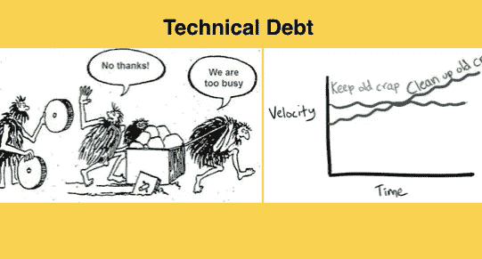

# 我作为一个角度开发者所犯的错误

> 原文：<https://levelup.gitconnected.com/mistakes-i-made-as-an-angular-developer-509277d60a10>

## 自白:作为一个 angular 开发者，我后悔没有做的事情，以及如何避免！

信用——malcoded.com

> “每次你决定不重构你刚写的糟糕代码时，你就欠下了技术债。”——@ code standards

自学成为一名初级开发人员可能很难。即使你有一个正式的计算机科学学位，编程和掌握高级概念也可能是棘手的。因此，作为初级开发人员，我们大部分时间都在尝试新东西和学习基础知识。如果你是一个有预培训的组织的一部分，这可能不是真的。但除此之外，我们都知道我们现在/曾经身处的困境。那完全没问题。**写好代码的唯一方法是从坏代码开始！**

我早期的大部分角度应用程序都是杂乱、庞大的，并且其他人很难理解。我的代码可能还是老样子，但至少这些年来我一直在学习。回想起来，我后悔没有在我的 angular 应用程序中学习/使用这些实践。

## 不考虑性能和优化

照片由[奥斯丁·迪斯特尔](https://unsplash.com/@austindistel?utm_source=medium&utm_medium=referral)在 [Unsplash](https://unsplash.com?utm_source=medium&utm_medium=referral) 上拍摄

这是一个广泛的概述。我在本文其余部分解释的一切都是因为作为一个有角度的开发者，我没有为性能和优化而烦恼。

当你是一个初级开发人员时，进入一个真正的项目可能是势不可挡的。当我刚开始工作时，我的主要精力只放在完成工作上。优化和最佳实践远未被考虑。我花了很长时间才把注意力集中到重要的事情上。我觉得这很普遍尤其是自学的时候。

## 不遵循干燥原则

照片由[尼克·费因斯](https://unsplash.com/@jannerboy62?utm_source=medium&utm_medium=referral)在 [Unsplash](https://unsplash.com?utm_source=medium&utm_medium=referral) 上拍摄

干(不要重复自己)是众所周知的软件开发原则。它只是指不要在你的应用程序中多次编写做同样事情的代码块。**它基本上是说重用一切可能的东西，而不是从头开始写任何东西。**
仅仅因为你有一个已经在多个地方使用的自定义按钮元素，并不意味着你遵循了这个原则。angular 有很多不同的技术可以确保这一点。

了解更多干原理[这里](https://medium.com/javascript-in-plain-english/apply-the-dry-principle-to-make-angular-code-less-error-prone-and-easier-to-maintain-2bc4af0592ad)和[这里](https://medium.com/swlh/keeping-your-angular-components-dry-with-content-projection-8ba7d1ef55c6)。

## 不考虑技术债务

信用——https://twitter.com/carnage4life

让我们承认吧，最后期限驱使我们！我们都有这样一位经理，他不断地询问最新情况，并说客户对推动(无法实现的)最后期限是多么不高兴。你是做什么的？您忘记了最佳实践，将样式从一个组件复制粘贴到另一个组件，并将一个工作正常但有缺陷的应用程序发布到产品中。你管理开心，客户开心，老板开心！当更多的功能增强出现在应用程序中时，事情就完全颠倒了。现在你显然没有时间去重构旧代码，但是你也不得不再次做同样的事情！我想这是每个开发者的困境。它需要在整个组织中有一个结构化的方法来实现这些目标，而不是单个的目标。也许你可以带头**保持单一风格引导前进**。

让我们看看这个示例代码，

以上可能是您的某个应用程序中的潜在代码片段。你做了一轮测试，这段代码运行得非常好，你把 JIRA 的票推到 *done* 并移动到下一个实现。

这里的问题是在组件级别上进行`http`调用的实践。相反，我们可以使用一个*服务*来做这件事。这里的*服务*的好处是数据源的独立性。您的组件不必知道数据来自哪里。这有助于重用、隔离和定制您的代码。很明显，你在代码中留下了一笔债务，将来它会困扰你。

点击阅读更多关于技术债务[的内容。](https://www.devbridge.com/articles/resolving-common-technical-debt-to-speed-up-angular-development/)

## 不使用`async`管道并且不取消订阅观察值

信用——datanumen.com

当我意识到取消订阅 observables 的重要性时，已经很晚了。我最初的大部分角度片段看起来像这样👇

如你所见，我几乎从不退订那些不再需要的可观的东西。**在这里，很明显，更好的方法是在** `**ngOnDestroy**` **上取消订阅，甚至更好的方法是使用** `**async**` **管道。**

点击阅读更多关于取消订阅[的信息。](https://blog.bitsrc.io/6-ways-to-unsubscribe-from-observables-in-angular-ab912819a78f)

## 不大量使用 rxjs 和反应性

Angular 遵循的核心理念之一是反应性的概念。该框架是在牢记反应性的基础上构建的。棱角分明一直严重依赖`rxjs`引擎盖下。

但对我个人来说，`rxjs`只是另一个库。我只是在框架需要的时候才使用它。在最大程度上，我一直使用[主题](https://rxjs-dev.firebaseapp.com/guide/subject)来处理全局状态。最近，我了解到有很多有趣的方法可以让我们使用 `**rxjs**` **来使我们的应用程序反应更快、更干净、更轻便、更简单。**

让我们举一个简单的例子来理解用例，

学分——零零碎碎

上面的代码从 DOM 元素中检索值，过滤值，两秒钟后停止监听。

让我们看看如何使用`rxjs`来做同样的事情。

学分——零零碎碎

我们使用`fromEvent`从事件中创建`value$`可观察对象，使用`map`通过它映射转换成大写字母，使用`filter`过滤空格，最后使用`takeUntil`在 2 秒钟后取消订阅。多么优雅的做法！你现在可以在模板的任何地方订阅这个观察。

你可以在这里了解更多关于`rxjs`的角度[。](https://medium.com/angular-in-depth/rxjs-in-angular-part-1c5409610d8e)

## **没有利用角度的力量**

尼基塔·福克斯在 [Unsplash](https://unsplash.com?utm_source=medium&utm_medium=referral) 上拍摄的照片

Angular 提供了很多现成的功能。这意味着 angular 提供了很多机会来编写更高性能和更有组织的应用程序。举个简单的例子，我已经很久没有在大型应用程序中使用反应式表单了。我也很久没用`pipes`了。

使用 angular 的这些方便而强大的特性可以使您的应用程序变得优雅和高性能——这可能包括以下内容以及更多内容，

1.  反应形式
2.  服务和管道
3.  自定义指令和自定义组件
4.  装饰者和界面
5.  Http 拦截器和解析器
6.  路线守卫

## 没有模块化业务逻辑

由[维多利亚·斯特鲁科夫斯卡娅](https://unsplash.com/@struvictoryart?utm_source=medium&utm_medium=referral)在 [Unsplash](https://unsplash.com?utm_source=medium&utm_medium=referral) 上拍摄的照片

这不是 Angular 特有的，尽管模块化应用程序在 Angular 中很有意义。众所周知，与其他 SPA 框架相比，Angular bundle 的尺寸更大。典型地，项目需求开始时规模很小。那时，我们作为开发人员可能不会真正以一种非常模块化的方式来思考和定制我们的应用程序。但是最终，更多的特性会被添加进来，我们的应用程序会变得更大。

在某种程度上，我们会有一个更大的包，我们的应用程序初始加载和性能会受到影响。Angular 中最好的性能优化之一是延迟加载。**您不知道什么组件与什么相关，有多少服务是全局的，或者共享模块中需要什么！**

因此，无论你从多小的地方开始，确保从一开始就模块化你的角度应用。

点击了解更多关于模块化角度应用[的信息。](https://malcoded.com/posts/angular-fundamentals-modules/)

## 直接操作 DOM

何塞·阿拉贡内塞斯在 [Unsplash](https://unsplash.com?utm_source=medium&utm_medium=referral) 上拍摄的照片

谈到 DOM(文档对象模型)的基本经验是**不要直接操作 DOM。** Angular 提供了许多 DOM 操作的替代方法。我见过人们使用`JQuery`来操作 DOM 的应用程序。这并不理想，因为我们的代码与 DOM APIs 紧密耦合。

例如，如果您正在使用服务器端渲染(SSR ),并且您的应用程序上有类似于`window.onScroll()`的东西，那么您将会得到一个抛出的错误，因为服务器确实知道`window`对象。

【Angular 提供了不同的解决方案来实现这些更可靠、更高效的目标。如，`**ElementRef**`**`**TemplateRef**`**`**ViewRef**`**`**ComponentRef**`**和** `**ViewContainerRef**` **。********

****显然，与其这样做👇****

****我们开始吧👇****

****这只是一个例子，不直接操作 DOM 的基本思想是平台独立性的概念。我们的 Angular 应用程序可以在浏览器、移动平台或 web worker 内部运行。****

****点击这里阅读更多关于有角度的 DOM 操作[。](https://indepth.dev/exploring-angular-dom-manipulation-techniques-using-viewcontainerref/)****

# ****外卖食品****

1.  ****在设计 Angular 应用程序时，要牢记应用程序的性能，无论应用程序有多大。****
2.  ****遵循干的原则。****
3.  ****尽可能降低你的技术债务。永远不要留下任何不必要的东西。****
4.  ****使用`async`管道，或者永远记住，一旦不使用，就取消订阅。****
5.  ****尽可能使用`rxjs`。****
6.  ****从一开始就模块化你的应用程序。****
7.  ****停止直接操纵 DOM。****

****更多类似的文章👇****

**** [## Bharath Ravi | javaScript 文章

### 有能力的文章来提升你的网络技能。javaScript 全栈开发者 Bharath Ravi 的个人博客

bharathravi.com](https://bharathravi.com/) 

在 twitter 上找到我[这里](https://twitter.com/_bharath_ravi)，黑客快乐！**** 

# ****分级编码****

****感谢您成为我们社区的一员！ [**订阅我们的 YouTube 频道**](https://www.youtube.com/channel/UC3v9kBR_ab4UHXXdknz8Fbg?sub_confirmation=1) 或者加入 [**Skilled.dev 编码面试课程**](https://skilled.dev/) 。****

**** [## 编写面试问题

### 掌握编码面试的过程

技术开发](https://skilled.dev)****