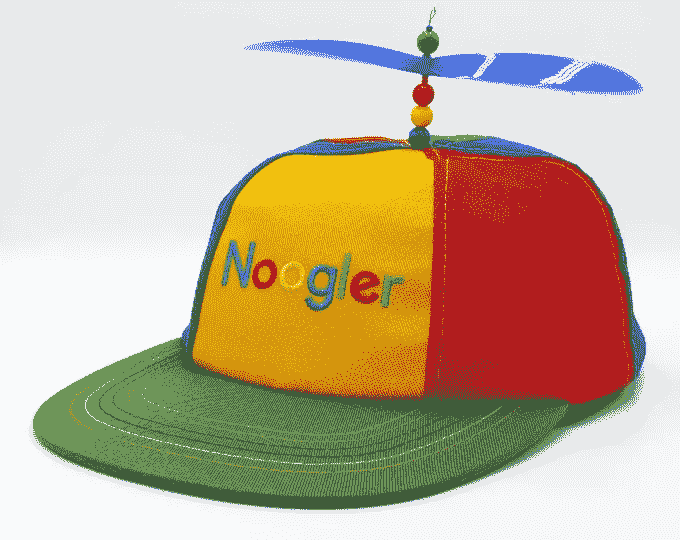

# 作为一个 30 万美元的新手我犯过的错误

> 原文：<https://levelup.gitconnected.com/mistakes-ive-made-as-a-300-000-noogler-9f0b957081c9>

它们不便宜

由 [Unsplash](https://unsplash.com?utm_source=medium&utm_medium=referral) 上 [charlesdeluvio](https://unsplash.com/@charlesdeluvio?utm_source=medium&utm_medium=referral) 拍摄的照片

当我开始在谷歌做软件工程师的新工作时，我被要学的东西淹没了。像谷歌文化和人际关系这样的东西还有很多要学，以下是我在谷歌工作 6 个月以来犯的错误。

# 没有利用作为诺格勒的优势

无论你是一名新手还是其他公司的新员工，我都希望自己能更好地利用成为最新工程师的机会。我催促自己尽快完成入职培训，以便立即做出有意义的贡献。

我想表现出我可以独立工作，独立完成任务。当我想不出来的时候，我就去阅读关于内部工具、代码库和设计的无尽的文档列表。寻求帮助感觉很尴尬。

但是在入职六个月后，我失去了对我的系统提出最简单问题的机会。其他人都知道的关于 Angular 的事情，暗示着我也知道。现在，当我问一些关于我们系统的简单问题时，我得到的是队友的关心而不是同情。

我总是有机会阅读文件或独立工作，但作为一名新员工的同理心慢慢消退。

# 对一切都说好

照片由[托马斯·博尔曼斯](https://unsplash.com/@thomasbormans?utm_source=medium&utm_medium=referral)在 [Unsplash](https://unsplash.com?utm_source=medium&utm_medium=referral) 上拍摄

加入谷歌几个月后，我被分配了一个荒谬的字符串更改任务，将所有引用从“GCP”更改为“谷歌云平台”。这是一个没人想做的任务。如果没人想做，我也不会想做。但是我盲目的接受了这个任务。

这项任务花了我两周的时间来找到我需要更新的每个实例。想象一下，告诉你的单口相声更新，这一周你所做的只是更新字符串。我的队友中没有一个对这个任务相关的更新特别感兴趣。

两周是一段很长的时间。2/52 大概是一年的 4%。对于一项既不能帮助我更好地理解系统，也不能帮助提高可见性的任务来说，这是一段很长的时间。

话说回来，为什么我有这个任务而别人没有？因为别人都说不行，而我说行。

# 在我使用的技术上投入更多时间

卢卡斯·布拉塞克在 [Unsplash](https://unsplash.com?utm_source=medium&utm_medium=referral) 上的照片

也许你已经知道 ctrl+c ctrl+v 复制并粘贴你选择的文本。但是你知道吗，在谷歌网站上点击“/”是一个可访问的快捷方式，如果有搜索栏的话，可以立即聚焦搜索栏。

在谷歌的所有内部工具中，还有很多类似的提示和技巧。但是我后悔没有花时间去学习它们，即使知道我每天都在使用这些工具。像大多数其他人一样，我对我的工具有了足够的了解来完成任务。但是如果你仍然重新输入所有的内容，而不是使用复制和粘贴，你会比其他人慢很多。

我们都在使用同样的工具。那些更好地使用它们的人总是会走在其他人的前面。

# 为品牌而来

很难找到一个不熟悉谷歌公司的软件工程师。它是 FAANG 的一部分，拥有前所未有的品牌。这是很多员工加入公司的原因，包括我自己。

但当我加入这个品牌时，我在微软留下了极好的工程机会和友好的文化。我把这两者都留给了一家把品牌看得比工程更重要的公司。

谷歌的工程师很了不起，但品牌永远高于一切。

你看到点击并按住拍手按钮会发生什么了吗？

帮我进入**微软**和**谷歌**的[简历包](https://alexcancode.gumroad.com/l/fullresumekit)

如果你喜欢这种体验，考虑成为[会员](https://medium.com/@alexcancode/membership)以获得更多类似的内容！

Twitter 上有 1000 人在关注！

关注我在 LinkedIn 上的 10 万名粉丝