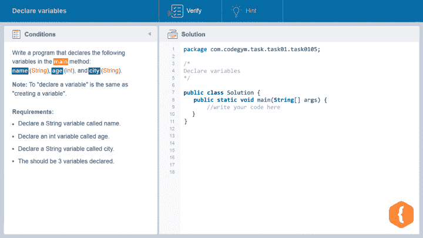
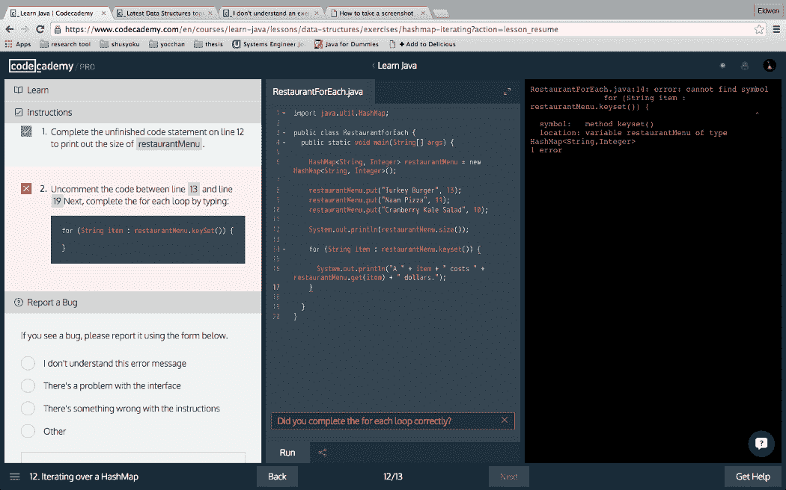
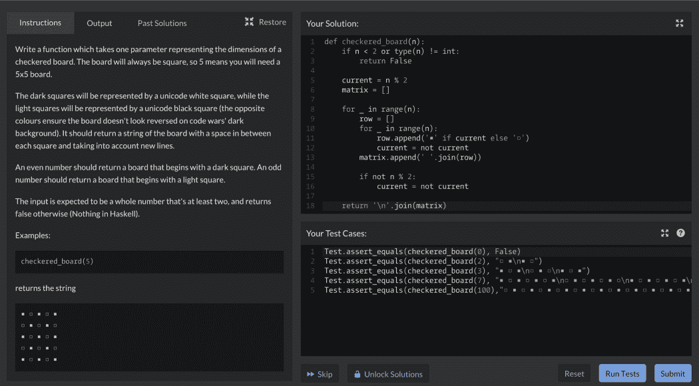

# 大多数学生在学习编程时犯的错误

> 原文：<https://levelup.gitconnected.com/mistakes-most-students-make-while-learning-programming-90ac3cabdd15>

安妮·斯普拉特在 [Unsplash](https://unsplash.com?utm_source=medium&utm_medium=referral) 上的照片

我们从小就听说每个人都是不同的，但令人惊讶的是，我看到数百名学生在开始编码时重复同样的错误。我也认识到这种错误需要尽快纠正。的确，你要努力学习编程。但是不知道要避免什么错误的努力工作就像试图去战胜风一样。

是啊！试图通过避免其他程序员犯的错误来学习是成为一名成功的程序员的一个很好的方法。真正的问题是:“我如何在错误扼杀我的动力并克服它们之前发现它们？”我已经列出了一些人们在学习编程时最常犯的错误，以及他们的解决方法。让我们一个一个挖掘出来。

# 学习编程时的常见错误

# 永无止境的研究和不足的编码

## 问题

所以你花了几个小时研究从哪种编程语言开始。但是你真的开始编码了吗？我不这么认为。(但是如果答案是肯定的，你可以跳过这一步，进入下一步，因为这不适合你，你已经在成为编码忍者的道路上了)。

所以，自从学生们考虑他们是否能成为一名程序员以来，他们犯的第一个错误就是陷入了研究而没有转向实际的编码。

当谈到选择正确的编程语言时，大多数学生都犹豫不决，因为他们认为这是他们应该做出的最困难的决定之一。他们不断研究最合适的 web 框架、结构或数据库。事实上，他们是在永无止境的研究上浪费时间，而不是真正的学习。很多新手就是这样永远卡在第一阶段的。

事实是:你甚至不能从阅读和研究中学到一个命令。除非你真的开始编码，否则它永远不会让你成为伟大的程序员。您选择的任何语言都将是学习基本编程概念的良好开端。

基本技能——如定义函数、命名变量或解决一些具有挑战性的问题——可以在各种编码中找到。因此，没有基准。所以，即使你决定从一种语言转换到另一种语言，那些以前的技能仍然对你有用。

## 解决办法

从编码本身开始，而不是浪费时间在研究上。你的编码实践越广泛，你学得就越快。它将帮助您探索语法，并且您将从头开始理解一切是如何工作的。

当你写任何程序时，你会以多种方式使用语法。由于大多数编码平台都不允许语法写得完全相同，你将会面临复杂的情况，并试图自己解决。此外，尝试跳出框框思考会对拓展你的技能产生奇迹般的效果。尝试并实施其他几种解决方案来解决一个问题。

所以，当你学习一个新概念时，立即开始编码。找到编码练习，然后即使你认为所有的信息都很清楚，你不需要练习，相信我，你需要它。我永远不会厌倦重复学习编码总是关于实践。在构思新东西后，至少要写三到五个程序。这将有助于你全面理解语法。

有几个平台可以让你得到大量的实践:

*   [**CodeGym**](https://codegym.cc/)**—一门游戏化的 Java 课程，专为刚加入编程世界的人开设。**

****

**这门课程的构建方式是你花 20%的时间在理论上，80%的时间在实践上。该程序只基于一种语言——Java，因此您可以深入学习这项技术。这门课程非常循序渐进，我建议选择它作为主要的学习来源。**

*   **[**Codecademy**](https://click.linksynergy.com/deeplink?id=JVFxdTr9V80&mid=44188&murl=https%3A%2F%2Fwww.codecademy.com%2Fcatalog%2Flanguage%2Fjava&LSNSUBSITE=TEST)**—我喜欢称之为“通过编程学习编程”的另一个解决方案。****

********

****本课程结构合理，可引导您从初级阶段进入更高级的阶段。我想说这个网站可能是学习 Java 的一个很好的补充资源，但是你必须找到学习基础知识的平台。****

*   ****[**Codewars**](https://www.codewars.com/)**——一场开发者的线上竞赛。******

************

******没错，一旦你对基础知识感到自信，就该参加竞赛了。我必须承认学生们喜欢它。你可以找到不同语言的比赛。有不同的编码选项供您选择:您可以在浏览器中编写代码并一步一步地研究它，单独编码或在小组中解决任务。******

# ******过多地与他人比较，越来越怀疑自己******

## ******问题******

******当我开始编程的时候，我经常被自我怀疑所困扰。作为一个初学者，毫无头绪，恐惧的程序员，我开始思考我的能力，因为我看到有经验的程序员在眨眼之间解决了问题。许多学生也这样做。******

******首先，你必须明白每个有经验的程序员都曾经是初学者。他们都在和你现在一样的问题上挣扎。******

******其次，如果你和你的朋友或其他初学者一起学习，在某个时候，你开始认为他们比你聪明，因为他们比你更了解一些主题，请记住，通常这只是初学者的错觉。他们可能只是在一个特定的主题上花了更多的时间，或者因为他们已经有了以前的知识，他们更容易消化新的信息。最后，每个人的学习节奏不一样。******

******我知道有时编程可能是一场噩梦，作为初学者，人们经常看着别人，开始认为他们不是聪明的问题解决者，或者有错误的编码大脑。同样，他们头脑中有许多不好的想法，这让他们对自己的编码能力感到不确定。******

## ******解决办法******

******解决这个问题的唯一办法就是停止拿自己和别人比较，尤其是和有经验的程序员比较。每当你对自己的存在感到一丝自我怀疑时，向自己保证你会坚定不移地克服任何阻碍你实现编码梦想的障碍。******

******记住，编程就是接受挑战，帮助客户解决他们的问题。所以在试图帮助他们之前，先帮帮你自己，清除所有的自我怀疑。******

******这里有一个论坛列表，在那里你可以遇到编程新手:******

*   ******[堆栈溢出](https://stackoverflow.com/)******
*   ******[GitHub](https://github.com/)******
*   ******[WebDevelopers](https://www.webdeveloper.com/) (特别适合新手)******
*   ******[黑客新闻](https://news.ycombinator.com/)******
*   ******[站点点](http://www.sitepoint.com/forums/)******
*   ******[代码项目](http://www.codeproject.com/)******
*   ******[DZone](http://www.dzone.com/)******

# ******自以为无所不知******

## ******问题******

******我知道当你的初始编码产生无错误的结果时感觉很棒。最后，你会有一种“我是不可阻挡的”的感觉，这种感觉让你精神振奋，甚至想去给别人提供培训。******

******你开始相信自己无所不知。但是，不幸的是，这是错误转折的开始。无所不知的感觉越来越限制你学习，遇到任何复杂的项目都会卡住，自我怀疑的循环再次被激活。******

******这个问题不只是新手才有；我也见过很多精通的程序员也有同样的困境。他们在完成一些杂务后停止了学习和实践，因此他们正在失去在 IT 行业的价值。******

******请记住，编程是一个永无止境的过程。每天至少有几个新的框架被引入，这当然需要你坚持不懈地学习新的结构。******

## ******解决办法******

******学习编程的最好方法之一就是认识到编码没有止境。当你有了无所不知的感觉时，立即投入到寻找一个能让你脚踏实地的复杂项目中。******

******所有成功的程序员都一直在学习，因为他们总是希望自己的知识是现实的和最新的，以满足市场的需求。不要低估或高估你的技能——保持谦逊但自信的平衡。******

# ******像对待考试一样对待学习编码******

## ******问题******

******我经常看到学生试图记忆编码技术，而不是把这个概念视为随着学习而积累和增长的信息。死记硬背可能是有用的，但它有时会阻止学生看到更广阔的视野。******

******编程不是成为智力竞赛的冠军。不管你的记忆能力有多好，如果你不能理解更复杂的想法，你就不可能成为现实世界中的优秀程序员。******

******编码就是提供解决方案。您需要理解编码语言和克服不同挑战的不同方法。没有作弊！所有程序员在编码时都使用谷歌，因为最终目标是找到解决某个问题的方法。******

## ******解决办法******

******正如我上面提到的，没有所谓的“欺骗”所以没有必要把所有的东西都背下来，因为你总是可以接触到不同的资源。******

******最好的方法是理解架构，知道如何组合事物以及在哪里找到它们。******

******因此，从其他资源获取帮助将会使你的工作准确完成。在 [GitHub](https://github.com/) 、[栈溢出](https://stackoverflow.com/)、 [Reddit](https://www.reddit.com/) (r/WebDev、r/Frontend、r/AskProgramming、r/LearnProgramming、r/Coding)等上寻找你问题的答案。会鼓励你更简单的理解编码，建立解决问题的态度。所以这就是如何用正确的方法学习编程这个问题的正确答案。******

# ******一个人学习又不好意思求助******

## ******问题******

******无论你多么努力地隐居，你都需要一个群体来生存。同样的规则也适用于作为程序员的你。我知道在完全孤立的情况下创建程序感觉像是一种福气，但在商业世界中并非如此。程序员应该是一个乐于帮助客户和他或她的队友的团队成员。******

******说到学习，和别人分享新想法的感觉棒极了。与其他程序员交谈可以帮助你分享和接受新的知识和经验。另外，这是一种友好的方式来帮助那些比你知道的少的人。类似地，许多开发人员分享他们的生活窍门，这些窍门实际上给每个人带来了好处，因为他们通过一种共同的编码语言和相同的任务感到团结。******

## ******解决办法******

******我相信学习编程的另一个最好方法是加入编码社区(我在本文前面给了你一个社区列表)。你可以找到其他的编码小组或参加会议，或者你可以简单地开始你自己的。相反，你也可以通过加入在线平台成为编码联盟的活跃成员。请记住，主要目的是增加与其他编码人员的互动，因为这将增强您的编码知识。******

# ******认为你需要成为数学天才才能擅长编程******

## ******问题******

******作为一名普通的数学学生，我的学生总是对选择自己的爱好感到紧张，因为他听说只有数学天才才能在编程领域出类拔萃。但当他逐渐意识到自己错了，那些渗入他内心的人是活在一种错误的观念中，我是那么的开心。编程不是关于你在数学方面有多出色，而是你能多快地解决问题。******

## ******解决办法******

******接受这样一个事实，即使一个普通的数学人才在大学微积分考试中失败也可以成为一个编码奇才。我不是想说编程不包括数学，因为如果你想从事科学编程或创建游戏引擎，你确实需要了解数学。但是总的来说，要成为一名成功的程序员，你不必是一个数学天才。******

******此外，如果你从学校了解基础数学，你可以在编程方面有所成就。即使你已经忘记了，也没问题！您将在处理实时任务和实际编码时学到这些知识。******

# ******在改变即将发生之前放弃******

## ******问题******

******最后但同样重要的是，学生有时很容易放弃。看，学习编程，尤其是如果你想以此为生，需要付出很多努力。有时人们放弃了，却不知道他们离成功只有几英里了。******

******在我的整个职业生涯中，我从未见过一个程序员在作为初学者编程时没有犯任何错误。这是一种自然现象，会随着时间而消失。但是放弃从来都不是一种选择。******

## ******解决办法******

******当我看到我的学生崩溃失去理智的时候，我告诉他们三个神奇的词:永不放弃。的确，你会感到疲惫和压力，但这就是你成为大师的方式。耐心是必要的，勤奋是你需要的。******

# ******结论******

******说实话，大部分学生刚开始学编程就磕磕碰碰的。然而，最好知道最普遍的错误，而不是简单地不知道它们。我已经指出了这里所有的主要错误，所以回避它们。******

******但是主要的建议还是和往常一样:坚持编码，不要放弃。尽可能多地尝试编码来实现你的目标。******

# ******分级编码******

******感谢您成为我们社区的一员！ [**订阅我们的 YouTube 频道**](https://www.youtube.com/channel/UC3v9kBR_ab4UHXXdknz8Fbg?sub_confirmation=1) 或者加入 [**Skilled.dev 编码面试课程**](https://skilled.dev/) 。******

**** [## 编写面试问题

### 掌握编码面试的过程

技术开发](https://skilled.dev)****