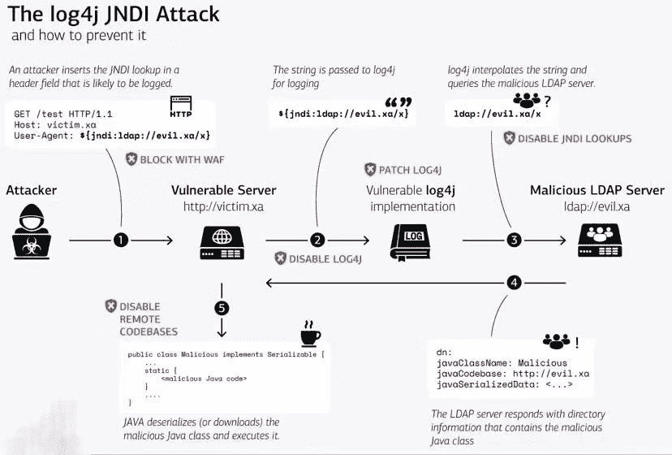

# 通过使用 Traefik 降低 Log4Shell 安全风险

> 原文：<https://levelup.gitconnected.com/mitigate-log4shell-security-risk-by-using-traefik-ead836260410>

## 无需接触您正在运行的系统，即可轻松防止网络入门级攻击！


照片由来自 [Pexels](https://www.pexels.com/photo/man-in-white-shirt-using-macbook-pro-52608/?utm_content=attributionCopyText&utm_medium=referral&utm_source=pexels) 的[蒂姆·高](https://www.pexels.com/@punttim?utm_content=attributionCopyText&utm_medium=referral&utm_source=pexels)拍摄

2021 年 12 月 10 日，在 Apache log4j2 中发现了一个严重的安全问题([https://nvd.nist.gov/vuln/detail/CVE-2021-44228](https://nvd.nist.gov/vuln/detail/CVE-2021-44228))。该漏洞是 Java 应用程序日志库中的一个问题，在多个开放和封闭源代码项目中广泛使用。为了理解该漏洞，可以使用下面的图片



来源-Twitter[https://Twitter . com/numen cyber/status/1470571451698712576/photo/1](https://twitter.com/numencyber/status/1470571451698712576/photo/1)

正如您在图片中看到的，在请求到达任何可能有漏洞的服务器之前，拦截入侵攻击的好地方就在您网络的入口处(见 1)。

**这正是使用 Traefik 的地方！**

虽然 HeadersRegexp 匹配器的内部架构允许阻塞简单的请求，比如`curl 127.0.0.1:8080 -H ‘User-Agent: jndi:ldap://127.0.0.1/a}`，但是有一种方法可以很容易地用`curl 127.0.0.1:8080 -H ‘User-Agent: ${${lower:j}ndi:ldap:*//127.0.0.1/a}*`屏蔽用户代理。然而，有一个插件可以阻止任何类型的请求。

# 插件

要安装该插件，您必须使用 Trafik v 2 . 5 . 5，并且需要将 traefik 实例连接到 traefik Pilot。然后，您可以创建静态和动态配置。我使用了一个`configuration.toml`文件，并添加了如下插件:

```
[pilot]
    token = "YOUR_PILOT_TOKEN_HERE"

[experimental.plugins.log4shell]
    modulename = "github.com/traefik/plugin-log4shell"
    version = "v0.1.2"
```

之后，您可以在 Docker 合成文件中使用它来防止负载平衡器级别的 log4shell:

```
traefik.http.routers.app.middlewares: log4shell-foo
traefik.http.middlewares.log4shell-foo.plugin.log4shell.errorcode: 200
```

# 结束语

log4j 漏洞太疯狂了。重要的是，每个人都意识到这个问题，并将尽一切可能防止可能的攻击。

使用 traefik 作为网络负载平衡器，您可以在入门级阻止每一次入侵攻击。

我建议每个人都使用像 traefik 这样的负载均衡器来提供服务。如果你想为自己设置一个，你可以看看我写的多个教程。

[](/how-to-setup-traefik-v2-with-automatic-lets-encrypt-certificate-resolver-83de0ed0f542) [## 如何使用自动加密证书解析器设置 Traefik v2

### 在我学会如何 docker 之后，我真正想要的下一件事是一个帮助我组织网站的服务…

levelup.gitconnected.com](/how-to-setup-traefik-v2-with-automatic-lets-encrypt-certificate-resolver-83de0ed0f542) 

如果你喜欢用 traefik 建立一个 Docker Swarm，你可以阅读这两个教程

[](/docker-swarm-in-a-nutshell-ed2a9c42cd7c) [## 码头工人蜂拥而至

### 这个简单的教程展示了如何在大约 15 分钟内创建一个正在运行的 docker swarm 集群。

levelup.gitconnected.com](/docker-swarm-in-a-nutshell-ed2a9c42cd7c) [](/the-most-important-services-everyone-should-deploy-in-a-docker-swarm-8e120b5a66) [## 每个人都应该在 Docker 群中部署的 4 项重要服务

### 学习如何用四个你会喜欢的重要服务来增强你的 Docker 群。

levelup.gitconnected.com](/the-most-important-services-everyone-should-deploy-in-a-docker-swarm-8e120b5a66) 

本博客到此结束。我很想听听你的想法和想法🤗请把它们记在下面👇👇👇此外，如果你有问题，不要犹豫，问我！

*✍️写的*

*保罗·克努特*

👨🏻‍💻🤓🏋️‍🏸🎾🚀

丈夫，两个孩子的父亲，极客，终身学习者，技术爱好者&软件工程师

*问好🙌开:*

[*Twitter*](https://www.twitter.com/paulknulst) *，*[*LinkedIn*](https://www.linkedin.com/in/paulknulst/)*，* [*GitHub*](https://github.com/paulknulst)