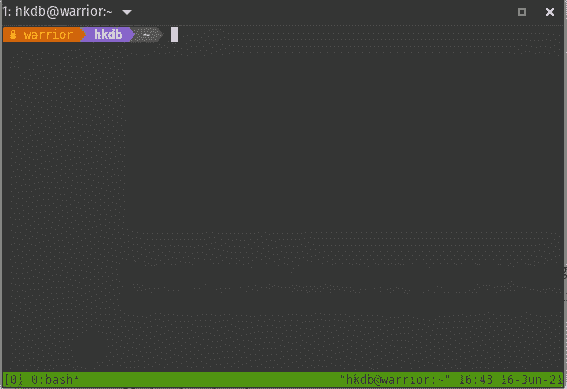

# 缓解不稳定的连接

> 原文：<https://levelup.gitconnected.com/mitigate-unstable-connectivity-bf989c62acdd>

## 用 tmux 和。用于 SSH 远程会话的 bashrc


如果你在科技行业工作过一段时间，或者过去只是上过一些计算机科学课程，那么你很可能不得不通过 [SSH](https://en.wikipedia.org/wiki/Secure_Shell_Protocol) 与远程服务器一起工作，以执行一些命令、编译代码、解决服务器问题，或者部署你编写的新应用。你们中的一些人甚至可能有一个便携式 CLI 环境，只要你有稳定的互联网连接，无论你去哪里，它都允许你做任何你自己定制的事情。也就是说，如果您总是与一台台式计算机保持稳定的连接，并且您运行的命令不需要花费数小时来完成，那么 SSH 很可能就足够了。

然而，如果你一天中不停地跑来跑去通过多个地点连接，你会遇到和这篇文章顶部图片一样的问题。当您完成了一个命令的 90%时，突然之间，您的连接中断了，这难道不令人沮丧吗？是的，这意味着您必须重新开始，因为您会丢失会话状态，并且一旦连接中断，所有进程都会被终止。如果您想要运行一个需要 5 个小时的命令，并且在这 5 个小时之间，您必须使用同一台笔记本电脑移动到不同的物理位置，该怎么办？好吧，欢迎来到我的生活故事！

## 长时间运行流程和不稳定连接的解决方案

是的，正如这篇文章的标题所暗示的，上面提到的挑战有一个解决方案，而且只需要几分钟就可以完成。您所要做的就是安装以下软件:

*   [tmux](https://github.com/tmux/tmux)——一个强大的终端多路复用器，它的能力超过了我在这里将要讨论的范围。出于本文的目的，我们将重点关注它在多次登录/连接中维护会话状态以及在远程会话中拆分窗口的能力，就像您在本地桌面环境中使用 [Tilix](https://gnunn1.github.io/tilix-web/) / [Terminator](https://gnome-terminator.org/) 一样。

如您所料，tmux 是键盘驱动的，非常适合远程 CLI 环境。你不需要这样做，但这里有一个快速的备忘单，告诉那些有兴趣深入了解我将在以下步骤中介绍的内容的人如何去做:


虽然 tmux 很可能已经安装在您选择的发行版中，但是如果您的远程 Linux 服务器上还没有安装 tmux，那么下面是如何安装 tmux 的方法:

```
# Debian/Ubuntu Base
$ sudo apt install tmux# Arch Based
$ sudo pacman -S tmux# RedHat Based
$ sudo dnf install tmux
```

这就是了。现在，当您登录后只需键入 tmux，您将拥有一个远程会话，它将经受住多次登录/注销和不稳定的连接:



请注意底部有一个绿色条。它表示您处于 tmux 会话中。此时，即使您的连接中断，您的会话仍将继续。您只需重新登录并重新连接 tmux 会话，就可以再次看到所有内容重新出现在您的眼前。

现在让我们在 tmux 会话中进行一些“工作”:

*   水平分割窗口，点击 Ctrl-b %,然后输入“htop”在右边运行 htop
*   按 Ctrl-b ←(左箭头)返回到左侧外壳
*   运行 DoTheWork.sh 脚本

```
$ ./DoTheWork.sh
```

您的会话现在看起来将如下所示:


现在，让我们从这个会话中分离出来，并在它完成它的工作时干净地注销，以便我可以通过按 Ctrl-b d，然后按 Ctrl-d 或键入 exit 从服务器中注销，实际移动到我的下一个目的地。

到达下一个目的地后，我只需重新登录服务器并键入以下内容:

```
$ tmux attach -t 0
```

上面命令中的“0”是会话 id，如果只有一个 tmux 会话，则该 id 始终为 0。如果您有多个会话，那么 id 当然会增加。所以，是的，你可以同时进行多个会话。要检查您打开了哪些会话，您只需键入:

```
$ tmux ls
```

在任何情况下，在您重新连接 tmux 会话之后，您将会看到一切都如预期的那样仍然存在。请再次注意，即使您没有干净地分离 tmux 会话，并且在工作时失去了连接，这也是正确的。

就是这样！然而，您可能像我一样，在登录远程服务器时有时会忘记启动 tmux。我不记得在没有启动 tmux 的情况下，在远程服务器上运行某个长进程之前，我有多少次想扇自己耳光。所以能解决我健忘的部分来了。

## 自动启动 tmux

我将假设您要么使用 bash，要么使用 shell 环境。我是巴沙尔。

为了让 tmux 在登录时自动启动，这样您就不必自己动手了，请打开~/。bashrc，并添加以下几行:

```
if [[ -n "$PS1" ]] && [[ -z "$TMUX" ]]; then
    tmux new-session
fi
```

这将在您每次登录时自动打开一个新的 tmux 会话。这当然意味着您必须在下次登录时手动重新连接会话，但这也意味着您可以灵活地连接您想要的任何会话，而不是自动启动现有会话。

但是，如果您只想反复使用同一个会话，请在。改为远程服务器的 bashrc:

```
if [[ -n "$PS1" ]] && [[ -z "$TMUX" ]]; then
    tmux attach-session -t ssh_tmux || tmux new-session
fi
```

最后但同样重要的是，如果您希望在分离或退出 tmux 会话后自动注销，请在。您的远程服务器的 bashrc intead:

```
if [[ -n "$PS1" ]] && [[ -z "$TMUX" ]]; then
    tmux attach-session -t ssh_tmux && exit || tmux new-session && exit
fi
```

你有它！现在，您已经准备好成为一名移动战士，而不会受到不稳定的连接或长时间运行的流程的影响，从而无法前往下一个目的地！