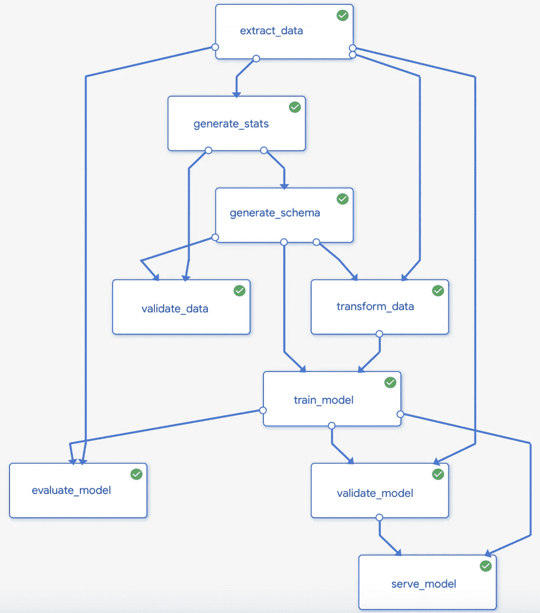

# MLOps:用于机器学习的 DevOps 方法和工具

> 原文：<https://levelup.gitconnected.com/mlops-methods-and-tools-of-devops-for-machine-learning-8cc87cd91ed7>

当谈到机器学习时，我们通常会讨论数据准备或模型构建。该技术很少在部署方面被提及。

根据最近的一项研究，这个阶段占据了数据科学家 25%的时间。换句话说，他们将四分之一的精力投入到基础设施上，而不是做他们最擅长的事情。

同一调查显示，将模型从研究环境投入生产——最终开始增加商业价值——平均需要 8 到 90 天。更糟糕的是，在 T2，75%的 ML 项目从来没有超过实验阶段。

作为对这一问题的合乎逻辑的反应，出现了一种新的趋势——MLOps。这篇文章

*   概述了 MLOps 的主要概念和潜在优势，
*   解释它与其他流行的 Ops 框架的不同之处，
*   在关键的 MLOps 阶段充当向导，并且
*   引入可用的工具和平台来自动化 MLOps 步骤。

最后，我们将考虑 MLOps 采用的三个级别，但我们不要走在故事的前面！所以…

# 什么是 MLOps，它如何推动业务成功？

“机器学习”和“操作”这两个术语的融合，MLOps 是一套用于在生产中自动化机器学习算法生命周期的方法，从最初的模型训练到部署，再到针对新数据的再训练。它促进了[数据科学团队](https://www.altexsoft.com/blog/datascience/how-to-structure-data-science-team-key-models-and-roles/?utm_source=MediumCom&utm_medium=referral&utm_campaign=shared)和 It 专业人员之间的合作，因此结合了数据工程、机器学习和 [DevOps](https://www.altexsoft.com/blog/engineering/devops-principles-practices-and-devops-engineer-role/?utm_source=MediumCom&utm_medium=referral&utm_campaign=shared) 中使用的技能、技术和工具——软件开发领域中 MLOps 的前身。

*MLOps 是 ML、数据工程和 DevOps 的交汇点。*

采用 MLOps 可为组织带来以下好处。

有更多时间开发新车型。 *“直到现在，机器学习工程师或数据科学家一直在自己将模型部署到生产中，”*—altex soft 数据科学能力负责人 Alexander Konduforov 评论道。*“借助 MLOps，生产环境是运营专业人员的职责范围，而数据科学家可以专注于他们的核心任务。”*

**缩短 ML 车型的上市时间。** MLOps 为模特培训和再培训流程带来了自动化。它还为部署和更新[机器学习管道](https://www.altexsoft.com/blog/machine-learning-pipeline/?utm_source=MediumCom&utm_medium=referral&utm_campaign=shared)建立了持续集成和持续交付([сI/CD](https://www.altexsoft.com/blog/business/continuous-delivery-and-integration-rapid-updates-by-automating-quality-assurance/?utm_source=MediumCom&utm_medium=referral&utm_campaign=shared))实践。因此，基于 ML 的解决方案可以更快地投入生产。

**更好的用户体验。**由于持续培训和模型监控等 MLOps 实践，您的人工智能应用程序可以及时更新，从而提高客户满意度。

**预测质量更高。** MLOps 负责数据和模型验证，评估其在生产中的性能，并根据新数据集进行再培训。所有这些都消除了错误见解的风险，并确保您在做出重要决策时可以信任算法产生的结果。

# MLOps 和其他 Ops:有什么区别？

[机器学习](https://www.altexsoft.com/whitepapers/machine-learning-bridging-between-business-and-data-science/?utm_source=MediumCom&utm_medium=referral&utm_campaign=shared)的本质决定了 MLOps 的特殊性，这种特殊性使其有别于 DevOps、DataOps 和 AIOps 等密切相关的“Ops”实践。下面，我们将探讨它们之间的核心区别，以避免混淆并更好地抓住每种方法的本质。

## MLOps 与 DevOps

MLOps 经常被称为机器学习的 DevOps，这一点很难反驳。MLOps 继承了 DevOps 的很多原则。要了解更多信息，请观看我们最近解释 DevOps 的视频。

*devo PS 如何将开发和运营专家聚集在一起。*

尽管有相似之处，但我们不能简单地使用 DevOps 工具并应用它们来操作 ML 模型。以下是主要原因。

**1。除了代码版本控制，您还需要一个地方来保存数据和模型版本。**机器学习涉及大量实验。数据科学家用各种数据集训练模型，这导致不同的输出。因此，除了在 DevOps 中使用的代码版本控制之外，MLOps 还需要特定的工具来保存数据和模型版本，以便重用和重新培训。

**2。与代码不同，模型会随着时间而退化，这需要监控。**经过训练的模型投入生产后，它开始根据真实数据生成预测。在一个稳定的环境中，它的精确度不会下降。但是，唉，*“生活在变，我们的模型接受的实时数据也在变，*”——亚历山大·孔多福罗夫承认。*“这导致了所谓的模型退化，换句话说，它的预测性能会随着时间的推移而降低。为了防止错误，我们需要持续的模型监控，这对于 DevOps 实践来说并不典型。”*

**3。训练永无止境。**一旦发现性能下降，必须使用新数据重新训练模型，并在再次投入生产之前进行验证。因此，在 MLOps 中，持续培训和验证取代了在 DevOps 中执行的持续测试。

## MLOps 与 DataOps

DataOps 或者说数据操作几乎是和 MLOps 同时进场的，也借鉴了很多 DevOps 的模式。但它的核心应用领域是数据分析。

DataOps 涵盖数据生命周期的所有步骤，从收集到分析和报告，并尽可能实现自动化。它旨在提高数据的质量和可靠性，同时最大限度地缩短交付分析解决方案所需的时间。

这种方法对于处理大型数据集和复杂数据管道的组织特别有用。DataOps 也可以促进 ML 项目——但只是在一定程度上，因为它不提供管理模型生命周期的解决方案。所以 MLOps 可以看作是 DataOps 的扩展。

## MLOps vs AIOps

上述所有 Ops 中最年轻的，AIOps 经常与 MLOps 互换使用，简单地说，这是非常不正确的。根据在 2017 年创造了这个术语的 [Gartner 的说法，](https://www.gartner.com/en/information-technology/glossary/aiops-artificial-intelligence-operations)ai ops——或 IT 运营的人工智能— *“结合了大数据和机器学习来自动化 IT 运营流程。”*

从本质上讲，AIOps 的目标是自动发现日常 IT 运营中的问题，并使用人工智能主动做出反应。Gartner [预计](https://www.gartner.com/smarterwithgartner/how-to-get-started-with-aiops/)到 2023 年，多达 30%的大型企业将采用 AIOps 工具来监控其 IT 系统。

现在，是时候回到我们的核心主题，更详细地探索整个 MLOps 周期了。

## MLOps 概念和工作流程

端到端的 MLOps 工作流程由持续集成、交付和培训方法指导，这些方法相互补充，缩短了人工智能解决方案向客户提供的途径。

**持续集成和持续交付(CI/CD)。** MLOps 生活在由 DevOps 倡导的 [CI/CD 框架](https://www.altexsoft.com/blog/business/continuous-delivery-and-integration-rapid-updates-by-automating-quality-assurance/?utm_source=MediumCom&utm_medium=referral&utm_campaign=shared)中，这是一种在频繁的时间间隔内推出高质量代码更新的成熟方法。然而，机器学习通过数据和模型验证扩展了集成阶段，而交付解决了机器学习部署的复杂性。总之，CI/CD 将数据、模型和代码组件结合在一起，以发布和更新预测服务。

**连续训练(CT)。**CT 是 MLOps 独有的概念，它完全是关于模型再训练的自动化。它包含模型生命周期的所有步骤，从数据接收到跟踪其在生产中的性能。CT 确保您的算法会在环境出现衰退或变化的第一个迹象时得到更新。

为了更好地理解持续集成、交付和培训如何转化为实践，以及如何在 ML 和运营专家之间分担职责，让我们来学习 MLOps 的关键组成部分。这包括:

*   模型培训渠道，
*   模型注册表，
*   模型服务(部署)，
*   模型监控，以及
*   CI/CD 编排。

*m lops 周期的关键组成部分。*

当然，在不同的情况下，步骤和整个工作流程可能会有所不同——取决于项目、公司规模、业务任务、机器学习复杂性和其他因素。因此，这里我们将描述最常见的场景，并建议可用的工具来自动化重复的任务。

## 模型培训渠道

***构建端到端模型训练管道的工具:***[*【TFX】*](https://www.tensorflow.org/tfx)*(tensor flow Extended)*[*ml flow*](https://mlflow.org/)*，* [*厚皮动物*](https://www.pachyderm.com/) *，*[*kube flow*](https://www.kubeflow.org/)

***现阶段谁做什么:***

*   ML 专家创建培训渠道，设计新功能，监控培训过程，解决问题。
*   *运营专家测试管道组件，并将它们部署到目标环境中。*

模型培训管道是持续培训流程和整个 MLOps 工作流程的关键组成部分。它执行频繁的模型训练和再训练，而数据科学家可以专注于为其他业务问题开发新模型，而不是对现有模型进行微调。

*库伯流管道图。来源:* [*谷歌云*](https://cloud.google.com/solutions/machine-learning/architecture-for-mlops-using-tfx-kubeflow-pipelines-and-cloud-build)

根据使用案例，可以重新开始一个培训周期:

*   手动，
*   按时(每天、每周。每月)，
*   一旦新数据可用，
*   一旦发现训练数据集和实时数据之间存在显著差异，或者
*   一旦模型性能下降到基线以下。

每次流水线执行以下步骤序列。

**数据摄取。**任何 ML 管道都是从数据摄取开始的——换句话说，从外部存储库或功能库获取新数据，在那里数据被保存为可重用的“功能”，为特定的业务案例而设计。此步骤将数据拆分为单独的训练集和验证集，或者将不同的数据流合并为一个包含一切的数据集。

**数据验证。**该步骤的目标是确保摄取的数据符合所有要求。如果发现异常，管道可以自动停止，直到数据工程师解决问题。它还会告知您的数据是否会随时间发生变化，突出显示模型在生产中使用的训练集和实时数据之间的差异。

**数据准备。**在这里，原始数据被清理，并获得正确的质量和格式，以便您的模型可以使用它。在这一步，数据科学家可能会介入，利用[数据机器人](https://www.datarobot.com/)、[特征工具](https://www.featuretools.com/)或其他特征工程解决方案的能力，将原始数据与领域知识结合起来，并构建新的特征。

**模特培训。最后，我们来到了整个管道的核心。在最简单的情况下，模型是根据新摄取和处理的数据或特征来训练的。但是您也可以并行或按顺序启动几个训练运行，以确定生产模型的最佳参数。**

**模型验证。**当我们在以前从未见过的数据集上测试最终模型性能，以确认其部署准备就绪时，就会出现这种情况。

**数据版本化。**数据版本化是在软件开发中保存类似于代码版本的数据制品的实践。流行的方法是使用 GIT 上的轻量级 CLI 工具 [DVC](https://dvc.org/) ，尽管你可以在更复杂的解决方案中找到类似的功能，如 MLflow 或 Pachyderm。

*DVC 允许数据科学家保存实验并在以后重复使用。来源:* [*谷歌云*](https://cloud.google.com/solutions/machine-learning/architecture-for-mlops-using-tfx-kubeflow-pipelines-and-cloud-build)

为什么这种实践对整个 MLOps 生命周期如此重要？在训练过程中，根据训练数据集和您选择的参数，模型输出会有很大的不同。版本控制工具存储在特定的训练运行中使用的配置，这意味着您可以在任何需要的地方重现具有相同结果的实验。这有助于您轻松地在数据集和模型之间切换，以寻找最佳组合。

## 模型注册表

***平台充当模型注册表:*** [*MLflow 模型注册表*](https://databricks.com/product/mlflow-model-registry)*[*AI Hub*](https://cloud.google.com/ai-hub)*

****谁在这个阶段做什么:*** *ML 专员可能会共享模型，并与 Ops 专员协作来改进模型管理。**

*当找到合适的候选产品时，它将被推送到模型注册中心——一个集中的中心，捕获已发布模型的所有元数据，如*

*   *标识符，*
*   *姓名，*
*   *版本，*
*   *添加该版本的日期，*
*   *序列化模型的远程路径，*
*   *模型的部署阶段(开发、生产、存档等。),*
*   *关于用于训练的数据集的信息，*
*   *运行时指标，*
*   *用于高度管控行业(如医疗保健或金融)审计目标的治理数据，以及*
*   *其他附加元数据取决于您的系统和业务需求。*

*注册中心充当研究和生产环境之间的通信层，为部署的模型提供运行时所需的信息。它还支持跟踪变化和*阴影模式测试*，我们稍后会谈到。*

## *模型服务*

****模型上菜工具:*** [*谢顿核心*](https://www.seldon.io/tech/products/core/) *，* [*MLflow 模型*](https://www.mlflow.org/docs/latest/models.html) *，*[*algorithm ia*](https://algorithmia.com/)*，*[*kube flow*](https://www.kubeflow.org/)*

****谁在这个阶段做什么:*** *Ops 专家控制模型部署，而 ML 专家可能在生产中启动测试。**

*在生产中启动模型有三种主要方式:*

*   *在物联网边缘设备上，*
*   *嵌入消费者应用，以及*
*   *在通过 [REST API](https://www.altexsoft.com/blog/engineering/what-is-api-definition-types-specifications-documentation/?utm_source=MediumCom&utm_medium=referral&utm_campaign=shared) 或远程过程调用(RPC)可用的专用 web 服务内。*

*被称为模型即服务的最新方法是目前最受欢迎的方法，因为它简化了部署，将机器学习部分与软件代码分开。这意味着您可以在不重新部署应用程序的情况下更新模型版本。此外，在这种情况下，预测服务可以由多个消费者应用程序访问。*

**

**部署的模型即服务方法。来源:* [*三级 ML 软件*](https://ml-ops.org/content/three-levels-of-ml-software.html)*

*像 Kubeflow、TFX 或 MLflow 这样的工具会自动将模型打包成 Docker 图像，部署在 [Kubernetes](https://www.altexsoft.com/blog/kubernetes-security/) 或特殊的模型服务器上，如 [TensorFlow Serving](https://www.tensorflow.org/tfx/guide/serving) 和 [Clipper](http://clipper.ai/) 。此外，您可以为同一个服务部署多个模型，以便在生产环境中执行测试。*

***阴影模式测试。**也被谷歌称为“黑暗启动”，这种方法通过一个新鲜的模型版本来运行生产流量和实时数据。其结果不会返回给最终用户，而只是被捕获以供进一步分析。与此同时，旧版本继续为客户提供预测。*

***测试竞争车型。**这种技术包括同时部署具有相似输出的多个模型，以找出哪个更好。该方法类似于 A/B 测试，只是您可以比较两个以上的模型。这种测试模式带来了额外的复杂性，因为您必须在模型之间划分流量，并为最终选择收集足够的数据。*

## *模型监控*

****模型监控工具:***[*ml watcher*](https://github.com/anodot/MLWatcher)*，*[*DbLue*](https://dblue.ai/)*，* [*Qualdo*](https://www.qualdo.ai/monitor-ml-model-performance-monitoring/)*

****此阶段谁做什么:*** *ML 专员分析指标并捕获系统警报。**

*在发布到生产时，模型性能可能会受到许多因素的影响，从研究和实时数据的初始不匹配到消费者行为的变化。*

*在某些时候，当精度变得不可接受时，必须重新训练算法。但是要准确检测出所谓的模型漂移何时发生并不容易。通常，机器学习模型不会立即证明错误，但它们的预测确实会影响最终结果。不准确的洞察力会导致糟糕的商业决策，从而导致财务损失。为了避免这样的麻烦，公司应该采用软件解决方案来自动检测异常，发出早期警报，并触发机器学习管道进行再培训。*

## *CI/CD 编排*

****精简 CI/CD 工作流程的工具****:*[*GoCD*](https://www.gocd.org/)*，* [*IBM 城市代码*](https://www.urbancode.com/) *，*[*AutoRABIT*](https://www.autorabit.com/)*

****谁在这个阶段做什么:*** *运营专员统一多个流程，自动化整个发布流程。**

*MLOps 流程的所有组件都已就绪，我们需要协调许多活动，如执行培训管道、运行测试和验证，以及部署新的模型版本。为此，使用 CI/CD 工具，这些工具可以可视化复杂的工作流并管理应用程序的生命周期。这允许您以相对简单的方式将管道连接在一起。值得注意的是，许多 MLOps 解决方案很容易与主流 CI/CD 工具以及 Git 集成。*

**

**在 GoCD 中，ML 管道与应用程序部署管道相结合。来源:*[*MartinFowler.com*](https://martinfowler.com/articles/cd4ml.html)*

# *与 Google、Amazon 和 Microsoft 的端到端 MLOps*

**微软 Azure 的端到端 MLOps 生命周期。**

*与 DevOps 不同，MLOps 还处于起步阶段，缺乏成熟的解决方案。这意味着在大多数情况下，该框架使用了多种多样的工具，并且需要频繁的人工干预。*

*然而，这种方法正在迅速发展，因为它得到了脸书、亚马逊、微软、网飞、谷歌和其他每天推出无数模型的科技巨头的推动。一些 MLOps 的传播者提出在他们的平台上，使用他们的基础设施和服务来构建和管理端到端的 ML 生命周期。*

***Microsoft Azure** 授予使用启动 MLOps 的机会*

*   *[Azure 机器学习](https://azure.microsoft.com/en-us/services/machine-learning/#features)构建、训练和验证可复制的 ML 管道；*
*   *自动化 ML 部署的 Azure Pipelines*
*   *[Azure Monitor](https://azure.microsoft.com/en-us/services/monitor/#security) 跟踪和分析指标；和*
*   *[Azure Kubernetes 服务](https://azure.microsoft.com/en-us/services/kubernetes-service/)和其他附加工具。*

**

*Microsoft Azure 的端到端 MLOps 生命周期。*

*在**谷歌云**上建立一个 MLOps 环境涉及到许多服务，包括*

*   *[数据流](https://cloud.google.com/dataflow)提取、验证和转换数据以及评估模型；*
*   *[AI 平台笔记本](https://cloud.google.com/ai-platform-notebooks)开发训练模型；*
*   *[云构建](https://cloud.google.com/cloud-build)构建和测试机器学习管道；*
*   *TFX[部署天然气管道；和](https://www.tensorflow.org/tfx)*
*   *[Kubeflow 管道](https://www.kubeflow.org/docs/pipelines/overview/pipelines-overview/)在 [Google Kubernetes 引擎](https://cloud.google.com/kubernetes-engine) (GKE)之上安排 ML 部署。*

*在 **AWS** 上的 MLOps 可以通过 [Amazon SageMaker](https://aws.amazon.com/sagemaker/) 实现，这是一套用于构建、训练、部署和监控机器学习模型的工具。*

# *你什么时候真正需要 MLOps？*

*如果您想到了这个问题，那么弥合模型构建和部署之间的差距可能早就应该实现了。然而，这并不意味着您必须投入大量资金将所有步骤缝合在一起，并将每项任务自动化。Google [描述了](https://cloud.google.com/solutions/machine-learning/mlops-continuous-delivery-and-automation-pipelines-in-machine-learning#mlops_level_2_cicd_pipeline_automation)三个层次的 MLOps，它们之间的选择取决于组织规模和它们需要运行的机器学习算法的数量。*

***MLOps level 0** 表明该公司使用机器学习，甚至拥有能够构建和部署模型的内部数据科学家。但是 ML 工作流程完全是手动的。这个水平可能足够了*“像银行或保险机构这样的非科技公司，* *他们升级他们的模型，比如说，一年一次或者当另一场金融危机发生的时候，”*——亚历山大·孔多福罗夫澄清道。*

***m lops 1 级**引入了持续培训的渠道。数据和模型会被自动验证，并且每当模型性能下降或有新数据时，都会触发重新训练。这种场景可能有助于在不断变化的环境中运行并需要主动应对客户行为、价格和其他指标变化的解决方案。*

*当 CI/CD 管道在生产中自动部署 ML 模型和 ML 培训管道的组件时，MLOps level 2 就出现了。这个级别适合技术驱动型公司，这些公司必须每天(如果不是每小时)重新培训他们的模型，在几分钟内更新它们，并同时在数千台服务器上重新部署。如果没有端到端的 MLOps 周期，这样的组织将无法生存。*

**原载于 AltexSoft tech 博客“*[*【MLOps:devo PS 用于机器学习的方法和工具*](https://www.altexsoft.com/blog/mlops-methods-tools/?utm_source=MediumCom&utm_medium=referral&utm_campaign=shared)*