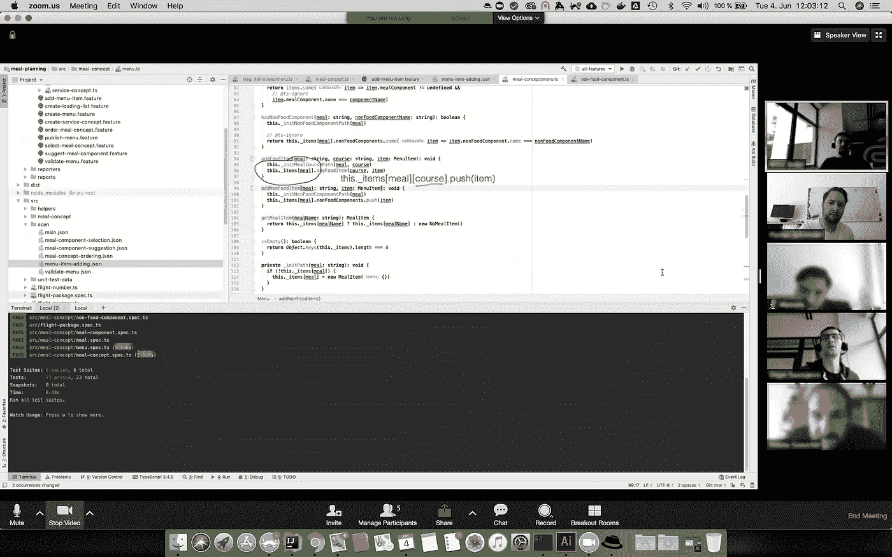
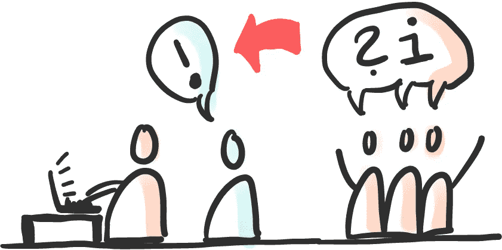
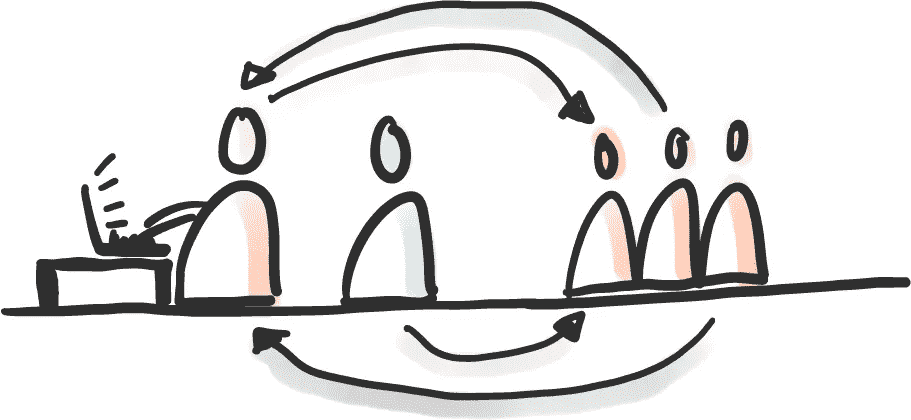

# 暴民编程和分享一切

> 原文：<https://levelup.gitconnected.com/mob-programming-and-share-everything-1704fa071852>

约翰·弗莱彻和弗洛里安·施奈德

Mob 编程是一种我们广泛用于在团队中共享知识、提高开发人员技能和增加团队凝聚力的技术。这些可能不是你生意的主要目标，但它们对实现你的目标的贡献可能比你意识到的要大得多。在这篇文章中，我们分享了我们开发的使 Mob 编程可行、有趣和有效的技术。

# “分享一切”

在最近的一个项目中，我们引入了 mob 编程，作为我们在团队内部共享一切的目标的一部分。我们希望所有的开发者都处于同一水平，而不是有头衔、分类和专业。由于一贯地应用“共享一切”的思维模式，我们团队的“公共汽车因素”接近团队规模。

# 公交因素？

-图片由莱曼·农·昂思普拉什拍摄

在任何团队中，都有个人是特定知识的唯一拥有者，这些知识对团队的表现和结果至关重要。如果这些人突然离开团队，团队会受到影响。

一个团队的公共汽车因素是在这个团队陷入严重困境之前，需要“被公共汽车撞”的团队成员的数量。

因此，总线因素表明了您的团队在知识转移和技能共享方面的健康程度。高总线系数表明健康的知识共享和健康的团队。

我们是如何应用 mob 编程和“共享一切”的？

# 暴民编程——一次冒险

*-远程暴民编程会议——作者截图*

在这个项目中，我们很幸运地使用了 DDD(领域驱动设计)、TDD(测试驱动开发)，以及更重要的 mob 编程技术。

最初我们有一个颠簸的开始。Mob 编程与我们习惯的软件开发感觉完全不同。在回顾会上，人们反复提到一种感觉，即我们可能走得不够快，并且对无法拿起键盘和控制感到沮丧。我们尝试过，放弃过，重启过，又停下来。

我们一开始做了很多实验，并受到了马雷特·皮哈尔维[[https://mobprogramingguidelines . XYZ/Download/mobprogramingguidelines . pdf](https://mobprogrammingguidebook.xyz/Download/MobProgrammingGuidebook.pdf)]的指南的启发。

我们开始看到知识是如何传递给每个团队成员的，代码质量似乎也在提高。

然而，挑战依然存在。就在我们打算永远放弃这个想法的时候，我们和伍迪·祖伊[[https://woodyzuill.com/](https://woodyzuill.com/)]开了一个很棒的乌合之众编程研讨会。这有助于我们了解这项技术如何让我们作为个人和团队得到发展，我们再次充满热情！在我们从 Woody 那里学到的许多想法中，有一个是每日回顾的实践。一般来说，我们在下午 4 点左右这样做，并尽量保持在 5 分钟。在每日回顾中，每个人都说了一些在一天中积极向上的事情。为了适应它，我们需要设置一个闹钟。

我们需要关注远程 mob 编程，因为团队成员分散在不同的地点。在这里，我们从西蒙·哈勒、约亨·克里斯特和马丁·胡伯的指导中得到了启发——[【https://www.remotemobprogramming.org/]T2]。我们需要建立一些规则…

# 一些“分享一切”的规则

**摄像头一直开着**

*-图片来自 Aksa2011，pixabay*

由于团队分散在几个地方，对我们来说定义“摄像机一直开着”的规则很重要。这让所有团队成员都感觉自己是一等公民。它给你一种更好的“我们”的感觉，特别是对于远程成员。此外，它还能在讨论和会议中促进更好的理解，因为你会看到说话人的手势。这就引出了下一条规则…

**30 秒规则**

*-图像由 Aron Visuals，unsplash*

如果一个人在镜头外发言超过 30 秒，会议必须中断，以便强制纠正。
因为我们主要项目办公室的每个人都有自己的带摄像头的笔记本电脑，所以大多数时候，每个人都默认处于摄像头之下。

然而，通常利益相关者会拜访我们参加会议。为了贯彻我们的“共享一切”理念，每个人都需要平等地参与这些会议。关键是要调整我们的设置，以便房间里的所有客人都能被远程成员/参与者清楚地看到。无论是为了捕捉肢体语言，还是仅仅是为了意识到到底是谁在说话，这条规则就像白天和黑夜一样有所不同。因此，在会议开始前，多余的人被分配到现有的笔记本(摄像机)中。利益相关者非常合作。

**10 分钟规则**

*-图片由 Clem Onojeghuo，unsplash 拍摄*

如果远程参与者在 10 分钟内没有说任何话，停止会议，让他们说点什么或总结最后几分钟。当然，这是一个硬性规定，但对我们来说，重要的是每个人都了解会议的内容，并保持知识的传播。如果有人一段时间不说话，通常表明他们已经不知道发生了什么。

你需要休息吗？拿一个。

*-图片由 Alex 拍摄，unsplash*

Mob 编程需要高度的注意力和专注度，学习很累。团队中的每个人都应该被允许在需要的时候休息。做 mob 编程的积极的一面是，这个人会很快回到流程中。
我们尝试了各种突破技术，最终确定了“个人突破”技术。我们通常同步午餐，但除此之外没有约定的休息时间。任何人只要觉得有必要，都可以休息片刻。当他们回来时，我们只是把他们放在名单的末尾。这避免了讨论和组织。这个人很容易再次进入。

当然，对于商务会议，你们需要一起休息。在这里，我们建立了另一个规则——“45 分钟规则”，这基本上意味着每 45 分钟强制休息一次。对于不说母语的远程参与者来说，会议压力很大。这有助于他们保持关注。

上面的规则在做 mob 编程的时候帮了我们很大的忙。mob 编程帮助我们将所有知识传播给每个团队成员。因此，这个团队中的每个人都知道我们应用程序的每个小角落，并且能够处理它的每个部分。

# 为胜利而实验

如前所述，我们做了大量的实验。实验很有趣。因此，举例来说，我们尝试用三种不同的方式做群体编程，这是我们在 Woody Zuill 的工作室里从他那里学到的“道场”。我们称之为严格、柔和、自由式。

**严格**

驱动程序导航模式的最严格实现。只有导航员被允许说话，其他人只是简单地看着。从字面上看，他们可能不说话，甚至回答问题。对于暴民来说，这很快变得令人沮丧，因为他们看到导航员在挣扎，却不允许给他们任何答案。令人惊讶的是，这可以创造巨大的利益。领航员学会大声思考，这样下一个领航员就能轻松接手。向暴民提问(没有人回答)是一种非常有效的交流方式。
暴民学会了耐心，学会了让别人试一试的重要艺术；尝试别人的想法。一旦你学会处理挫折，你会发现这是所有技巧中最平和的。没有讨论，没有争论。只是编码，试着理解对方。

**软**

这类似于严格的技术，但是当导航器请求时，允许暴民说话。他们可以回答问题，也可以举手，然后等到被要求发言。当你看队友挣扎时，这消除了一些严格技术的愚蠢。然而，如果你不小心，这种技术可以退化为长时间的讨论和“自由式”。

**自由式**

在自由式模式中，有一个车手，其余的队员是导航员。每个人都可以自由地发布命令，提出想法，或者开始讨论。我们发现，在这种模式下，运用技巧来减少讨论是很重要的。其中一个技巧就是接受同事的想法，并尝试去证明它是好是坏，而不是讨论到死。往往结果是令人惊讶的！

我们还试验了 mob 编程时间。因此，我们尝试将计时器设置为非常低(2-3 分钟)、中等(5-12 分钟)和高(15-25 分钟)的时间。然后我们开始暴民 1 到 2 轮。我们发现计时器设置过高会导致追随者失去注意力。此外，太低的时间是不好的，因为你开始，思考一些事情，开始一个小的讨论和繁荣…时间结束了。至少，我们坚持 6-8 分钟驾驶一圈。我们有足够的时间去做一些事情，同时也讨论一些想法。

作为一个远程团队，我们还必须考虑切换的开销(推到一个专用的 Git 分支，切换屏幕共享)。当我们受到训练时，我们设法将这个时间减少到 30 秒，但没有更长。所以一个不到 6 分钟的计时器，这就成了一个重要的方面。

我们尝试的另一件事是驾驶导航模式的不同方式。许多团队停留在导航员-司机-暴徒的模式上。我们尝试了所有可能的变化:

**导航员-司机-暴徒**

导航员成为司机，司机加入暴徒，暴徒中的下一个成为导航员。

**司机-导航员-暴民**

司机成为领航员，领航员加入暴徒，暴徒中的下一个成为司机。

**司机-暴民-导航员-暴民**

司机和导航员加入暴民，暴民中的下两个成为司机和导航员。

驾驶员-导航员-mob 成为我们的默认顺序，因为:

*   如果有人与正在发生的事情失去了联系，那么在成为导航员之前，他们有更好的机会在精神上重新成为一名驾驶员。
*   当司机来自暴徒时，转换摩擦减少。他们可以确保在转换前 30 秒打开正确的程序和类，当他们试图导航时，这是不实际的。

然而，在不同的时候，我们发现其他的模式很有趣，也很有帮助。我们之前提到过吗？我们喜欢实验。

# 心理安全

研究表明，心理安全是团队表现的一个强有力的预测因素。这基本上是说你想什么就说什么，做你自己而没有尴尬或害怕回应的感觉。如此紧密的合作帮助我们团结在一起。很少有“其他人的代码”这种东西，每个人都知道其他人的能力和个人情况，并对此感到满意。

我们设法亲自见面并一起工作了几次——这是非常有益的。现场见面，晚上一起喝杯啤酒，见见你同事的家人——这些都是加强团队凝聚力的事情。

# 具有讽刺意味的是，共享一切和公共汽车因素

使用 mob 编程方法作为“共享一切”思维模式的一部分是非常有益的。随着项目的进行，我们注意到我们的总线因素已经接近我们的团队规模。换句话说，你基本上需要移除整个团队，因为知识和技能会从项目中丢失。这是一个相当惊人的结果。

我们还发现整个团队的满意度都很高。每个人都对做实验和相互合作充满热情。没有人害怕说“我不明白这个”，“我们能改变这个吗？”或者，“我们应该试试这个”。

*-图片由瑞安·唐拍摄，unsplash*

高巴士系数在人们离开的情况下保护了团队。然而，具有讽刺意味的是，当一个“共享一切”的团队成立时，没有人愿意离开。在那个项目中，我们的团队没有变动。

尽管项目中涉及了非常有趣的技术和合作客户，但在项目结束时，一名团队成员总结了团队的感受，他说:“这个项目要结束了，我真的很难过。不是真的因为项目工作，而是因为失去团队”。