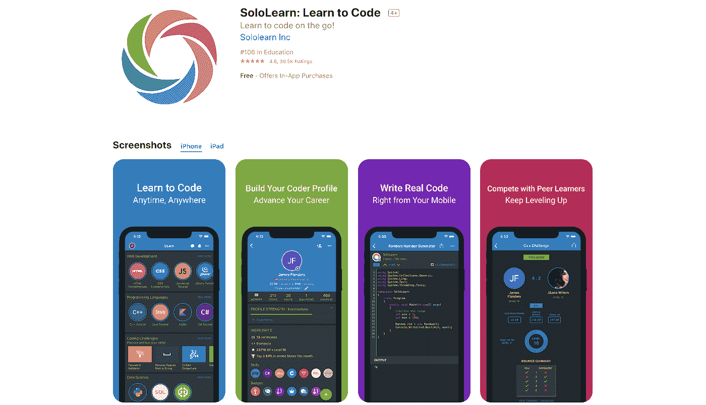

# 用于在旅途中学习编码的移动应用程序，甚至在太空中

> 原文：<https://levelup.gitconnected.com/mobile-apps-for-learning-to-code-on-the-go-even-in-space-bc2a7b373a56>

乔伊·孙约在 [Unsplash](https://unsplash.com/?utm_source=unsplash&utm_medium=referral&utm_content=creditCopyText) 上的照片

在某种程度上，编程就像骑自行车。除非你做了一段时间，否则你不会知道如何写代码。换句话说，这项技能需要大量的练习和更多的支持。

有几种方法可以开始:买书，在 YouTube 上看视频，或者走更传统的路线，参加教育机构的课程。然而，开始旅行最便捷的方式就在这里，触手可及。

教你编程的移动应用程序变得越来越流行。这并不奇怪:整个编程课程就在你的智能手机上；你可以在旅途中学习编码。无论你是被困在队列中还是交通堵塞中，在睡觉前或乘公交车去某个地方前有 10 分钟——打开一个应用程序，提升你的技能。

这就是为什么我编制了一个编码应用程序列表，它将帮助你跟上时代，不管你是什么水平，也不管你决定学习什么编程语言。

# 可汗学院

可汗学院有超过 6000 个关于计算机科学基础的视频。该应用程序提供免费的视频教程和练习，他们的使命是通过提供免费的教育课程来改变教育的本质。

可汗学院应用程序既适合[安卓](https://play.google.com/store/apps/details?id=org.khanacademy.android&hl=en)又适合 [iOS](https://apps.apple.com/us/app/khan-academy/id469863705) 用户。

可汗学院提供 HTML/CSS 等主要编码语言的入门课程。他们还提供关于创建网页、绘图和动画课程的初始信息。

# CodeGym

CodeGym 是一项教育探索。Java 内部应用课程由 1200 个任务和 600 个小教程组成。

如果你没有足够的时间参加繁忙的课程，这是你最好的解决方案。每天花大约 30 分钟，这将足以完成几个讲座或解决几个问题。

课程以游戏形式呈现，包括四个任务。CodeGym 是 80%的练习，这样你可以从一开始就熟悉编码。还有一点很棒的是，借助移动 IDE 开发环境，你可以在手机上写代码。

该应用程序具有在虚拟导师的帮助下对任务进行即时反馈的功能。

该应用程序的两个不同优势是帮助部分和强大的 Java 社区。

CodeGym 唯一的缺点就是只教 Java。该应用仅适用于 [Android](https://play.google.com/store/apps/details?id=com.hitechrush.codegym) 用户。

# 编码

有了 Encode，可以向 web 开发者学习推广 Python、JavaScript、HTML、CSS。在你读完语言理论之后，你需要通过测试才能继续。Encode 使您能够在培训的每个阶段进行自我测试。

Encode 的一个与众不同的特点是，它从头开始，以小块的形式提供不同的概念，所以如果你只有几分钟的时间，可以去应用部分。只有在学习了基本概念之后，它才会引入更高级的概念，比如编码，使用 JavaScript 之类的语言。

课程也是交互式的，应用程序会在每节课后提供反馈，确保您在最初不理解这些概念时能够重写课程。

不幸的是，对于那些使用 iOS 的人来说，Encode 仅适用于 [Android](https://play.google.com/store/apps/details?id=com.upskew.encode&hl=en) 用户。

# 恩奇

Enki 是一个平台，在这里你可以快速轻松地学习任何技术语言。可以学习数据科学、HTML、SQL、Javascript、Python、区块链、CSS、安全、Git、计算机科学、Basic、Linux 之类的东西。这个应用程序将完全满足你的任何学习需求。

该应用程序支持所有人，从初学者到更有经验的程序员。如果你刚刚入门，你可以在转用 JavaScript 之前使用这个应用来学习网络技术。

Enki 还帮助你学习编程相关的话题，比如使用 Linux 命令行，通过 Git 管理版本。

恩奇一般都是免费的。然而，获得一些功能，如额外的培训，是在付费墙后面。

下载 app: [iOS](https://geo.itunes.apple.com/us/app/enki/id993753145?mt=8) | [Android](https://play.google.com/store/apps/details?id=com.enki.insights)

# SoloLearn

SoloLearn 最适合那些没有编码先验知识，想从头开始的人。每一节都分为“章节”在一章结束时，你必须通过一项语言测试，这样你才能进入下一部分。

它就像一门在线大学课程，你可以和其他学生一起参加论坛，并就通常会让你尴尬的事情提出问题。

在操场代码部分有数百个不同的测验和活动来继续练习。

像这个列表中的其他一些应用一样，SoloLearn 使用游戏化来鼓励你坚持下去。

您可以在您的进度水平上获得技能和成就积分，并与世界各地的其他学生竞争更激烈的挑战。

SoloLearn 的基础级是免费的。然而，每月 6.99 美元或每年 47.99 美元，就可以订阅 SoloLearn PRO。它消除了广告，并增加了一些功能，如设置学习目标和查看关于学习的个性化想法的能力。

下载 app: [iOS](https://itunes.apple.com/us/app/sololearn-learn-to-code/id1210079064?mt=8) | [Android](https://play.google.com/store/apps/details?id=com.sololearn)

# 蝗虫

Grasshopper 是一款面向 [iOS](https://itunes.apple.com/us/app/id1354133284) 和 [Android](https://play.google.com/store/apps/details?id=com.area120.grasshopper) 用户的免费应用。它教你如何编程，使用你选择开发的 JavaScript 谜题。

这个应用程序使用起来很简单，因为它允许您使用这些块并按照逻辑顺序组织它们来创建一个工作代码。您还可以获得实时反馈，并随着经验的增加获得奖励。

与列表中的其他应用不同，Grasshopper 只坚持一种语言:JavaScript。

# 总结一下

这些是学习如何在互联网和移动设备上编码的许多方法中的几个。

偏好可能因人而异，所以根据您想要学习的编程语言和原因，尝试几个应用程序来找到最适合您需求的合适的移动应用程序。