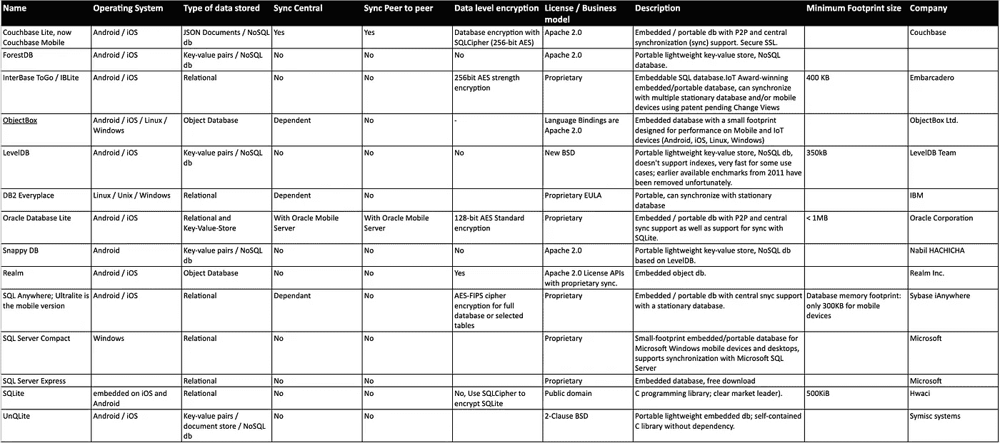

# Android 中的移动数据库。

> 原文：<https://levelup.gitconnected.com/mobile-databases-in-android-c968c9a9d1b7>

地方政府间的权力和信息分配

包括智能手机、个人数字助理(已停产)、平板电脑和可穿戴设备在内的移动计算设备存储数据并在网络间共享。它为用户分配数据和节省成本和时间提供了巨大的优势。

移动数据库可以作为一种经济高效的有价值的解决方案，而不是维护中央数据库并在每次需要时使用数据存储进行通信。通过使用移动数据库，我们可以节省服务器和移动设备之间数据通信的额外成本。许多应用程序需要从数据源下载数据和信息，并且即使在超出范围和断开网络连接的情况下也需要操作信息。特别是设备和服务器之间的通信工作负载([客户端-服务器通信](https://en.wikipedia.org/wiki/Client%E2%80%93server_model#Client_and_server_communication))。然而，这对于提供更好的应用和设备性能是不利的。因此，开发人员和研究人员需要发明一种新的工艺来实现更好的性能。作为多种研究的结果，产生了具有移动数据库的移动计算技术。

# 什么是移动数据库？

移动数据库独立于主数据库，即使它们没有连接到主数据库，也可以很容易地转移到不同的地方。它们仍然可以相互通信以共享数据和交换数据。移动数据库包括一些功能。它们如下。

1.  存储所有数据并链接到移动数据库的主系统数据库。
2.  允许用户即使在移动中也能查看信息的移动数据库。它与主数据库共享信息。
3.  该设备使用移动数据库来访问数据。该设备可以是手机、笔记本电脑、平板电脑和可穿戴设备。
4.  允许在移动数据库和主数据库之间传输数据的通信链路。

# 移动数据库的优势

1.  使用移动数据库，可以从任何地方访问数据库中的数据。它提供无线和离线数据访问。
2.  数据库系统通过使用移动数据库以同步方式开发，多个用户可以通过无缝交付过程访问数据。
3.  移动数据库是轻量级的，可维护性更好。
4.  可以与智能手机、笔记本电脑、平板电脑、可穿戴设备等多种设备同时同步。

# 移动数据库的缺点

1.  移动数据不如存储在传统数据库中的数据安全。会导致安全隐患。
2.  存储在设备中的移动数据库可能消耗更多的 CPU 和更多的功率来与应用程序通信。

# **Android 中的移动数据库**

大多数时候，Android 使用 SQLite 作为移动数据库技术。SQLite 是一个关系数据库，用于 iOS 和 Android 平台上的各种嵌入式系统。它有公共许可证，因此任何人都可以在公共领域下使用它。SQLite 是一个 C 编程库，大小约为 500KiB。大多数 Android 应用程序开发人员使用 SQLite。它有许多优点和缺点。它们如下:

**SQLite 的优势**

1.  它可以通过工具链使用。例如:DB 浏览器。
2.  没有主要的依赖关系。
3.  开发人员可以根据需要定义数据模式和结构。
4.  开发人员拥有创建和操作数据库的完全权限。
5.  开发人员可以获取数据库并进行分析。
6.  易于编写的内容提供者与加载器一起使用。

**SQLite 的缺点**

1.  有许多样板代码。
2.  工具已经开始工作了。
3.  内容提供商是另一层。
4.  没有编译时检查过程。
5.  手动模式更新(维护、迁移脚本)
6.  SQL 是另一种语言。
7.  可测试性。
8.  SQL 查询会变得更长。

作为 SQLite 缺点的解决方案，已经产生了许多 SQLite 替代方案。如果您对 SQLite 和样板代码不满意，可以在 SQLite 上使用对象抽象。这是通过使用 ORM(对象关系映射)实现的。但是，如果您想完全取代 SQLite，您可以使用许多替代产品，如 Couchbase Lite、Interbase、LevelDB、Oracle Berkeley DB、Realm、SnappyDB、Sparksee Mobile、SQL Anywhere、SQL Server Compact(已停产)和 UnQLite。

下面列出了一些 SQLite 备选方案，并做了比较。

SQLite 备选方案与比较

我将从这篇文章中解释和更新移动中的 **NoSQL，以实现 Android 应用程序开发中的 SQLite 数据库和 ORM。**

参考资料:

1.  [http://objectbox.io/](http://objectbox.io/)
2.  [https://www.w3schools.in/](https://www.w3schools.in/)
3.  [https://en.wikipedia.org/wiki/Mobile_database](https://en.wikipedia.org/wiki/Mobile_database)
4.  [http://www.hwaci.com/sw/sqlite/prosupport.html](http://www.hwaci.com/sw/sqlite/prosupport.html)