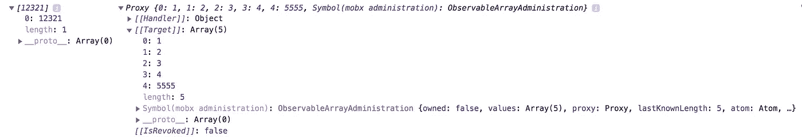
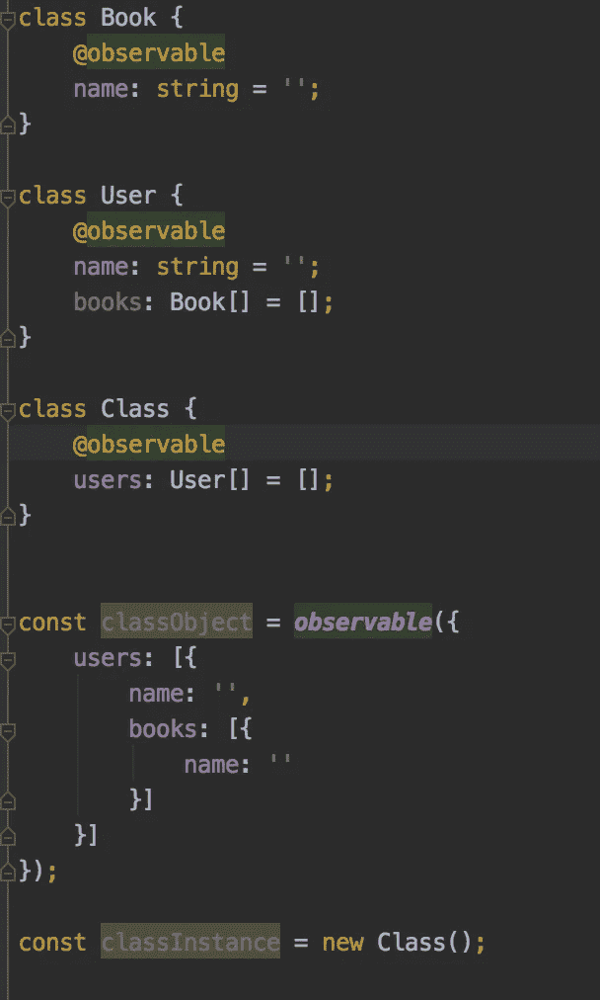
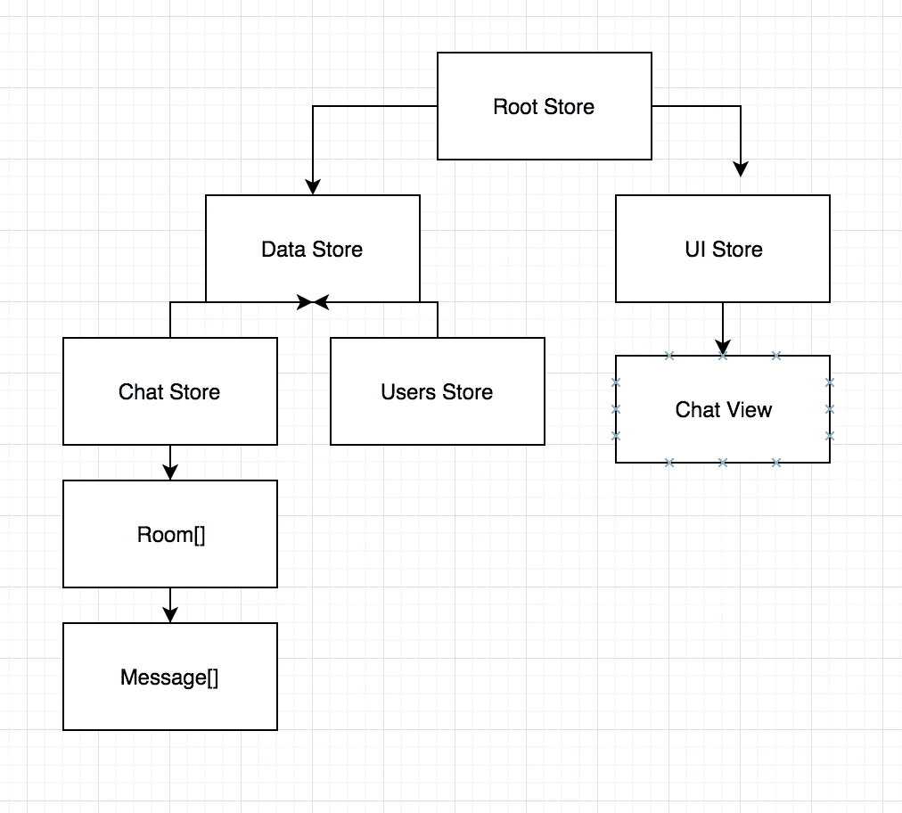
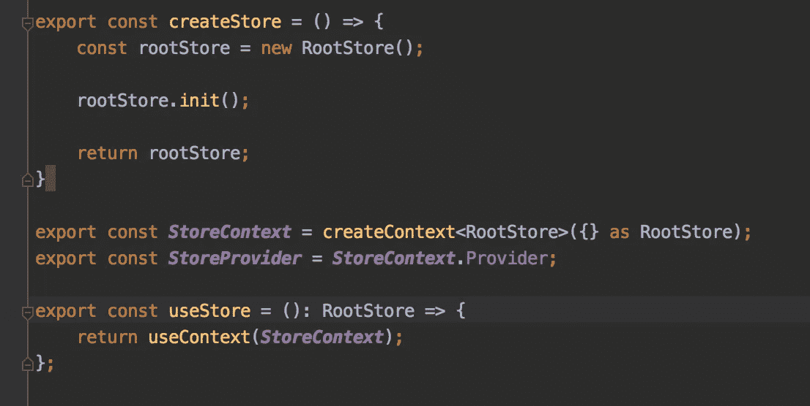
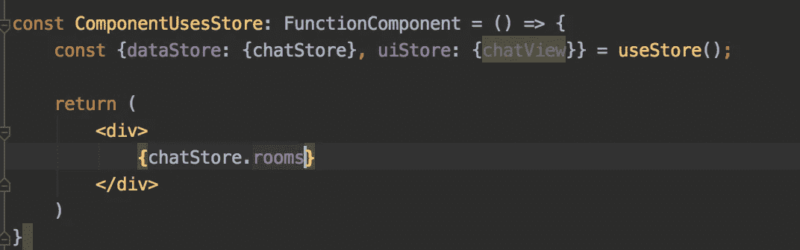
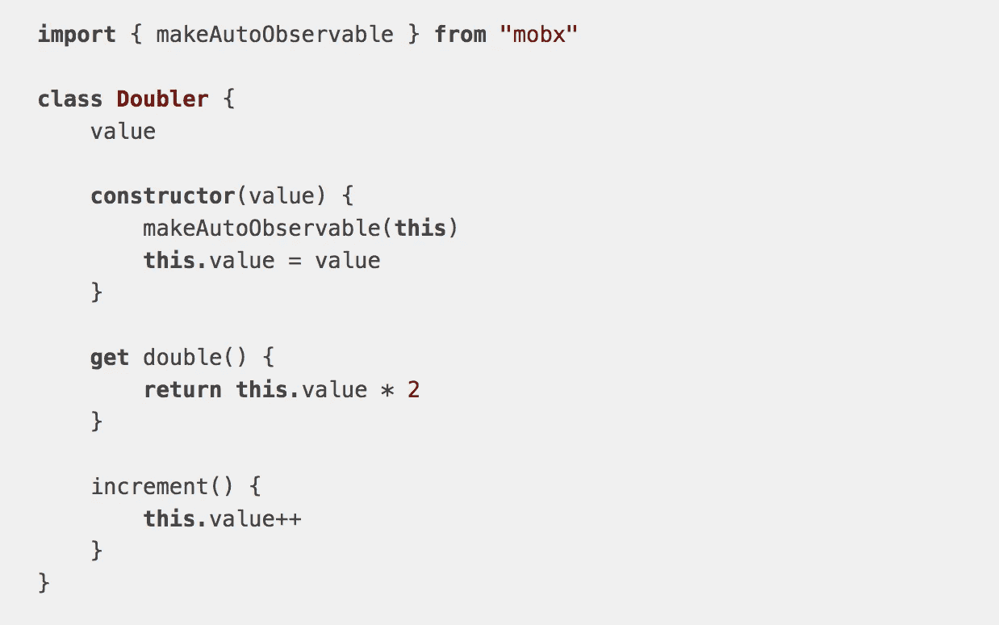

# Mobx 提示和陷阱

> 原文：<https://levelup.gitconnected.com/mobx-tips-and-pitfalls-92e635108653>

所以最近我开始看到越来越多的人使用 MobX，我想分享我在使用它一段时间后获得的一些见解。我将写一些对于 MobX 新用户来说不太明显的话题。这篇文章确实需要 Mobx 的基础知识或以前的用法，我已经准备了 Github repo 来玩这个东西([这里](https://github.com/stolenng/mobx-tips-and-pitfalls))

# 计算值缓存

因此，我们在 MobX 中有一个称为“计算”的惊人功能，它允许从状态中获取值，但是如果您尝试调试它，您会看到一些值被缓存，而一些没有，那么为什么会发生这种情况呢？计算函数只有在被**观察到**时才会被缓存/记忆，例如被自动运行、反应或 mobx-react 观察器观察。这样设计是为了避免计算，并且只有当 mobx 观察到变化时才这样做。

更多信息请点击此处:

*   [当计算值运行时](https://mobx.js.org/best/pitfalls.html#computed-values-run-more-often-than-expected)
*   [电脑装饰](https://mobx.js.org/refguide/computed-decorator.html)

# 重新分配可观测量

MobX 用自己的接口和方法来包装 **observables** ，以便能够观察到变化，因此，如果您给它重新赋值，您可能会删除 MobX 包装器，然后失去它的所有功能，并且需要一段时间来理解为什么会发生这种情况。

尽可能多地使用可观察的方法，例如，如果是一个数组，就使用像 push、pop 等数组方法…

简单数组与可观察数组的示例

上图显示了两个可观察到的，左边的一个已经被重新分配并失去了 if 能力，右边的一个使用了数组的`push`方法并保留了 MobX 能力。

# 为您的数据建模

我建议尽可能多地尝试对你的数据建模，而 Mobx **observables** 会自动使你的大部分对象**可观察**它可能会错过一些地方，因为它的规则使**可观察**然后你可以进入一个迷宫，试图了解哪里出错了，而不是仅仅控制你的对象，并自己决定什么是**可观察的**和什么不是。

下面是一个例子，您可以控制每个对象/类:)

你可以在这里阅读规则:

 [## 可观察的 MobX

### egghead.io 第一课:可观察对象&观察者托管在 egghead.io egghead.io 第四课:可观察对象&地图托管…

mobx.js.org](https://mobx.js.org/refguide/observable.html) 

# 如何组织你的商店

我最喜欢的方法是把你的商店组织成一棵树，从一个包含两个商店的根商店开始，一个是数据商店，一个是 UI 商店，然后从那里开始建立树。我还创建了一个简单的库来帮助依赖注入和从树的任何地方获取根，你可以在这里查看: [mobx-easy](/introducing-mobx-easy-cd281ace9e6e)

商店结构图

本指南更深入地讨论了这一概念:

 [## 构建大规模可维护项目的最佳实践

### 构建大规模可维护项目的最佳实践

构建大规模可维护 projectsmobx.js.org 的 MobX 最佳实践](https://mobx.js.org/best/store.html) 

# 连接您的商店以做出反应

我们将创建 [React Context](https://reactjs.org/docs/context.html) 并用提供者包装我们的`<App />`组件，然后将根存储作为值传递给它，我们还将创建一个函数名`createStore`来帮助我们创建根存储(在实际项目中，我们可以在那里传递额外的功能)。

我们将创建自定义的`hook`来通过我们刚刚创建的上下文检索根存储。

上面的例子。

然后，我们可以像这样轻松地访问每个 react 组件中的存储:

使用 useStore 挂钩

# 使用观察者/观察者

因此，对于最后一个主题，我们将关注实际的连接，之前的主题只是一个设置。

如果你的项目只包含函数组件，你可以使用 [mobx-react-lite](https://github.com/mobxjs/mobx-react-lite) ，如果你对组件进行分类，你需要使用 [mobx-react](https://github.com/mobxjs/mobx-react) 。

这两个库基本上通过为我们提供`observer` / `useObserver`函数来帮助我们连接 react 组件，就像`autorun`一样，它们观察每个 mobx 可观察的用法。

如果你用`observer`包装你的组件，所有在组件内部使用的可观察对象都将被观察到，组件将在任何改变后重新呈现。如果你用`useObserver`包装你的返回值，只有其中的可观察对象会被跟踪，如果你不使用它们中的任何一个，那么你的组件根本不会重新呈现。(你可以在这里找到示例代码:[链接](https://github.com/stolenng/mobx-tips-and-pitfalls/blob/master/src/examples/observing-components.tsx))

# MobX 6 peek

所以本周 MobX 团队公布了 v6 的首个候选版本:【https://www.npmjs.com/package/mobx/v/6.0.0-rc.1 

我们在这里可以期待看到的主要事情是慢慢开始摆脱 decorator 的使用，因为它的提议在 tc39 中没有进展，我们将需要开始使用名为`makeObservable`和`makeAutoObservable`的新函数，这将帮助我们决定类中哪些属性是可观察的/动作的/计算的，哪些不是不使用 decorator 的。

你可以在本期中读到关于从装饰者转移的决定和更多信息:

 [## 最佳/装饰者 MobX

### 编辑描述

部署-预览-2327 - mobx-docs.netlify.app](https://deploy-preview-2327--mobx-docs.netlify.app/best/decorators.html) 

还有更多 mobx 6 的更新文档，你可以在这里查看:

 [## make observable/makeoutobservable MobX

### make observable/make auto observable

MobX make observable/makeautobservabledeploy-preview-2327-MobX-docs . net lify . app](https://deploy-preview-2327--mobx-docs.netlify.app/refguide/make-observable.html) 

# 总结

我试图让这个主题尽可能的简短和直接，我创建了一个包含所有示例的知识库，这样你就可以在代码中体验它，并且比在文章中看到的效果更好。

 [## stolenng/mobx-提示和陷阱

### 你可以用 npm run start 运行这个项目，并选择所选的例子，它会自己运行，你可以玩…

github.com](https://github.com/stolenng/mobx-tips-and-pitfalls) 

我希望这篇文章能帮助使用 MobX 的人，或者至少让他们思考或给出如何改进他们目前正在从事的项目的想法:)

***9/20 更新***

我发布了一个关于 MobX 的广泛课程，请在这里随意查看:

 [## 使用 React 深入研究 MobX(Hooks+TypeScript)

### 高级软件开发人员—在以色列空军服役 3 年，是一名软件开发人员——曾担任…

www.udemy.com](https://www.udemy.com/course/mobx-in-depth-with-react/?referralCode=B7FD24C7EB1A51684160)