# 模拟数据—如何使用邮递员工作流

> 原文：<https://levelup.gitconnected.com/mocking-data-how-to-do-it-with-postman-workflow-ae51390133f5>

ostman 是一个 API 测试工具，可以与 CI/CD 管道集成。

它有各种有用的功能，如

*   自动化测试
*   设计和模仿 API
*   API 文档
*   API 的监控
*   与不同的团队协作 API，等等…

> 工作流就是这样一个特性。在这里，我们将更多地讨论什么是工作流，如何使用它，以及它的用例。

P ostman Workflow 是一个 API 集合，允许我们对 API 的执行顺序进行排序和指定。这是邮差提供的另一个非常有用的功能。

## 借助工作流功能，我们可以

*   编写指定 API 执行顺序的脚本
*   调用特定 API 的次数(有助于创建模拟数据)
*   通过将值存储在 postman 提供的变量(全局和环境)中，将值从一个 API 响应传递到下一个 API 响应

指定执行顺序的脚本被添加到请求前和请求后(测试脚本部分)脚本的组合中。

> **请求前脚本**将在 API 调用之前执行，可用于填充请求体中的值。 ***图 1*** 显示了 postman UI 上的预请求选项卡
> 
> **请求后或测试脚本**在 API 返回响应后执行，可以验证、解析响应体，如果需要，可以将值存储在环境变量中。**图 2** 显示了 postman UI 上的 post-request 或 test script 选项卡

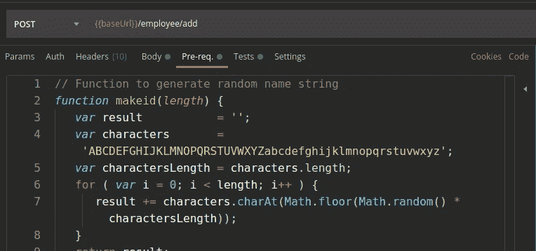

图 1 —显示了“预先请求”选项卡

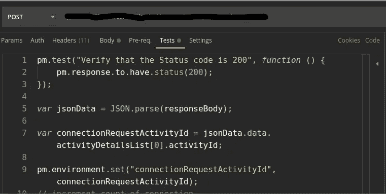

图 2——显示了测试脚本部分以及响应体的解析和环境变量中的值设置

> **JavaScript 用于编写邮递员脚本**

那么……用例是什么，这对开发团队和产品本身有什么帮助？

*   工作流帮助我们通过应用程序接口验证应用程序流
*   当应用程序处于开发阶段时，这个自动化过程可以生成大型数据集
*   数据的生成将有助于我们以有效的方式执行负载测试

好的……让我们看看这是怎么做到的

**在演示应用程序中，我们有 4 个端点:**

1.  创建新的员工记录
2.  检索所有员工记录
3.  让 60 岁以上的员工退休
4.  获取退休员工的记录

> 演示应用程序基于带有 PostgreSQL 的 Spring boot

## **API #1 —添加员工**

我们添加在请求体中看到的雇员信息(图 3)，值将从环境变量中选取。

请求体的值是通过预请求脚本自动生成的(图 4)，并将它们存储在一个环境变量中(图 5)

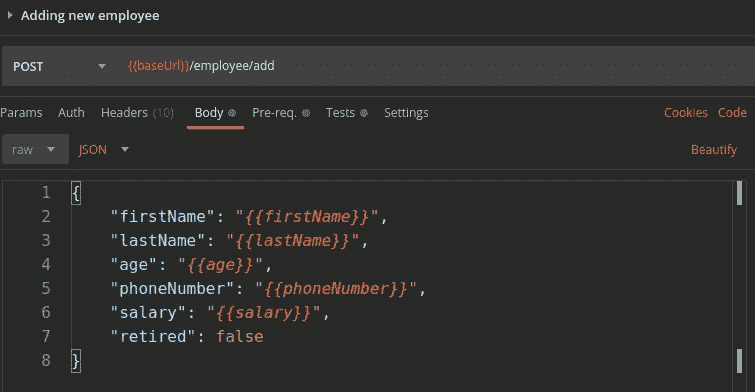

图 3 —添加员工 API 的请求体，将获取值

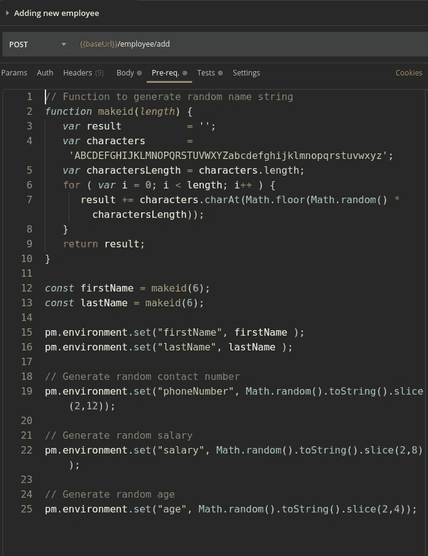

图 4 —随机生成值并将其存储在环境变量中的请求前脚本

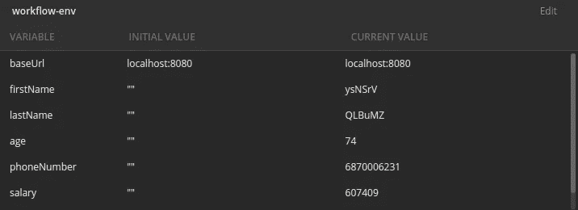

图 5 —执行预请求脚本后的值

显示从环境变量中提取并存储在数据库中的值的响应主体(图 6)

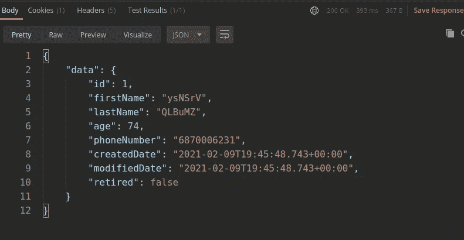

图 6 —来自添加员工 API 调用的响应

添加雇员 API 循环 100 次，以创建 100 条雇员记录。达到期望的数量后，下一个 API 请求被设置为获取所有雇员记录(图 7)

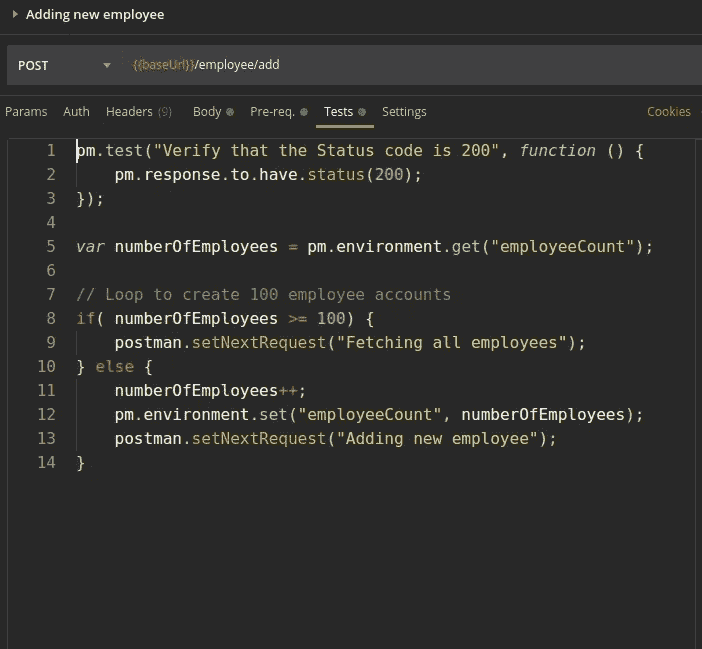

图 7 — Post 请求脚本处理调用循环并将调用重定向到下一个 API

> 命名每个 API 调用非常重要，因为这将作为值传递给下一个请求，如 **postman.setNextRequest("获取所有雇员")。**

## API #2 —获取所有员工的记录

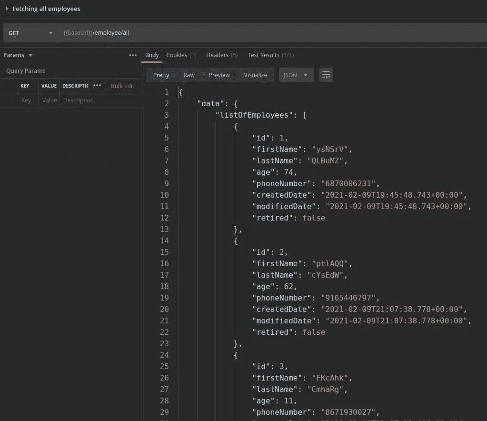

图 8 —员工列表

API 将只被调用一次，在调用成功后，API 将请求退休员工(图 9)

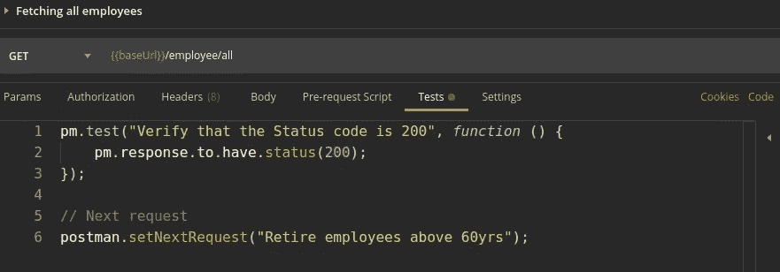

图 9 —下一个请求设置为让员工退休

## API # 3—60 岁以上的退休员工

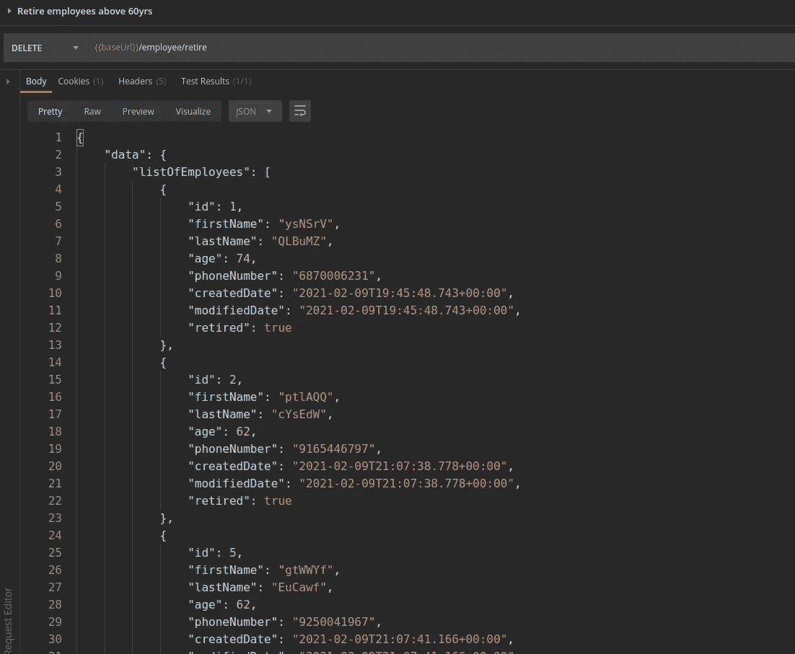

图 10 —显示退休员工列表的回复

同样，这个 API 只被调用一次，下一个请求在测试后脚本中设置(图 11)

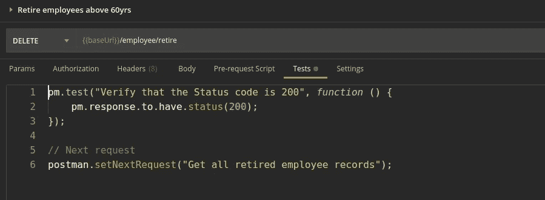

图 11 —设置下一个获取所有退休员工记录的请求

## API #4 —获取所有退休员工记录

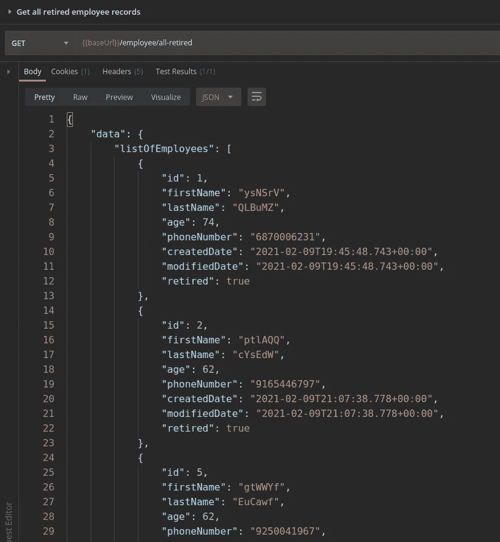

图 12 —所有退休员工列表

一旦所有的 API 请求完成，环境变量的值在最后一个 API 调用的 post 请求脚本中被重置(图 13)。

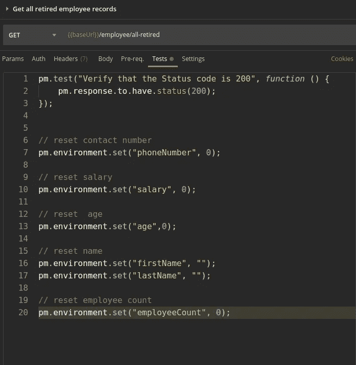

图 13 —重置值

> 【https://github.com/raghavendra-hegde/postman-workflow-demo】源代码可以在这里找到——

## **自动化 API 调用非常有帮助**

*   **为应用程序负载测试生成大型数据集——当应用程序仍处于开发阶段时，通过手动过程创建数据既繁琐又耗时(通常如此)**
*   **验证应用程序流**
*   **与 CI/CD 集成并验证所有 API**

**当在大型迭代中运行这个工作流时，使用 **Newman** ，因为我不得不面对大量 API 调用的 Postman UI 问题，然而，为了验证脚本，你可以继续使用 Postman UI。**

> *****纽曼*是邮递员**的命令行收集运行器**

**谢谢你…！**