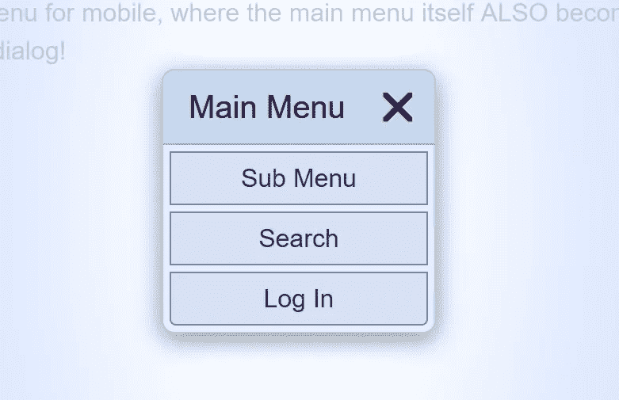

# 没有 JavaScript 的模态对话框驱动的网站

> 原文：<https://levelup.gitconnected.com/modal-dialog-driven-websites-without-javascript-16e858615780>



比下拉菜单好多了

继续我上一篇文章的主题[，我想介绍如何不用 JavaScript 就能制作模态对话框。使用以下技术，可以简化网站的主要功能和导航。](/tabbed-interfaces-without-javascript-661bab1eaec8)

再说一次，使用 JavaScript 的网站——模态对话框、下拉菜单、“汉堡包”风格的移动菜单——在可用性和可访问性方面都是彻头彻尾的失败；尤其是当他们缺乏优雅的退化。

同样，许多常见的“经典”导航技术——比如下拉菜单——对于有辅助功能需求的用户来说是一个巨大的中指。像 NNGroup 这样的地方和 WCAG 这样的基本指南反复告诉我们不要对这些事情使用脚本，即使没有脚本也是有问题的。

CSS3 为我们提供了解决这个问题所需的所有工具！通常使用相同甚至更少的代码，以这种方式，非屏幕媒体设备—屏幕阅读器(大声朗读页面的软件)、盲文阅读器、搜索引擎等能够很好地消化页面，就像它只是常规导航一样。

…它的神奇之处来自一个简单的伪状态。`:target`

# CSS3 `:target`是什么？

它让我们对当前页面地址的散列部分的当前目标元素进行样式化。当这个散列匹配一个 nchor 标签上的名字，或者当它匹配页面上具有相同 ID 的任何元素时，对于所述元素:target 为真。

后一种用法——针对 ID——是我们想要的样式。如果我有:

```
<div id="test">Some Text</div>
```

这个 CSS:

```
#test:target { color:red; }
```

当 URI 末尾有 hash #测试时，DIV 中的文本将是红色，否则它将是默认颜色。

# 那么我们如何用它来制作一个模型呢？

当元素不是:target 时，隐藏它。当它…好吧，展示它。这是您的切换状态，不涉及脚本。

## 加价

如果我们默认隐藏模态的外部容器，但是当它是`:target`时，在我们的内容上显示它，结果意味着我们打开模态所需要的是:

```
<a href="#ourModal">Open Our Modal</a>
```

同时关闭它，我们可以把:

```
<a href="#">Close Modal</a>
```

…在模态内部。通过将 hash 改为 empty，模式关闭。

经过多次修改，我决定采用这种技术结构:

```
<div id="ourModal" class="modal">
  <a href="#" class="modalClose" hidden aria-hidden="true"></a>
  <div><section>
    <a href="#" class="modalClose" hidden aria-hidden="true"></a>
    <h2>Our Modal</h2>
    <div>
      <p>
        A Sample Modal
      </p>
    </div>
  </section></div>
<!-- #ourmodal.modal --></form>
```

像往常一样，尽量不要用“无用的类”来嘲笑标记，而是让语义和 DOM 结构来完成大部分工作。

外层 DIV 的目的很明显，它将我们的“固定”容器设置为全屏。将`display:flex;`与`align-items:center;`和`justify-content:center;`一起使用会使内容居中，但是如果你有使用 flex 或 center 的经验，你会知道它会影响滚动。溢出:flex 容器上的 auto 是脆弱的、不可靠的，并且经常完全损坏。因此，我们没有在外部包装器上设置 flex，而是在 DIV.modal 中的第一个 DIV 标签上设置它。

我们有两个 a.modalClose .这些 get 类，因为我们可能在结构上选择它们不一致的地方需要或想要它们。第一个是全屏关闭，这样如果你点击实际内容区域之外，它将关闭模态。第二个是为生成的内容添加一个明显的关闭按钮，以形成一个清晰的视觉点来关闭它，当屏幕太小而没有一个区域围绕实际内容时

。

这两个锚都被设置为`hidden`和`aria-hidden=”true”`，使得非屏幕媒体 UA 忽略这两个元素。屏幕阅读器(大声朗读页面的软件)、盲文阅读器、搜索引擎等会假装这些锚点不存在。当键盘导航时，他们不会关注它们，他们不会试图阅读它们的内容。它们不存在于任何现代的 UA 中，除非我们通过用 CSS 改变它们的显示状态来显示它们。因此，如果我们在样式表<链接>上使用 media="screen ",我们可以只为屏幕媒体设备打开它们。

*Side node，99%的时候你看到的<链接>或者<样式>缺少 media= " "或者被设置为 media="all "，你看到的是 web 开发中那些讨厌的 3i:无知、无能、不称职。这就是为什么在外部样式表中说“screen and”的媒体查询同样是无知的垃圾。但是，在大多数使用案例中，同样的情况也适用于< style >或 style= " "。*

因为 DIV 在语义上是中性的，并且因为我们隐藏了锚点，所以非屏幕 UA(包括 search)实际上将上述标记视为:

```
<h2>Our Modal</h2>
<p>
  A Sample Modal
</p>
```

仅此而已。甚至更好的替代导航将让模态链接导航到这些子部分，不需要我们花哨的视觉效果，就像任何其他正常的页面散列链接一样！这些链接甚至会出现在浏览器的历史记录中，所以“后退”也会关闭模态链接，并且/或者引导非视觉用户回到他们点击“模态”链接之前的位置。

请注意，因为这些 section/nav 是完全限定的内容部分，所以从结构上来说，您应该以 H2 作为顶级部分。

这太理想了！这解决了页面模式可能产生的所有可访问性问题。

记住，***(单数)*是**头 **ing** (单数)整个**场地**上的一切都是。就像一本书或一份报纸上每一副折页上方的标题。H2 标记页面主要小节的开始，H3 标记 H2 小节的开始。H4 标志着他们前面的 H3 小节的开始…想猜猜 H5 和 H6 是什么意思吗？即使是低 HR 也意味着话题或版块的变化，**而不是**“在屏幕上划一条线”。****

****这就是为什么你不愿意跳到深度 5，或者用 H4 开始一个文档，或者其他所有那些创建和维护像 tailwind 和 bootcrap 这样的“框架”的白痴、庸医和傻瓜没有资格吹嘘他们写 HTML 的能力，更不用说为其他人开发工具了！****

## ******其他问题******

****创建模态的一个问题是，如果存在的话，主体滚动条不能被模态覆盖。当模式打开时，这会导致无意义的滚动条，或者当窗口小于模式内容时，甚至会导致多个混乱的滚动条。****

****要解决这个问题，最简单的办法是用一个额外的 DIV 作为我们模态的同类的人造体；但是如上所述，通过溢出滚动:自动；带弯曲的螺钉*(或者反过来？所以增加了一个额外的内部包含 DIV 来解决这个问题。这样，我们也可以通过 flex 使我们的布局 100%最小高度。*****

```
**<div id="fauxBody"><div id="fauxInner">
<!-- page Content here -->
<!-- #fauxInner, #fauxBody --></div></div>**
```

****注意我是如何将结束注释放在实际标签之前的。这避免了某些浏览器引擎中的呈现错误，在这些引擎中，同级元素之间或闭包之间的注释可以被视为内容或触发“双重呈现”错误。虽然在大多数现代浏览器中这不是问题，但这比在结束后发表评论要好得多。****

****我们也可能希望对主菜单使用相同的模态技术。然而，这只能在媒体查询中完成，因此“通常”它不是模态的。因此，它的标记应该是这样的:****

```
**<header id="top"> <h1>
    Modal Site Demo
  </h1>

  <div id="mainMenu">
    <a href="#" class="modalClose" hidden aria-hidden="true"></a>
    <div><nav>
      <a href="#" class="modalClose" hidden aria-hidden="true"></a>
      <ul>
        <li><a href="#submenu">Sub Menu</a></li>
        <li><a href="#search">Search</a></li>
        <li><a href="#login">Log In</a></li>
      </ul>
    </nav></div>
  <!-- #mainMenu --></div>

  <a href="#mainMenu" class="mainMenuOpen" hidden aria-hidden="true"></a>

 <!-- #top --></header>**
```

****我将标题的 id # top 作为“返回顶部”链接的挂钩。外部 DIV 获得一个 ID，这样我们的 a.mainMenuOpen 就可以指向它。我们使用 NAV 而不是 SECTION，我们可以只使用 UL 而不是额外的包装 DIV，所有模态相关的锚再次得到相同的 hidden 和 aria-hidden="true ",以便屏幕阅读器忽略它们。****

## ****风格****

****对于我们的屏幕媒体样式表，我们要做的第一件事是重新打开所有的锚，同时我们也可以删除默认的下划线。****

```
**.modal .modalClose {
 display:inline; /* undo hidden */
 text-decoration:none;
}**
```

****然后我们需要放置所有与模态相关的容器，包括#fauxBody。****

```
**.modal,
.modal > .modalClose,
#fauxBody {
  position:absolute;
  top:0;
  left:0;
  width:100%;
  height:100%;
  overflow:auto;
}**
```

****通常你会想到使用 position:fixed，但这实际上会导致 webkit 中的滚动和定位问题。我不确定为什么这是一个问题，但由于这些都是 BODY 的子体，并且都是全屏大小，我们所有的内容都将放在这些容器中，position:absolute 可以实现相同的功能！****

****从那里，我们想击中我们的模态。****

```
**.modal {
  left:-100vw;
  opacity:0;
  padding:1em;
  transition:opacity 0.3s, left 0s 0.3s;
  background:radial-gradient(
    hsla(220, 100%, 100%, 0.8) 20%,
    hsla(220, 100%, 85%, 0.95) 100%
  );
}**
```

****因为它们是 width:100%和 overflow:auto，要隐藏它们，我们需要做的就是将它们从屏幕左侧按视口宽度滑动。嘣，他们被藏起来了。**不使用显示:无；或者能见度:隐藏；为了这个！！！**这将阻止搜索引擎寻找内容伪装滥用能够看到这些元素的内容！****

****这个过渡是一个有趣的魔术，因为我们只是延迟了左边的过渡，这样我们的不透明度动画就可以显示出来了。我们消除了延迟:****

```
**.modal:target {
  left:0;
  opacity:1;
  transition:opacity 0.3s, left 0s;
}**
```

****当我们展示的时候。有一个大的功能实现。左:0 表示显示，不透明度淡入表示外观“漂亮”。****

****带有内部 DIV:****

```
**.modal > div {
  display:flex;
  align-items:center;
  justify-content:center;
  min-height:100%;
}**
```

****我们只是应用 flex 来居中我们的部分或导航。然后:****

```
**.modal > div > section,
.modal > div > nav {
  position:relative;
  overflow:hidden;
  width:100%;
  max-width:24em;
  background:hsl(220, 100%, 95%);
  border:1px solid #0484;
  border-radius:0.5em;
  box-shadow:0 0.25em 1em #0006;
  transform:scale(0);
  transition:transform 0.3s;
}**
```

****得到我们想要的任何样式。我使用了变换:缩放动画，这样当模态成为目标时，它们就会“放大”成焦点。****

```
**.modal:target > div > section,
.modal:target > div > nav {
  transform:scale(1);
}**
```

****内在的。模态闭合****

```
**section .modalClose,
nav .modalClose {
  position:absolute;
  top:0;
  right:0.325em;
  font-size:1.75em;
  color:#C00;
  transition:transform 0.3s;
}section .modalClose:after,
nav .modalClose:after {
  content:"\1F5D9";
}section .modalClose:focus,
section .modalClose:hover,
nav .modalClose:focus,
nav .modalClose:hover {
  transform:scale(1.2);
}**
```

****得到 UTF-8 抵消 X 的生成内容，然后我们在我们的 H2 上空对其进行绝对定位。****

****从那里开始，它只是组件的正常样式。****

****主菜单必须进入媒体查询，因此我们必须复制大部分相同的代码。这很糟糕，因为它是在同一件事情上双倍下注，但没有真正的办法解决这个问题。*(如果只有 CSS3“空”和一般的兄弟选择器对生成的内容起作用！)*****

****首先，我们可以通过简单地使用生成的内容和边框来制作“汉堡包”。****

```
 **.mainMenuOpen {
    display:block;
    padding:0.25em;
    text-decoration:none;
    border-radius:0.5em;
    transition:transform 0.3s;
  }

  .mainMenuOpen:focus,
  .mainMenuOpen:hover {
    transform:scale(1.2);
  }

  .mainMenuOpen:before,
  .mainMenuOpen:after {
    content:"";
    display:block;
    width:1.75em;
    height:0.325em;
    border:solid #000A;
    border-width:0.325em 0;
  }

  .mainMenuOpen:after {
    border-top:none;
  }**
```

****然后我们需要瞄准它。模式关闭可见。****

```
 **#mainMenu .modalClose {
    display:inline; /* undo hidden */
    text-decoration:none;
  }**
```

****与的定位相同。情态的****

```
 **#mainMenu,
  #mainMenu > .modalClose {
    position:absolute;
    top:0;
    left:0;
    width:100%;
    height:100%;
    overflow:auto;
  } #mainMenu {
    left:-100vw;
    opacity:0;
    padding:1em;
    transition:opacity 0.3s, left 0s 0.3s;
    background:radial-gradient(
      hsla(220, 100%, 100%, 0.8) 20%,
      hsla(220, 100%, 85%, 0.95) 100%
    );
  } #mainMenu:target {
    left:0;
    opacity:1;
    transition:opacity 0.3s, left 0s;
  }**
```

****等等，等等，等等。你现在应该明白了。我们可以对菜单做的一件有趣的事情是，代替我们的 H2 标题，我们可以使用生成的内容添加一个假标题。****

```
**#mainMenu nav:before {
    content:"Main Menu";
    display:block;
    padding:0.4em 2.8em 0.4em 0.8em;
    font-size:1.25em;
    background:#0482;
    border-bottom:1px solid #0484;
  }**
```

****提供视觉一致性。****

# ****现场演示****

****您可以在这里观看现场直播:****

 ****[## 没有 JavaScript 演示的模态网站

### 使用 CSS3 :target 属性，我们不再需要 JavaScript 来创建模态对话框。事实上，我们可以增强整个…

cutcodedown.com](https://cutcodedown.com/for_others/medium_articles/modalSite/modalSite.html)**** 

****同我所有的例子目录:
[https://cutcodedown . com/for _ others/medium _ articles/modal site/](https://cutcodedown.com/for_others/medium_articles/modalSite/)****

****是敞开的，容易接触到黏糊糊的东西。我在那里放了一个标记的. txt 文件给那些“查看源代码”的人，还有一个完整的. rar 文件。****

****这些都被放进了我的一个标准股票模板中，以展示它能做什么。****

# ****利弊****

****和往常一样，我先从问题开始。****

## ****不足之处****

1.  ****如果你经常打开和关闭它们，它会填满浏览器历史记录。****
2.  ****为了保持一致性，您应该严格遵循最内层 DIV 之外的标记。这可以被认为是“脆弱的标记”。****
3.  ****CSS 中的选择器可能看起来很复杂，尤其是如果你已经接受了选择器减慢“渲染”速度的**秃头谎言**。****
4.  ****您最终会在内容周围添加额外的标记。*请注意，如果你在做最小高度布局，你可能已经有了！*****
5.  ****它依赖于某些传统浏览器中不存在的浏览器功能。尤其是 IE 可能会有问题。*但是，即使 bootstrap 在这一点上告诉所有版本的 IE 去吃屎吧，我们可能在这一点上是安全的。如果真的很重要，不要把 CSS 发送给 IE，让他们处理普通的标记外观！*****

## ****优势****

1.  ****语义、隐藏和 aria-hidden 的使用使页面 100%满足可访问性最低要求。事实上，传统的页面导航是以这样一种方式维护的，非屏幕用户甚至不会知道我们为有视力的人提供了所有这些花哨的东西！****
2.  ****不需要 JavaScript。除了消除可访问性的麻烦之外，它还导致触发的动作感觉更平滑和干净。*不像许多 JavaScript“框架”那样使用基于定时器的“计算”。为了土地，让 CSS 来做繁重的工作吧！*****
3.  ****使用一致的结构可以很容易地将现有的例子复制到新的设计中****
4.  ****多余的类保持在最低限度，从而更好地利用缓存模型。记住，说什么东西看起来像**与你的标记无关:**无论是你的标签、id 还是类！**说什么东西都是！！！**你在标记中放入的表示越多——即使是作为类——页面就会越慢。 ***这就是为什么 via BEM 等网站上的 slopping 类声称能神奇地让页面“更快”或“更好”,是 100% A 级农场新鲜草原馅饼！*******
5.  ****因为它都是 CSS 驱动的，所以你可以很容易地随心所欲地切换你的动画。只是玩变换、过渡和定位。****

********

# ****增强？**增强功能！！！******

****现在，我们已经尽力避免使用 JavaScript，但是这并不意味着我们不能或者不应该使用。****

****例如，我们可能不关心它如何填充浏览器历史。你可以把所有的。modalClose anchors 说如果前一个散列是空的，但它是同一个页面，则执行`window.history.back()`而不是让 anchor 触发。****

****很好，**然后**你潜心研究 JavaScript。但是**只有**那么。首先在没有 JavaScript 的情况下尽可能地让它工作。首先关注内容的正常页面加载和正常导航。****

*****说到 JavaScript，要学会保持冷静！*****

****[正如我在另一篇文章中所说的，高质量的 JavaScript 应该增强已经工作的页面，**而不是**成为你提供所述功能的唯一方式！](https://medium.com/@deathshadow/accessibility-101-good-client-side-javascript-should-enhance-an-already-working-page-not-be-the-bf92741d2310)至少如果你稍微关心一下可用性、可访问性和简单理智的前端开发的话。这就是为什么像 React 和 Angular 这样的框架从如此高的高度上清空了他们的可访问性，你会认为这是汤姆·汉克斯在《他们自己的联盟》中的场景。使用这种脚本的人没有时间去思考当脚本在用户代理中被阻止、不可用甚至不相关时会发生什么。当你这么做的时候，你就有麻烦了。****

# ****麻烦？来自 JavaScript？不要这么说！****

****是的麻烦！一些行业的法律麻烦 …基本上所有的企业都在枪口下；自从碧昂斯和多米诺被拖上法庭。如果有最好的律师的高知名度的大预算的大人物可以在 sloar 的深处被烤，当一些流着鼻涕的助理 DA 或救护车追逐者来敲门时，像我们这样的普通 shubs 和 zuul 有什么机会？****

****我们不能像 20 世纪 90 年代浏览器大战中最糟糕的情况一样，用表示层来不断增加表示层标记。你**必须**使用正确的语义和逻辑文档结构。你**必须**记住关闭图像、关闭脚本、甚至关闭 CSS 会发生什么。你**必须**记住 CSS 有媒体目标(屏幕、打印、语音等),如果你在使用<链接>或<样式>或发送到“全部”时没有使用，可能会产生可访问性问题——甚至只是浪费带宽。****

****同样，这也是一场速度竞赛，如果你使用一些巨大的 JS 框架和半打 k 的定制脚本来做四到六 k 的 CSS 自己就能做的事情，那么在 web 开发中……/失败/甚至一些客户开始关注像 lighthouse 这样的工具中的“有意义的绘画”时间，臃肿缓慢的脚本和大规模的“框架”真的会让这些成为泡影。****

****作为网络专业人士，我们需要开始沿着这些思路思考。使用这样的技术不仅可以改善用户体验，还可以避免因未能满足可访问性最低要求而受到指责。****

# ****结论****

****通过避免使用 JavaScript 并利用 CSS3 的特性，我们可以为非屏幕用户制作非常优雅的页面，同时仍然提供所有花哨的屏幕糖果。由于现代浏览器的特性，只需先编写语义，添加几个 div，将样式表用于屏幕媒体，然后使用选择器和伪状态来触发行为，这比浪费时间编写脚本来处理这些要简单得多，也有用得多。****

****同样，关注点分离。如果你在不应用屏幕 CSS 时查看语义导航，这听起来可能很奇怪。模态——至少以这种方式实现——不是行为。这是演示…而演示是 CSS 的工作！****