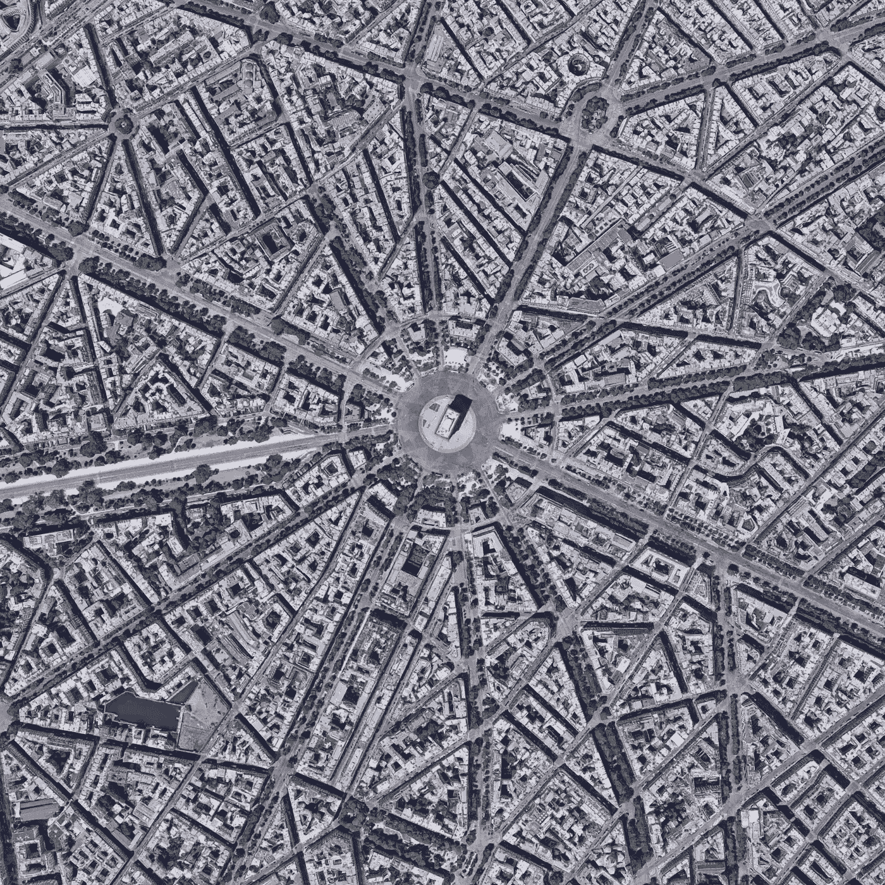
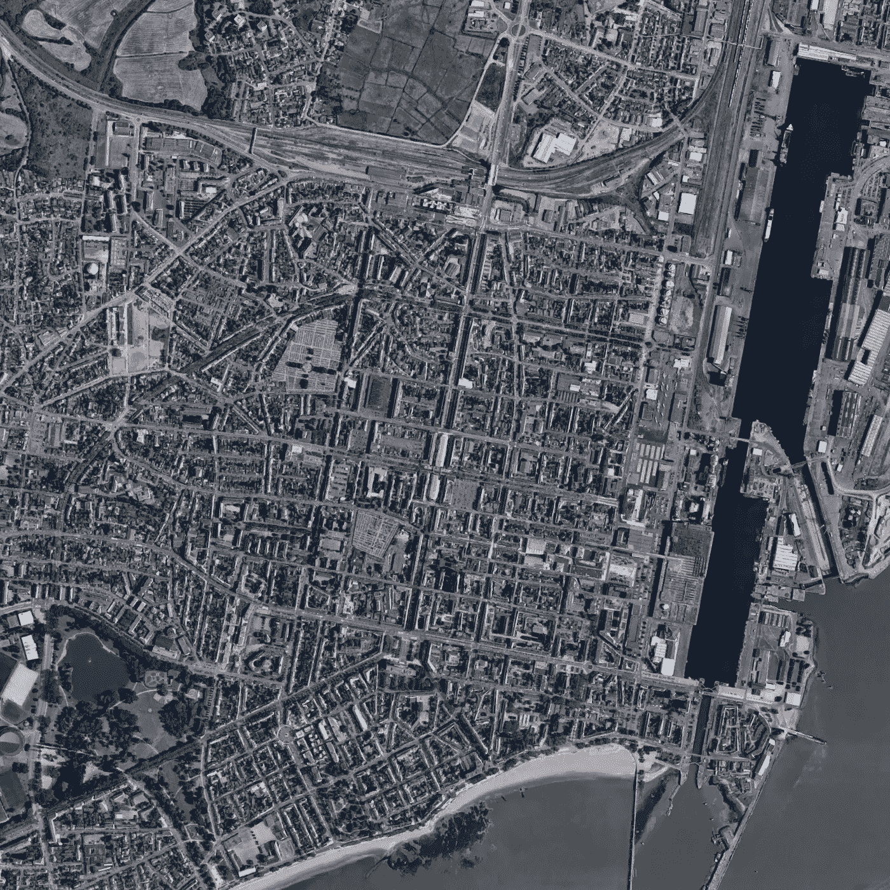

# 苏联城市模型和工程师能从中学到什么

> 原文：<https://levelup.gitconnected.com/model-soviet-cities-and-what-engineers-can-learn-from-them-70a9a9457c67>

## 土木工程和软件工程的共同点

每当人们提到苏联的模范城市，脑海中可能会浮现出普里皮亚季或 T2 马格尼托戈尔斯克这样的画面。尽管毫无疑问，历史已经决定了这些城市不同于最初设计者的命运，但它们所代表的思想仍然可以激励今天的工程师。

不，我指的不是苏联时代的社会经济规范或政治立场。相反，我在讨论*为什么*这些微观世界曾经存在过。这些项目背后的灵感是这些城市崛起的原因。然而，其中一些例子的执行可以归因于它们的垮台。

然而，世界上有很多灵感满足现实需求的例子。其他计划中的城市，如巴黎、华盛顿特区和澳大利亚的堪培拉，继续结出精心规划的果实。这些精心策划的文明的光辉例子，很像他们的苏联同行，讲述了一个软件工程师应该注意的故事。

# 它们是实验和模型

常识会告诉我们，没有人能回答所有问题，尤其是在探索未知领域的时候。自从有史以来，城市一直是一个未解决的挑战，它们经常是实验的主要地点。

城市设计师通常试图找出现有布局和基础设施的常见问题，然后在孤立的环境中试验提议的解决方案，看看它们是如何工作的。由于这在人口高度密集的地区可能是一个昂贵的提议，所以模型城市经常被用作在绿地环境中实施许多集体改进的地方。

和任何实验一样，有些实验进行得很好，比如巴黎，而有些实验却因为失败而被铭记，比如普里皮亚季。在这两种情况下，这些城市都是该国其他文明中心的典范，意在体现该国的最佳特征。

## 软件并行

将我们的注意力转向软件，也许你已经可以看到土木工程和软件工程方面的相似之处。您的代码中是否有一个地方可以让您试验和使用新的库、技术或行业建议？任何健康的软件项目都需要一个地方，在那里你可以脱离特性交付的苦差事，专注于改进它的工程方面。

和城市一样，新的想法在完全通过审查之前不能应用于整个项目。这将是一个昂贵且潜在浪费的前景。取而代之的是，在进行更广泛的采用之前，专注于小的、独立的领域，在这些领域中，你可以集中精力，进行孤立的测试。

这种方法允许人们重复引用应用程序的相同部分，以启发和指导工程师应该如何构建应用程序的新功能，或者他们应该如何检查旧的部分。

# 有机增长与结构化增长

从空中可以看到精心规划的城市的成果。人们不需要成为城市设计师来区分它们。让我们考虑三个不同的城市，每个城市都包含不同风格的规划和发展。

在此之前，我想分享一下，这些只是用于学术练习的例子。它并不反映我对这个城市、国家或人民的看法。我有幸访问了其中两个国家，非常钦佩其人民的决心和毅力。

对于我们的第一个例子，考虑伦敦。

谷歌地图上位于[南肯辛顿、骑士桥和切尔西区](https://go.oliverspryn.com/south-kensington-knightsbridge-chelsea)的伦敦部分

正如你从这幅图中看到的，这个城市的规划和发展似乎缺乏大量的结构。我把这称为有机增长，即城市的新区建设是为了满足一个地区的当前需求，而不再考虑未来、周边地区，甚至整个城市。

让我们对比一下第二个例子，[巴黎](https://go.oliverspryn.com/arc-de-triomphe)。

从谷歌地图上俯瞰巴黎凯旋门

与伦敦不同，巴黎以规划城市而闻名。也许没有比凯旋门更能体现这种规划的地方了。这幅图展示了巴黎是如何围绕笔直的主要堤道组织起来的，这些堤道通向更多的次要道路，这些次要道路又分支成更小的道路。这些重要的道路中有许多在环形交叉路口交叉，提供了到城市其他地区的便捷通道。我称这种设计为结构化增长。

最后，让我们看一个介于这两者之间的小例子。[法国圣纳泽尔](https://go.oliverspryn.com/saint-nazaire)。

法国圣纳泽尔市中心[来自谷歌地图](https://go.oliverspryn.com/saint-nazaire)

在第二次世界大战期间，这座城市的中心大约 80%被德国的轰炸摧毁。战后，美国人按照美国城镇经典的笛卡尔网格风格重建了它的中心。你可以看到重建停止的地方，当你到达郊区时，笔直的网格很快变成蜿蜒的街道，这是典型的法国旧城镇。我们可以说，这个例子是有机增长方法和结构化增长方法的混合体。

## 软件并行

同样，这是一个严格的学术练习，所以请把这些相似之处与他们的意图联系起来。

从不花时间反思和改进他们的代码库的项目倾向于更有机地发展，就像伦敦。我们构建代码来满足当前的需求，即使从更广泛的意义上来说这并不是最好的方法。如果我们能像想象伦敦的街道一样想象我们的代码，也许我们会看到蜿蜒的街道，不寻常的十字路口，以及城市分区条例的不均衡应用。如果我们对自己诚实，我们的项目中都有一点伦敦的影子。

理想情况下，我们所有的项目看起来都像巴黎。我们可以认为这是一个完美结构化代码的理想例子，其中细节的实现方式将项目作为一个整体来考虑。也许这种观点对于任何大型项目来说都是不现实的，这就是为什么我觉得圣纳泽尔是一个更现实的比较。

不管我们做了多少努力，我们可能总会有项目中可以改进的部分。然而，圣纳泽尔做得很对。一座城市不可能为了满足城市规划者的某些宏伟愿景而被夷为平地并重建。相反，城市中心，他们城市的核心，最基本的方面，被精心规划。这将有助于您的项目更好地清理基础，如网络、导航或总体架构。

# 怎么做

从本质上说，我主张您确定代码中最基本、最基础和最深远的部分。市中心很难改变，你代码的这些部分也是如此。无论正确与否，都将产生深远的影响。

另一种方法是找到项目中不在积极开发中的一个小方面，并对其进行改进。理想情况下，这将是一个独立的功能。任何足够小的代码部分都可以工作。

无论是基础架构还是独立的特性，这些例子都可以作为代码其余部分的模型。

在职业上，我从事一个名为 AndroidMyUPMC 的项目。我在我的 Android 项目中有一个模块，我用它作为我的模型，我经常向自己和其他人寻求灵感。它小到可以理解，但大到足以概括我们应用程序的重要思想和实践。

# 结论

我们都开车穿过城市，开始欣赏它们好的一面，或者想知道它们不好的一面。巴黎和普里皮亚季都是计划中的城市，旨在展示他们所代表的国家的精华。巴黎成功了，普里皮亚季却没有。

我们软件工程师可以从建造这些城市的灵感中收集信息，并从这两个例子中吸取教训。这是人类努力改善自己。同样，我们可以用类似的方法来改进我们的项目。

将项目的各个领域隔离为“模型代码”并确保基础设施是健全的，这将大大有助于使您的项目组织良好、易于维护，或者混乱无序。我们必须花时间关注这些努力。否则，我们的代码会自然地转移。

所以，下次你需要从专题工作中休息一下，专注于纯粹的工程工作时，把自己想象成一名城市规划师。做得好，不仅你会感谢自己，你的团队和雇主也会感谢你。

# 喜欢你读的东西吗？

媒体上还有成千上万篇类似的文章。我是这个网站的付费会员，我完全认为这项投资是值得的。[点击这里加入](https://go.oliverspryn.com/medium-membership)，你将会用你的一部分会员资格来支持我的工作。

本文原载于 https://oliverspryn.com/[。](https://go.oliverspryn.com/model-soviet-cities-and-what-engineers-can-learn-from-them)[加入我的邮件列表。](https://go.oliverspryn.com/medium-subscribe)