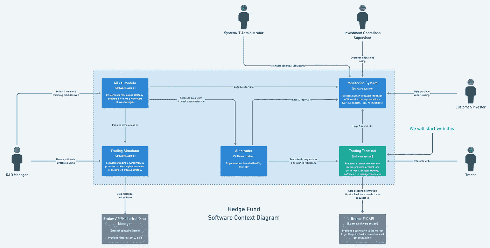
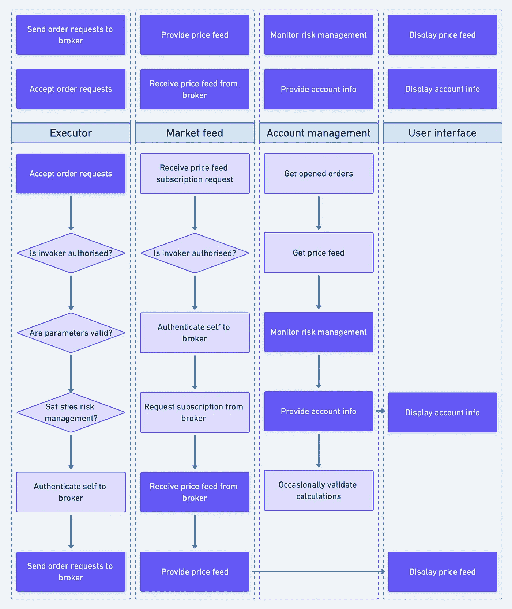
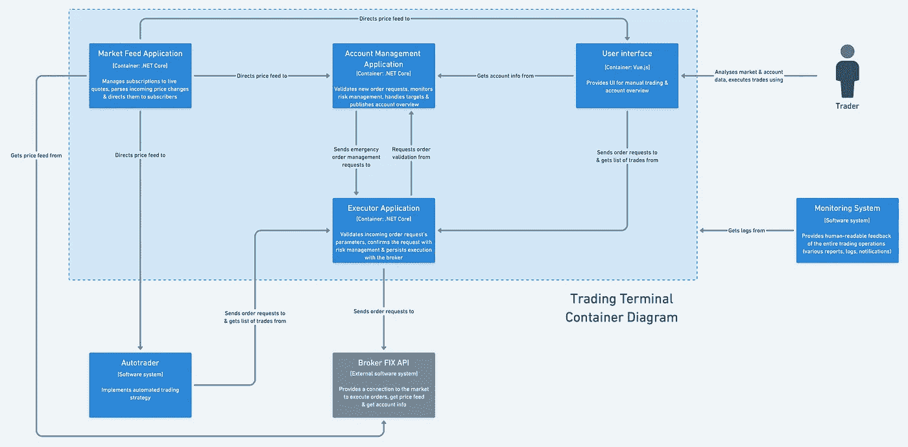

# 模拟交易终端

> 原文：<https://levelup.gitconnected.com/modelling-a-trading-terminal-3761a70f8c64>

## 从受限上下文到微服务

[王占山](https://unsplash.com/@jdubs?utm_source=medium&utm_medium=referral)在 [Unsplash](https://unsplash.com?utm_source=medium&utm_medium=referral) 上拍照

K 知道我们的软件应该做什么，应该解决哪些问题是很重要的，但是仅仅这一点并不能帮助我们开发一个高效的模型。

将软件的职责划分为清晰的**分离的** **上下文**允许我们在开发过程中只见树木不见森林，构建一个**松散耦合的**、**可扩展的**应用。此外，我们可以使用这些有界的上下文作为我们的**微服务**的基础。

> 这是我从零开始为概念对冲基金构建软件系统系列的一部分。在第一部分中，我从业务层面评估了这个项目，并得出了我们系统的高级模型。

软件环境图——C4 模型的第一层

在这一部分，我们将更深入地从系统的核心职责开始，进入模型的**服务级别**，由**交易终端**处理。

另外，做模特是一件相对主观的事情，我鼓励你挑战我的决定。

# 责任

对我来说，一个好的起点是确定交易终端的职责。让我们孤立地关注它在系统中的关系。

系统上下文图内隔离的交易终端

查看上下文图(系统的高级概述)，我们看到有 4 个不同的组件/角色与交易终端交互:

*   交易员；
*   经纪人；
*   自动跟踪仪；
*   监控系统。

为了达成职责，让我们从查看组件的核心/最必要的交互开始，具体的模式应该从这些组件中演化出来。

与交易终端的互动/关系

从这些交互中，我们可以推导出交易终端的具体职责。我们可以根据信息流动的方向对这些信息进行分组，这样可以更清楚地了解我们的交流模式。

交易终端的职责

我们知道我们期望交易终端为整个系统提供什么，以及它需要什么来实现这一点，但是，我们有许多方法来分离责任。仅仅知道**输入**和**输出****并不能为设计通信模式提供一个非常有效的起点。**

# **用例**

**让我们将责任划分为完成任务所需的具体行动流——**用例**。**

****

**基于职责的初始用例**

**一个接一个地回顾用例，我们可以看到职责的分离，因为很少的动作是跨边界重复的。这就是**有界上下文**开始形成的地方。在将每个上下文标记为单独的服务之前，让我们更详细地回顾一下这些操作。**

****

**重复的操作**

**跨越边界，我们有两个重复的动作:**在请求动作时授权**调用者/调用者，以及**在向代理发出请求时认证**我们的客户。**

**安全和授权是至关重要的，一旦我们对要保护的系统有了清晰的了解，我们将对其进行更详细的处理。**

**我们的客户端认证很可能是基于令牌的。这两种责任都不能也不应该作为单独的环境分开。**

**提供**价格反馈**和**账户信息**作为原始数据与在 UI 中显示它们也是几乎相同的用例，只有最后一步不同。这很好地将我们未来的 UI 组件从后端逻辑中分离出来。**

**将**报价逻辑**保持在自己的上下文中是有意义的，因为处理潜在的数千个价格订阅可以从 Y 轴缩放中受益。**

> **“与 X 轴和 Z 轴不同，X 轴和 Z 轴包含应用程序的多个相同副本，Y 轴扩展将应用程序拆分为多个不同的服务。每个军种负责一项或多项密切相关的职能。”— [刻度立方体](https://microservices.io/articles/scalecube.html)**

**然而，几乎所有关于**账户信息**(保证金、权益等)的信息都可以从账户余额、订单列表和活跃头寸的价格中获得。在订阅 price feed 时，每次向经纪人请求帐户信息是没有意义的。我们可以自己使用报价来计算相同的信息，并定期与经纪人验证结果。**

**在执行订单之前，我们必须确保其**满足风险管理**，如果订单被执行，账户将遵守预设限额。这提醒了我，我错过了我们最初为我们的终端设定的核心职责之一——自动**头寸和账户管理**。终端应监控开放位置，并在必要时进行干预。**

**我感觉到提供**账户信息**和监控**风险管理**之间的相关性，因为两者都依赖于对未平仓头寸及其价值的了解。回到绘图板…**

****

**右边是另一个用例**

**备选用例本质上只处理**风险管理**。帐户信息只是计算的副产品，可以与必要的人共享。这**减少了与外部系统(代理)的通信**，因为我们可以基于订单列表(可以从**执行服务**获得)和价格反馈(已经由**市场反馈服务**处理)进行计算。**

**风险管理组件仍然需要帐户余额、货币、杠杆和公式的一些其他输入。例如，这可以每天提取一次，同时确保计算结果与经纪人这边的所有数据相加。**

**有了这个更好的选择，我们已经成功地确定了 4 个明确分离的有界上下文:**执行者**、**市场反馈**、**账户管理**和**用户界面**。这些涵盖了交易终端将拥有的核心职责，每个都将成为单独的服务。**

****

**最终有界背景**

**注意，我去掉了**日志**上下文。日志责任应该集成到每个组件中。此外，对于日志管理，已经有很多很好的解决方案，所以没有必要用我们自己的服务重新发明轮子。**

# **服务**

**有了清晰分离的边界，我们可以映射我们的**容器图**(C4 模型的第二层)，其中我们确定的每个有界上下文是一个单独的**服务**。**

> **“‘**容器**’类似于服务器端的 web 应用程序、单页应用程序、桌面应用程序、移动应用程序、数据库模式、文件系统等。本质上，容器是一个**可单独运行/部署的**单元(例如一个单独的进程空间)，它执行代码或存储数据。”—[C4 模式](https://c4model.com)**

****

**贸易码头集装箱图**

**注意，我已经为刚刚创建的容器分配了具体的技术。NET Core 和 Vue.js)。这是基于我的经验的初步预测，应该在做出最终选择和开始开发之前进行评估。**

**虽然我已经将服务相互连接，表示将要交换的信息，但我们还没有讨论微服务之间的**通信方式。这是一个如此重要的话题，尤其是在我们需要信息快速流动的情况下，我将在另一篇文章中解决这个问题。****

# **摘要**

**已经用业务级上下文图为我们的系统列出了主要需求，现在是时候更深入地研究我们的模型并确定将帮助我们实现目标的特定组件了。**

**我们看到了如何通过**职责**、**用例**和**有界上下文**达到对我们系统的更低层次的理解。这个一步一步的过程导致了清晰的分离服务和对我们将要构建的系统更好的理解。**

**我们还没有讨论**服务间通信** *(在本系列的* [*第 3 部分*](/synchronous-vs-asynchronous-by-example-36b7b87711e7) *中进一步分析)*的细节，我们也没有想出如何在我们的系统中有效地管理**数据**。在我们满怀信心地开始实际编程之前，需要回答这些问题以及许多其他重要问题。**

**有很多有趣的话题可以讨论，我希望能在路上遇到你！**