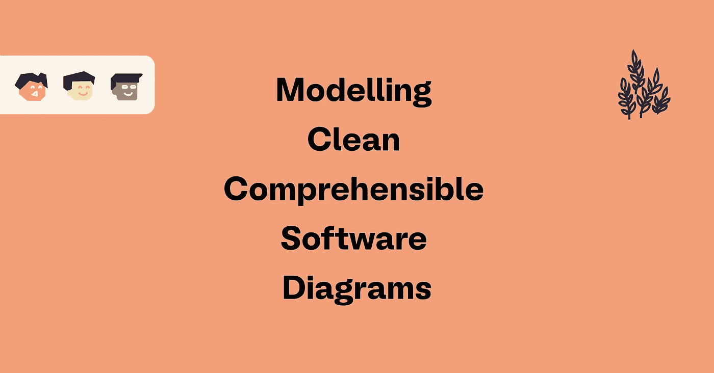
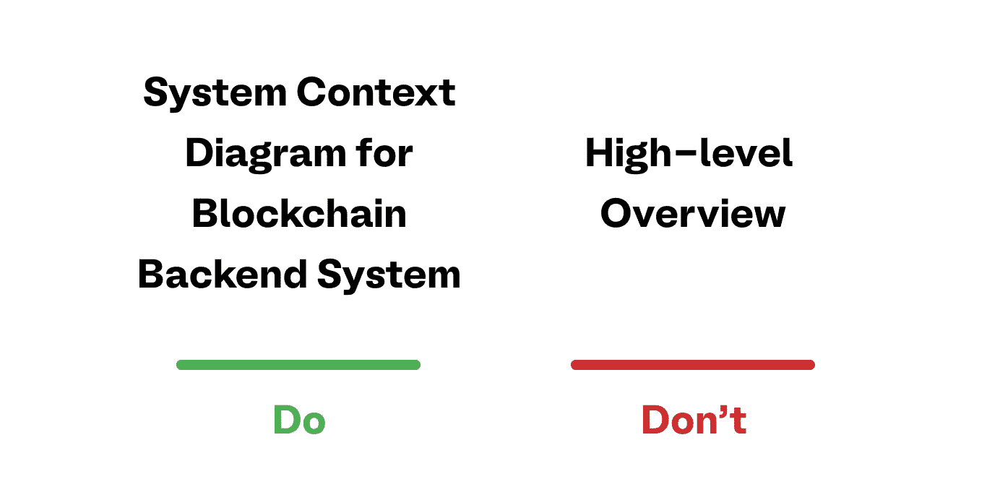
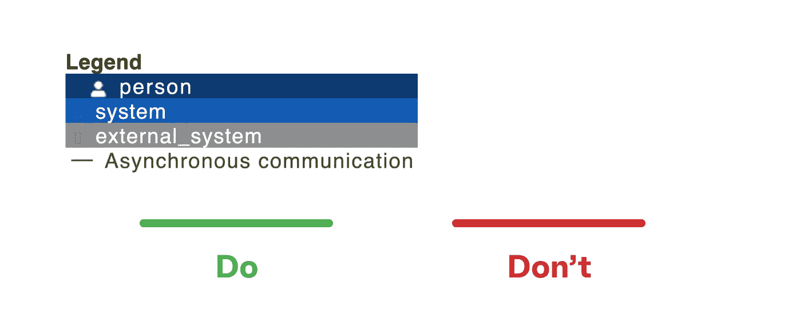
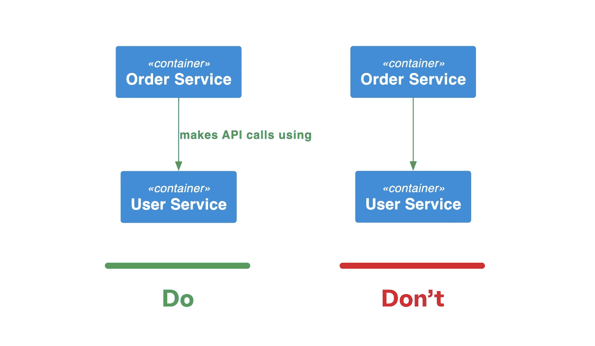
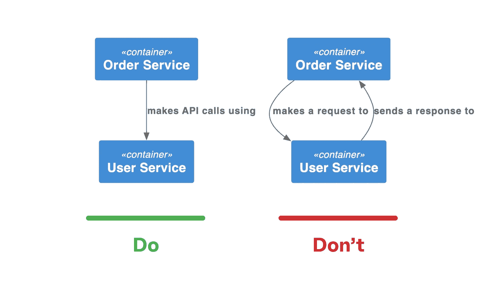
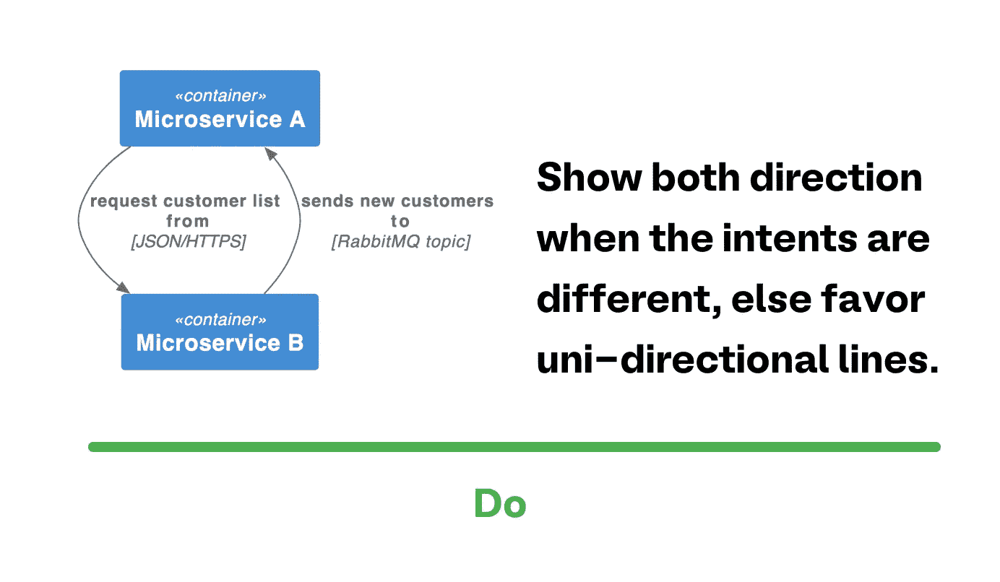
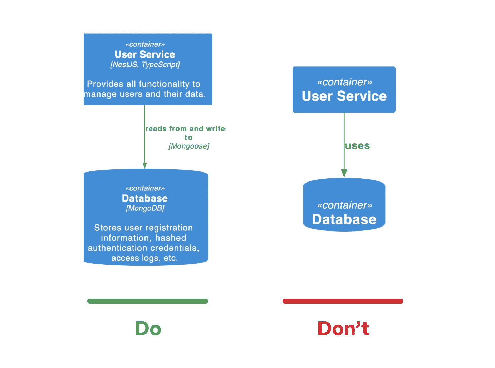
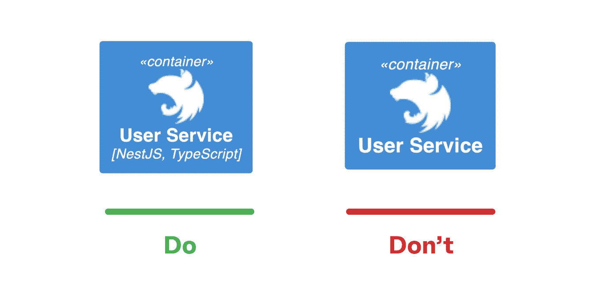
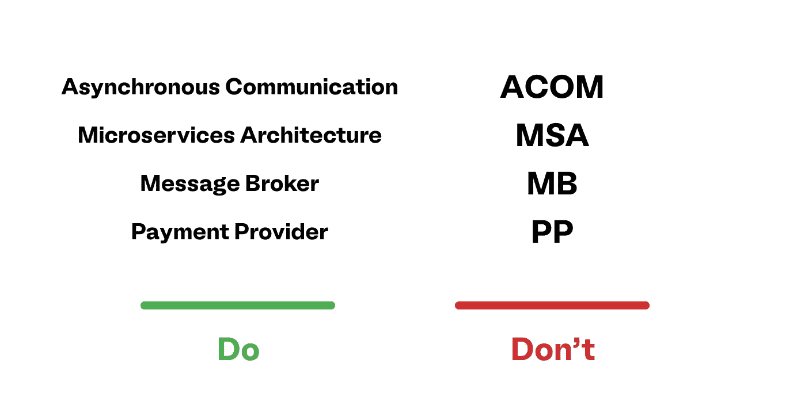

# 建模清晰易懂的软件图

> 原文：<https://levelup.gitconnected.com/modelling-clean-and-comprehensible-software-diagrams-c3ca7456feec>

## 遵循一些简单的指导方针，为您、您的团队以及所有相关的利益相关者编写更好的软件图。

> 做工程师，而不是艺术家——基于西蒙·布朗的演讲

# 介绍

好的软件图避免了歧义，改善了沟通，并且被所有的涉众理解，无论他们是 DevOps 工程师、开发人员、产品负责人、测试人员等等。然而，今天的软件图充满了没有人理解的颜色、形状和符号。

这篇文章的目的是用一些简单的技巧来改进你下一个项目的软件图。所有这些指导方针都摘自西蒙·布朗关于 C4 软件架构模型的演讲。我们将这些最佳实践用于我们设计的每一个图，这帮助我们建模更精确和漂亮的软件图。

# 在图表中使用标题

使用反映图表类型的简短而有意义的标题。

这是一个快速有效的解决方案:每个图都应该有一个**缩写** **标题**。标题应该是**有意义的**并提到**类型的图**。例如，如果它是一个部署图，您应该能够立即从标题中看出这一点。

提示:如果图表顺序很重要，在标题上加一个数字。

# 在图表中使用图例

添加图例解释您的颜色、形状等。—即使你的符号看起来很明显。

你多久问自己一次这个颜色意味着什么，即使你上周就知道了？一个失踪的传奇是一个错误，可以花费你和你的队友很多时间。所以:**解释所有的表格、线条样式、颜色、边框、缩写等。—即使它们是显而易见的。**你未来的自己会感谢你。

# 视觉上保持一致

在图表中保持符号和元素位置的一致性。

我们统一命名代码变量和方法。对于演示文稿，我们只对标题和文本使用一致的字体。为什么要为图破例？

因此，尝试在所有图表中使用相同的颜色、阴影和形状**。总是把同样的东西放在同样的地方。例如，如果在一个图的左上角有用户，将他们放在其他图的相同位置。**

# 为你的线条和关系使用有用的标签

添加标签，避免“用途”之类的笼统描述。

标记的关系和链接有助于读者更好地理解您的图表。尽量避免像*使用*这样的通用标签，因为没有附加值，但尽量简单准确地描述关系。您的注释应该**明确说明线条和方向的目的**。

# 偏爱单向线

通过总结关系的意图来避免混乱的图表。

一般来说，没有箭头的线条或两边都有箭头的链接很难流畅地阅读图表。数据流通常是不明确的，人们不知道哪个组件有哪个依赖项。因此，通过总结关系的意图，尝试支持**单向线。但是要精确！**不要用两行来发送请求和接收响应，而是总结成一行，说明它发出了一个 API 请求。使用这种方法，您的图表就不会那么混乱。

提示:链接应该指向符合链接标签的方向。例如，服务 A 调用服务 B，或者服务 A 依赖于服务 B

不要总结具有不同意图的行。

如果两个组件**之间的两个链接有不同的用途**，不要将它们合并成一个链接，而是显示两个方向，以免混淆。

# 添加更多的单词并大声读出你的图表

添加更多的词语，使意图更加明确。

对组件和连接的简短描述使您的图表更容易理解。但这并不意味着你应该写整篇文章。尽量精确一点，但一般来说，这里的意思是:越多[话]越好。

当你创建你的图表时，总是**大声读给自己听**，并确保它听起来流畅且有意义。

# 使用图标来补充文本，而不是取代它

不要期望每个人都理解图标。

图标使您的图表更漂亮。我们理解。但是图标的问题是，不是每个人都知道它们的意思。因此，只有**添加图标，如果你的图表没有图标**也能被理解的话，并且如果你从你的图表中移除所有的图标也不会有信息的丢失。

# 仅为美观目的添加颜色、形状和不同尺寸

在与他人共享您的图表之前，请尝试以下方法:删除所有颜色、形状和大小，并询问您的同事裸露的图表是否仍然可以理解。

我们的意思是，不同的颜色和形状使你的图表更漂亮，但在你添加颜色和其他东西之前，你的图表必须有意义。其他涉众可能不理解你为什么使用那种特殊的颜色，所以他们需要能够理解没有颜色的图表。

# 不要使用缩写

避免使用缩写。

永远不要使用缩写因为没人会懂。这个经典的技巧适用于图表和涉及多人的所有事情。有大家都知道的缩写。例如，您不必为 HTTP 写出超文本传输协议。但是这些异常很少见，因此，在使用它们之前要三思。

看看[埃隆·马斯克发给 SpaceX 员工的这封电子邮件](https://gist.github.com/klaaspieter/12cd68f54bb71a3940eae5cdd4ea1764)关于首字母缩写词有多糟糕。

# 结论

这篇文章有望给你一些简单的提示，让你的软件图在将来更易读。以下是帖子内容的简要总结:

*   使用标题
*   使用图例
*   视觉上保持一致
*   为你的关系使用标签
*   偏爱单向线
*   多加几个字更明确
*   大声读出你的图表
*   使用图标来补充文本，而不是取代它
*   使用不同的形状、颜色、大小等。只是为了补充一个图表
*   不要使用缩写

最后但同样重要的是，一如既往，我们非常欢迎大家提出意见和建议。