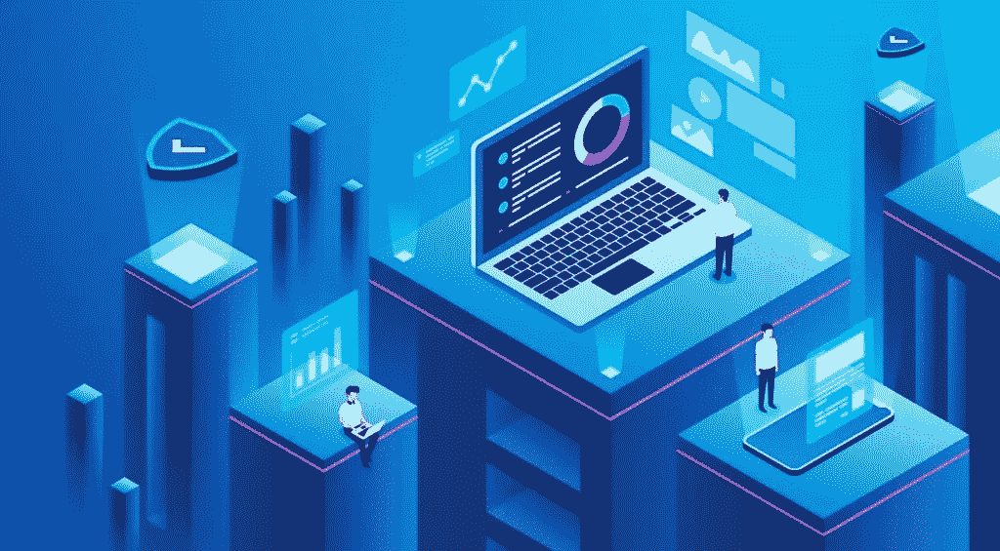

# 现代应用基础设施

> 原文：<https://levelup.gitconnected.com/modern-application-infrastructure-64c1b6ce8966>

## 开发现代基础设施的最佳实践和技巧

软件总是在变化和发展，这意味着支持它的基础设施必须与它一起发展，以应对不断变化的需求。本文旨在描述什么是现代应用程序基础设施，以及它应该包括哪些元素。一旦明确了这一点，我们将仔细研究最佳实践、要避免的错误，并尝试定义一些规则，帮助您定义最适合您的应用的基础架构。

# 什么是现代应用基础设施？

当谈到现代应用程序时，我们可能会想到新技术和编码语言(React、Golang、NodeJs、Scala……)，但事实是，定义应用程序的是架构。具有模块化体系结构模式的面向事件的体系结构、异步通信、组件间的消息传递、流式传输(当需要时)。这些元素可以告诉我们应用程序是否现代。我们总是可以使用 NodeJs 开发一个单一的应用程序，这不会是一个现代的应用程序。

一旦我们知道了现代应用程序的样子，我们就需要描述对基础设施的期望。首先，现代基础设施需要在全球范围内提供 24/7 的可用性，它需要能够适应负载的变化；它必须具有应对失败的弹性，并且需要具有成本效益。现代基础设施的另一个关键方面是被包含在应用程序开发本身遵循的相同敏捷过程中的可能性。

当经历所有这些需求时，首先想到的是云，原因是我们可以非常快速地在那里创建基础架构，并利用自动化、基础架构即代码(IaC)和 DevSecOps 等关键原则，而无需在全球范围内投资我们自己的基础架构。

# 应用基础设施概述

一旦我们有了应用程序基础架构需求定义，在大多数情况下，现代软件基础架构将包括以下几个要素:

*   全球分布式前端(我们 JavaScript 的 CDN 部署)
*   微服务容器化(Kubernetes、AWS Lambdas/Azure 功能)
*   关系和非关系数据库(MySQL、PostgreSQL、MongoDB、CouchDB)
*   组件之间的消息传递(Kafka、RabbitMQ、Spark)
*   API 网关(孔，云提供商产品)
*   通过身份提供者进行身份管理(Azure AD、Amazon Cognito、Keycloak)

这只是您肯定听说过的组件列表，因此让我们尝试绘制一个流程来创建实际的应用程序基础架构设计。

# 应用基础设施设计流程

设计基础架构时，我们需要回答以下问题:

## 我们有什么类型的应用程序？

*   电子商务网站？高峰时有大量并发用户，但使用量处于低谷
*   数据密集型？处理/分类数据的长流程
*   关键系统？医疗保健、急诊、银行。

## 应用程序有哪些层？

*   演示(图形用户界面)
*   应用程序(业务逻辑)
*   数据(数据库、存储……)

## 是全球范围的吗？

*   客户群遍布全球

## **它是否提供了一个公共 API 来与他人集成？**

## **内部需要什么样的安全等级？**

*   它是否需要 PCI DSS 认证？
*   ISO 27001？

## 我们能承受系统的失败吗？

*   高可用性
*   灾难恢复计划

一旦我们回答了这些问题，我们就可以根据我们的需求定义我们的应用程序基础结构模型。一般来说，我们的应用程序基础架构模型将包含以下部分:

# 基础设施定义

我们需要在一个地方描述我们的基础设施，以便我们在将来进行更改时参考。这通常是在文档和图表中完成的，但是有了作为代码的*基础设施，我们可以利用它来简化文档，并且还能够跟踪未来的变化和发展。*

因此，我们将拥有我们的代码库，我们的基础设施代码库(通常是 git repo)。我们将使用 Terraform、CloudFormation、Ansible、Azure 等语言写下我们将在那里创建的资源…

# 基础设施交付流程

与我们将如何定义我们的基础架构同样重要的是，我们需要我们的基础架构交付流程。这需要与软件开发生命周期保持一致，因为应用程序的变化可能需要基础设施的变化。这通常是通过在 Azure DevOps、AWS CodeDeploy、Github Actions、Jenkins、Bitbucket pipelines 等工具中创建基础设施创建管道来完成的。最终，我们的目标是以自动化和可重复的方式创建一个基础设施，这样就不涉及任何“手动”更改。这样，我们可以确保在操作基础架构时没有人会“遗忘”任何东西。

# 部署策略

与基础设施交付流程相关联，我们拥有将用于交付软件的部署策略。应用程序基础设施需要能够应对诸如处理蓝绿色部署、canary 版本或主从部署模式等需求。这在很大程度上取决于应用程序的需求，但最关键的部分是拥有一个自动化的流程，以便在出现问题时进行部署和回滚。

# 可量测性

最后，以可纵向和横向扩展的方式设计基础设施至关重要。这在很大程度上取决于应用架构本身，因此，关键是要有一个模块化架构，我们可以独立地、垂直地(例如，需要提供越来越多分析服务的读取数据库)或水平地(例如，需要创建更多副本来处理不同区域负载的一组微服务)扩展模块。

# 创建现代基础设施的最佳实践

一旦我们清楚地了解了应用程序需求以及我们想要的设计，在创建现代应用程序基础架构时就有一些最佳实践可以遵循:

## -模块化组件:

尽量不要让独立的软件在同一个基础设施中运行。例如，在同一个虚拟机中运行后端服务和数据库可能是一个很好的概念验证想法，但是您很快就会意识到您正在创建单点故障，并且即使在更新单个元素时也会导致整个系统停机。

在单独的元素中运行应用层服务并按照功能隔离它们是一个好主意。

## -添加缓存以提高性能:

添加 CDN 分发以缓存静态资源。

使一些缓存技术(如 Redis)能够用很少的计算资源对频繁重复的查询做出快速响应。

## -根据您的需求调整技术:

云提供商有很多不同的服务可以帮助你的应用。如果你是从零开始，可以考虑使用无服务器(AWS Lambdas、Azure Functions、GCP 云函数……)来快速传递价值。

在大多数情况下，在第一阶段，你的工作量不会很大。更重要的是快速交付特性并轻松更改。选择有助于你的技术。

## -越简单越好:

不要通过添加大量部件来使系统过于复杂，以防将来可能会用到它们。最好在中期重写部分系统并改变基础设施，而不是一开始就使解决方案过于复杂，以防万一你会非常成功。

这并不意味着如果你的软件需要消息系统、流或大数据分析，你不应该把它们放在适当的位置。意思是除非你确定你需要这些特性，否则不要去做，直到它成为一种必需品。

## -尽可能自动化:

作为代码和交付管道的基础设施是复制、更改和修改基础设施的关键。这是您可以轻松发展基础架构的唯一方式，而无需大量的工作和手动干预，这通常会导致大的维护窗口、重大更改等。

## -从一开始就监控:

云基础设施带来了挑战。监控及其可观察性是关键。对您来说，检测应用程序的所有元素并将所有日志和指标发送到一个集中的系统是非常重要的。这将有助于产生警报和防止问题。

跟踪变得至关重要，因为这是了解系统中请求和消息演变的最佳方式。OpenTelemetry 等开源框架可以在这一过程中为您提供帮助，并为您提供有关基础设施和应用内部情况的大量信息。

利用 AWS Cloudwatch、Azure Application Insights、日志分析、GCP 云监控等服务。它们将很容易与您的基础设施集成，并从头开始为您提供大量指标。

## -利用可用性区域部署

利用可用性区域部署来处理云提供商 CPD 中的灾难。不要认为云提供商地区不会失败。即使不经常发生，它也会对你的业务产生巨大影响。云提供商通常不保证单可用性区域服务的 SLA 高于 99.99%。这对你和你的企业来说可能还不够。

## -使用容器编排技术

如果您有一个后端服务层，其中有许多微服务和不同的负载，容器编排技术会有很大帮助。它们将使您能够快速准确地适应您的性能需求。

## -使用异步消息传递系统来传递您的服务。

您将在应用程序基础设施中面临的最大挑战之一是理解跨服务的通信模式，并知道为什么一些服务难以处理它们的请求。同步调用，除非由于请求的性质它们是强制性的，否则会隐藏一点有问题的服务。

消息传递系统还可以帮助您了解哪些队列/主题有更多的请求，从侦听器获得响应需要多长时间，并帮助跟踪系统问题。

## -从一开始就是安全的。

在系统已经运行的情况下添加安全层并不容易，而且可能会破坏您的系统。如果您有一个 web 应用程序或 REST APIs，Web 应用程序防火墙是强制性的。这将保护您免受最频繁和最容易的攻击。API 网关具有速率限制等特性。在公共 API 中，能够限制从单一来源接收的请求数量是非常重要的。这样，单个客户端不会耗尽您的资源。

确保您在 WAFs 中启用了 bot 保护，并使用 cdn。这将帮助您控制僵尸程序并限制 DDoS 攻击。了解云提供商 DDoS 产品更像是保险，而不是实际的 DDoS 保护，因为他们对您的基础设施不遭受这种类型的攻击最感兴趣。

此外，您应该:

*   遵循必要权限较少的原则。
*   隔离网络层(例如，Web 服务器应该只能访问应用服务器，而不能直接访问数据服务器)。
*   限制出站连接并监控网络内部的异常活动。
*   使用虚拟专用端点连接到云服务和静态加密，以实现与云服务的安全通信。
*   启用安全审计。如果你用的是容器，漏洞评估工具像 Qualys，Sysdig Aquasec 等。可以帮忙。

## -最后，根据您团队的技能调整要使用的技术。

如果您的工程师擅长使用 AWS EC2 实例和自动扩展，但您喜欢使用 AWS lambdas 设计一个完全无服务器的系统，因为您认为它非常适合您的需求，那么最好找一个这方面的专家来培训您的团队，而不是试图在工作中学习，因为可能会犯大错误，您的基础架构将难以运行。

# Web 应用程序基础结构示例

AWS 中 Web 应用程序基础结构的一个基本示例如下:

该系统依赖 API Gateway 和 AWS Lambda 作为业务层，Cloudfront 和 AWS S3 作为前端 JavaScript 应用程序，RDS DB 部署在 Multi-AZ 中。为了在彼此之间传递服务，将使用 AWS Eventbridge。该基础设施将能够根据早期阶段的业务需求进行增长和扩展，并有助于加快 web 应用程序的上市时间。对于一个地理区域内的电子商务网站来说，这可能是一个好主意。CloudFormation 和 Github 行动将涵盖 IaC 和 CI/CD 需求。

# 作者:

Fernando 是 Zartis 的高级 DevOps 主管和云架构师，在软件工程领域拥有十多年的经验。他在软件开发生命周期、云架构、代码基础设施和 CI/CD 引擎方面拥有丰富的经验。