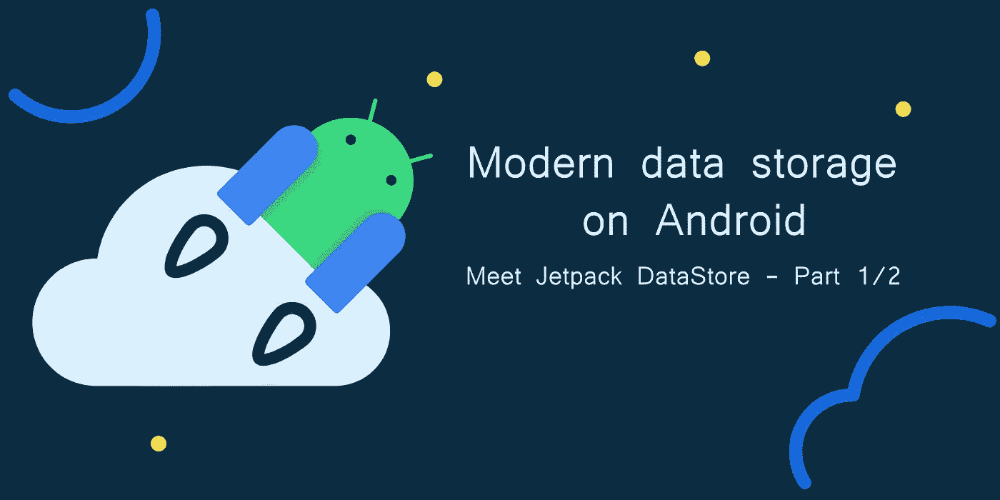
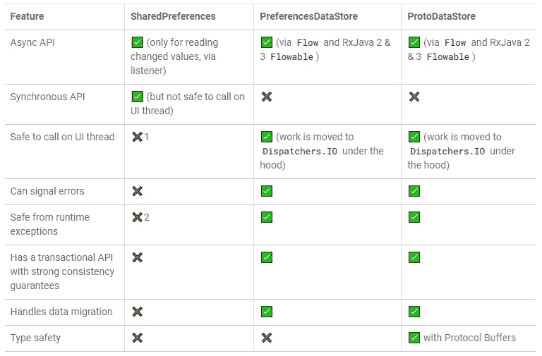
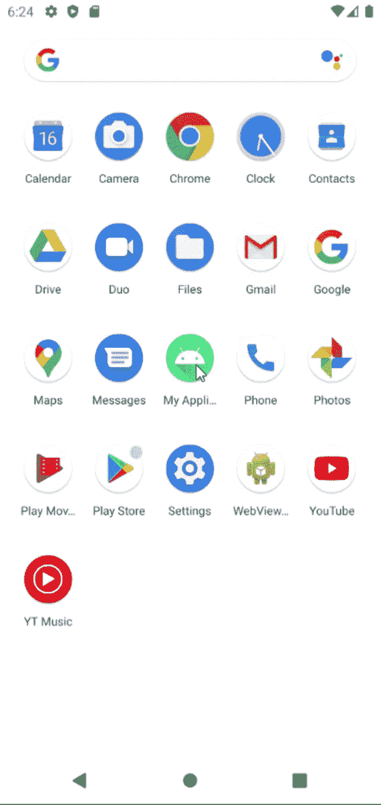

# Android 上的现代数据存储:了解 Jetpack 数据存储—第 1/2 部分

> 原文：<https://levelup.gitconnected.com/modern-data-storage-on-android-meet-jetpack-datastore-part-1-2-9f314c994fc8>

谷歌最近发布了其新的 Android 数据存储解决方案的稳定版本:DataStores。



# 介绍

当我们谈论 android 的数据存储解决方案时，很容易想到 SharedPreferences，这是一种非常简单快捷的将数据保存到应用程序中的方法，但如果管理不当，当应用程序的大小和复杂性增加时，它可能会导致许多难以解决的问题。Jetpack DataStore 是 SharedPreferences 的可能替代品，可以解决其中的许多问题。

## 什么是 Jetpack 数据存储？

> “Jetpack DataStore 是一个数据存储解决方案，允许您使用[协议缓冲区](https://developers.google.com/protocol-buffers)存储键值对或类型化对象。DataStore 使用 Kotlin 协同例程和流来异步、一致和事务性地存储数据。”
> 
> ——【developer.android.com 

有两种不同类型的数据存储，preference 和 proto 数据存储，第一种非常类似于 SharedPreferences 的工作方式，它实现起来更简单，但没有类型安全，第二种使用协议缓冲区来序列化数据，它的实现更复杂，但有很多优点。在本文中，我将讨论 PreferencesDataStore 以及如何实现它，但是请继续关注第 2 部分，在第 2 部分中，我将讨论 ProtoDataStore 以及随着您的项目变大，它对于应用程序开发的许多优势。



[谷歌代码实验室](https://developer.android.com/codelabs/android-preferences-datastore#3)

# 履行

让我们看看如何在应用程序中使用首选项数据存储，在本例中，我们将实现一个简单的计数器数据存储，稍后我们将使用它创建一个应用程序。

## 步骤 1:添加依赖关系

要在您的应用程序中使用 Jetpack 数据存储，请将依赖项添加到您的 app/build.gradle 文件:

```
implementation "androidx.datastore:datastore-preferences:1.0.0"
```

## 步骤 2:创建数据存储

将依赖项添加到应用程序后，您现在可以创建第一个数据存储，为此，您需要创建上下文对象的扩展:

如何创建新的数据存储

## 步骤 3:创建数据存储的密钥

使用 SharedPreferences，您可以使用硬编码的字符串键来写入和读取数据，这在数据存储中是不可能的，您需要创建一个 key 对象，您可以这样创建它:

如何为首选项数据存储创建密钥

这看起来像是一个额外的步骤，但实际上非常有帮助，因为您的项目越来越大，这将迫使开发人员将所有的键放在一个集中的位置(或者他们必须在每次读/写数据存储时创建一个键的实例，这不是一个很好的做法)，并确保如果键在未来发生变化，您的类和文件将不会使用旧的不推荐使用的键。

您还可以创建其他类型的 PreferenceKey:

*   booleanPreferencesKey (名称:字符串)
*   [doublePreferencesKey](https://developer.android.com/reference/kotlin/androidx/datastore/preferences/core/package-summary#doublePreferencesKey(kotlin.String)) (名称:字符串)
*   [floatPreferencesKey](https://developer.android.com/reference/kotlin/androidx/datastore/preferences/core/package-summary#floatPreferencesKey(kotlin.String)) (名称:字符串)
*   [intPreferencesKey](https://developer.android.com/reference/kotlin/androidx/datastore/preferences/core/package-summary#intPreferencesKey(kotlin.String)) (名称:字符串)
*   [longPreferencesKey](https://developer.android.com/reference/kotlin/androidx/datastore/preferences/core/package-summary#longPreferencesKey(kotlin.String)) (名称:字符串)
*   [stringPreferencesKey](https://developer.android.com/reference/kotlin/androidx/datastore/preferences/core/package-summary#stringPreferencesKey(kotlin.String)) (名称:字符串)
*   [stringSetPreferencesKey](https://developer.android.com/reference/kotlin/androidx/datastore/preferences/core/package-summary#stringSetPreferencesKey(kotlin.String))(名称:字符串)

## 步骤 4:将数据写入数据存储

要将数据写入数据存储，我们需要调用 edit()方法，让我们创建一个函数来完成这项工作:

如何在首选项数据存储中写入/编辑数据

## 步骤 5:从数据存储中读取数据

要读取数据，我们需要从 datastore 中访问" *data* "属性，data 属性是一个[*Flow*](https://developer.android.com/kotlin/flow)*<*[*Preferences*](https://developer.android.com/reference/kotlin/androidx/datastore/preferences/core/Preferences)*>*，因此我们可以获得整个首选项，也可以将其映射为我们实际需要的值:

从数据存储中读取数据

## 步骤 6:处理异常

使用 flow 对象，我们还可以捕获异常:

如何捕获数据存储异常

## 步骤 7:创建 DataStoreManager(可选)

为了充分利用数据存储，最好使用一个集中式类来保存与读取和写入数据相关的每个逻辑，而不要直接公开数据存储，这样可以确保这是应用程序中唯一会对数据存储进行实际更改的地方，从而防止代码重复以及可能导致的问题:

使用这种方法，我们不能直接编辑数据存储，我们需要使用管理器，确保每个 IO 操作都在单个类中处理。

# 在我们的应用中使用数据存储

现在我们已经看到了如何实现数据存储，让我们看看如何在我们的计数器应用程序示例中使用它。

## 第一步:主要活动布局

我们的计数器将有一个非常简单的界面，我们将有一个编辑文本来显示和设置计数器的当前值，2 个按钮用于将值增加和减少 1，最后一个按钮用于将编辑文本的当前值设置到数据存储中:

## 步骤 2:实例化我们的经理

布局准备好了，我们就可以开始我们的活动类了，让我们从获取所有我们需要的视图并添加管理器开始。

请注意，我们用*CounterDataStoreManager(this)，*实例化了我们的计数器数据存储管理器，但这仅在活动中是可能的(活动是一个上下文)，如果您在片段或自定义视图中这样做，您将需要将“context”或“requireContext()”而不是“this”传递给构造函数。

## 步骤 3:读取数据存储

要读取我们的数据存储的内容，我们所要做的就是“收集”我们的流，这样，每当计数器值有任何变化时，就会触发一个回调:

## 步骤 4:用户交互

现在我们已经有了所有的基础，让我们实现点击监听器:

最后，完整的主要活动:

就是这样！现在你有了一个全功能和持久的计数器应用程序。



您可以在这里找到源代码:

[](https://github.com/GB0307/android_datastore_counter_app) [## GitHub-GB 0307/Android _ datastore _ counter _ app

### 在 GitHub 上创建一个帐户，为 GB 0307/Android _ datastore _ counter _ app 开发做贡献。

github.com](https://github.com/GB0307/android_datastore_counter_app) 

我希望这篇文章对你有用！请继续关注第 2 部分，在那里我将讨论原型数据存储，一旦发布，请关注我以获得通知。