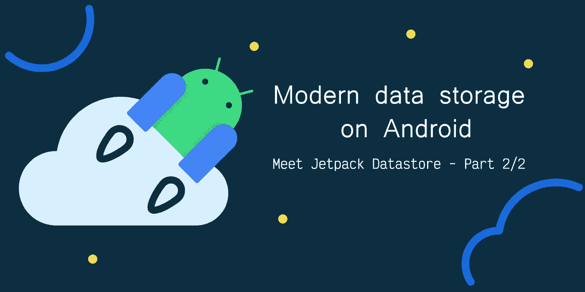
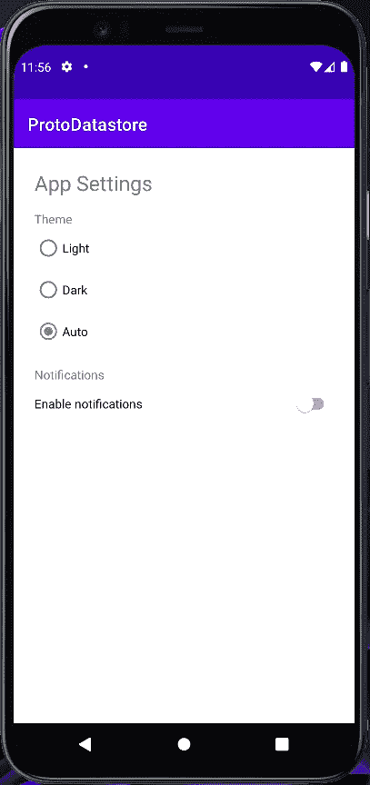
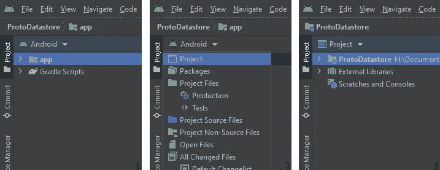
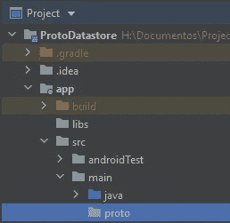

# Android 上的现代数据存储:了解 Jetpack 数据存储—第 2 部分

> 原文：<https://levelup.gitconnected.com/modern-data-storage-on-android-meet-jetpack-datastore-part-2-2-def77b1434bd>

了解 Proto Datastores，面向 Android 的类型安全和异步数据存储解决方案。

在这个故事中，我将分享如何使用 proto DataStore，如果你不知道什么是 Jetpack DataStore 或想学习如何使用 Preferences DataStore，请查看我以前的故事。

 [## Android 上的现代数据存储:了解 Jetpack 数据存储—第 1/2 部分

### 谷歌最近发布了稳定版的 Android 新数据存储解决方案:数据存储。

levelup.gitconnected.com](/modern-data-storage-on-android-meet-jetpack-datastore-part-1-2-9f314c994fc8) 

# 什么是原型数据存储？

Proto DataStores 是 Jetpack DataStore 中的一个存储解决方案，与 Preference Datastore 相比，它的主要区别在于它是类型安全的，使用起来更方便，它需要一些额外的步骤来实现，但一旦完成，它就很容易维护。我真的推荐对更大的应用程序使用这个解决方案，因为它提供了更好的关注点分离。

# 履行

为了实现原型数据存储，我们将创建一个简单的设置数据存储，用户可以在其中选择应用程序主题(亮、暗或跟随系统主题)，并管理通知(尽管我们不会实现通知)。

## 步骤 1 —设置项目

让我们首先为我们的设置应用程序实现一个 UI:

有了 activity_main.xml，我们的应用程序应该如下所示:

## 步骤 2——创建我们的原型数据文件

proto 和 preferences 数据存储之间的一个关键区别是，在 proto 中，我们为数据定义了一个方案，因此我们需要创建一个包含“消息”的. proto 文件，这就是我们的数据和类的外观。

要定义一个原型文件，我们需要在 Android Studio 中通过选择左上角的项目视图来切换到项目视图。

然后我们需要在 app/src/main 文件夹中创建一个名为 proto 的文件夹，所有的 proto 文件都需要在那里。

在 proto 文件夹中，创建一个 user_settings.proto 文件，在该文件中，我们将定义一条消息，其中包含我们希望保存到 proto 数据存储中的任何数据。协议缓冲区有一个非常简单的语法，你可以在这里阅读更多关于它们的内容。

让我们定义我们的原型文件:

## 步骤 3 —添加依赖关系

现在我们需要向我们的项目添加依赖项，我们需要添加 Google protobuf gradle 插件、数据存储、javalite 和一个“protobuf”块来设置 protobuf 插件应该如何生成我们的数据类，你可以查看它如何工作的更多细节[点击这里](https://github.com/google/protobuf-gradle-plugin#customizing-protobuf-compilation)。

现在构建项目，protobuf 插件将为我们生成 UserSettings 类。

## 步骤 4 —设置我们的序列化程序

我们有了自己的类，现在我们需要为它创建一个序列化程序，因此，创建一个目录 datastores/settings，并在其中创建一个 UserSettingsSerializer.kt:

不要太担心这个 serializer 类，它几乎是样板文件，每次你实现一个新的 serializer 时，你可以复制粘贴上面的代码并用你的类替换“UserSettings”。

## 步骤 5 —设置我们的设置管理器

现在，我们开始实际实现我们的数据存储，管理器是整个应用程序中唯一可以直接访问数据存储的位置，与 SharedPreferences 相比，这似乎是一个限制，需要更多的工作，但实际上可以节省很多精力。查找与 SharedPreferences 相关的错误有点痛苦，可能会出错的地方很多，可能会键入错误的键，可能会编写错误的值类型，可能会用错误的上下文打开它，所有这些都可能发生在应用程序中的任何地方，而使用这个管理器，所有东西都打包到一个类中，如果出错，只需查看一个位置。

让我们实现我们的管理器类:

上面代码的一些注释:

*   datastore.data 是一个流<usersettings>，这意味着对保存到 datastore 中的 UserSettings 的每次更改都会触发流中的一个事件，我们可以通过调用。在流动中收集。</usersettings>
*   流是可以映射的，所以假设我只想监听 UserSettings 类中的一个变量，为此，您需要做的就是用。map 函数，然后收集它，只有当这个变量发生变化时，才会触发事件。
*   数据存储连接到上下文，因此如果您想要将单个数据存储连接到多个活动，请从应用程序上下文中调用它(用`private val datastore = context.applicationContext.settingsDataStore`替换第 11 行)。
*   我为数据创建了 setter(`setTheme`和`setNotifications`)，这样我可以更好地控制它们的更新方式(以防将来需要更改)，但是如果需要更多的灵活性，您可以从数据存储中公开更新方法。

## 步骤 6 —添加功能

现在让我们在活动中使用数据存储，首先让我们在 MainActivity 中创建一个方法来实际更新应用程序的主题模式:

然后，我们需要使用`collect`监听数据存储更新，并更新 UI 和主题以反映最新的数据:

我们可以读取数据，现在唯一缺少的是实际写入数据:

就这样，现在您就有了一个带有原型数据存储的全功能设置屏幕！除了设置 radioGroup 和 switch 侦听器中的值之外，您不需要做任何其他事情，因为一旦数据在数据存储中得到更新，就会调用 collect 回调。

这使我们能够做的一件很酷的事情是将代码解耦，在这个示例中，我们对同一活动做了所有事情，但数据存储的真正价值是保持应用程序的不同部分与数据连接和同步，而这些部分不需要相互了解，您可以在主活动中收集主题模式设置，同时在不同的片段中设置这些值，收集回调仍然会被触发！

检查下面完整的 MainActivity 代码:

# 结论

原型数据存储对于您的项目来说是一个非常好的可能性，它可能不能解决您所有的问题，并且仍然相对较新，所以像加密这样的一些特性还不可用，但它肯定是有前途的！它迫使您和您的团队在处理存储时保持良好的实践，同时为我们提供了一个出色的异步类型安全 API。

检查完整项目的 GitHub repo:

 [## GitHub-GB 0307/Android _ datastore _ settings _ app

### 此时您不能执行该操作。您已使用另一个标签页或窗口登录。您已在另一个选项卡中注销，或者…

github.com](https://github.com/GB0307/android_datastore_settings_app/tree/main)