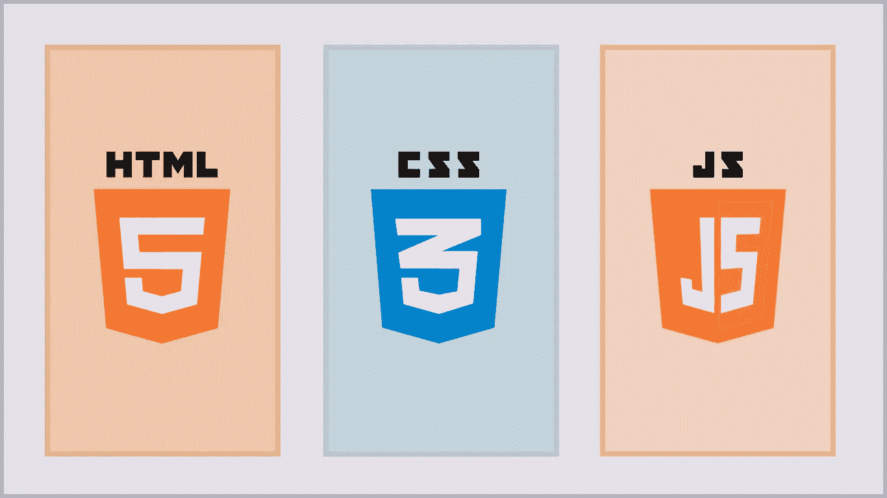
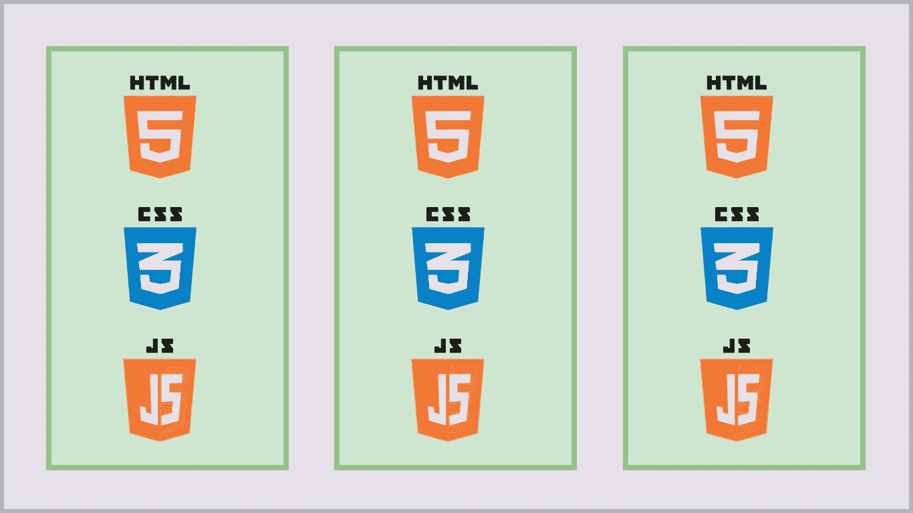
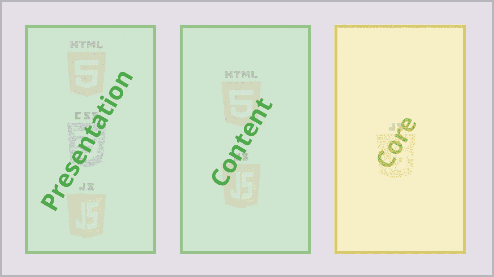

# 现代的关注点分离

> 原文：<https://levelup.gitconnected.com/modern-day-separation-of-concerns-74e79ff87767>

当代前端架构概述

web 开发的前景充满了陡峭的岩石和悬崖，很难驾驭。一个人必须学会辨别好的做法和坏的做法，对任何事情都要有所保留。我遇到的一些最有争议的问题都围绕着 SoC(关注点分离)。)在这篇文章中，我希望在这个参差不齐的环境中至少搭建一座桥梁，这样你就可以花更少的时间去破译这些争论，而有更多的时间去参与。

> HTML 应该允许内容和表现的分离。因此，表达结构的标记通常比纯粹的表示性标记更受青睐。
> […]
> `article`元素定义了一篇文章，但没有定义它如何显示的细节。

— [W3C，HTML 设计原则](https://www.w3.org/TR/html-design-principles/#separation-of-concerns)

上面的摘录建议您的标记应该以有利于 SoC 的方式编写。传统上，这意味着向 CSS 添加一个`<link>`和一个指向 JavaScript 的`<script>`。

传统 SoC

但是，您可能会说，自从撰写本文档以来，我们已经走过了漫长的道路。在很大程度上，我们不再用一个大文档、一个大样式表和一个大脚本来构建网站。随着流行的组件驱动库如 [React](https://reactjs.org/) 的兴起，我们倾向于使用微小的组件范围来组合每一种语言中的所有三种语言。

带组件的 SoC

那么这是否意味着 SoC 是一个过时的概念呢？不完全是，只是看起来有点不同。以这种方式组合语言并不一定违反 W3C 鼓励的原则，因为表示和内容的概念超越了 HTML 和 CSS。

现代应用程序通常由三层构成:

1.  演示(用户界面)
2.  内容(有时称为“抽象”)
3.  核心(API)

具有前端架构的 SoC

# 介绍会；展示会

演示负责向你网站的访问者展示内容，不管是人还是其他。

这一层是为无状态 UI 组件保留的，理想情况下根本没有任何硬编码文本。这些组件应该将所有表示细节与其他层隔离开来。

在这个主题上有很多东西要解开，所以作为一个单独的主题阅读更多关于[掌握演示组件](https://medium.com/@jon.dewitt/mastering-presentation-components-614e847efbce)的内容可能会对你有所帮助。

# 内容

内容层可以通过几种不同的方式表现出来:

*   作为负责提供数据的高级组件(有时称为“容器”组件)
*   作为定义内容的纯语义组件(没有 CSS，也没有表示性标记，如`
`和``)
*   作为用于在 UI 组件和核心之间传递数据的实用程序

在这一层，我们可以从核心中提取数据，并运行逻辑来确定向表示提供什么内容。我们还可以处理用户触发的事件，并将结果发送到核心(例如，表单提交。)

# 核心

应用程序的核心负责运行业务逻辑、发出异步请求、管理状态以及通过内部 API 与内容层进行交互。

分离这一层尤其重要，因为当你所有的依赖关系被整齐地封装在一个地方时，它使你的技术栈的升级变得更加容易。

假设您的团队因为某种原因决定 [Apollo GraphQL](https://www.apollographql.com/) 不再适合您的应用程序的需求。如果 [Apollo 的](https://www.apollographql.com/docs/react/api/react/hooks#usequery) `[useQuery](https://www.apollographql.com/docs/react/api/react/hooks#usequery)` [钩子](https://www.apollographql.com/docs/react/api/react/hooks#usequery)被导入到你的所有组件中，那么你将需要对你的整个代码库进行一些重大的重写，这些改变的影响范围将是巨大的。

现在，假设每个查询都包含在一个函数中，那么组件范围内唯一的事情就是函数调用。现在，您只需重写该函数的内容，而无需修改组件。

# SoC 的价值

虽然你可能理解这些概念，但你可能会思考是否值得努力。是不是工程过度？有足够的收益吗？

> “我选择一个懒惰的人去做艰苦的工作。因为一个懒惰的人会找到一个简单的方法去做。”
> 
> —比尔·盖茨

关于我处理几乎所有事情的方法，有一点你应该明白，那就是我喜欢愚蠢简单的东西。所以我为什么要宣扬这些复杂的建筑呢？答案在于对未来的高瞻远瞩。我懒，不是没耐心。最终，所有这些原则加起来就是*更少的工作*，如果你是面向商业的，那么*更少的成本*。

让我们时间旅行一会儿。六年后，你已经编写了下一个热门的移动应用程序。恭喜你！你的公司发展很快，现在你必须雇佣一个工程师团队来维护它。当您对最新功能做出重大决策时，您的团队正在努力跟上。*“没花*我*那么久写这个，怎么回事？”*你可能会想。

几年来你第一次打开你的代码，发现你几乎已经忘记了大部分。不幸的是，您没有编写任何文档来帮助您确定这一点。你花了很多时间寻找所有需要改变的部分。一旦找到它们，就必须沿着代码回溯文件直到找到每个依赖项，然后对所有依赖项进行调整。然后，您意识到您添加的新标记破坏了 CSS，因此您必须查明该样式的来源。所以这种趋势还在继续…

当你完成所有的工作时，8 个小时来了又走了，所以你必须第二天再回来…直到一周过去。您最终提交了您的更改，却发现它们没有通过 QA。任务已经被分配回给你，因为你无意中造成了你之前没有注意到的关键缺陷。

似曾相识，不是吗？现在，如果你从一开始就很好地组织了你的关注点，会怎么样呢？同样的场景看起来却大不相同。你很好地记录了你的代码，编写了 [ESLint](https://eslint.org/) 规则来保持秩序，并且雇佣了首席开发人员来执行你的标准。

现在，你在几年后打开你的代码，你会看到一个路线图，告诉你要去哪里。没有时间去寻找。您只找到一个相关的区域，因此您可以立即开始编码。因为您所有的依赖项都在范围内，所以您不必担心会产生副作用。因为它非常简单，您可以轻松地完成任务，而不会在创纪录的时间内引入任何错误。

好吧，这有点做作和乐观，但尽管如此，我认为它有效地证明了这一点。练习良好的足球就像锻炼一样——没有人特别喜欢这样做，但很难否认长期的好处。

回到原点，我们可以从所有这些中得出结论，SoC 现在比以往任何时候都更重要。一些曾经局限于后端的复杂系统已经转移到了前端，随之而来的是保持代码整洁的额外责任。你欠你的同龄人，你的继任者，和你未来的自己。

我有意让这个主题非常宽泛，以便在高层次上介绍这些概念。手头有这样的东西有助于在团队之间快速交流这些想法，并作为更具体和完整材料的支持信息。