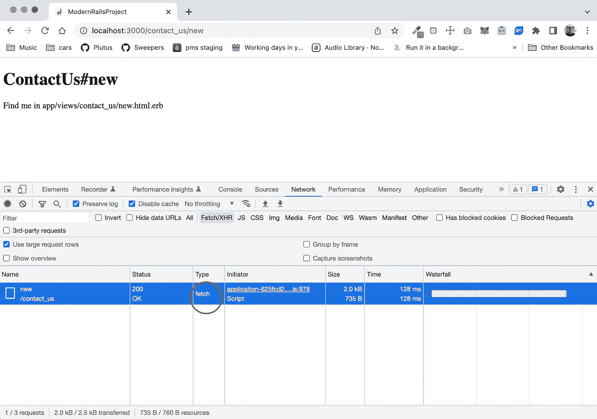
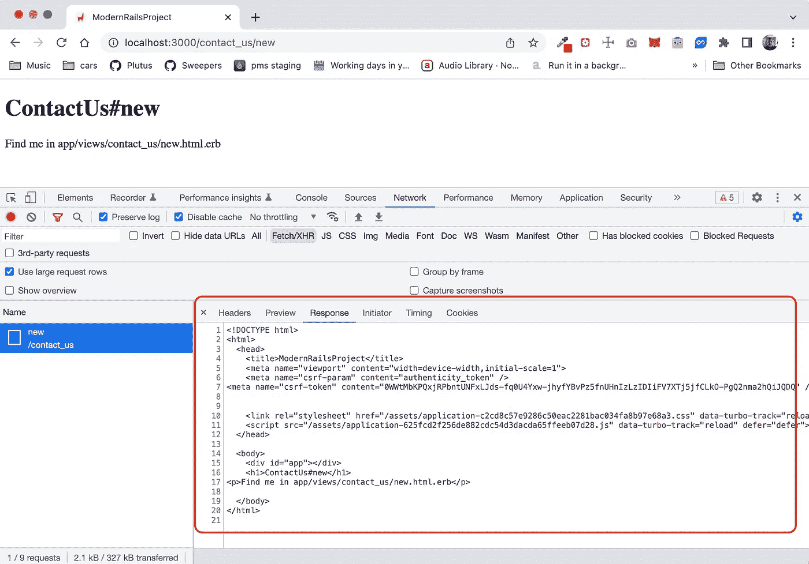
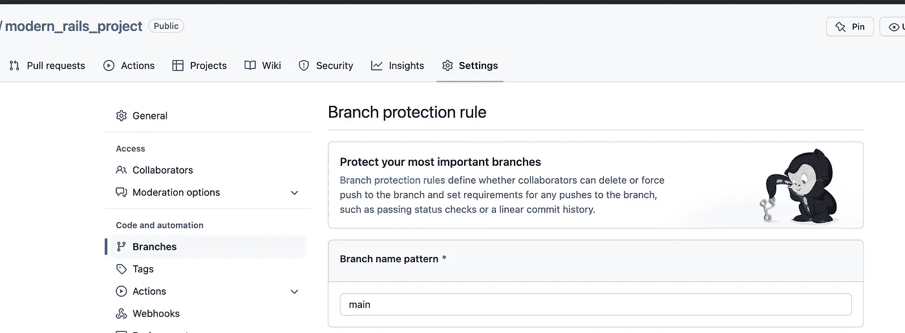

# 使用 Rails 的现代开发

> 原文：<https://levelup.gitconnected.com/modern-development-with-rails-d9c6cf929ff6>

使用 Ruby on Rails 的全栈现代开发


图片由来自 [Pixabay](https://pixabay.com//?utm_source=link-attribution&amp;utm_medium=referral&amp;utm_campaign=image&amp;utm_content=1335737) 的 [Andreas Riedelmeier](https://pixabay.com/users/riedelmeier-130476/?utm_source=link-attribution&amp;utm_medium=referral&amp;utm_campaign=image&amp;utm_content=1335737) 拍摄

Ruby on Rails 是一个奇妙的 Web 框架，被大大小小的许多公司所使用。

在这篇文章中，我将一步步向你展示我是如何建立一个 Ruby on Rails 项目的。你将会很好地了解如何将现代工具整合到整个堆栈中。

特别是，除了 Ruby on Rails 项目的标准后端内容之外，我们还将接触以下内容:

*   用 [asdf](https://asdf-vm.com/) 进行版本管理。
*   [在浏览器中运行的所有 JavaScript 语言的类型脚本](https://www.typescriptlang.org/)。
*   与 [esbuild](https://esbuild.github.io/) 的 JavaScript 捆绑。
*   [Foreman](https://github.com/ddollar/foreman) 用于引导您的开发和生产环境。
*   [热线](https://hotwired.dev/)工具[涡轮](https://turbo.hotwired.dev/)和[刺激](https://stimulus.hotwired.dev/)用于轻量级 SPA 开发。
*   [CSS 框架的引导](https://getbootstrap.com/)。
*   Rubocop 在 Ruby 代码库中应用最佳实践。
*   [ESLint](https://eslint.org/) 用于查找代码中的 JavaScript/TypeScript 问题。
*   [更漂亮的](https://prettier.io/)用于格式化我们的 JavaScript/TypeScript 代码。
*   [过量使用](https://github.com/sds/overcommit)来扩展 Git 挂钩。
*   用于编写整个堆栈的规范。
*   [Github 动作](https://github.com/features/actions)持续集成流程。
*   用于错误管理的 [Sentry](https://sentry.io) 安装和配置。
*   Heroku 部署

注意:本指南是使用 macOS Monterey 开发的。

我们开始吧。

# 项目的源代码

为本文构建的示例项目[在这里](https://github.com/pmatsinopoulos/modern_rails_project)公开。

# 版本管理器— asdf

我使用 [asdf](https://asdf-vm.com/) 作为我的大多数开发工具的版本管理器，我需要为不同的项目保持不同的版本。

# Nodejs

使用`asdf`安装 Nodejs。

```
$ asdf install nodejs 18.7.0
```

# 故事

使用`asdf`安装`yarn`:

```
$ asdf plugin add yarn
$ asdf install yarn latest
```

# 红宝石

使用`asdf`安装 Ruby。

```
$ asdf plugin add ruby
$ asdf install ruby 3.1.2
```

# 使用最新版本的工具启动 shell

确保`asdf current`打印最新版本的 Nodejs、Ruby 和 Yarn:

```
$ asdf current
nodejs          18.7.0
ruby            3.1.2
yarn            1.22.19
```

否则`shell`按要求进行:

```
$ asdf shell nodejs 18.7.0
$ asdf shell ruby 3.1.2
$ asdf shell yarn 1.22.19
```

# 打包机

安装`bundler`。如果您已经安装了该软件，请确保安装了最新版本的

```
$ gem update bundler
```

# 安装 rails 宝石

Ruby on Rails 是一块宝石。安装它。

```
$ gem install rails
```

# 开始一个新的 Rails 项目

安装了`rails`之后，我可以调用创建新 Rails 项目的命令。

*   我将使用 Postgres 作为我的数据库
*   对于资产管道，我将使用[传动轴](https://rubygems.org/gems/propshaft)。
*   我将跳过测试，只是因为我喜欢使用 [RSpec](https://github.com/rspec/rspec-rails) ，但是您也可以使用 Rails 附带的测试。他们也很好。
*   对于 JavaScript bundler，我将使用 [esbuild](https://esbuild.github.io/) 。
*   对于 CSS，我将使用[引导](https://getbootstrap.com/)。

最初，我将跳过捆绑和 Rails 提供的其他自动安装过程，只手动一步一步地进行。通常，我不会想那么做，或者说我没有任何理由。但我只是出于教育原因才这么做的。一步一步地完成剩下的设置过程会让我更好地理解它。

因此，启动项目设置的命令将是:

```
$ rails new my_awesome_project --database=prostgresql \
--assets-pipeline=propshaft \
--skip-test \
--skip-system-test \
--javascript=esbuild \
--css=bootstrap \
--skip-bundle
```

注意:我将我的新项目命名为`my_awesome_project`。显然，你可以使用任何你喜欢的名字。

*注意*:在接下来的不同步骤之间，我将把项目的状态签入 git。这非常有用，如果我愿意，我可以随时返回，更好地理解每一步实际上做了什么。这些代码检入，我称之为 *Git 检查点*。

# 捆

我 cd 到新创建的文件夹:

```
$ cd my_awesome_project
```

而我

```
$ bundle
```

这将安装所有在`Gemfile.`中定义的 gem

*Git 检查站:*

```
$ git add .
$ git commit -m "Initial Commit after rails new and manual bundle"
```

# VS 代码

对于那些使用其他 IDE 的人，他们可以跳过这一部分。

但是对于那些使用 VS 代码的人来说，他们可以在 VS 代码中打开`my_awesome_project`并可能创建一个新的 VS 代码工作区。我喜欢使用 VS 代码工作区，因为它们允许我在项目中添加许多文件夹。

那么，在这种情况下，我将不得不忽略特定于 VS 代码的文件夹和文件，比如`.vscode`和`*.code-workspace`。

这是`.gitignore`文件的状态:

第 33–35 行是为 VS 代码添加的。

*Git 检查点:*

```
$ git add .
$ git commit -m "Ignore Visual Studio Code Files"
```

# asdf 的引脚节点、Yarn 和 Ruby 版本

确保`asdf`知道在你的项目文件夹中使用哪个版本的 Node、Yarn 和 Ruby。

```
$ asdf local nodejs 18.7.0
$ asdf local yarn 1.22.19
$ asdf local ruby 3.1.2
```

*Git 检查点:*

```
$ git add .tool-versions
$ git commit -m "Pin Node, Yarn and Ruby versions for 'asdf'"
```

# JavaScript Bundler — esbuild

下一步是安装 JavaScript bundler。我会用 [esbuild](https://esbuild.github.io/) 。

```
$ bin/rails javascript:install:esbuild
```

从输出中可以看出，这个命令做了很多事情，但最重要的是:

*   它创建了文件`bin/dev`，我将用它来启动我的开发环境。它依赖于 [foreman](https://github.com/ddollar/foreman) ，这是一个基于`Procfile`规范管理运行环境的工具。
*   它创建文件`Procfile`供`bin/dev`使用。

```
web: bin/rails server -p 3000
js: yarn build --watch
```

`yarn build --watch`将调用我的`package.json`文件中定义的`build`脚本。它将允许我自动调用`esbuild`来修改 JavaScript 文件的内容。

*   它创建包含以下内容的`package.json`文件:

```
{
  "name": "app",
  "private": "true",
  "dependencies": {
    "esbuild": "^0.15.3"
  },
  "scripts": {
    "build": "esbuild app/javascript/*.* --bundle --sourcemap --outdir=app/assets/builds --public-path=assets"
  }
}
```

*   它创建文件夹`app/assets/builds`，其中将存储`esbuild`生成的文件。
*   它创建了一个空文件`app/javascript/application.js`，这将是我所有 JavaScript 代码的入口点。这是`esbuild`将解析的内容，以在`app/assets/builds`中生成 JavaScript 输出。
*   我需要在`app/views/layouts/application.html.erb`中添加必要的`javascript_include_tag`。这将引用生成的 js 文件以及所有 JavaScript 生成的代码:

```
<%= javascript_include_tag "application", "data-turbo-track": "reload", defer: true %>
```

*Git 检查点:*

```
$ git add .
$ git commit -m "After installing 'esbuild'"
```

# 一个小的 JavaScript 例子

在继续之前，我编写一个小的 JavaScript 示例来见证 JavaScript 的正确设置。

这是:

## 欢迎控制器

`app/controllers/welcome_controller.rb`:

## 一些简单的 JavaScript 逻辑

`app/javascript/application.js`:

这段代码将定位 id 为`app`的元素，并将插入一个 HTML `<strong>`元素作为其内部 HTML。此外，它导出一个对象。我将展示如何访问导出的所有内容。

## 为导出设置全局命名空间

我通过添加选项`--global-name myAwesomeProject`来更改`package.json`中的`build`脚本。：

```
"build": "esbuild app/javascript/*.* --bundle --sourcemap --outdir=app/assets/builds --public-path=assets --global-name=myAwesomeProject"
```

稍后，我将在下面展示如何使用它。

## 布局中的 HTML 元素

我将下面的 HTML 元素作为`body`的第一个子元素添加到`app/views/layouts/application.html.erb`中:

```
<div id="app"></div>
```

## 欢迎索引操作的视图

我添加文件`app/views/welcome/index.html.erb`，内容如下:

## 路线配置

我确保 routes 将`/`发送到欢迎索引:

## 在开发中运行

就这样。我准备在我的 Rails 项目中见证这个小小的 JavaScript 魔术。

**确保我的本地 Postgres 服务器正在运行**

如果你没有安装 Postgres，你可以使用像 [this](https://postgresapp.com/) 这样的向导在本地安装。

**准备数据库**

随着本地 Postgres 的启动和运行，我在 shell 中运行以下命令:

```
$ bin/rails db:prepare
```

这将创建开发和测试数据库。

**启动开发服务器**

```
$ bin/dev
```

然后服务器启动后，我访问页面 [http://localhost:3000](http://localhost:3000) 。


浏览到本地服务器

我会去看 **Hello World！**短语，它是`app/javascript/application.js`中 JavaScript 代码的结果

同样，如果我打开开发者工具控制台并输入`myAwesomeProject`，我将可以访问由相同的 JavaScript 代码`module.exports`在相同的`app/javascript/application.js`文件中导出的对象。


在控制台中打印 myAwesomeProject

*Git 检查点:*

```
$ git add .
$ git commit -m "Implementing a small JavaScript example code"
```

我继续其余的设置。

# 设置类型脚本

现代 JavaScript 开发意味着 [TypeScript](https://www.typescriptlang.org/) ，至少在我看来是这样。

因此，让我们看看如何引入 TypeScript 支持。

## 添加必要的包

```
$ yarn add typescript tsc-watch --dev
```

## 创建最低配置文件

```
$ tsc --init
```

上面的命令创建了一个`tsconfig.json`文件。

## 按照 esbuild 的建议进行配置更改

根据 esbuild，必须对`tsconfig.json`文件做一些最小的修改:

1.  `declaration : false`
2.  `noEmit: true`
3.  `isolatedModules: true`
4.  `esModuleInterop: true`

请注意，我将`noEmit`设置为`true`。TypeScript 编译器将解析并编译`ts`文件，但不会在编译过程之外生成`.js`文件。这将是`esbuild`工具。

*Git 检查点:*

```
$ git add .
$ git commit -m "After having installed and configured TypeScript"
```

## 将代码转换为类型脚本

现在我已经设置了 TypeScript，我做了一些更改，以便在示例代码中包含 TypeScript 代码:

**重命名**

我将文件`app/javascript/application.js`重命名为`app/javascript/application.ts`，并相应地修改内容:

如您所见，我添加了一些类型脚本代码来证明这一点。

**改编** `**package.json**`

我将`package.json`中的`"scripts"`命令改为使用`tsc-watch`。这就是现在的`"scripts"`部分:

*   最初的脚本`build`现在是`build:js`，因此它的名字揭示了它的目的，只构建 JavaScript 代码。稍后我将介绍构建`CSS`代码的`build:css`。
*   我仍然需要`build`脚本，因为它在资产预编译后被`jsbundling-rails` gem 自动调用来构建 JavaScript。
*   我引入了`failure:js`，如果有一个类型脚本编译错误，它将删除`esbuild`生成的文件。
*   我介绍一下`dev`的剧本，叫`tsc-watch`。在开发过程中，这将持续编译`*.ts`文件，并根据编译结果调用`esbuild`或不调用。

**改变** `**Procfile.dev**`

我将`Procfile.dev`改为调用`yarn dev`而不是`yarn build --watch`。

```
web: bin/rails server -p 3000
js: yarn dev
```

**生成 ES2022 模块**

我修改了`tsconfig.json`文件，这样它就能理解并生成`es2022`兼容的模块。

```
"compilerOptions": {
  ...
  "module": "ES2022",
  ...
},
```

**模块解析策略**

我在`tsconfig.json`文件中将模块解析策略设置为`node`。

```
"compilerOptions": {
  ...
  "moduleResolution": "node",
  ...
},
```

这是使用 TypeScript 时推荐的策略。

**型检查为** `**null**` **和** `**undefined**`

我启用了对`null`和`undefined`类型的严格检查。在`tsconfig.json`文件中:

```
"compilerOptions": {
  ...
  "strictNullChecks": true,
  ...
},
```

当`strictNullChecks`为`false`时，`null`和`undefined`被语言有效忽略。这可能会导致运行时出现意外错误。

当`strictNullChecks`是`true`时，`null`和`undefined`有它们自己不同的类型，如果你试图在需要具体值的地方使用它们，你会得到一个类型错误。

**包括/排除哪些文件**

在里面，我指定包含哪些文件，排除哪些文件。

```
{
  "compilerOptions": {
    ...
  },
  "include": ["app/javascript/**/*.ts"],
  "exclude": ["**/*.spec.ts", "node_modules", "vendor", "public"],
  ...
}
```

**保存时不编译**

这对于关闭很有用，因为如果打开，它可能会被 IDE 使用(例如 Visual Studio 代码)。因为我使用了`ts-watch`，所以我不需要这个标志。在`tsconfig.json`文件中:

```
{
  "compilerOptions": {
    ...
  },
  ...
  "compileOnSave": false
}
```

就是这样！

**在开发中运行**

有了这些更改，我就可以运行开发环境了:

```
$ bin/dev
```

然后访问页面 [http://localhost:3000](http://localhost:3000) 。我会看到这个


浏览器显示打字稿后的页面

我已经启用了 TypeScript，我的应用程序像以前一样工作，没有任何问题。

尝试更改文件`app/javascript/application.ts`的内容并重新加载页面。你会看到变化的反映。

*Git 检查点:*

```
$ git add .
$ git commit -m "With a TypeScript application.ts entrypoint"
```

# 涡轮

现代 Rails 开发包括一套工具，统称为 [Hotwire](https://hotwired.dev/) 。

*注意*:这篇博文的目的不是教你什么是 Hotwire 和个人工具。Hotwire 网站上的文档非常好。

我将使用的第一个热线工具是[涡轮](https://turbo.hotwired.dev/)。

## 安装 Turbo

我运行以下命令来安装 Turbo:

```
$ bin/rails turbo:install
```

其结果如下:

**安装** `**redis**` **宝石**

`Gemfile`变更为包含`redis`宝石。Redis 有必要通过[动作索](https://guides.rubyonrails.org/action_cable_overview.html)支持[涡轮流](https://turbo.hotwired.dev/handbook/streams)。

**动作电缆开发配置**

文件`config/cable.yml`被更改为在`development`环境中使用`redis`适配器。这样做是因为现成的`async`适配器不支持 Turbo 流。

更改规定 redis 应该在端口`6379`上本地运行。确保您的开发机器上运行了 redis。

```
development:
  adapter: redis
  url: redis://localhost:6479/1
...
```

**包**包`**@hotwired/turbo-rails**`

在`package.json`中添加了对`@hotwired/turbo-rails`的 npm 依赖。软件包也已经安装好了。

**导入**

命令`bin/rails turbo:install`未能在 JavaScript 入口点内添加一行来导入`@hotwired/turbo-rails`，因为它试图在不存在的文件`app/javascript/application.js`上做这件事。

打开您的`app/javascript/application.ts`文件，然后导入:

```
// Entry point for the build script in your package.json
import '@hotwired/turbo-rails'const appElement = document.getElementById('app')
if (appElement) {...
```

我已经成功安装了 Turbo。

*Git 检查点:*

```
$ git add .
$ git -m "After installing Turbo and importing in the Javascript entrypoint"
```

# 一个小型 Turbo 示例— Fetch

现在，让我们编写一个小的 Turbo 示例来证明一切正常。

首先，我将向欢迎页面添加一个链接，向用户显示一个联系我们表单。

## **添加路线**

打开`config/routes.rb`文件，添加新路线:

## **添加控制器**

创建包含以下内容的文件`app/controllers/contact_us_controller.rb`:

## **添加视图**

创建包含以下内容的文件`app/views/contact_us/new.html.erb`:

## **联系我们的链接**

编辑文件`app/views/welcome/index.html.erb`并添加到`"Contact Us"`的链接。

## **跑去看**

使用以下命令启动服务器

```
$ bin/dev
```

并访问页面 [http://localhost:3000](http://localhost:3000) 。你会看到这个:


如果您点击链接[联系我们](http://localhost:3000/contact_us/new)，它将加载联系我们视图的内容。这没什么大不了的，也不能证明涡轮增压是可行的。但是，如果您在 developer tools Network 选项卡打开的情况下单击链接，您将会看到浏览器没有使用 HTTP GET 请求来请求完整的页面内容。它试图使用一个`Fetch/Ajax`调用来检索内容。



我把这种魔力归功于 Turbo，它拦截链接点击并发送获取请求。

这样做的“问题”是我没有从这种技术中得到太多。这是因为 Rails 后端无论如何都会用整个页面的 HTML 内容进行响应:



Rails 用整个页面的 HTML 内容来响应

因此，这并不是 Turbo 所能做的全部。让我们看另一个例子。

但是首先，一个

*Git 检查点:*

```
$ git add .
$ git commit -m "Turbo example that uses Fetch to get the content of an page visit"
```

# 第二个 Turbo 示例—框架

我将要使用的第二个 Turbo 示例展示了 [Turbo 帧](https://turbo.hotwired.dev/handbook/frames)的强大功能。

我将依赖于前一个例子的联系我们。

## **编辑联系我们视图模板**

将联系我们视图模板(`app/views/contact_us/new.html.erb`)的内容更改如下:

将欢迎视图模板(`app/views/welcome/index.html.erb`)中的`"Contact Us"`链接包装到一个涡轮框架中，如下所示:

## 跑去看

现在用以下命令启动 rails 服务器

```
$ bin/dev
```

然后访问 [http://localhost:3000](http://localhost:3000) 。当您点击“联系我们”时，您将看到`fetch`请求只返回一个 HTML 片段，即在`app/views/contact_us/new.html.erb`中的那个。不是整个页面:


只返回一个 HTML 片段

Turbo 识别出响应中有一个`turbo-frame`，并替换匹配`turbo-frame`的页面内容。

酷！不是吗？没有编写一行 JavaScript，我的应用程序就变成了一个 SPA。

不仅如此，我还可以为 Turbo 流演示一个例子。

但是，首先:

*Git 检查站:*

```
$ git add .
$ git commit -m "Turbo Frames Example"
```

# 第三个 Turbo 示例—流

这个例子演示了 Turbo 帧和 Turbo 流。

## 创建消息模型

让我们快速创建一个模型`Message`:

```
$ bin/rails generate model Message content:string
  invoke  active_record
      create    db/migrate/20220819064914_create_messages.rb
      create    app/models/message.rb
$ bin/rails db:migrate
```

## 扩展联系我们表单以保存消息

文件`app/views/contact_us/new.html.erb`现在有了一个`form_for`片段，允许用户键入表单。

内部带有表格的联系我们视图

## 路线

我需要一对夫妇的路线，这种形式的工作。文件:`config/routes.rb`

我添加了第 5 行和第 6 行。

## `ContactUsController`

`ContactUsController`(文件:`app/controllers/contact_us_controller.rb`)现在支持上述路线如下:

## 部分呈现消息

当我创建一个新消息时，我渲染了部分`app/views/contact_us/_message.html.erb`:

## 消息列表

我更新了欢迎视图(`app/views/welcome/index.html.erb`)以显示消息列表:

和实例化`@messages`的`WelcomeController`。文件`app/controllers/welcome_controller.rb`:

## 跑去看

一切准备就绪。当你启动服务器并访问页面 [http://localhost:3000，](http://localhost:3000,)你可以点击联系然后添加消息。您将在欢迎页面的底部看到它们的显示方式。


消息出现在欢迎页面的底部

我将用第四个例子来完成 Turbo 示例，这个例子证明我的设置是正确的，这个例子将 WebSockets 与 Turbo 流结合在一起。

但是首先，

*Git 检查点:*

```
$ git add .
$ git commit -m "Example Using Turbo Frames and Turbo Streams"
```

# 第四个 Turbo 示例—使用 Web 套接字的流

这将会很快。每次创建新消息时，我都会使用 ActionCable 通过 WebSockets 广播消息。这将允许不同的浏览器标签被通知新的消息内容。

## 消息创建广播

我增强了`app/models/message.rb`以在新消息提交到数据库后广播 ActionCable 消息。

您可以看到，每次创建新消息时，我都会发布到`messages`频道。

## 欢迎页面订阅 ActionCable

欢迎页面需要订阅 ActionCable `messages`频道。

我们补充如下:

```
<%= turbo_stream_from "messages" %>
```

文件的开头`app/views/welcome/index.html.erb`。

一切准备就绪。

## 跑去看

启动 rails 服务器，加载两个带有页面 [http://localhost:3000 的选项卡。](http://localhost:3000.)在一个选项卡上创建消息时，它会出现在两个选项卡的底部。


消息出现在两个选项卡中

*Git 检查点:*

```
$ git add .
$ git commit -m "Turbo Streams Example With WebSockets"
```

我继续…

# 刺激物

[Stimulus](https://stimulus.hotwired.dev/) 是现代 Rails 开发热线工具套件中的第二个工具。这是 JavaScript 工具，我将需要添加动态到我的页面上现有的服务器提供的 HTML。

## 安装刺激

让我们安装它。

```
bin/rails stimulus:install
```

这个命令添加了`@hotwired/stimulus` npm package.json，下载并使用`yarn.`安装它

然后，它自动创建文件夹`app/javascript/controllers`,里面有三个文件:

*   `index.js`这是所有刺激控制器的导入点。
*   `application.js`哪个负责实例化刺激应用。
*   `hello_controller.js`这是一个样本刺激控制器。

## 刺激的打字稿

我将把文件`app/javascript/controllers/index.js`和`app/javascript/controllers/application.js`保留为 JavaScript 文件，因为`bin/rails stimulus:*`命令希望它们找到的是`*.js`文件，而不是`*.ts`文件。然而，在整个激励应用程序的过程中，这些文件很少被触及，只是为了配置应用程序的引导方式以及注册新的控制器。

但是，我将把`app/javascript/controllers/hello_controller.js`重命名为`*.ts`文件。

```
$ mv app/javascript/controllers/hello_controller.js app/javascript/controllers/hello_controller.ts
```

## 导入控制器

然后我需要在 JavaScript 入口点中导入所有的刺激控制器。将文件`app/javascript/application.ts`修改如下:

```
// Entry point for the build script in your package.jsonimport '@hotwired/turbo-rails'
import './controllers'...
```

上面的第二行导入了刺激控制器。

## 让 Hello 控制器工作

让我们更改 HTML 以附加 Hello 刺激控制器:

文件:`app/views/layouts/application.html.erb`

请看上面的第 14 行。这就是我如何附上控制器。此外，我还添加了第 15 行作为刺激控制器目标。这是我将要插入问候消息的地方。

然后删除以下行:

```
const appElement = document.getElementById('app')if (appElement) {
  appElement.innerHTML = '<strong>Hello World with TypeScript!</strong>'
}
```

来自`app/javascript/application.ts`的文件。他们不需要它。我将这部分移到 Hello 刺激控制器中。

因此，文件`app/javascript/controllers/hello_controller.ts`变成了:

我不打算详述我如何编写刺激控制器和如何使用刺激目标，也不打算详述我如何集成 TypeScript。所有这些都在[刺激文件](https://stimulus.hotwired.dev/handbook/introduction)中有很好的记录。

## 跑去看

一切准备就绪。用`bin/dev`启动开发服务器，访问页面 [http://localhost:3000。](http://localhost:3000.)它仍然像以前一样工作，但是页面的`<strong>...</strong>`部分的动态更新将由 Hello Stimulus 控制器来完成。您也将能够看到`"Hello Controller Connected"`控制台消息。


刺激控制器体验

在我继续之前，让我们…

*Git 检查点:*

```
$ git add .
$ git commit -m "Install Stimulus and build on the Hello Controller Example"
```

# CSS —自举案例

通过用于 Rails 的 [CSS 绑定](https://github.com/rails/cssbundling-rails)，Rails 可以与许多不同的 CSS 处理器和绑定器集成。

我选择用[自举](https://getbootstrap.com)。

## 安装引导程序

运行以下命令:

```
$ bin/rails css:install:bootstrap
```

这个命令做各种有用的事情:

*   它会安装必要的 npm 软件包:

1.  `@popperjs/core`
2.  `bootstrap`
3.  `bootstrap-icons`
4.  `sass`

*   它创建了一个新的 npm/yarn 脚本，该脚本将使用`sass`可执行文件将 SCSS 转换为 CSS:

```
"build:css": "sass ./app/assets/stylesheets/application.bootstrap.scss:./app/assets/builds/application.css --no-source-map --load-path=node_modules"
```

*   它在`Procfile.dev`文件中增加了一个条目:

```
css: yarn build:css --watch
```

这将确保您的开发环境通过监视 SCSS 文件并在每次文件内容改变时调用`build:css` npm 脚本，持续地将您的 SCSS 代码转换成 CSS。

*   它修正了`config/initializers/assets.rb`以包括

```
Rails.application.config.assets.paths << Rails.root.join("node_modules/bootstrap-icons/font")
```

这包括作为资产文件夹一部分的`node_modules/bootstrap-icons/font`文件夹。

*   它删除了`app/assets/stylesheets/application.css`文件。
*   它创建了包含以下内容的文件`app/assets/stylesheets/application.bootstrap.scss`:

这个文件是 CSS 编译和捆绑的入口点。

## 更改 CSS 绑定以导出地图

由于`--no-source-map`，添加到`package.json`的`"build:css"`脚本不会导出源文件。我们移除了这面旗帜。

```
"build:css": "sass ./app/assets/stylesheets/application.bootstrap.scss:./app/assets/builds/application.css --load-path=node_modules"
```

## 引导 JavaScript

为了整合 Bootstrap JavaScript 特性，需要在 JavaScript 入口点`app/javascript/application.ts`中导入 Bootstrap:

`import 'bootstrap'`完成了这个任务。

在开始小型引导程序演示之前，让我们

*Git 检查点:*

```
$ git add .
$ git commit -m "Install Bootstrap and Import in entry points"
```

# 演示引导

让我们给我们的演示项目添加一些引导的味道。它将证明 CSS 和 JavaScript 都是可行的。

在文件`app/views/welcome/index.html.erb`的开头添加以下 HTML/ERB 代码片段。

## 跑去看

用`bin/dev`启动服务器，访问页面 [http://localhost:3000。](http://localhost:3000.)您将看到 Bootstrap 风格的下拉菜单，它响应点击事件(多亏了 Bootstrap JavaScript)并显示一个选项列表。像这样:


带下拉菜单的引导程序

*Git 检查点:*

```
$ git add .
$ git commit -m "Add a Bootstrap HTML fragment"
```

# 测试框架

做`rails new`的时候没有安装测试框架。我继续安装 [RSpec](https://rubygems.org/gems/rspec) 。

## 安装 RSpec

修改`Gemfile`以参照 [RSpec 导轨](https://rubygems.org/gems/rspec-rails)如下:

```
...
group :development, :test do
  ...
  gem "rspec-rails", "= 6.0.0.rc1"
  ...
end
...
```

然后:

```
$ bundle
$ bundler binstubs rspec-core
```

然后

```
$ bin/rails generate rspec:install
```

它生成必要的 RSpec 文件夹和文件。

## 配置 RSpec 格式输出

我喜欢看到 RSpec runner 以文档格式输出。这就是为什么我要确保`.rspec`有以下内容:

```
--require spec_helper
--format documentation
```

## 测试实践

如果你想学习如何为 Ruby on Rails 项目编写测试，你可以从这里的[开始。本指南包含了从单元测试到两端测试的所有内容。](https://github.com/rspec/rspec-rails)

*Git 检查点:*

```
$ git add .
$ git commit -m "Install and Configure RSpec Rails"
```

# Rubocop

如果我不利用 Rubocop 的力量，Ruby on Rails 项目就不会成功。

## 安装 Rubocop

在`Gemfile`中添加以下条目:

```
group :development, :test do ...
  gem 'rubocop'
  gem 'rubocop-rails'
  gem 'rubocop-rspec'
  ...
end
```

然后

```
$ bundle
$ bundle binstubs rubocop
```

## 初始化 Rubocop

运行命令:

```
$ bin/rubocop --init
```

这将生成文件`.rubocop.yml`，它基本上是空的。

我把以下内容放在里面:

```
require:
  - rubocop-rails
  - rubocop-rspecAllCops:
  NewCops: enableStyle/Documentation:
  Enabled: false
```

## 运行 Rubocop 并修复

安装并配置 Rubocop 后，我运行:

```
$ bin/rubocop -A
```

这将自动修复大部分的罪行。

然后我再运行一次，看看哪些是没有修复的。

```
$ bin/rubocop -A
Inspecting 30 files
.....C........................Offenses:app/controllers/contact_us_controller.rb:10:3: C: Metrics/MethodLength: Method has too many lines. [12/10]
  def create ...
  ^^^^^^^^^^
app/controllers/contact_us_controller.rb:20:23: C: Rails/I18nLocaleTexts: Move locale texts to the locale files in the config/locales directory.
      flash[:error] = 'Cannot save message'
                      ^^^^^^^^^^^^^^^^^^^^^30 files inspected, 2 offenses detected
```

我现在禁用了`Metrics/MethodLength`和`Rails/I18nLocaleTexts`，因为这只是一个演示项目。我将不得不决定到底服从哪个警察。

在文件`app/controllers/contact_us_controller.rb`中，我在方法`def create`的开始禁用了这些警察，然后在结束时又启用了它们:

```
# rubocop: disable Metrics/MethodLength, Rails/I18nLocaleTexts
def create
...
end
# rubocop: enable Metrics/MethodLength, Rails/I18nLocaleTexts
```

然后我再次运行`bin/rubocop -A`，我看到一切都成功通过:

```
$ bin/rubocop -A
Inspecting 30 files
..............................30 files inspected, no offenses detected
```

*Git 检查点:*

```
$ git add .
$ git commit -m "Add Rubocop and Automatically fix the errors"
```

Rubocop 将编码标准保持在 Ruby 级别。但是在 JavaScript 层面呢？为此，我们加入了 [ESLint](https://eslint.org/) 和[更漂亮的](https://prettier.io/)。

# 埃斯林特

[ESLint](https://eslint.org/) 在 JavaScript 和 TypeScript 代码中发现问题。

## 安装 ESLint

```
$ yarn add eslint --dev
```

## 初始化 ESLint

初始化 ESLint 的命令是:

```
$ yarn eslint --init
```

它将首先安装软件包`[@eslint/create-config](http://twitter.com/eslint/create-config)@0.3.1`。

然后它会开始问一些问题，我回答如下:

✔:你喜欢用 ESLint 吗？✔，你的项目使用什么类型的模块？esm
✔:你的项目使用哪个框架？✔，你的项目使用打字稿吗？✔，你的代码在哪里运行？✔你希望你的配置文件是什么格式？Java Script 语言

然后它会安装软件包:

*   `[@typescript](http://twitter.com/typescript)-eslint/eslint-plugin@latest`
*   `[@typescript](http://twitter.com/typescript)-eslint/parser@latest`

注意，我没有配置 ESLint 来重新格式化代码。仅用于检查语法问题。这就是为什么我回答了*问题*关于*你想如何使用 ESLint？*。

该流程生成如下所示的`.eslintrc.js`文件:

## 告诉 ESLint 忽略

我创建了一个名为`.eslintignore`的文件，在这个文件中，我指定了我希望`eslint`在林挺时忽略的文件和文件夹模式。

## 运行 ESLint

运行`eslint`来检查是否有你需要修复的东西:

```
$ yarn eslint .
```

你不应该得到任何错误。

## 构建以使用 ESLint

增强`"build"`脚本以调用`eslint`检查。下面是我建议的`package.json`文件的新`"scripts"`:

除了`"build"`的台词，我还添加了脚本`"eslint:check"`。

Git 检查站:

```
$ git add .
$ git commit -m "ESLint installed and configured"
```

# 较美丽

[更漂亮](https://prettier.io/)用于格式化 JavaScript 和 TypeScript 代码文件。

## 安装更漂亮

```
$ yarn add --dev --exact prettier
```

## 配置文件

创建一个空的漂亮的配置文件:`.prettierrc.json`。其内容应该是:

```
{}
```

## ESLint 集成

为了让更漂亮的人和埃斯林特(ref:[https://prettier.io/docs/en/integrating-with-linters.html](https://prettier.io/docs/en/integrating-with-linters.html))跳得更好，我必须加上这个包`eslint-config-prettier`。

```
$ yarn add eslint-config-prettier --dev
```

然后，我需要编辑`eslint`配置文件`.eslintrc.js`来引用正确的漂亮插件:


将“更漂亮”添加到 ESLint 配置中

## 忽略文件夹和文件

创建包含以下内容的文件`.prettierignore`:

```
app/assets/builds
.eslintrc.js
*.md
```

## 检查配置

运行命令:

```
$ npx eslint-config-prettier app/javascript/application.ts
No rules that are unnecessary or conflict with Prettier were found.
```

这应该表明没有不必要的或冲突的规则。在这里阅读更多关于这个[的内容。](https://github.com/prettier/eslint-config-prettier#cli-helper-tool)

*Git 检查点:*

```
$ git add .
$ git commit -m "Installed and configured Prettier"
```

# 为 ESLint 和 Prettier 改编构建脚本

现在我已经设置了`eslint`和`prettier`，我需要修改`"build"`和`"build:css"`脚本，如果`eslint`或`prettier`失败，它们也会失败。

## `Procfile.dev`

我将`Procfile.dev`更改如下:

```
web: bin/rails server -p 3000
js: yarn dev
css: yarn build:css:dev
```

第三行已被修改，引用了`package.json`文件的`"scripts"`部分中的一个新条目。

## 脚本更新

`package.json`文件的`"scripts"`部分变成:

用于`"build"`的 3 号线现在也在呼叫更漂亮的支票。

第 10 行现在是`"build:css:dev"`，它是在运行开发环境时被`Procfile.dev`调用的。这不叫漂亮。在我的例子中，我已经将 pretty 与我的 VS 代码集成在一起，每当我保存一个文件时，pretty 会根据规则自动修改文件内容的格式。

`"build:css"`是构建 CSS 资产时调用的脚本。这是在调用`yarn build:sass`之前要求更漂亮地检查`*.scss`文件，这将把`*.scss`转换成`*.css`。

就是这样。

## 按需运行 ESlint 和 beauty

在检查整个变化之前，让我们根据需要手动运行`eslint`和`prettier`:

```
$ yarn eslint:check$ yarn prettier:check
```

我不期待`eslint`失败，但我期待`prettier`失败。

让我们修复错误:

```
$ yarn prettier --write .
```

有了固定文件，我可以提交:

*获取检查点:*

```
$ git add .
$ git commit -m "Adapt build scripts and fixed Prettier Errors"
```

# 使承担义务过分

在我的开发环境中，另一个非常重要的工具是[过量使用](https://rubygems.org/gems/overcommit)。这是一个配置和扩展 Git 挂钩的神奇工具。

让我告诉你我如何使用它:

## 安装超量承诺

将宝石`overcommit`添加到`Gemfile`的`development`组内。

然后:

```
$ bundle
$ bundle binstubs overcommit
$ bin/overcommit --install
```

最后一个命令应该告诉您已经成功安装了超量提交。它创建了文件`.overcommit.yml`。

## 配置超量提交以使用 Rubocop、ESLint 和更漂亮

我们希望过量提交，以确保我们提交的代码已经通过了 linters 的所有检查。因此，我们将`.overcommit.yml`内容修改如下:

注意:除了 Rubocop、ESLint 和更漂亮的特定部分，我还添加了一些在提交前需要检查的规则。选择或放弃对你和你的项目更有意义的东西。

*Git 检查点:*

```
$ git add .
$ git commit -m "Overcommit installation and configuration"
```

# 部署到 Heroku

我可以快速地将我的项目推送到 Heroku，并在生产中投入使用。

## 添加 Linux 平台

我需要添加 linux 平台作为支持平台的一部分:

```
$ bundle lock --add-platform x86_64-linux
$ git add Gemfile.lock
$ git commit -m "Add Linux platform in order to deploy to Heroku"
```

## 添加 Procfile

为了生产部署并考虑到 Heroku 使用 foreman，我创建了一个特定于生产的 foreman 配置，文件`Procfile`:

```
web: bundle exec puma -t 5:5 -p ${PORT:-3000} -e ${RACK_ENV:-development}
release: bin/rails db:migrate
```

*Git 检查点:*

```
$ git add Procfile
$ git commit -m "Add Procfile specific for production"
```

## Heroku 应用程序

在使用 Heroku CLI 登录 Heroku 时，我可以使用以下脚本创建 Heroku 应用程序:

```
$ heroku apps:create panos-awesome-project \
--addons=heroku-postgresql:hobby-dev,heroku-redis:hobby-dev,coralogix:free-30mbday,sentry:free \
--region eu
```

正如你所看到的，我正在添加以下插件:

*   `heroku-postgresql:hobby-dev`为 Postgres db。
*   `heroku-redis:hobby-dev`为 Redis db。
*   `coralogix:free-30mbday`用于用 [Coralogix](https://coralogix.com/) 测井。
*   `sentry:free`对于异常和错误记录的集中方法，由[哨兵](https://sentry.io/)执行。

## 部署到生产环境

创建应用程序后，我使用以下命令将代码部署到生产环境中:

```
$ git push heroku
```

## 访问生产页面

运行以下命令打开带有应用程序页面的浏览器:

```
$ heroku apps:open --app panos-awesome-project
```

太棒了。您现在可以看到应用程序正在生产中运行。

# 添加哨兵

Heroku 应用中增加了 Sentry ，但这还不足以让 Sentry 使用。

## 哨兵 DSN

您必须为您的项目找到 SENTRY_DSN。请访问 heroku 仪表板，特别是 Heroku 应用程序资源。

找到哨兵一号，点击访问。


在 Sentry 项目的特定设置中，找到 DSN。


运行命令:

```
$ heroku config:set SENTRY_DSN='[https://f4524b8684ef4731b06fe52fdffad86d@o1371356.ingest.sentry.io/6675531](https://f4524b8684ef4731b06fe52fdffad86d@o1371356.ingest.sentry.io/6675531)' --app panos-awesome-project
```

## 哨兵宝石

给`Gemfile`添加必要的哨兵宝石:

```
gem 'sentry-rails'
gem 'sentry-ruby'
```

然后:

```
$ bundle
```

## 哨兵初始化器

用以下内容创建`config/initializers/01_sentry.rb`:

现在，您的项目已经准备好向 Heroku 应用程序特定的 Sentry 帐户发送错误/异常。

*Git 检查点:*

```
$ git add .
$ git commit -m "Install and Configure Sentry"
```

# 启用运行时动态元数据

命令:

```
$ heroku labs:enable runtime-dyno-metadata --app panos-awesome-project
```

将允许设置一些部署特定的元数据，然后由 Sentry 用来将错误/异常链接到特定的 Heroku 部署。真的有用。

# 使用 Github 部署

另一个很好的工具是在每次提交到`main` branch 时自动部署到生产中。

注意:如果 Github 上没有您的代码，您可以创建一个 repo 并将其定义为项目的`origin`。


转到您的应用程序的 Heroku dashboard 并启用`Github`部署方法。然后链接正确的 Github repo。

然后启用自动部署:


就是这样。然后，每当一个新的提交进入`origin/main`，一个新的部署到您的 Heroku 应用程序将开始。

# 连续累计

我不去的是持续整合的实践。出于这个原因，我加入的一个工具是 [Github Actions](https://github.com/features/actions) 。

让我们在 repo 中创建必要的文件，以便在每次推送到 remote `origin`时合并项目的连续构建。

用以下内容创建文件`.github/workflows/ci.yml`:

这是设置一个名为`CI`的工作流，其中有三个并行运行的作业:

*   `tests`
*   `rubocop`
*   `assets_precompile`

它依赖于您必须创建的另一个文件`.github/actions/install/action.yml`，其内容如下:

上面是一个由主`CI`作业引用和重用的[复合动作](https://docs.github.com/en/actions/creating-actions/creating-a-composite-action)。

此外，`CI`工作`assets_precompile`依赖于秘密`ASSETS_PRECOMPILE_SECRET_KEY_BASE`。你需要在 Github 回购的秘密中注册这个秘密。

首先用以下命令生成一个密码:

```
$ bin/rails secret
```

复制生成的密码并存储在此处:


这就是了。

Git 检查站:

```
$ git add .
$ git commit -m "Github Actions workflow for CI"
```

# 仅当 CI 成功时合并 PRs

CI 就绪后，您应确保仅当 CI 成功时，PRs 才会合并到`origin/main`。

转到 Github 存储库设置，为`main`分支添加一个分支保护规则:



新分支保护规则

然后确保规则*要求在合并*启用前通过状态检查:


合并前要求通过状态检查

现在，当您创建 PR 时，它将运行 CI 工作流作为检查的一部分。在他们通过之前，公关不会被合并。


PR 不可合并

CI 成功后，可以合并 PR:


当检查通过时，请购单可以合并

# 仅在 CI 成功时部署

最后，我希望确保除非 CI 成功通过，否则不会部署任何代码。

转到应用程序的 Heroku 仪表板，并在部署前启用 CI 检查:


在部署之前等待 CI 成功

# 进一步的改进

还有许多实践可以用来改进所有环境(开发、测试和生产)的设置和运行。但这会让这篇长文变得更长。

# 结束语

Ruby on Rails 是一个非常成熟的 Web 开发框架，它解决了全栈问题。这篇文章告诉你我目前启动一个现代 Rails 项目的最小设置。

一如既往，我从你身上学到的比你从我身上学到的要多得多。因此，我非常欢迎你的评论。

# 分级编码

感谢您成为我们社区的一员！在你离开之前:

*   👏为故事鼓掌，跟着作者走👉
*   📰查看[级编码出版物](https://levelup.gitconnected.com/?utm_source=pub&utm_medium=post)中的更多内容
*   🔔关注我们:[推特](https://twitter.com/gitconnected) | [LinkedIn](https://www.linkedin.com/company/gitconnected) | [时事通讯](https://newsletter.levelup.dev)

🚀👉 [**加入升级人才集体，找到一份惊艳的工作**](https://jobs.levelup.dev/talent/welcome?referral=true)