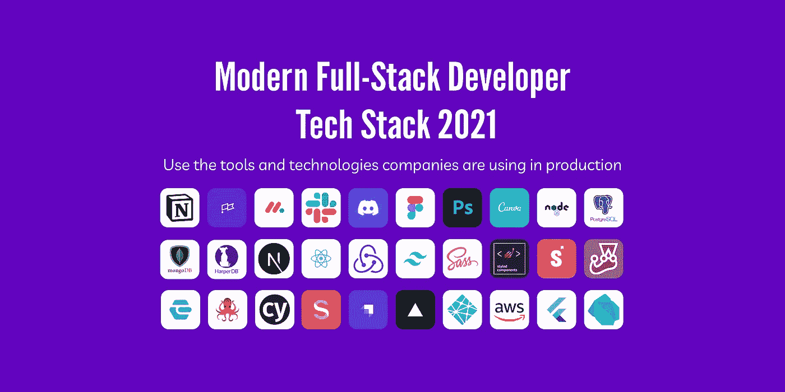

# 现代全栈开发人员技术栈 2021

> 原文：<https://levelup.gitconnected.com/modern-full-stack-developer-tech-stack-2021-69feb9af13f3>

随着新工具和技术的引入，开发人员的技术前景一直在变化。在经历了大量的面试和阅读了无数的职位信息之后，我认为对于 2021 年的 JavaScript 开发者来说，这是一个伟大的现代技术栈。我选择的框架是 React，但是你可以把它换成 Vue，Angular 或 Svelte。

有数不清的工具，所以我将只涵盖一个选择，当结合起来可以用在个人项目或公司。当然，还有许多其他的项目管理工具，例如吉拉、confluence、Trello 和 Asana 等等。这是基于用户的体验和偏好，所以你可以根据自己的喜好随意做一些细微的调整和个人改变。

专注于一套精炼的工具要简单得多，而不是被过多的选择淹没，这使得有抱负的开发人员很难选择一个起点。

# 项目管理

*   [概念](https://www.notion.so/) —用于整体项目管理、文档、笔记和维基
*   [会所](https://clubhouse.io/) / [周一](https://monday.com/) —会所或周一自行管理开发流程。两者都可以合并到 CI/CD 工作流中，因此构建是自动完成的，并且更改会反映在准备和生产 CI/CD 分支中
*   [松弛](https://slack.com/) / [不协调](https://discord.com/)——用于团队之间的沟通

# 设计

*   [Figma](https://www.figma.com/) — Figma 是一款现代的跨平台设计工具，内置了共享和协作功能
*   [Photoshop](https://www.photoshop.com/)/[Canva](https://www.canva.com/)—Photoshop 是从事平面设计工作的行业标准，Canva 是一款出色的图像编辑工具

# 后端

*   [Node.js](https://nodejs.org/en/) —一个流行的现代后端框架
*   一个流行的 SQL 数据库
*   MongoDB——一个流行的 NoSQL 数据库
*   HarperDB —一个流行的混合 NoSQL/SQL 数据库

# 前端

*   [NextJS](https://nextjs.org/) / [创建 React App](https://create-react-app.dev/)/[Redux](https://redux.js.org/)—NextJS 用于生成静态网站或创建 React App 用于使用 Redux 构建标准 React 网站进行状态管理
*   用于编写 CSS 的 Tailwind，因为它是一个现代流行的框架，基本上可以让你避免从头开始编写自己的定制 CSS，从而加快开发工作流程
*   [CSS/SASS](https://sass-lang.com/)/[styled-components](https://styled-components.com/)—这可以用作 Tailwind 的不同选项，为 React 中的组件提供更多定制选项
*   [故事书](https://storybook.js.org/) —这是创建组件的主要构建过程，因为它允许模块化。Storybook 组件是在动态库中独立创建的，可以在整个企业中更新和共享
*   [Jest](https://jestjs.io/) 和 [Enzyme](https://enzymejs.github.io/enzyme/) 、 [React Testing Library](https://testing-library.com/) 和 [Cypress](https://www.cypress.io/) — TDD 在代码和组件被发送到生产和 Cypress 进行端到端测试之前使用单元测试
*   [Sanity](https://www.sanity.io/)/[Strapi](https://strapi.io/)—Sanity 和 Strapi 是无头 CMS，用于通过 GUI(可选工具)发布内容
*   [Vercel](https://vercel.com/)/[Netlify](https://www.netlify.com/)/[AWS](https://aws.amazon.com/)—CI/CD 提供程序与 GitHub 相结合，使得在开发变更时审查和促进变更变得容易

# 移动的

*   [React Native](https://reactnative.dev/)/[Redux](https://redux.js.org/)—React Native 用于创建跨平台移动应用，Redux 用于状态管理
*   [Flutter/Dart](https://flutter.dev/) —用于创建跨平台移动应用的 Flutter 和 Dart