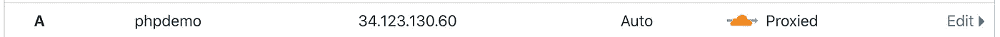
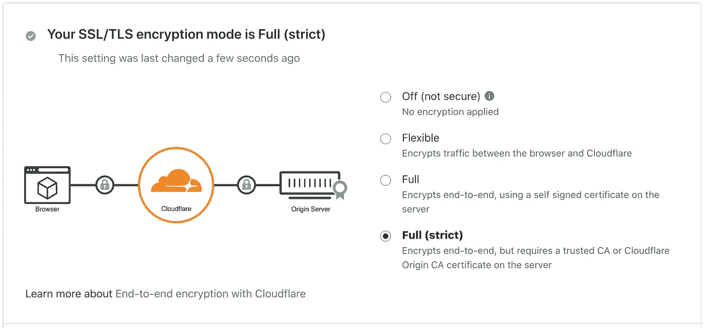
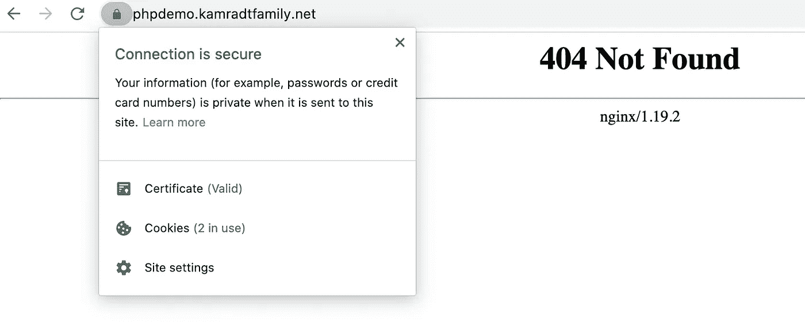
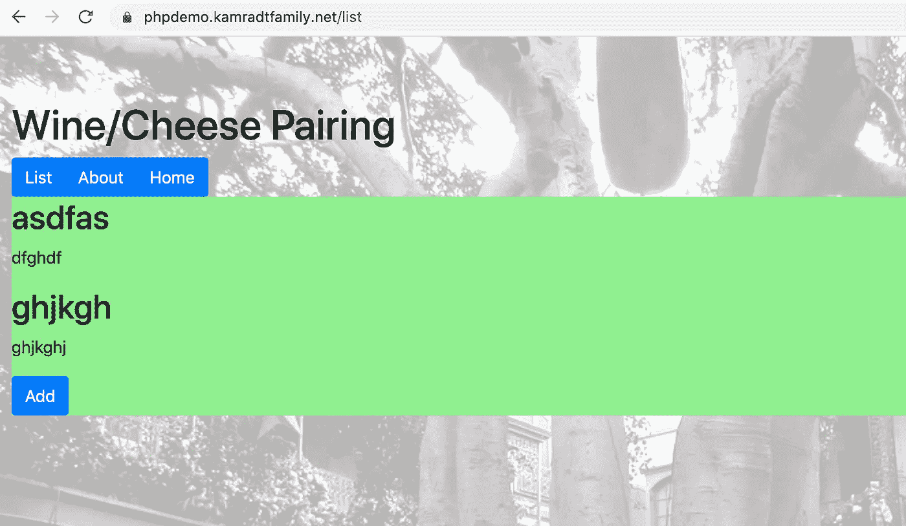

# 现代 PHP(第 2 部分)

> 原文：<https://levelup.gitconnected.com/modern-php-part-2-4973f48a90c0>

## 部署到云


图片来自 [Pixabay](https://pixabay.com/?utm_source=link-attribution&utm_medium=referral&utm_campaign=image&utm_content=1235959) 的[巨云](https://pixabay.com/users/colossuscloud-2086276/?utm_source=link-attribution&utm_medium=referral&utm_campaign=image&utm_content=1235959)

在本系列的第一部分的[中，我创建了一个非常简单的 PHP 应用程序，作为一个自由程序员可能会被要求做的事情的例子。但是，如果客户还没有一个面向互联网的网站，而你的项目的一部分就是创建一个，那么这篇文章就是为你准备的。](/modern-php-df3d3bf343f8)

假设您的客户已经超越了他们的 Wix 或 Squarespace 站点，希望表单得到数据库的支持，或者访问其他 API，并决定拥有一个全栈定制网站。我之前的文章展示了如何制作一个数据库支持的表单，如果你能制作一个表单，你就能制作一打。它还展示了如何使用一个相对便宜的裸[谷歌云平台](https://cloud.google.com/) (GCP)虚拟机将它部署到云上(假设你没有很多流量)。

唯一的问题是它没有“久经沙场”。当我在虚拟机上安装了 PHP 应用程序，并让全世界都可以访问它时，对日志的快速扫描显示，它正在被探测漏洞，可能是邪恶的玩家在寻找托管非法内容的地方。它也没有 HTTPS，所以有一个登录页面是不明智的。我们需要一个反向代理来处理这些方面。在本文中，我们将使用 [Nginx](https://nginx.org/en/) 。在以后的文章中，我们还将使用 Nginx 为您的所有应用程序实现单点登录。

为了完成这篇文章，你需要一个域名，一个 [Cloudflare](https://www.cloudflare.com/) 账户和一个 GCP 账户。如果这是一个真正的自由职业项目，要么你的客户会提供给你，要么你可以建议他们如何设置。你或许可以使用任何允许裸机通过 SSH 和 HTTPS 访问的云服务，我这里只是用 GCP 作为例子。我不会详细介绍如何设置 Cloudflare 和 GCP；他们有大量的在线帮助来帮助您进行设置，并且对于像我们这样的简单用例来说相对简单。如果您需要获得一个域名，请确保您获得一个允许您将 Cloudflare 设置为您的主要和辅助 DNS 并且能够随意处理 DNS 记录的域名。我使用 Namecheap.com 的[和](https://www.namecheap.com/)，并能够设置它没有问题。

您需要做的第一件事是在 GCP 上配置一个虚拟机，该虚拟机配有一个现代的 Linux 操作系统和大约 10gb 的硬盘空间。我用的是 Ubuntu 20.04。对于我们正在做的事情，您可以提供他们提供的最小的 CPU。确保您给予它外部 HTTPS 和 SSH 访问(GCP 自动添加 SSH 访问)。一旦 VM 启动并运行，连接到它并安装 Docker(和 Docker Compose)和 Git。这是您只需要安装的两个东西，所以如果您需要的话，重新配置应该很容易。

您需要找出新虚拟机的外部 IP 地址，以便将其添加到 Cloudflare。


在上图中，第二个 IP 地址是外部地址。现在，您可以在 DNS 选项卡上转到您的 Cloudflare 帐户，并使用您选择的新主机名添加“A”记录。这将被添加到完整主机的域名前面。请注意，此 IP 地址是“短暂的”，可能会在虚拟机重启之间发生变化。你可以把它设置成静态的，只需要多花一点钱。



现在，转到 Cloudflare 上的 SSL/TLS 选项卡，选择完全(严格)模式，这样您的所有流量都将需要 https，并且您的源服务器将需要 Cloudflare 证书。



在“原始服务器”子选项卡中，您可以创建一个证书以在虚拟机上使用。单击 Create Certificate 按钮，采用问题的默认值，它会给出两个长文本块，即证书和密钥。保持此页面打开，并转到虚拟机的 SSH 屏幕。您应该还在您的主目录中，我将把它们复制到那里。使用 VI(因为它是新虚拟机上唯一可用的编辑器，打开`yourdomain.com.pem`(替换您的实际域名)，插入第一个块中的所有文本，并保存它。接下来，打开`yourdomain.com.key`，对第二个块做同样的操作。现在，您的证书/密钥对在虚拟机上可用了。您还应该将这两个文件的副本存储在某个安全的地方。别不小心放到 GitHub 上就好！

我们将通过 Git 和 Docker 安装我们的应用程序。我在 GitHub 上创建了一个名为`phpappprod`的存储库，其中包含 Nginx 配置和 docker-compose.yml，说明应该运行哪些应用程序。当我们在这个库中创建文件时，我们将假设所有的秘密文件都直接存储在父库中，所以它们不会意外地存储在 GitHub 上。将新的存储库克隆到您的本地机器上。

现在，让我们只关注 Nginx。下面是启动 Nginx 的基本`docker-compose.yml`:

```
version: '3.1'
services:
  nginx:
    image: nginx
    restart: always
    volumes:
     - ./nginx.conf:/etc/nginx/nginx.conf
     - ..:/etc/certs
    ports:
     - "443:443"
```

注意，我们将`/etc/certs`映射到`..`，这样它将在父目录中查找证书。`nginx.conf`将不包含任何秘密，所以我们将把它添加到`phpappprod` GitHub 库中，并直接从那里映射它。以下是目前`nginx.conf`中的内容。

```
events {}
http {
  server {
    listen 443 ssl;
    server_name yourdomain.com;
    ssl_certificate /etc/certs/yourdomain.com.pem;
    ssl_certificate_key /etc/certs/yourdomain.com.key;
    ssl_protocols TLSv1 TLSv1.1 TLSv1.2;
    ssl_ciphers HIGH:!aNULL:!MD5;
    location ~ ^/(html|images|javascript|js|css|flash|media|static)/ {
      index index.html;
      root /etc/nginx/html;
      expires 3s;
      include /etc/nginx/mime.types;
    }
  }
}
```

显然，用您自己的域“yourdomain.com”替换 server_name、ssl_certificate 和 ssl_certificate_key。

在将它们推送到 GitHub 之前，您可以在本地进行测试。

```
docker-compose up -d
curl -k https://localhost/
```

您应该得到 Nginx 404 页面，因为您的应用程序没有绑定 Nginx(并且您的应用程序没有运行)。您必须使用-k 选项，因为您创建的证书仅在 Cloudflare 上有效。当您访问互联网上的新域时，Cloudflare 将拥有自己的证书。

提交并将所有内容推回 GitHub。现在回到 VM 的 SSH 终端，您可以克隆`phpappprod`存储库。我们将使用该存储库将所有非机密文件“传输”到您的虚拟机。使用 HTTPS 模式而不是 SSH 模式进行克隆，因为您不会从虚拟机提交更改，也不想设置 SSH 密钥。然后将目录切换到存储库并启动您的服务器

```
cd phpappprod
docker-compose up -d
```

现在，您可以在互联网上找到带有真实 SSH 证书的服务器:



这可能看起来不太令人印象深刻，但这是让您的应用程序在恶劣的互联网上安全运行的一大步。

## 在您的应用程序中添加

在本系列的前一篇文章中，我们有一个只有几页的简单网站。有一页展示了葡萄酒/奶酪的搭配，还有一页允许你添加更多。不是很多，但这是个好的开始。一旦你有了几个页面和一个总的主题，你就为拥有一个像样的网络应用做好了准备。您已经验证了您可以读写数据库并在 web 上显示它。

有几个问题我们没有解决，开发模式应用程序有一个示例密码嵌入到系统中。它还需要一个开发环境来建立数据库。最后，数据库存储在数据库容器中，所以一旦容器消失，数据也会消失。当我们将应用程序发布到互联网上时，我们可以解决所有这些问题。

一个小提示，您可能不希望您的数据库在容器中运行。那是一个合理的选择。在虚拟机上安装和设置数据库，或者甚至在单独的虚拟机上安装和设置数据库，这取决于您。GCP 有一个点击 MySQL 安装程序，它将在虚拟机上运行一个完全配置好的数据库。但是我是一个控制狂，本文的其余部分将假设您将在容器中运行数据库。如果您不希望这样，那么您必须弄清楚如何调整应用程序，以便从您选择的外部数据源读取数据库。

第一个问题是数据库的 root 密码；在开发版中，它就在。env 文件，它被签入 GitHub。这确实不是一个好主意，但是因为它只是一个开发密码，所以它使得在新的笔记本电脑上运行开发环境变得非常容易。它只影响开发环境中的数据库。GitHub 好心地给我发了一个警告，说我把一个密码签入了存储库。

让我们采用与证书/密钥对相同的策略，将新的秘密放入我克隆 GitHub 库的父目录中。这样很容易定位，但是在库之外，所以没有机会被推送到 GitHub。也许你会认为我们应该把秘密保存在一个隐藏的目录中，只有根用户才有读写权限。但是，如果有人入侵了你的虚拟机，再多的保护措施也无法保密。所以最好是在方便的地方。我将调用我的文件`../phpapp.env`(相对于存储库目录)，它现在只有一行:

```
MYSQL_ROOT_PASSWORD=<your super secret password here>
```

现在让我们将 MariaDB 应用程序添加到`docker-compose.yml`中。

```
version: '3.1'
services:
  nginx:
    image: nginx
    restart: always
    volumes:
     - ./nginx.conf:/etc/nginx/nginx.conf
     - ..:/etc/certs
    ports:
     - "443:443"
  mariadb:
    image: mariadb
    restart: always
    env_file:
      - ../phpapp.env
    ports:
      - 3306:3306
```

请注意，我取出了生产版本中的管理应用程序。我不想把它暴露给外界，所以我将限制自己只能通过命令行访问它。

现在，您可以启动它并确认它正在运行

```
docker-compose up -d
docker exec -it phpappprod_mariadb_1 bash
mariadb -u root -p
```

它会提示您输入密码；您可以输入您放在`../phpapp.env`文件中的密码，您应该会看到:

```
Welcome to the MariaDB monitor.  Commands end with ; or \g.
Your MariaDB connection id is 5
Server version: 10.5.5-MariaDB-1:10.5.5+maria~focal mariadb.org binary distributionCopyright (c) 2000, 2018, Oracle, MariaDB Corporation Ab and others.Type 'help;' or '\h' for help. Type '\c' to clear the current input statement.MariaDB [(none)]>
```

所以我们知道 MariaDB 已经启动并正在运行，并且 root 密码安全地存储在`../phpapp.env`中

下一个问题，存储的任何数据都将存储在容器中。我们需要建立一个卷来存储外部数据。首先，停止 MariaDB 监视器，然后停止 docker-compose:

```
docker-compose down
```

我们不希望数据库数据存储在 GitHub 中，但我希望保持简单，只将数据目录直接放在存储库区域内。所以我们必须在`.gitignore`文件中添加一行:

```
data
```

接下来，我们将创建数据目录，并授予它完全权限，以便我们可以从 docker 内部将其作为一个挂载卷进行访问:

```
mkdir data
chmod 777 data
```

最后，我们可以将它挂载到 docker-compose.yml 文件中:

```
...
mariadb:
    image: mariadb
    restart: always
    volumes:
     - ./data:/var/lib/mysql
    env_file:
      - ../phpapp.env
    ports:
      - 3306:3306
```

或者，您也可以让 Docker 创建一个卷并进行分配，但这种方式似乎更容易。如果您正在创建一系列共享一个数据库的 web 应用程序，这将是一个不错的选择。但我们会保持简单。我们可以通过再次启动和停止服务来确认 MariaDB 正在使用它:

```
docker-compose up -d
docker-compose down
ls data
```

`data`目录应该被文件填满。如果我们在本地测试这些生产脚本时需要重置数据库，我们可以删除数据目录的内容。

最后一个问题，为我们的应用程序创建数据库和表，有点棘手。在本系列的第一部分中，我们使用了几个 PHP/Symfony 命令，但是我们不想在我们的生产虚拟机上直接安装 PHP 或 Symfony。请记住，目标之一是轻松(重新)供应，所以我们必须安装的越少越好。幸运的是，有一个命令可以转储必要的 SQL，我们可以将它挂载到 MariaDB 在未初始化时查看的位置。或者，由于所有的 PHP/Symfony 命令都在映像中可用，您可以运行映像并覆盖 Docker `CMD`行，但是我认为从 MariaDB 映像中运行 SQL 对于习惯于从脚本中运行 DDL 的人来说更熟悉一些。

我们还需要覆盖应用程序的数据库 URL。所以在你的`../phpapp.env`文件中添加一行

```
DATABASE_URL=mysql://root:<pw>@mariadb:3306/winelist?\   serverVersion=mariadb-10.4.11
MYSQL_ROOT_PASSWORD=<pw>
```

用您的新密码替换这两个<pw>。</pw>

回到`phpapp`存储库，假设它仍然下载了所有的依赖项，我们可以运行下面的命令让 SQL 创建这个表:

```
php bin/console doctrine:schema:create --dump-sql
```

复制它生成的 SQL 并返回到`phpappprod`存储库，创建一个名为`init`的目录，在其中创建一个名为`init.sql`的文件并粘贴 SQL。如果数据库不存在的话，我们必须对它进行一些修改，以便创建和使用数据库。我们得到的结果应该是这样的:

```
CREATE DATABASE IF NOT EXISTS winelist;
USE winelist;
CREATE TABLE IF NOT EXISTS wine_pairing 
  (id INT AUTO_INCREMENT NOT NULL, 
   wine VARCHAR(255) NOT NULL, 
   wine_description VARCHAR(255) NOT NULL, 
   cheese VARCHAR(255) NOT NULL, 
   cheese_description VARCHAR(255) NOT NULL, 
   pairing_notes VARCHAR(255) NOT NULL, 
   PRIMARY KEY(id)) 
   DEFAULT CHARACTER SET utf8mb4 
   COLLATE `utf8mb4_unicode_ci`  
   ENGINE = InnoDB;
```

现在将映射添加到`docker-compose.yml`中。

```
...
mariadb:
    image: mariadb
    restart: always
    volumes:
     - ./data:/var/lib/mysql
     - ./init:/docker-entrypoint-initdb.d
    env_file:
      - ../phpapp.env
    ports:
      - 3306:3306
```

为了确保它被初始化，删除数据目录的内容，然后重新启动。您可以再次运行 MariaDB 命令行，以确保所有内容都已初始化:

```
rm -rf data/*
docker-compose up -d
docker exec -it phpappprod_mariadb_1 bash
mariadb -u root -p
```

运行 describe 命令来查看新的`wine_list`表。

## 添加反向代理

我们现在已经运行了 Nginx 和 MariaDB 剩下的就是添加应用程序并设置 Nginx 反向代理它。这意味着`docker-compose.yml`的另一个变化。

```
...
  phpapp:
    image: rlkamradt/phpapp
    env_file:
      - ../phpapp.env
    ports:
      - 8000:8000
```

这将启动应用程序。将 Nginx 设置为反向代理相当简单；`nginx.conf`应改为:

```
events {}
http {
  server {
    listen 443 ssl;
    server_name kamradtfamily.net;
    ssl_certificate /etc/certs/kamradtfamily.net.pem;
    ssl_certificate_key /etc/certs/kamradtfamily.net.key;
    ssl_protocols TLSv1 TLSv1.1 TLSv1.2;
    ssl_ciphers HIGH:!aNULL:!MD5;
    location / {
        proxy_pass [http://phpapp:8000](http://phpapp:8000);
    }
  }
}
```

这将接受所有请求，并将它们传递给应用程序。请注意，我们不需要在应用程序本身上启用 HTTPS，因为 Nginx 和应用程序之间的通信完全在一个虚拟机上进行，所以在它们之间使用不安全的通信是安全有效的。

将这些都上传到服务器只需要很少的努力。首先，确保您已经提交并推送了`phpappprod`存储库中的所有变更。然后将您的`../phpapp.env`复制到您的主目录中的虚拟机上，该目录应该是虚拟机上存储库的父目录。最简单的方法就是登录你的虚拟机，运行`vi phpapp.env`，剪切并粘贴你的本地拷贝，就像我们在虚拟机上获取证书一样。最后，在 VM 上，切换到`phpappprod`目录，并执行`git pull`来获取我们在本地所做的所有更改。现在您可以运行`docker-compose up -d`了，您的应用程序应该准备好发布到真正的互联网上了！



我在清单上加了几项，你可以看看。它看起来仍然很丑，但一点点的造型会解决这个问题。

但首先，我要关闭服务器。我敢肯定，如果我把它留在那里，当我回来的时候，一些爱开玩笑的人会把它装满滑稽的东西，或者更糟。永远不要把一个半成品的应用程序留在互联网上！

还能做什么？除了让它看起来漂亮，我们需要添加一个登录，以便只有授权的人可以添加配对。一旦我们有了登录，我会觉得让它在互联网上运行是相当安全的。一旦它被美化了，我会很高兴把它作为一个投资组合项目。我以前使用过 [Okta](https://www.okta.com/) 进行授权，所以在我的下一篇文章中，我将展示如何使用它们让您的应用程序登录。

下面是本文中使用的存储库:

[](https://github.com/rkamradt/phpapp/tree/v0.2) [## rkamradt/phpapp

### 此时您不能执行该操作。您已使用另一个标签页或窗口登录。您已在另一个选项卡中注销，或者…

github.com](https://github.com/rkamradt/phpapp/tree/v0.2) [](https://github.com/rkamradt/phpappprod/tree/v0.1) [## rkamradt/PHP pprod

### 此时您不能执行该操作。您已使用另一个标签页或窗口登录。您已在另一个选项卡中注销，或者…

github.com](https://github.com/rkamradt/phpappprod/tree/v0.1) 

提到的其他文章:

[](/modern-php-df3d3bf343f8) [## 现代 PHP

### 使用 Upstart 上最需要的项目语言之一开始你的自由职业生涯。

levelup.gitconnected.com](/modern-php-df3d3bf343f8)