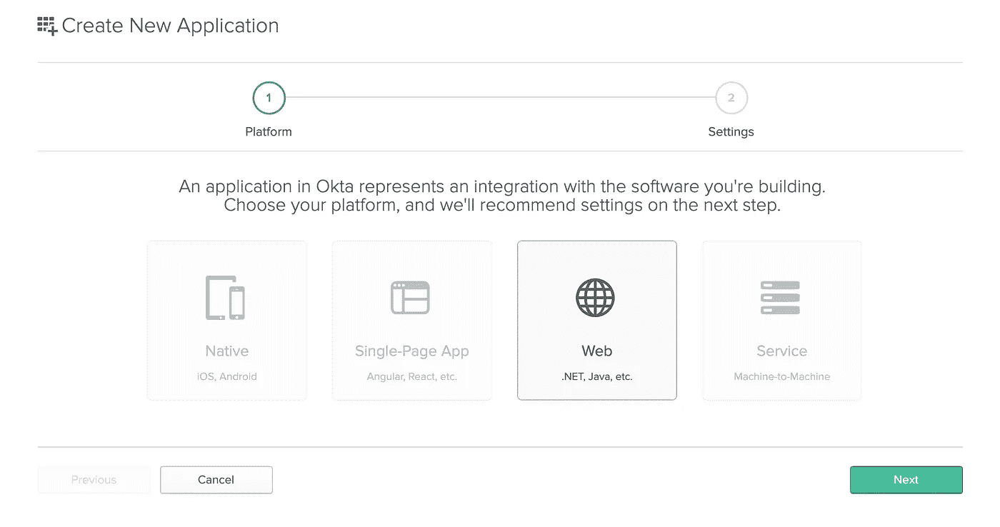
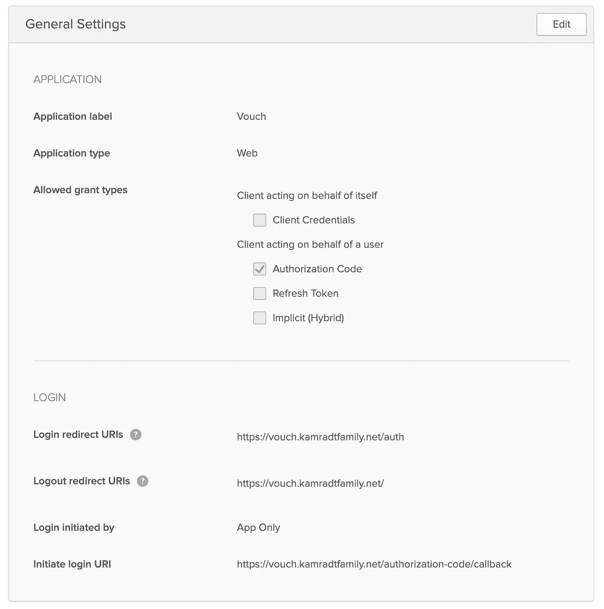
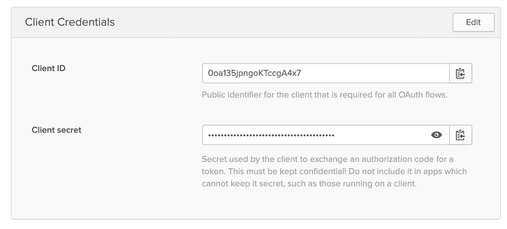
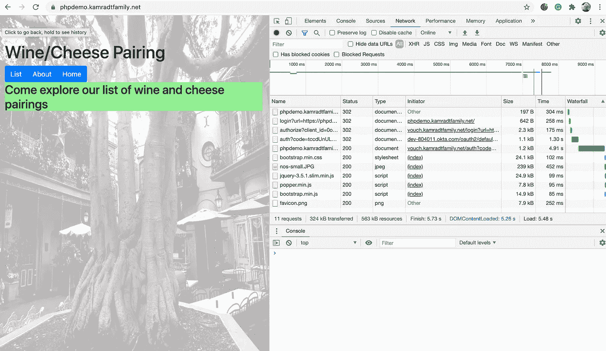
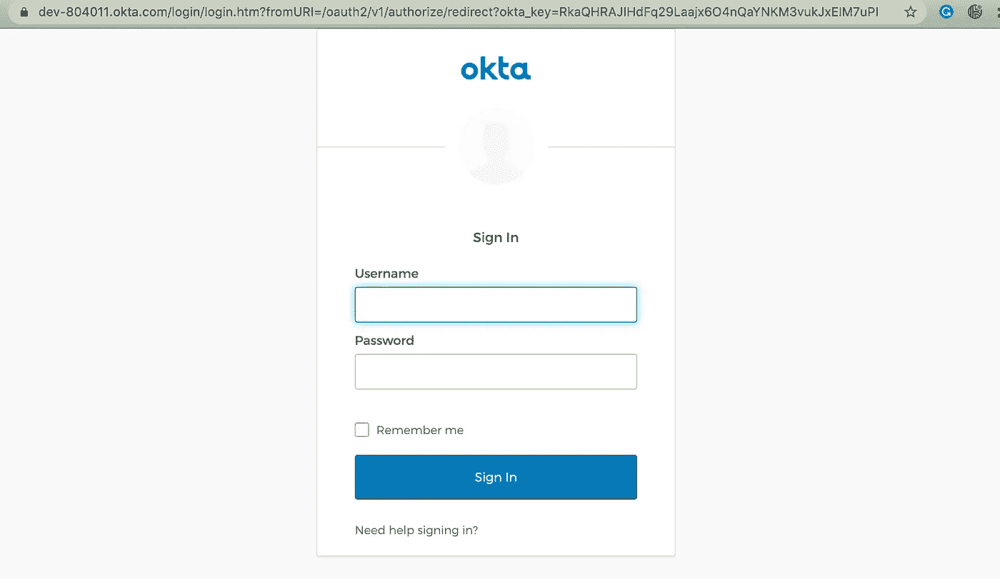

# 现代 PHP(第 3 部分)

> 原文：<https://levelup.gitconnected.com/modern-php-part-3-1f5b78b3371d>

## 所有 web 应用程序的单点登录。


图片来自[皮克斯拜](https://pixabay.com/?utm_source=link-attribution&utm_medium=referral&utm_campaign=image&utm_content=1944688)

这些年来我学到的一件事就是不要让你的应用程序处理安全性。让专家来处理安全问题。不终止 SSL 或验证用户身份，应用程序就已经够复杂了。此外，这使得在开发环境中进行测试更加困难。试图用最新的安全补丁来修补你的 PHP 环境，比给他们一个像 Nginx 这样的入口点来修补要困难得多。

在本系列的前几篇文章中(见下面的链接)，我创建了一个 PHP 应用程序，允许您列出和添加葡萄酒和奶酪的搭配。我还展示了如何将它部署到云中，并在互联网上提供它。然后我立刻把它撤了下来，因为让一个不安全的应用程序在互联网上运行通常不是一个好主意。因此，在本文中，我不仅要添加一个登录屏幕，还要构建它，以便运行在您的云虚拟机上的任何应用程序都可以轻松地使用身份验证。

为了进一步减少您必须做的工作量，我将使用一个名为 [Okta](https://www.okta.com/) 的服务来处理认证。我还将使用一个名为[的应用程序作为 Nginx 和 Okta 之间的中介。您的应用程序唯一关心的是授权(让某些用户能够访问特定于用户的数据)。带有 JWT 的安全 cookie 将被添加到每个请求中，应用程序可以使用它来确定特定用户是否能够访问或修改数据。](https://github.com/vouch/vouch-proxy)

首先要做的是建立一个 Okta 开发者账号。这是一个免费帐户，最多允许 1000 名用户注册。登录后，创建一个新的应用程序并选择 Web 作为类型。



接下来，它会将您带到一个配置屏幕，在这里您将添加与您的系统交互所需的所有 URIs。因为您将只使用凭证应用程序，所以您需要在您的域中创建一个新主机。假设你的域名是“yourdomain.com”，你可以使用[https://vouch.yourdomain.com](https://vouch.yourdomain.com)作为这些项目的主机。其余的可以保留为默认值。



创建应用程序后，它会给你一个客户端 id 和客户端密码。



客户 id 是公共知识，但是客户秘密当然是秘密的。您必须将这两者作为您的凭证实例的参数。您需要的唯一其他信息是 Okta 组织的 URL，您可以在 Okta 仪表板的右上角找到它。

现在我们已经在 Okta 仪表板中设置了凭证 SSO 应用程序，让我们将凭证部署到云中。在我的例子中，我将把它与我的应用程序和 Nginx 放在同一个 VM 中。在为多个应用程序提供身份验证的情况下，配置会更加复杂。但是，让我们从运行在同一虚拟机上的一个应用程序开始。如果您阅读了本系列中我以前的文章，您应该已经有了一个名为`phpappprod`的存储库。如果没有，您可以将[库](https://github.com/rkamradt/phpappprod/tree/v0.2)克隆到您的本地驱动器。我们可以通过将它添加到我们`docker-compose.yml`来开始凭证。

```
vouch:
    image: voucher/vouch-proxy
    volumes:
      - ..:/config
    ports:
      - 9090:9090
```

我在存储库的父目录中使用相同的保密策略，这样它就不会被签入 GitHub。该配置将保存在一个名为`../config.yml`(相对于存储库目录)的文件中。它将包含所有凭证配置，如下所示:

```
vouch:
  logLevel: debug
  domains:
  - vouch
  - {yourdomain}
oauth:
  provider: oidc
  client_id: {your client ID}
  client_secret: {your client secret}
  auth_url: [https://{organizationURL}/oauth2/default/v1/authorize](https://dev-804011.okta.com/oauth2/default/v1/authorize)
  token_url: [https://{organizationURL}/oauth2/default/v1/token](https://dev-804011.okta.com/oauth2/default/v1/token)
  user_info_url: [https://{organizationURL}/oauth2/default/v1/userinfo](https://dev-804011.okta.com/oauth2/default/v1/userinfo)
  scopes:
    - openid
    - profile
    - email
  # Set the callback URL to the domain that Vouch is running on
  callback_url: [https://vouch.{yourdomain}/auth](https://vouch.kamradtfamily.net/auth)
```

`oauth.callback_url`必须与您在 Okta 配置中指定的登录重定向 URI 完全匹配。还请注意，我将`vouch`添加到了域名中，这样我就可以直接访问凭证，而不必通过互联网进行重定向。

你可以用`docker-compose up`启动它来试试。它还不能工作，因为它只配置为在实际的域中工作，而不是在本地。您可以将额外的域添加到您的配置中进行测试，但是我们将只在现实世界中运行身份验证。对于本地测试，我们将假设一切都已经过身份验证。这是将身份验证排除在应用程序之外的一个好处。

在我们将所有这些迁移到云之前，我们必须调整 Nginx，不仅要反向代理我们的应用程序，还要反向代理凭证应用程序。此外，它应该阻止访问我们的应用程序，如果没有认证，并重定向到 Okta 正确登录，如果需要的话。这是我想到的:

请注意，我们使用虚拟主机将应用程序请求发送到一个地方，将身份验证请求发送到另一个地方。同样，我们需要将秘密传递给 VM。同样，我将在虚拟机上使用`vi`进行复制和粘贴。到目前为止，我们只有三个需要复制的秘密文件，它们都是文本文件，不会有太大的变化，所以这似乎不是太大的负担。

在虚拟机上打开一个 SSH 终端并运行`vi config.yml`。然后，您可以复制本地`../config.yml`的内容，并将它们粘贴到虚拟机上的文件中。然后`cd`到`phpappprod`目录并运行`docker-compose up`。现在你的应用程序应该在互联网上运行，但是在登录之后。

如果你浏览到新安全的应用程序，你可能不需要登录。这是因为您可能仍然从配置会话登录到 Okta。包括 Okta 在内的所有申请都是单点登录。你可以确认你 Okta 允许你在 Chrome 中使用开发者工具。



有三个状态为 302 的额外请求，将您重定向到下一个阶段。另外，它将为您的新应用程序存储一个 cookie，这样只需要执行第一步。第一个请求需要大约四分之一秒的时间来执行，因为它与 Nginx 和您的应用程序位于同一位置；延迟应该很难察觉。在更复杂的设置中，需要重定向到外部互联网，这可能需要更长的时间(但肯定没有再次输入密码那么长)。

要查看当您被要求登录时会发生什么，您可以打开一个匿名窗口，浏览到您的应用程序，您应该被要求提供您的凭据。



如果你想在你的应用程序中包含登录界面，给它一个独特的品牌，Okta 有办法做到这一点，但这超出了本文的范围。

如果您想给出不同的作用域，传递给应用程序的 cookie 有一个 JWT，您可以打开它来查找用户名和角色，这样您就可以基于用户名或角色添加授权。例如，您可以允许任何人查看列表，但是只有特定角色的人可以添加到列表中。

我打算暂时不去管它；该应用程序受到 Okta、Nginx 和 Cloudflare 的安全保护，所以我很高兴让它像那样运行。请注意，为了能够添加这个安全级别，我根本不需要更改主应用程序。事实上，应用程序是 PHP 并不重要，它可以是任何表达式语言。但是由于这是一个关于现代 PHP 的系列，所以我使用前面开发的 PHP 应用程序图像作为例子。我希望我已经能够帮助您将应用程序安全地部署到 internet 上。如果你需要进一步的帮助，Okta 开发者的网站上有使用大多数表达式语言的 Okta 工具包的详细解释。

所有脚本(除了秘密脚本)都包含在这个存储库中:

[](https://github.com/rkamradt/phpappprod/tree/v0.2) [## rkamradt/PHP pprod

### 此时您不能执行该操作。您已使用另一个标签页或窗口登录。您已在另一个选项卡中注销，或者…

github.com](https://github.com/rkamradt/phpappprod/tree/v0.2) 

本文引用的其他文章如下:

[](/modern-php-df3d3bf343f8) [## 现代 PHP

### 使用 Upstart 上最需要的项目语言之一开始你的自由职业生涯。

levelup.gitconnected.com](/modern-php-df3d3bf343f8) [](/modern-php-part-2-4973f48a90c0) [## 现代 PHP(第 2 部分)

### 部署到 web

levelup.gitconnected.com](/modern-php-part-2-4973f48a90c0)