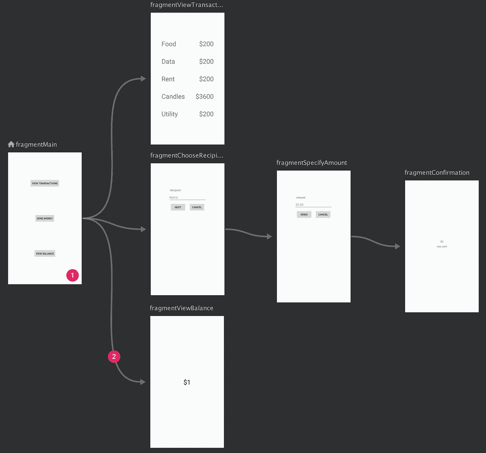

# 使用单一活动模式更新您的 Android 应用程序

> 原文：<https://levelup.gitconnected.com/modernize-your-android-app-with-the-single-activity-pattern-1526407a7d4>

丹尼尔·伊德里在 [Unsplash](https://unsplash.com?utm_source=medium&utm_medium=referral) 上的照片

如果你已经开发 Android 应用程序 3-5 年了，你可能在一开始就知道应用程序的一个屏幕应该按照 1-1 的关系分配给一个活动。

这是向框架迈出第一步时的主要经验之一，以保持开始时的简单性，因为这是开发应用程序的标准方式很长一段时间了。

这个框架已经发展了很多年，不同的方法来来去去，其中之一，也是我个人的偏好，是单一活动模式。

# 单一活动模式

这种模式认为，应用程序不是为每个屏幕使用一个活动，而是用一个单独的活动来构建，该活动充当将为每个屏幕替换的片段的容器，并通过堆栈来管理。核心思想是为片段改变活动。

如今，谷歌正在推广这种模式，将其作为开发 Android 应用的标准。你可以去看看谷歌软件工程师伊恩·莱克举办的这个[会议](https://www.youtube.com/watch?v=2k8x8V77CrU)，但是如果你觉得懒的话，以下是演讲中指出的主要好处:

*   在活动之间共享状态比在片段之间共享更难。片段可以使用容器活动，在附加到活动生命周期的视图模型的帮助下共享这些数据，这将在片段替换后继续存在。
*   在处理片段时，孤立地测试 UI 更容易。
*   更好地支持片段之间的动画转换，而不是活动之间的转换。
*   在屏幕之间切换时，避免暗示操作系统。每次创建和销毁活动时，活动都需要通知操作系统，这增加了额外的开销，但这并不是真正必要的。总体来说碎片比较轻。
*   遵循单一活动模式允许开发者充分利用 N[aviation Jetpack 库](https://developer.android.com/guide/navigation/navigation-getting-started)并使深度链接更容易。

通过使用导航库，您还可以直观地展示应用程序的导航逻辑，如下图所示。

谷歌[的导航组件示例](https://developer.android.com/guide/navigation/navigation-getting-started)

如今，随着 Jetpack Compose 的发布，我们又多了一个实现单一活动模式的选择。除了使用片段，我们可以为每个屏幕使用 composables，并使用 Compose 导航库在它们之间导航，完全消除片段。

您还可以为每个片段创建一个主要的可组合函数，并继续使用之前解释过的导航组件来保持导航的可视化表示。老实说，我不认为使用这些片段作为组件的容器会对性能产生不利影响，所以我个人更喜欢它对我的应用程序的显示内容、导航逻辑和我认为向 Jetpack Compose 的过渡这样会更容易。

如果你想阅读更多这样的内容，并支持我，不要忘记检查我的个人资料，或给媒体一个机会，成为会员，以获得我和其他作家的无限故事。一个月只要 5 美元，如果你使用这个链接，我会得到一小笔佣金。

 [## 通过我的推荐链接加入 Medium—Miguel

### 阅读米格尔的每一个故事(以及媒体上成千上万的其他作家)。你的会员费直接支持米盖尔…

medium.com](https://medium.com/@molidev8/membership)