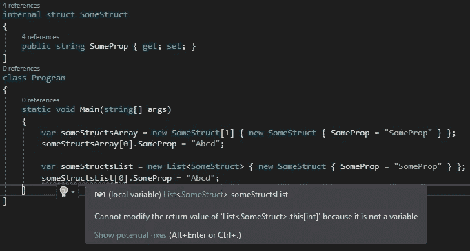
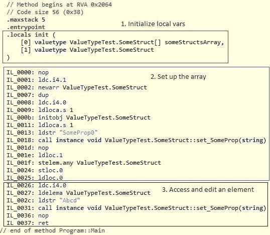
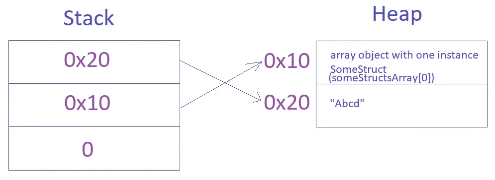
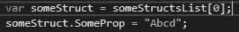
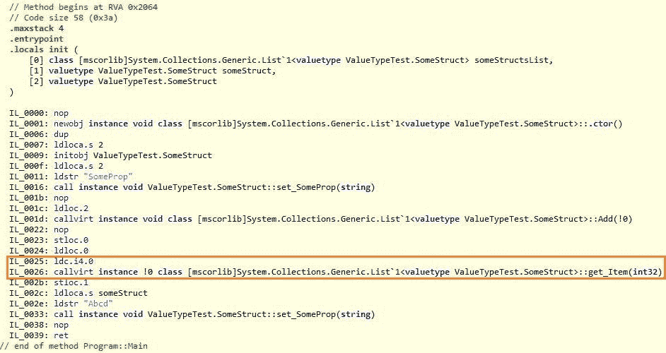

# 修改列表和数组中的结构

> 原文：<https://levelup.gitconnected.com/modifying-struct-in-list-vs-array-6b4035b139b9>

照片由[穆罕默德·迈赫迪·阿巴西](https://unsplash.com/@mohamad_mahdi)在 [Unsplash](https://unsplash.com/) 拍摄

在下面的代码中，我设置了一个简单的数组和一个泛型列表，两者都包含一个`SomeStruct`的实例:

# 错误

很奇怪，当你可以用几乎完全相同的方式修改数组时，看到编译器抱怨修改列表，那么为什么不允许我们这样做呢？

# 数组与列表

为了理解为什么不允许这样做，让我们来看看当您使用索引访问数组和列表时幕后发生了什么。

# 排列

下面是访问索引为 0 的数组的 CIL 代码，然后将属性设置为`“Abcd”`:

请看第 3 块“访问和编辑元素”。下面是对每一行的简要说明:

*   `ldc.i4.0` —将整数值 0 作为 int32 压入堆栈。
*   `ldelema ValueTypeTest.SomeStruct` —将数组元素的地址加载到当前栈顶 int 指定的索引处(即 0)，放到堆栈的顶部
*   `ldstr “Abcd”` —将新的对象引用推送到堆栈上的`“Abcd”`。
*   `call instance void ValueTypeTest.SomeStruct::set_SomeProp(string)` —调用属性`SomeProp`的 set property 方法，传入当前堆栈顶部的字符串(即`“Abcd”`)。

这就是堆/栈的样子。为位于内存 0x10 的`SomeStruct`实例设置`SomeProp`属性，字符串`“Abcd”`位于 0x20(注意内存地址是任意的)。

如您所见，该属性是为实际的`SomeStruct`实例(不是副本)设置的，位于内存中的数组中。

现在让我们将它与一个列表进行比较。

# 目录

类似于数组，当您调用`someStructsList[0].SomeProp = “Abcd”;`时，它实际上在做两件事，访问`SomeStruct`实例，然后设置属性。

既然我们不能编译`someStructsList[0].SomeProp = “Abcd”`，让我们把它分解成下面的编译，让我们看看它在幕后做什么:

这是 CIL:

我们只对橙色矩形中的代码感兴趣。

`*ldc.i4.0*` —将`Int32`值 0 加载到堆栈上。

`callvirt instance !0 class [mscorlib]System.Collections.Generic.List`1[valuetype ValueTypeTest.SomeStruct]::get_Item(int32)` —调用索引器方法。

与数组访问不同，当你访问一个列表中的元素时，你实际上是在使用一个索引器，这是一个接受一个`Int32`的方法，并且**返回位于列表内部数组中该索引处的元素**的副本。

这是关键点，你得到的是元素的副本，而不是实际的元素。

你可能以前学过这个概念，当一个方法返回一个值类型的实例时，你得到的是那个实例的副本，而不是实际的实例(除非你使用 ref/out)。

# 结论

这就是第一行代码不能编译的原因，因为您在`SomeStruct`实例的副本上设置了一个属性。因为这个副本没有存储在任何地方，所以您只是在一个即将被丢弃的副本上设置了一个属性，这可能不是您想要的。

如果你用一个局部变量把它分成两个步骤，编译器不会抱怨，因为至少你在一个局部变量中设置了一个实例副本的属性。