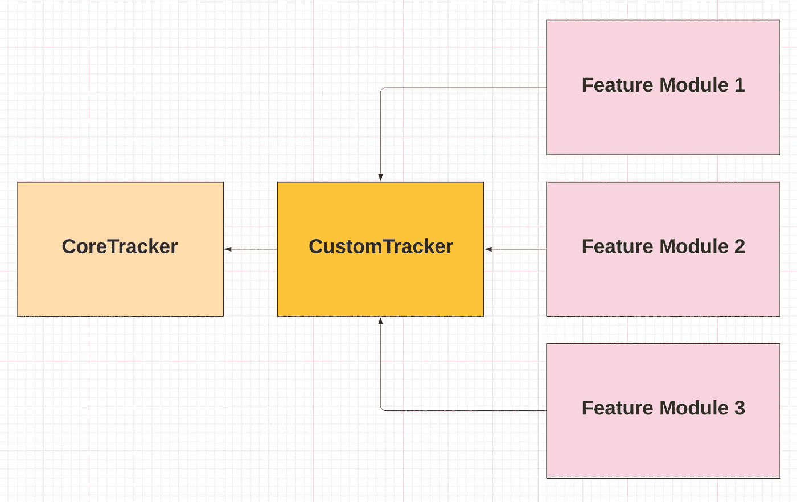
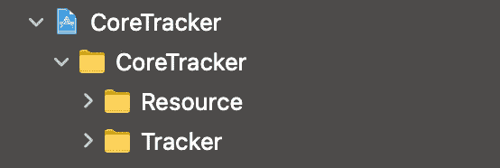
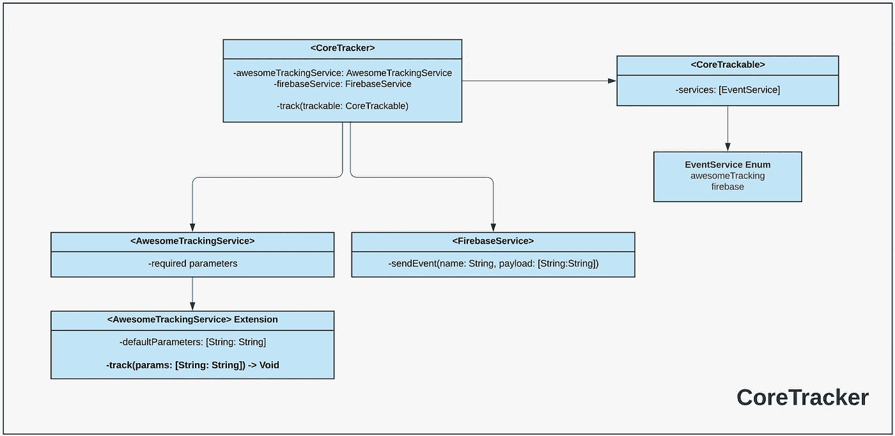
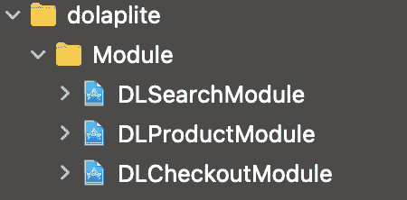

# Swift 中的模块化事件跟踪器

> 原文：<https://levelup.gitconnected.com/modular-event-tracker-with-swift-ce8425a06f64>

除了非常小的爱好项目，几乎每个 iOS 应用程序都有一个跟踪器架构来测量和跟踪分析事件。有时实施第三方解决方案或内部跟踪解决方案就足够了，有时您应该同时支持这两种解决方案。除了实现它们之外，为了项目的缘故，您还想保持跟踪机制的整洁。

由于 Trendyol iOS 应用程序是土耳其电子商务类别中最受欢迎的 iOS 应用程序之一，我们使用各种第三方解决方案和内部解决方案来跟踪事件。事实上，我们有一个跟踪机制，直到上个季度一直表现良好，但是我们注意到，随着应用程序的增长，它的规模不够大，还会出现一些问题。首先看看我们要改变的以前的跟踪解决方案，看看这里有什么问题。

先说跟踪服务；

跟踪服务

**TrackingService** 是一个包含跟踪选项的基本 enum。如你所见，它由一些流行的第三方解决方案和一个名为 **AwesomeTracking** 的内部解决方案组成。

> 我们使用的内部解决方案的实际名称不是 **awesomeTracking** ，但是出于隐私原因，我们现在就这样命名吧。

除了跟踪服务之外，还有一个**可跟踪**协议，每个 事件都要符合这个***；***

**可追踪**协议是追踪机制的核心。正如您所看到的，协议有一个名为 ***services*** 的必需变量(上面已经解释过了)，以及一个 ***track()*** 方法，它的默认实现在可跟踪扩展中提供。

在 track 方法中，每个事件都是通过其关联的实例发送的(大多数都是单例对象)。其对内部跟踪机制有效，此说法对***AwesomeTracking***也成立。所有肮脏的事件和网络的东西都藏在那里。

为了理解它在基本级别是如何工作的，让我们实现一个名为 **SupplierInfoEvent，**的基本事件，因为每个事件都应该符合可跟踪协议，所以它的实现可以编码为；

如你所见，当你符合 ***可跟踪*** 协议时，你应该实现 ***服务*** 数组，其中包含跟踪服务的引用。在上面的特定示例事件中，firebase 被赋予 Trackable。

只要写一行代码，你就可以把这个事件发送到任何你想发送的地方；

> 注意，每个事件都符合 Trackable，作为 Tracker 的**扩展实现，这只是为了在编写 Tracker.xxx 时清楚地看到哪些事件是可用的**

那么，这里的问题是什么？为什么我们需要改变它？

# 我们在以前的设计中遇到的问题

## 原因 1(模块化)

由于 Trendyol iOS 应用程序的功能越来越多，我们决定让它更加模块化，由许多框架、包等组成。除了大规模的功能，Trendyol 的目标是成为一个超级应用程序，包含几乎独立的应用程序规模的功能，如 **Dolap Lite** ( *在线二手时尚*)和 **Trendyol Go** ( *快速在线杂货店购物*)。由于当时 Trendyol iOS 应用程序是一个完整的整体应用程序，因此在实现这种跟踪机制时没有考虑模块化。

## 原因#2(可测试性)

由于每个事件结构都符合跟踪协议，并且事件是通过结构本身发送的(没有依赖注入)，所以很难测试当前的机制。

如果在编写像"*这样的单元测试时模仿事件结构就太好了，如果在产品细节屏幕上调用这个方法，那么这两个事件方法也应该被调用*

## 原因 3(灵活性)

特别是对于内部解决方案(如上面的 *AwesomeTracking* 所述)，实际的事件发送者类和跟踪服务是紧密耦合的。除此之外，使用具体类型代替协议类型。例如，每个 **AwesomeTracking** 事件都发送了大量的默认参数，这些默认参数是在实际的事件发送器类中处理的(当前情况下为***AwesomeTracking . shared***实例)。考虑到我们将在**Trendyol 本身和 Dolap Lite** 中使用 AwesomeTracking，然而一些默认参数**应该是不同的**。这种情况下我们该怎么办？由于我们不能将实际的事件发送器类注入跟踪服务，我们应该为 Dolap Lite 的 AwesomeTracking 服务添加新的案例，这是糟糕设计的标志。

# 新的模块化设计

我们的目标是开发一些解决上述问题的东西，同时保留现有设计的积极方面。

因为我们通过导入它在其他框架中使用这个新的跟踪架构，所以让我们创建一个名为 **CoreTracker 的框架。**

> 在这个框架的名称中使用 ***Core*** 前缀的原因是，它为使用 CoreTracker 的特定跟踪框架或目标提供了核心级行为。

创建 CoreTracker 框架后，让我们创建 **CoreTrackable** 和 **EventService，**这些几乎和之前的跟踪实现一样。CoreTrackable 将是**每个事件应该符合的协议。**

> 注意，为了简单起见，将只使用一个第三方服务***(*firebase*)***和一个内部服务**(出色的跟踪)**。

这里你应该注意到一个区别，在以前的实现中， ***track()*** 方法属于 **Trackable** 协议(*又名 CoreTrackable 此处为*)，然而在新的设计中 **CoreTrackable** 只需要服务数组，这意味着 track 方法不是通过事件本身调用的，让我们把它放到名为 **CoreTracker 的新协议中。**

> CoreTracker 将是我们新事件结构的主干，每个使用这个事件框架的框架都应该定义一个符合 CoreTracker 的具体类型来发送事件。

您可以看到在第 10 行和第 12 行应该有实例实际上是**发送事件**。由于每个使用 CoreTracker 的框架都希望给出自己的事件发送类，我们应该为它们考虑一个协议，而不是具体的类型。

例如对于 **AwesomeTracking** ，我们可以为项目需求创建如下协议；

类似地，对于第三方服务( *Firebase* )，我们可以创建一个协议，将实际的事件发送实现提供给 CoreTracker 模块；

现在让我们将这两个事件服务放到我们之前创建的 CoreTracker 协议中；

为了形象化我们到目前为止所做的工作，我们可以看看下面的基本图表；

总之，有一个 **CoreTracker** 协议包含事件服务。当一个框架想要使用它时，它应该创建一个符合 CoreTracker 的 tracker 类，作为 CoreTracker 的要求，它应该给出 firebase service 和 awesome tracking service 实例，这些实例必须符合 **AwesomeTrackingService** 和 **FirebaseService 协议**。

现在让我们使用这个事件结构，考虑将二手电子商务功能嵌入到我上面提到的名为 ***DolapLite*** 的 Trendyol 应用程序中。它在项目中有自己的框架。

DolapLite 由三个接口框架组成，我们称这些为 ***模块***；

如果我们想使用 CoreTracker 框架，我们应该创建一个符合 **CoreTracker** 协议的 **Tracker** 类。既然我们想在***dola plite***的所有接口框架中使用这个跟踪器，我应该创建一种包装器框架并在其中放入 Dolap Lite spesific Tracker 类。所以让我们创建 **DLTracker** (又名 DolapLite Tracker)框架，并在导入 CoreTracker 后在其中创建 Tracker 类；

> 注意，DL 前缀用于属于 Dolap Lite 的所有类

因为 firebase 服务和 awesome 跟踪服务需要 CoreTracker 协议的参数，所以我们应该创建和设置这两个服务。

在这里创建这些服务的美妙之处在于，这些服务的实现将是 Dolap Lite 框架所独有的。这是必需的，因为 Trendyol 和 DolapLite 中的 Awesome 服务事件所需的参数将**不同**。

让我们用这些新服务创建**dl tracker**；

> 注意，我们已经将这些服务作为 init 方法的默认参数注入。因为在编写单元测试时，我们可以很容易地用模拟服务初始化这个跟踪器。

现在我们可以在 Dolap Lite 的一个框架中使用新的 tracker。让我们导入 **DLTracker** 框架，并在 **DLProductDetail** 框架下创建一个示例产品细节事件；

创建活动后，考虑在 dolap lite 产品详细信息页面的演示者中使用它。因为所有的事件都应该通过一个符合 **CoreTracker** 协议的实例来发送(对于 Dolap Lite 来说是 **DLTracker** ，让我们把它注入到 presenter 对象中；

> 注意，我们保留了 tracker 实例作为 CoreTracker 协议的一种类型，并注入了 DLTracker 实例作为 init 的默认参数。这是因为我们可以在单元测试中使用模拟跟踪器实例。

现在，在演示器中发送事件很容易；

让我们用新的跟踪实现来重新考虑第一部分提到的问题；

## #1 模块化

新的跟踪机制封装到一个单一的事件框架和高度模块化。如果在不同的框架中使用，导入和创建符合跟踪协议的类就足够了。

此外，对于像 firebase 或 adjust 这样的第三方服务，它们的 SDK 可以在 tracker 框架中实现，而不会影响其他模块。

## #2 可测试性

事件发送不是在具体的事件类本身处理的，而是在符合 CoreTracker 协议的类中处理的，由于 CoreTracker 本身及其服务可以通过 init 注入，所以它很容易被模仿，并且事件发送在单元测试中是可测试的。

## #3 灵活性

不仅每个使用 CoreTracker 的框架都可以提供自己的服务(例如 Dolap Lite 示例中的 DLAwesomeTrackingService)，以前创建的服务也可以在其他框架中重用。

例如，如果 firebase 服务实现对于 Dolap Lite 和 Trendyol 是相同的，我们可以只创建一个 firebase 服务类，并将其注入到**dl Tracker**(Dolap Lite Tracker)和**ty Tracker**(Trendyol Tracker)。

我们认为这种方法将解决我们目前的问题，我们将使用它，直到下一个里程碑。我希望你也能从中找到一些有用的东西。

希望你喜欢，编码快乐！