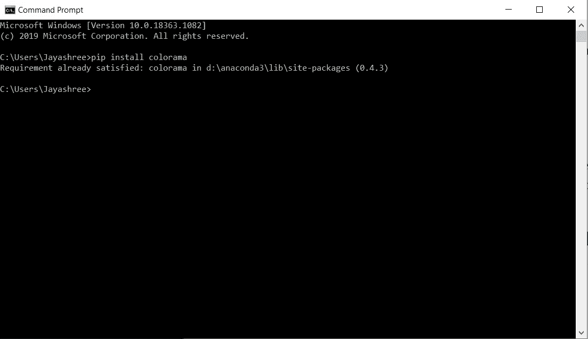
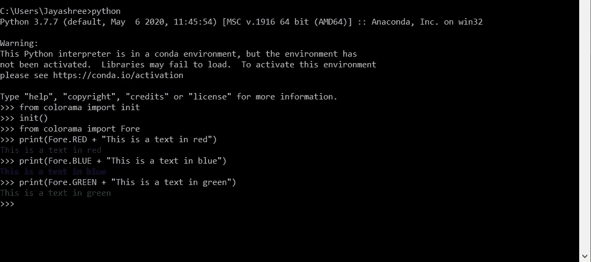
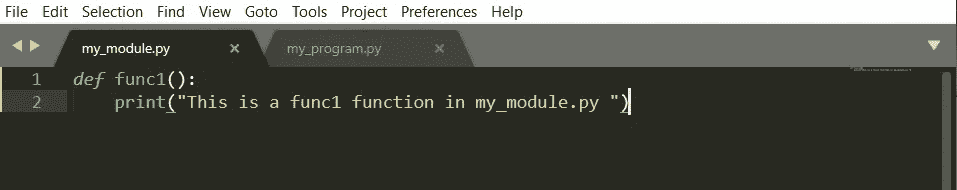
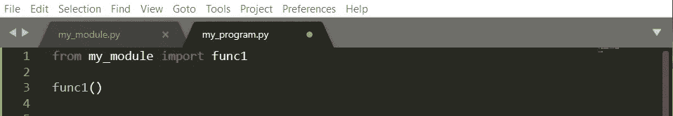
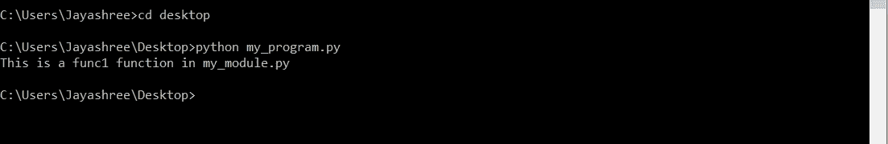
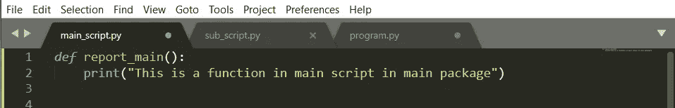
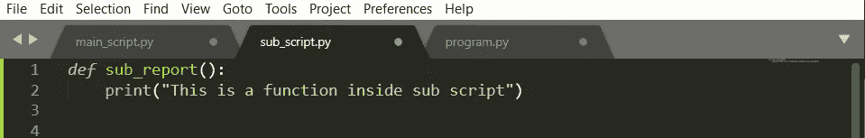
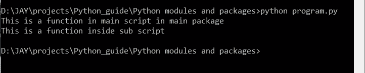
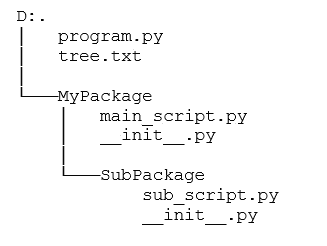

# Python 中的模块和包

> 原文：<https://levelup.gitconnected.com/modules-and-packages-in-python-1081f796ebd9>

## 了解如何使用 PyPi 安装模块和软件包以及创建自己的模块和软件包的指南。

PyPi 是开源第三方 Python 包的存储库。PyPi 上还有许多其他开源和共享的库。“pip install”命令用于安装这些软件包。

> 要了解 Python 安装，请查看我的另一篇文章[这里](https://medium.com/@domalajayashree/how-to-set-up-python-in-a-windows-system-920d6ac2549b)。

通过安装 Python，我们也自动安装了 pip。pip 是一种在命令行直接从 PyPi 存储库中下载包的简单方法。

# 如何下载和安装外部软件包？

让我们试着安装一个“colorama”包，它允许你在命令行中打印彩色文本。我已经安装了这个包，但是如果你没有的话，它会安装的。

现在让我们试着使用这个包。当我们必须使用一个包时，我们写“导入”命令。

# 如何创建自己的模块和包？

模块只是。在另一个。py 脚本。包是这些模块的集合。因此，我们也可以创建自定义模块和包。

去创造。py 脚本，最好使用编辑器。

我们首先创建两个文件，即“my_module.py”和“my_program.py”。

在“my_module.py”中，我们将创建一个基本函数。

my_module.py(来源:作者)

在“my_program.py”中，我们将使用刚刚创建的模块中的代码。

my_program.py(来源:作者)

所以现在当我们运行。py 脚本“my_program.py”调用“func1”函数的地方，我们会得到想要的输出。

这是创建模块的基本方法。现在我们将创建许多模块，并将其聚合到一个包中。所以现在创建一个文件夹“MyPackage”并创建一个名为“SubPackage”的子文件夹。现在，为了让 python 知道它必须将这些文件夹视为包，而不仅仅是文件夹，我们需要添加一个文件“__init__”。py”放在包文件夹和子包文件夹中。该文件为空。

现在创建两个文件“main_script.py”和“sub_script.py ”,并将其添加到 package 和 subpackage 文件夹中。然后创建另一个文件“program.py ”,我们将在其中导入包。相应地，编写给定的代码。

main_script.py(来源:作者)

sub_script.py(来源:作者)

文件夹目录应该如下所示:

目录树(来源:作者)

## 学习 Python 可以参考的入门书籍:

 [## Python 速成班，第二版:基于项目的编程入门实践

### 世界上最畅销的 Python 书籍的第二版。一个快速的，没有废话的 Python 编程指南…](https://amzn.to/3yDY4To)  [## 艰难地学习 Python:一个非常简单的介绍可怕的美丽世界…

### 你会学习 Python！Zed Shaw 完善了世界上最好的学习 Python 的系统。遵循它，你会…](https://amzn.to/3vtvQZv)  [## 思考 Python，2e:如何像计算机科学家一样思考

### 思考 Python，2e:如何像计算机科学家一样思考](https://amzn.to/3urluYI) 

## 学习 Python 可以参考的高级书籍:

 [## 编程 Python:强大的面向对象编程

### 如果你已经掌握了 Python 的基础，你就可以开始使用它来完成真正的工作了。编程 Python 将…](https://amzn.to/3fMzVBn)  [## 高级 Python 编程:使用以下工具构建高性能、并发和多线程应用

### 关键特性使用 Dask 和 PySpark Master 技能在集群上设置和运行分布式算法，以准确地…](https://amzn.to/34oFFMl) 

> *联系我:* [*LinkedIn*](https://www.linkedin.com/in/jayashree-domala8/)
> 
> *查看我的其他作品:* [*GitHub*](https://github.com/jayashree8)