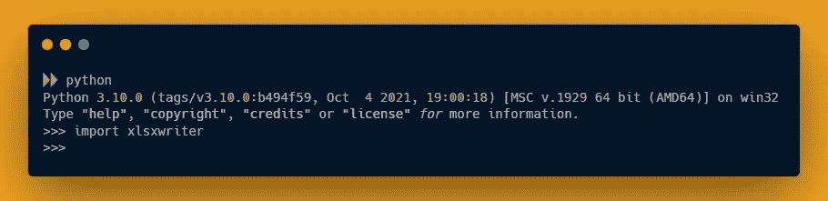
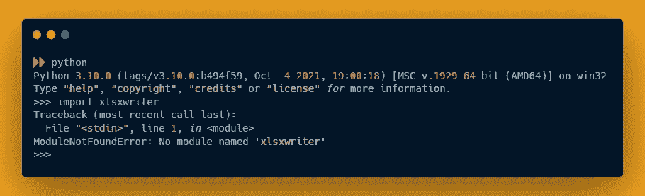
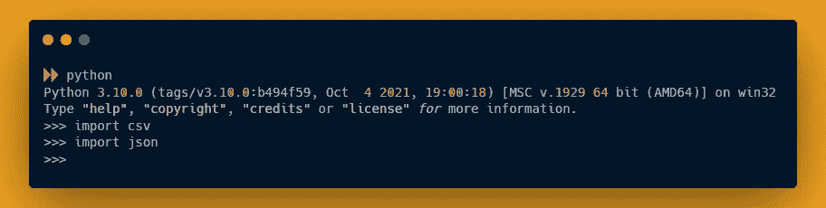
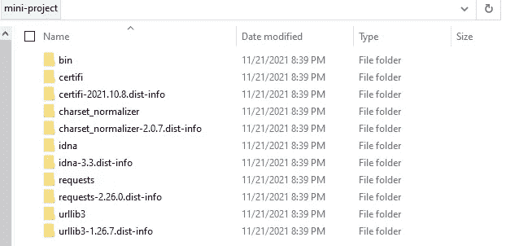

# Python 中的模块和包

> 原文：<https://levelup.gitconnected.com/modules-and-packages-in-python-63df7d952bb8>

了解模块和包的基础知识以及如何在 python 中使用它们


Python 中的模块和包

在现实生活的开发中，我们不需要编写每一行代码。如果有任何可用的资源或库，只要来源可信，我们通常会使用它们。这就像一句老话，“如果有可用的东西就用它，不需要重新发明轮子。”

因此，在本教程中，我将向您展示

1.  如何安装任何第三方软件包
2.  如何使用任何软件包(内置和/或第三方)

一旦我们理解了 python 中包的基本概念。我们将在一个小项目上工作，其中你将从一个用户的输入，并保存在不同的文件格式。

# Python 中的模块是什么？

在我们理解什么是包之前，我们需要理解什么是 python 中的模块。因为所有的包都是不同模块的组合。那么，**什么是模块呢？**

在实际开发中，代码文件可能有数百行甚至数千行。管理和处理一个文件中的所有代码是非常困难的，这根本不是编写代码的建议方式。这就是为什么我们把代码分成不同的部分。这些独立的部分被称为模块。

# Python 中的包是什么？

现在，在创建了所有模块之后，我们压缩所有相关的模块，得到一个包。因此，这个包只是相关模块的组合。大多数时候，当代码库变得太大时，我们会创建一个包。但是，你可能会看到，在 python 中，人们对待包和模块的方式是一样的。

# 如何在 Python 中安装一个包/模块？

要安装任何第三方软件包，我们需要`pip`。Pip 是 Python 的一个包管理器。如果你有 JavaScript 背景，你可能知道 npm 或者 yarn。因此，在我们用 python 安装任何包之前，我们需要确认我们的系统上是否安装了 pip。通常，python 安装程序会将 pip 与 python 一起安装。要验证 pip 安装，您可以在终端中使用以下命令

```
pip --version
```

如果这个命令抛出一个错误或者不显示任何 pip 版本，您可以使用下面的命令重新安装 pip。

```
python -m pip install --upgrade pip
```

安装过程完成后，再次检查 pip 版本。如果您仍然面临一个问题，请在评论部分提及该问题。我会尽力帮忙的。

使用 pip 安装软件包的语法:

```
pip install package_name
```

这只是一个基本的语法，我们可以用 pip 做很多操作。一旦我们验证了 pip 安装，我们需要软件包的名称。随着我们成为更有经验的开发人员，我们倾向于知道使用哪个包，如果我们不知道，我们可以在在线论坛上询问，例如 StackOverflow。

在这篇博客中，我将向你展示一个帮助我们以 excel (Xls)格式保存数据的包。我在谷歌上快速搜索了一下，发现我们可以用两个软件包将数据写入 excel

1.  xlsxwriter
2.  熊猫

可以有任何其他的软件包，但我经常遇到这两个。我们可以用 xlsxwriter 直接写成 excel 格式。为了读取 excel 文件，我们需要另一个名为 **xlrd 的包。**使用以下命令安装 xlsxwriter。

```
pip install xlsxwriter
```

# Python 中如何使用包/模块？

现在，如果我们在安装软件包时没有遇到任何错误，让我们来验证软件包的安装。要验证您是否可以在系统上打开终端，请按照图像中所示的步骤操作:



如果 xlsxwriter 没有正确安装在您的系统上，您将看到如下内容:



这是关于第三方包的。但是，你会问，我们如何使用内置的模块和包呢？我们可以像使用第三方包一样使用内置模块/包。一个区别是我们不需要安装 python 提供的任何模块/包。

在 python 中，我们有名为`csv`和`json`的内置包。要使用这些包，我们需要像导入 xlsxwriter 包一样导入它们。



# 用 Python 本地保存包中的所有文件

有时我们需要将我们的代码库上传到特定的云服务，我们可能无法像在本地系统上那样安装模块。Amazon lambda 就是这种云服务的一个例子。在这种情况下，我们需要将模块和代码文件压缩在一起。因此，要在本地特定位置安装该模块，我们可以使用以下命令:

```
pip install package_name -t PATH_TO_ROOT_FOLDER
```

假设我们想在当前目录下安装 xlsxwriter。要在当前目录下安装/下载 xlsxwriter，我们可以在终端中使用以下命令。

```
pip install xlsxwriter -t .# There is a space between "-t" and full stop(.)
```

这里，句号(。)代表当前目录。如果需要，还可以提供当前目录或特定目录的完整路径。一旦包被下载，我们将在当前目录中看到以下文件。



# 结论

终于！我们已经到了这一节的末尾😁。

在这篇博客中，我们了解了如何安装和使用软件包。但是，在 python 中打包概念还有更多。您可以创建和发布自己的包。我们将在其他博客中看到这一点。

我知道，一次接受太多了。但是，你不需要记住我在这里提到的一切。我只是展示给你看，这样你就能回忆起什么是可能的，什么是不可能的。还有一些我在这里没有提到的其他方法。

就这样。感谢您的阅读。

如果你需要任何帮助或者想讨论什么，请告诉我。在 [Twitter](https://bit.ly/3KjwgZV) 或 [LinkedIn](https://bit.ly/3JbsPDm) 上联系我。请务必在下面的评论中留下你的想法、问题或担忧。我很想看看他们。

> *想了解更多信息？*
> 
> *注册我的* [*简讯*](https://bit.ly/3Menk8Q) *，将最好的文章放入您的收件箱。*

直到下一次👋

> *探索我在 Python 101 系列中的其他博客*

[](/file-handling-in-python-6ffc23cc92c) [## Python 中的文件处理

### 所以，只是为了刷新我们的记忆，到目前为止，我们已经看到了 python 的所有基础知识，包括变量、数据类型、函数…

levelup.gitconnected.com](/file-handling-in-python-6ffc23cc92c) [](/create-and-use-functions-in-python-19b093f3ba9) [## 在 Python 中创建和使用函数

### 了解如何通过 Python 中的几个简单步骤来使用函数

levelup.gitconnected.com](/create-and-use-functions-in-python-19b093f3ba9) [](/conditional-statements-and-loops-in-python-b8ac64f36faa) [## Python 中的条件和循环

### 了解 Python 中的条件语句和循环

levelup.gitconnected.com](/conditional-statements-and-loops-in-python-b8ac64f36faa)