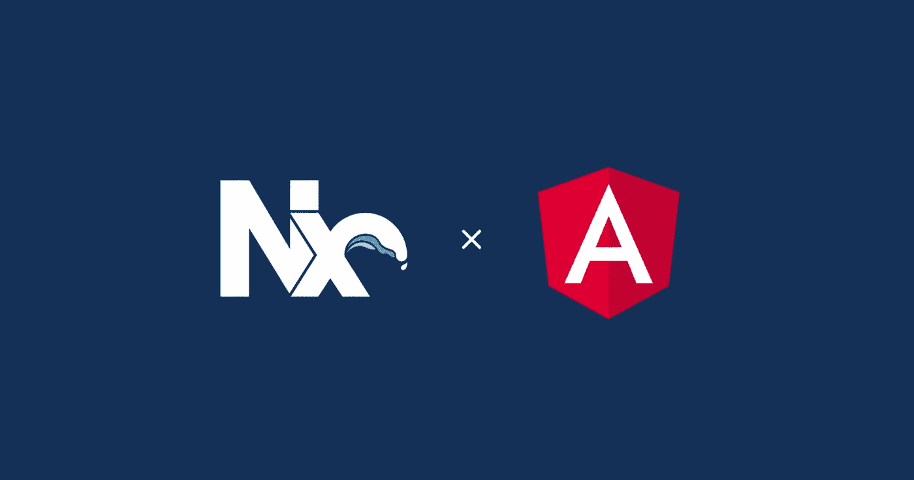
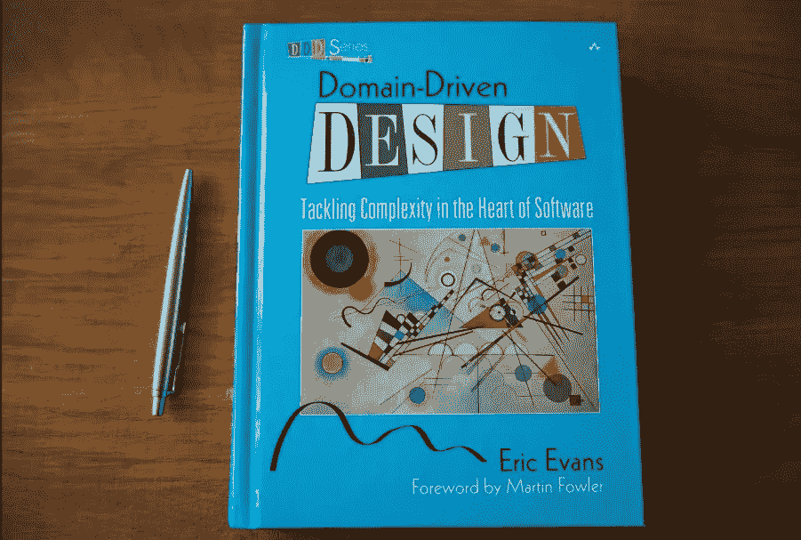
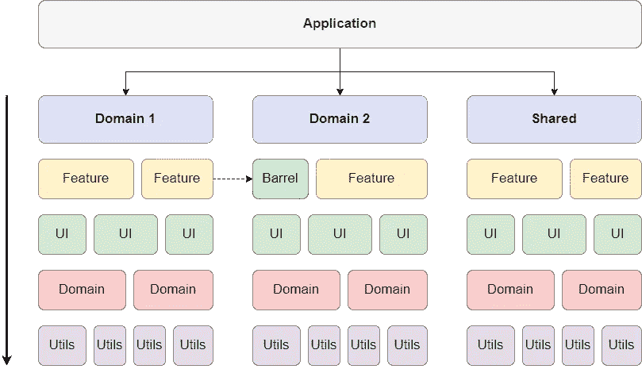

# 以 Nx 为单位的角度模数

> 原文：<https://levelup.gitconnected.com/moduliths-in-angular-with-nx-b8b0076794fb>

## 使用 DDD 和 Monorepos 创建可持续应用



## 整体建筑与微型建筑

[***微前端***](https://medium.com/stepstone-tech/microfrontends-extending-service-oriented-architecture-to-frontend-development-part-1-120b71c87b68) 几乎是新的趋势，围绕它有很大的炒作，因为它是一种很酷的技术，有自己的优势，如独立部署。通常，缺点没有被提及，而最令人担忧的缺点是复杂性增加，因此这种架构不应该被考虑用于许多应用。

选择微前端架构背后的原因通常不是技术决策，而是拥有许多前端团队、希望独立工作的大公司的组织决策。

这就是为什么大多数人坚持使用通常的 monolith，所有的模块和特性都在一个应用程序中。虽然它被描绘成老派，但对于大多数应用程序来说，它仍然是一个非常有效的架构，因为复杂性非常低，因此上市速度非常快。常见的主要缺点是，它没有强制任何边界，从长远来看会导致软件不稳定，难以维护和扩展。

有许多设计原则可以用来防止这种情况，其中之一是 **Modulith** ，它将两者的优点结合在一起。

## 领域驱动设计



模块化是基于被称为领域驱动设计的基本设计原则，这是关于设计独立的全功能特性仓——我们称之为领域。如果我们以 Medium 为例，我们可以怀疑我们至少拥有以下领域:*博客创建、计费、统计、用户订阅、通知/消息传递等。，…* 。它试图将不同域之间的依赖性降低到最小，因此最佳场景是没有域与另一个域有任何依赖性。通常情况下，情况并不总是这样，但是通过共享内核或独特的 API 限制等模式，我们可以将依赖性降低到最小。

这样，如果有足够的资源可用，我们可以将团队分配到域中。否则，DDD 仍然是一个很好的遵循原则，因为关注点严格分离的基本原则使得软件本身更加稳定，因为域没有(或者只有很少)依赖于其他域。因此，我们可以扩展一个域，而不用担心应用程序的某个完全不同的部分出现问题。

## 模数

一个模块是基于 DDD 的，这样它就把一个经典的整体分割成多个区域。这些域不会直接在应用程序本身中实现，而是每个域将成为一个角度库，然后由应用程序使用。

就像微前端架构一样，我们有不同的域/库，它们划分了清晰的边界，因此有助于更稳定的软件。但是我们没有微前端的复杂性，因为不是在不同的微前端中使用库，而是在一个应用程序中使用所有的库。

简单来说，模块有清晰的边界，就像 DDD 方式的微前端架构，但整体结构的复杂度更低。

## （同 nonexpendable）非消耗品

Angular 作为前端框架，不过说实话，这个例子中真正的英雄是 **Nx** 。以前没听说过 Nx？基本上，Nx 在 Angular CLI 的基础上提供了额外的工具来创建和管理 monorepositories，它将各种应用程序和库保存在一个库中，只有一个 package.json。这意味着每个库和应用程序都依赖于相同版本的包，因此版本不匹配是不可能的。此外，你不必将你的库发布到 NPM 注册表中，并安装到应用程序中，而是可以在 Nx 的帮助下直接引用它们。已经听起来不错了？准备好迎接更多的美好吧。

## [@ angular-architect](https://www.npmjs.com/package/@angular-architects/ddd)s[/DDD](https://www.npmjs.com/package/@angular-architects/ddd)套餐

Angular Architects 提供了一个非常好的示意图包，它不仅帮助我们跟踪 DDD，还给了我们实施它的可能性。首先，我们进行传统的域切片，并在 *libs* 文件夹中为每个域创建一个文件夹。但是我们并没有就此止步，相反，我们还通过深入研究**特性**、 **UI** 、**域**和**实用程序**，在域内部划分出不同的界限。



智能组件被认为是特性，而非智能组件被认为是 UI。状态管理、服务和后端通信和逻辑通常包含在域中。Utils 将包含相当经典的独立 JavaScript 助手函数，如 createUuid()、parseSomeDate()等。

但这还不是全部！如果我们使用@ angular-architects/DDD schematics，那么每个特性、UI、域和实用程序都将是一个单独的库。为什么这样因为这样一来，标签可以添加到 *project.json* 文件中，我们可以在林挺配置中使用这些标签来创建水平和垂直限制。这意味着我们不仅可以限制域 A 和 B 之间的访问，而且我们还可以在域内部进行限制，因为我们将一个域分成了多个子库。

*   **Utils** 可以依靠**一无所有**
*   **域**可以依赖**工具**
*   **UI** 可以依赖**域**，**实用程序**
*   **功能**可以依赖 **UI** 、**域**、**实用工具**

## 林挺规则

在文件 *.eslintrc.json* 中，我们现在可以使用库上指定的标签来创建林挺规则的限制。幸运的是，当我们使用 schematics 创建库时,@angular-architects/ddd 包可以处理所有这些问题。

在 *depConstraints* 数组中，依赖关系被明确指定如下:

```
...
{ “sourceTag”: “domain:domainA”, “onlyDependOnLibsWithTags”: [ “domain:domainA”, “domain:shared” ]}, 
...
{ "sourceTag": "type:feature", "onlyDependOnLibsWithTags": [ "type:ui", "type:domain-logic", "type:util" ]},...
```

## 现实场景

理想情况下，所有域都应该完全隔离，彼此之间没有任何依赖关系，但这是不现实的。通常情况下，域 A 对域 B 内部的某些东西有一点依赖，如果我们知道如何处理这一点，这是完全没问题的。我们可以创建一个单独的桶来暴露域 A 的依赖性，或者创建一个共享内核，当我们担心循环依赖性时，这也是一个好方法。

但是要注意，把所有东西都放在共享内核中会把你的应用程序变回一个经典的整体，破坏我们通过模块化设计获得的所有好处。因此，如果可能的话，创建多个共享内核，不要把所有的哑组件放在一个共享内核中。尽管哑组件不知道它们被使用的确切数据上下文，但是它们仍然可以知道它们被使用的域。

## 结论

模数非常适合许多架构。如果您想以一种清晰的方式构建您的应用程序，并通过林挺规则来加强边界，但不关心独立部署，那么 modulith 是一条不错的道路。如果你不喜欢 DDD，你仍然可以通过使用 Nx，单独的库和林挺规则来保护边界。否则我推荐使用[**@ angular-architects/ddd**](https://www.npmjs.com/package/@angular-architects/ddd)包在你的 Angular 应用中跟随 DDD。

## 通过我的推荐链接加入 Medium:

如果你喜欢这篇博文，并想在 Medium 上无限阅读，如果你能使用我的推荐链接创建一个 Medium 订阅，我将不胜感激:

[](https://medium.com/@stefan.haas.privat/membership) [## 通过我的推荐链接-斯特凡·哈斯加入媒体

### 阅读斯特凡·哈斯的每一个故事(以及媒体上成千上万的其他作家)。您的会员费直接支持…

medium.com](https://medium.com/@stefan.haas.privat/membership) 

## 其他有趣的阅读:

[](/your-first-angular-microfrontend-58950768a465) [## 角形微前端波导

### 这是一个关于如何创建一个简单的 angular 应用程序来使用另一个应用程序的模块的分步指南…

levelup.gitconnected.com](/your-first-angular-microfrontend-58950768a465) [](/refactoring-angular-applications-be18a7ee65cb) [## 重构角度应用程序

### 重构是软件工程中最重要的技术之一，因为它是项目进行的唯一方式

levelup.gitconnected.com](/refactoring-angular-applications-be18a7ee65cb) [](/secure-frontend-authorization-67ae11953723) [## 使用令牌处理程序模式的 SPA 身份验证

### 为单页应用程序构建安全认证过程的现代方法。

levelup.gitconnected.com](/secure-frontend-authorization-67ae11953723) [](/sustainable-future-proof-web-frontends-89ac5dd67dfb) [## 可持续的(经得起未来考验的)网络前端

### 在这一点上，它已经成为一个公认的迷因，每隔几个月就会弹出一个新的 JavaScript 框架…

levelup.gitconnected.com](/sustainable-future-proof-web-frontends-89ac5dd67dfb) 

## 更多关于 DDD 与棱角分明:

[](https://www.angulararchitects.io/aktuelles/tactical-domain-driven-design-with-monorepos/) [## 战术领域驱动的设计与角和 Monorepos？-角形建筑

### 这篇文章是关于领域驱动设计的系列文章的一部分

www.angulararchitects.io](https://www.angulararchitects.io/aktuelles/tactical-domain-driven-design-with-monorepos/) 

# 分级编码

感谢您成为我们社区的一员！更多内容见[级编码出版物](https://levelup.gitconnected.com/)。
跟随: [Twitter](https://twitter.com/gitconnected) ， [LinkedIn](https://www.linkedin.com/company/gitconnected) ，[迅](https://newsletter.levelup.dev/)
升一级就是转型科技招聘👉 [**加入我们的人才集体**](https://jobs.levelup.dev/talent/welcome?referral=true)