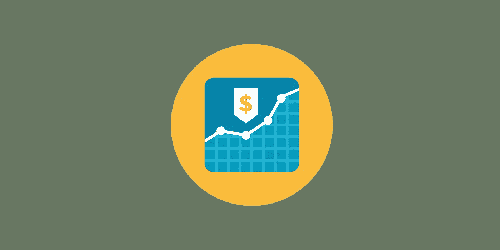
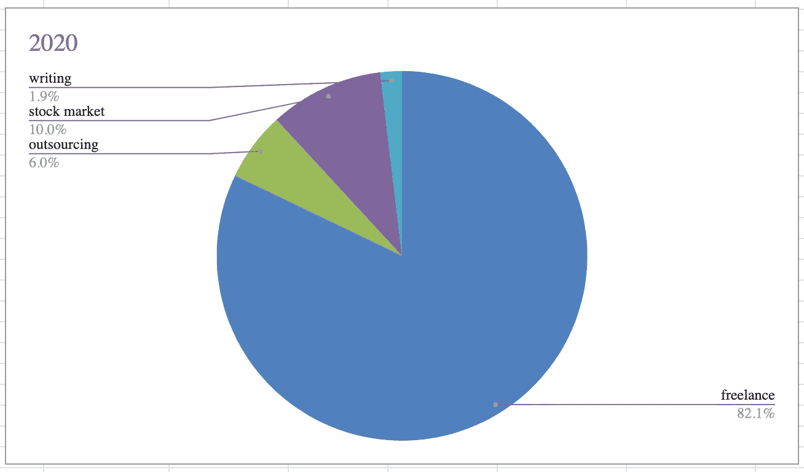

# 自由职业者的理财小贴士

> 原文：<https://levelup.gitconnected.com/money-management-tips-for-freelancers-ec521a80830d>

## 如何充分利用你的自由职业收入

图片:作者

我欠自由职业者很多。正如我的读者所知，它为我提供了[可靠的收入](https://jovancicmil.com/blog/how-i-made-over-150k-on-upwork)和[充分的自我提升机会](https://jovancicmil.com/blog/how-to-adopt-radical-open-mindedness)。

然而，自由职业并非没有挑战。独立也意味着自力更生。自由职业者没有保障，没有健康计划，也没有养老金——你必须自己去实现它们。

作为自由职业者，这里有一些理财的小技巧。

# **记账**

对于一个自由职业者来说，记账有多重要，我怎么强调都不为过。每个月底，花点时间总结一下你在每个客户/项目/平台上的收入。制作一个精美的 Excel 表格，其中包含一些随时间变化的图表。这一点至关重要，原因有几个:

*   跟踪你的自由职业收入和工作量的进展可以让你很容易发现问题。上一个项目是否耗费了过多的时间？Upwork 的客户与 LinkedIn 的客户相比如何？你的哪项技能在单位时间内收入最高？
*   当你有几个收入流时，你可以把它们加到表上，很容易就能看出它们是如何衡量的。然后，您可以根据不同活动的当前价值和增长趋势，灵活分配时间。不要依靠感觉来安排你的时间。
*   从长远来看，以可视化的形式显示数据是非常有价值的。随着时间的推移，分析你在多大程度上依赖于收入的某些方面，以及趋势是什么，会容易得多。

这是我今年迄今为止的一张图表:

明年，我希望增加自由职业收入的绝对数量，但将其重要性降低至少 10%。我计划通过改善其他收入来源来做到这一点，特别是写作和(这是一个新的)在 Udemy 上教学。

# **将你的灵活性货币化**

自由职业者与其他工作类型的区别之一是灵活性。灵活性的价值远不止舒适或更丰富的社交生活。这也意味着你可以抽出时间去追求其他的兴趣。从长远来看，这些兴趣可以成就你，也可以毁掉你。

例如，今年我录制了我的第一个在线课程。由于天气/噪音的原因，我只能在特定的日子里从下午 1 点到 3 点做这件事。在家和灵活的时间表使这成为可能。我一直有一个全职的自由职业项目，但我通过早上早点开始和/或晚点结束来凑合。

在我不能录音的日子里，我会在这段时间工作，并在下午早些时候完成，这样我就可以专注于写作或学习。

# 投资股市

金融专家在许多事情上意见不一，但他们都同意一点:尽早投入尽可能多的钱。复利是一种自然力。

我投资股票市场已经五年了。越早开始，你的长期回报就越好。你越早教育自己如何投资和投资什么，你就能越早开始。

好像做你自己的簿记员还不够，我现在要求你也做你自己的财务顾问。这听起来可能很多，但是你不需要一次做完所有的事情，这是值得的。

你不仅避免了大量的费用和开支，还在金融市场等领域进行了自我教育，并逐渐理解了经济是如何运转的。从长远来看，这是非常宝贵的，因为最终，我们都是经济机器的一部分。如果你明白它是如何运作的，你可以更好地计划，做出更好的选择，压力更小，收入更多。

# **投资发展你的品牌**

直到我开始推广我的课程，我才意识到在社交媒体上露面有多重要。具体来说，Twitter 上充斥着网络开发人员、设计师、文案和其他各种自由职业者，他们每天都在创造内容。

这些内容有助于他们分享知识，扩大受众，并与其他自由作者建立联系。出于各种原因，所有这些事情都很重要。

## **为什么自由职业者应该分享知识？**

事实已经一次又一次地证明，最好的学习方法是把你的知识用一种别人可以理解的格式表达出来。这有助于你发现知识上的差距，并更快地提高。当你想发布一个付费产品，如一门课程或一本书时，它也建立了可信度。帮助那些现在可能和你五年或十年前一样的人，这本身也是值得的。

## 为什么自由职业者应该扩大他们的受众？

拥有观众会给你力量。我见过 Twitter 上的人通过向他们的关系发布推文来找到工作，通过一条很棒的推文卖出数百本书，并找到合作伙伴来共同打造产品和公司。这些人中没有一个人拥有数百万的粉丝——大部分都在 1 万到 5 万之间。例如，当你写一本书时，你能想象如果你有 20，000 名追随者，与你没有追随者相比，获得早期销售和好评是多么容易吗？

## **一个自由职业者为什么要和其他自由职业者联系？**

除了分享知识，还可以收获知识。对我来说，2020 年是我真正开始理解在线营销中什么行得通，什么行不通的一年。我学习的一部分是通过为我的课程尝试各种自制的宣传，一部分是通过在 Twitter 上关注相关人士。与其他自由职业者联系甚至有更大的潜力:他们可能会提升你和你的内容，或者你们最终可能会一起建立一些东西。

根据你的计划，通过有偿促销来启动你的社交活动可能是有意义的。如果你已经有想要推广或销售的产品，这一点尤其正确。不管你是否发现在这方面投资在经济上可行，如果你计划在自由职业之外的其他收入来源上进行多样化，投资时间是必须的。就像股票市场一样，越早开始越好。

# **以多种货币记账**

在你的自由职业生涯中，你可能会收到多种货币的报酬，尤其是如果你住在欧洲。这是一个好主意，至少维持美元和欧元账户，这样你就可以引导你的北美客户到一个账户，而欧洲客户到另一个账户。

这将为你节省百分之几的收入，否则将损失货币兑换。这不是一个巨大的收获，但它的努力和成本非常小。Payoneer 等在线支付公司允许你拥有多个附有借记卡的货币账户，无需支付额外费用。

# **小心税收**

各国的税收法规各不相同，在涉及到国际商务时可能会非常复杂。注意你如何收到你的付款，你需要告诉你的国家税务机关什么，你不知道什么。与在该领域有知识的人交谈。

国际自由职业是一个相对较新的现象，许多国家的法律还没有适应。如果是这种情况，不要让他们胁迫你根据一些过时的规则支付更高的税收。与值得信赖的法律顾问进行一次长时间的讨论，考虑你所有的选择。

# **保持缓冲**

当传统公司想要雇用你时，他们不可避免地会试图向你兜售自由职业缺乏财务保障的故事。只有在你不打理好自己的财务的情况下才是这样。

为此，你应该始终保持足够的现金缓冲，让你舒适地度过几个月不工作的日子。在九年的自由职业生涯中，这种事情从未在我身上发生过，我最长的一次不必要的中断是大约三周。

# **结论**

想想上面的几点。你如何将它们融入到你的生活中，以促进你的职业生涯，并给自己最大的成功机会？

一个生活井井有条的自由职业者可以胜过整个机构。所需要的只是技术知识、生产力、沟通技巧和组织的良好结合。