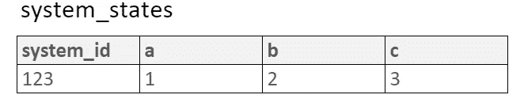

# MongoDB:用原子操作维护数据完整性

> 原文：<https://levelup.gitconnected.com/mongodb-maintain-data-integrity-with-atomic-operations-7c40d505b41e>

## 仔细看看 MongoDB 的$set、$setOnInsert、$push、$pull 和$inc 更新操作符

我和我在 [Nightlife Music](https://nightlife.com.au) 的团队已经使用 [MongoDB](https://www.mongodb.com/) 一年多了，用来存储我们音乐系统状态的对象表示，在这段时间里，我们学到了(并且仍在学习)很多关于如何正确使用和如何*而不是*使用数据库的知识。

首先，简单介绍一下我们如何使用它以及为什么使用它。


我们的公司为企业提供音乐解决方案，在一个场所播放的音乐存储在一台保持自身状态的计算机上，但当它的状态发生变化时，也会向我们的云基础设施发送通知。我们还可以从云中更改它的状态，当我们这样做时，我们会收到相同的通知。

## 我们如何处理从系统中收到的通知？

为了能够确定需要做出什么改变，我们需要两条信息:机器的*当前*状态，以及*预期*状态。预期状态通常由用户通过 GUI 填充，而机器的当前状态通过接收通知和更新该系统的 MongoDB 文档来存储。

我们将这两个对象都作为 BSON 对象存储在 MongoDB 中(在这里阅读关于 JSON 和 BSON 的更多信息),当需要应用差异时，我们只需检索这两个对象，比较这两个对象，并计算出我们需要向系统发送什么 API 调用来改变其状态以匹配预期的状态。

在这个模型中，**我们有一个准确的系统当前状态**是至关重要的，否则预期值和当前值之间的差异将产生不正确的动作。这就是 MongoDB 及其在任何粒度级别更新属性的能力的用武之地。

## 我们最初是如何接近 MongoDB 的

当我们第一次使用 MongoDB 时，我们的过程看起来有点像这样:

```
// Receive state update notification from music system
// Retrieve **whole** state from MongoDB by ID
// Replace relevant section(s) of state with data from notification 
// Save **entire** state back to MongoDB 
```

如果您**一次只处理一个通知**并且只有一个应用程序实例在运行，这个过程虽然不是很高效，但会保持您的数据完好无损。我们的情况不是这样。

首先，我们通过 [RabbitMQ](https://www.rabbitmq.com/) 接收这些通知，我们的应用程序一次从队列中拉出多个通知。此外，当我们收到大量通知时，我们可能希望扩展我们的应用程序来运行多个重复实例，以跟上入口。

下面的代码片段显示了在 MongoDB 中保存整个文档时，通知的并行处理可能会相互冲突和覆盖:

展示了 MongoDB 中的文档在检索整个文档、修改和保存它时如何变得不正确。

上面的问题是，如果在两个通知中的任何一个有时间写入新状态之前检索当前状态，那么最后一个写入将覆盖第一个写入的更新值(在上面的情况下，`b`的更新值将被来自**原始**当前状态的值覆盖，其中`a`的变化的通知被检索。

上面显示了当我们只是并行处理**两个**通知时，状态如何可能与系统发送给我们的不匹配。想象一下，如果我们处理*千个*会发生什么。相对于系统的*实际*状态，我们可能会偏离 MongoDB 中为我们的系统存储的内容。这就是“set”风格操作的用武之地，因为我们可以只对我们想要更新的属性执行原子操作。

## 我们如何确保不会覆盖准确的数据？

在我们进入 MongoDB 代码来解决这个问题之前，让我们看一下在同样的情况下我们会对 SQL 做什么。假设一行和列代表一个对象:



SQL 表“system_states ”,显示我们的系统状态数据如何在 SQL 中表示

为了更新`a`的值，我们不会检索整行，更改`a`然后再次设置整行(尽管我很确定我们已经被发现这样做了一两次),原因与我们不想写回整个 MongoDB 文档的原因相同:我们可能会在应用程序中处理更新时清除另一个事务所做的任何更改。

我们会这样做:

在两个并行查询中更新一行中两个不同字段的简单 SQL 语句示例

请注意，`a`和`b`的值不可能与我们收到的通知不匹配，因为我们是在单个表格单元格上执行原子操作。

## 用 MongoDB 的方式处理它

那么，为什么我们在处理 MongoDB 文档时不执行相同类型的操作呢？对一些人来说这似乎是显而易见的，也许我们应该在开始之前更仔细地阅读文档，但是学习下面的操作符完全改变了我们使用 MongoDB 的方式。那么，让我们只看几个。

我们使用的一些是:

[**$set**](https://docs.mongodb.com/manual/reference/operator/update/set/#up._S_set) —相当于与其同名的 SQL，设置单个字段的值

使用$set 运算符更新属性“a”和“b”

[**$seton insert**](https://docs.mongodb.com/manual/reference/operator/update/setOnInsert/#up._S_setOnInsert)**—类似$ set，但仅当文档是一个*新*文档时，才将字段的值设置为指定值。我们可以用它来设置文档的创建日期:**

**当找不到现有文档时，将属性“created_at”设置为当前日期和时间。请注意“upsert: true”选项，如果没有找到，它将创建文档**

**[**$push**](https://docs.mongodb.com/manual/reference/operator/update/push/#up._S_push) —将项目推入数组类型的属性中。我们还可以指定一个可选的索引来放置项目。可能被用来记录事件的历史，就像我们下面的`save_history`**

**将包含带有今天日期的“saved_at”和带有用户名的“saved_by”的对象推入 save_history 属性**

**[**$pull**](https://docs.mongodb.com/manual/reference/operator/update/pull/#up._S_pull) —从数组中拉出符合我们条件的项目。一个示例用例可能是取消用户接收有关对象变更的电子邮件更新:**

**从现有数组中提取一项**

**[**【Inc】**](https://docs.mongodb.com/manual/reference/operator/update/inc/#up._S_inc)**-数值字段按指定数量的值。我们可以用它来跟踪文档的版本号。注意，如果属性不存在，第一个值将等于指定的值`$inc:`****

****对于每个 update 语句，将属性“$inc”增加 1。如果该属性不存在，第一条语句会将其设置为 1****

## ****主要是原子和安全的…****

****除了`**$push**` 之外，上述所有操作符都是完全原子化的，无论我们以何种顺序处理通知，都将保护您的数据安全。`**$push**` 当我们不在乎对象在数组中出现的顺序时也是可以的，但对我们来说并不总是这样。当顺序很重要时，事情会变得有点棘手，如果不检索相关属性的当前状态，可能无法执行原子操作。****

****这些只是可以用 MongoDB 执行的一些原子写操作的几个例子。更多可以在这里找到。****

****如果您想了解更多关于当数据无序地从异步事件传入时如何处理对 **same** 属性的并发更新，请看看这篇文章: [MongoDB:处理来自异步事件的并发更新](/mongodb-handling-parallel-writes-fa7744565313)。****

****感谢阅读和快乐蒙格。****

## ****资源****

1.  ****[夜生活音乐](https://nightlife.com.au)****
2.  ****[MongoDB](https://www.mongodb.com/)****
3.  ****[JSON 和 BSON](https://www.mongodb.com/json-and-bson)****
4.  ****[RabbitMQ](https://www.rabbitmq.com/)****
5.  ****MongoDB [更新操作员](https://docs.mongodb.com/manual/reference/operator/update/#id1)****