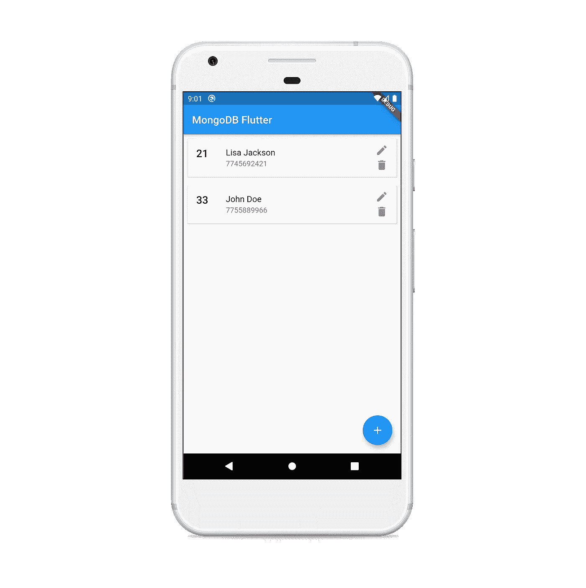
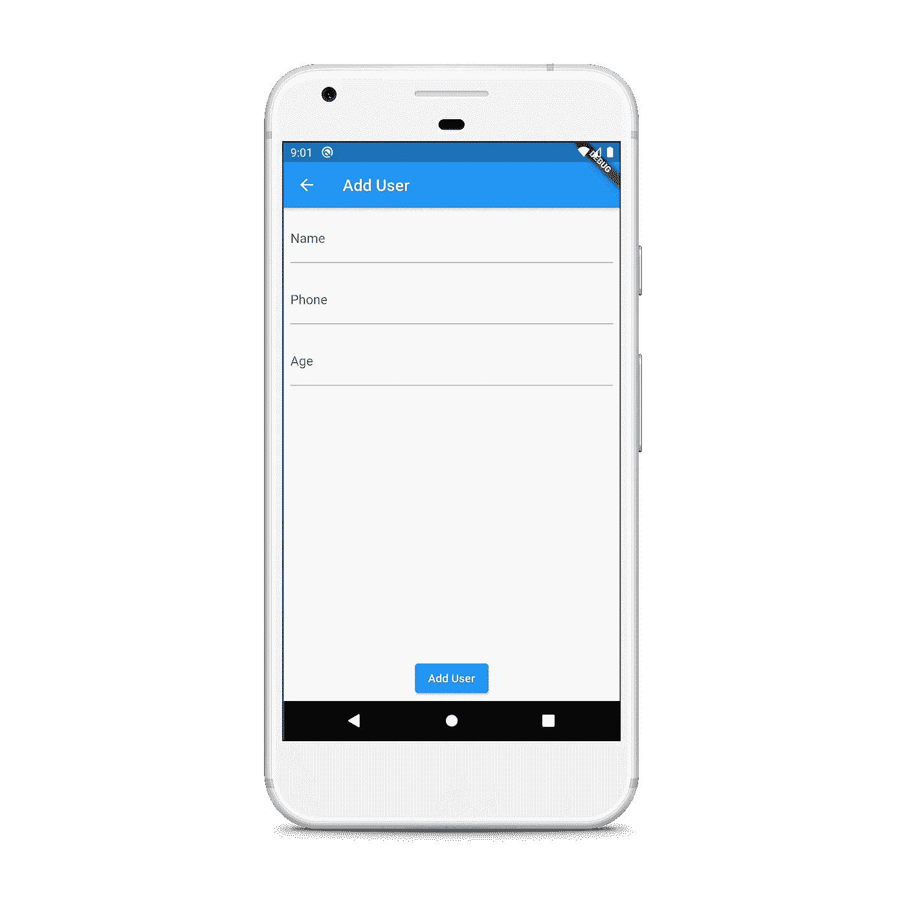
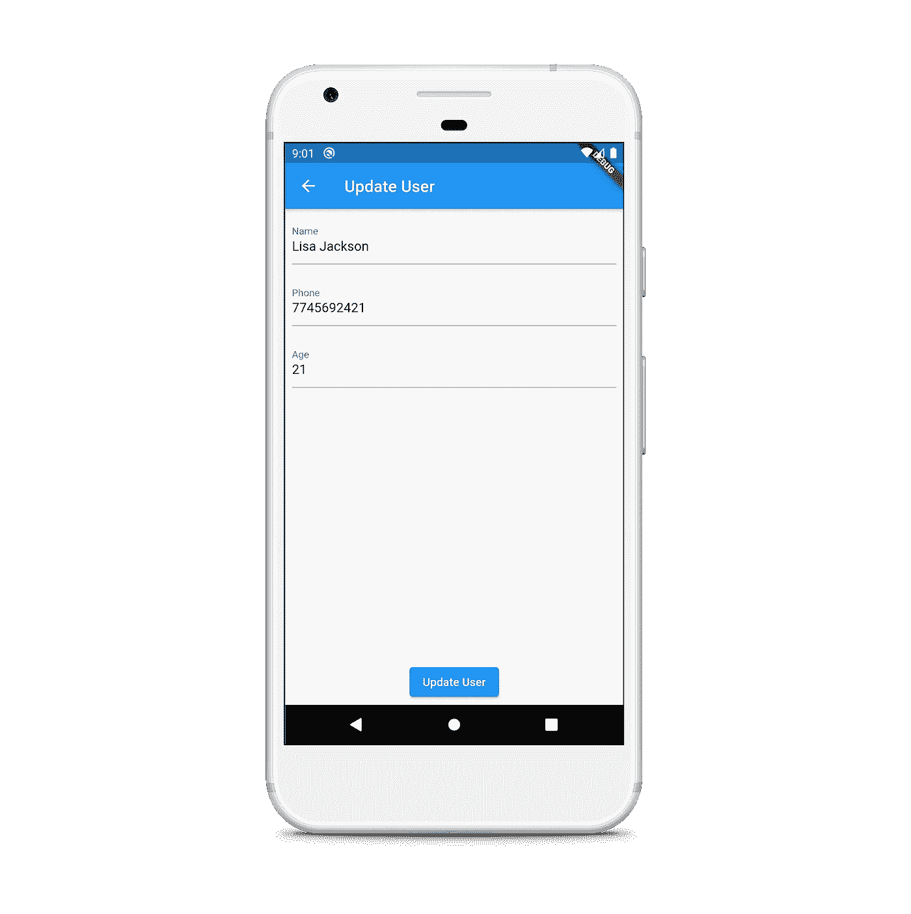

# 带颤振的 MongoDB

> 原文：<https://levelup.gitconnected.com/mongodb-with-flutter-407de79f84e4>

MongoDB 与 CRUD 操作在颤振中的集成


MongoDB 是流行的开源 NoSQL 数据库之一。在本文中，我们将看看如何在扑动应用程序中使用它。

在这个例子中，我们将使用 [mongo_dart](https://pub.dev/packages/mongo_dart) 包，这是一个用纯 dart 语言实现的 MongoDB 的服务器端驱动程序库。让我们开始吧！

# 装置

1.  将`mongo_dart`依赖项添加到您的`pubspec.yaml`文件中:

```
dependencies**:
  mongo_dart: ^0.4.4**
```

2.在终端中运行以下命令进行安装:

```
**$ flutter pub get**
```

3.导入包:

```
**import 'package:mongo_dart/mongo_dart.dart';**
```

# 履行

我们将创建的应用程序将拥有简单的用户群`List`。用户模型如下:

需要注意的是`id`属于`ObjectId`型，属于蒙古型。

创建一个新的文件`database.dart`，它将允许我们连接到 Mongo 数据库并保存 CRUD 操作。

让我们在刚刚创建的文件中创建一个新的类`MongoDatabase`。首先，让我们连接到 Mongo 数据库。添加以下方法连接到数据库:

这里，我们使用库提供的`Db`类中的`create()`作为 Mongo 连接 URL。URL 应采用以下形式:

```
"mongodb+srv://<USER>:<PASS>@<DB>/<COLLECTION>;
```

接下来，我们用`open()`打开数据库，在`userCollection`中获取集合。

## 创造

创建一个新文档非常简单。您只需要调用集合中的`insertAll()`就可以一次插入多个文档。在这里，我们将只使用它来插入一个文档。这可以通过以下方式完成:

这里，我们只需要调用方法并转换`User`来映射并将其传递到一个列表中。

## 阅读

要阅读 Mongo 的所有文件，我们需要使用集合上的`find()`。我们还需要将它们转换成列表，以便在用户界面上显示。这可以通过`toList()`来完成，它以动态类型值返回以字符串为键的地图对象列表。

这里，我们还使用一个简单的 try-catch 语句来处理空结果条件。

## 更新

更新文档时，我们使用`findOne()`按 id 查找文档，分配新值并使用`save()`保存到集合中。

## 删除

为了删除一个文档，我们调用`remove()`进行收集，并使用 where 子句传递 **ObjectId** 。

> **文章保持简单，这样你可以专注于概念，你不应该在生产应用中编写这样的代码。**

有了这些方法，让我们快速设置所需的页面。

我们将有一个用户卡中的用户列表的主页，以及一个浮动的动作按钮，这将引导我们到我们可以添加用户的页面。用户卡将有编辑和删除按钮。我们将使用`FutureBuilder`从数据库中获取文档。

主屏幕如下所示:



> ***为简洁起见，本文仅包含必要的代码，您可以在文章末尾找到 GitHub 到完整源代码库的链接。***

让我们添加一个新页面`add_user_page.dart`，它将用于添加新用户以及更新现有用户。添加或更新用户将取决于路由参数。该页面将有三个`textField`部件，分别用于姓名、电话和年龄。添加用户的用户界面如下所示:



插入和更新用户的方法有:

注意，我们在插入新用户时使用`ObjectId()`创建一个新的 id，但在更新用户时分配相同的 id。我们从前面创建的类中调用相应的插入和更新方法。

更新用户界面如下所示:



最后一步是在应用程序启动时连接到数据库。这可以通过以下方式实现:

这里，我们将`main()`设为`async` ，这样我们就可以调用`connect()`来连接 mongo 数据库。就这样，我们有了一个使用 MongoDB 作为数据库的可用的 flutter 应用程序！

# 结论

在本文中，我们通过一个简单的例子探索了如何在 flutter 中使用 MongoDB 并执行 CRUD 操作。

完整的源代码可以在下面的链接中找到:

[](https://github.com/harshshinde07/MongoDB-Flutter) [## harshshinde07/MongoDB-Flutter

### 一个演示如何将 mongodb 连接到 Flutter 应用程序的应用程序

github.com](https://github.com/harshshinde07/MongoDB-Flutter) 

## 感谢您阅读这篇文章。如果你喜欢这篇文章或者学到了新的东西，尽可能多地鼓掌以示支持。👏

## 这真的激励我继续写更多！:)

## 如果有错误，请随时纠正。

## 我们来连线:

*   [GitHub](https://github.com/harshshinde07/)
*   [领英](https://www.linkedin.com/in/harshshinde07/)