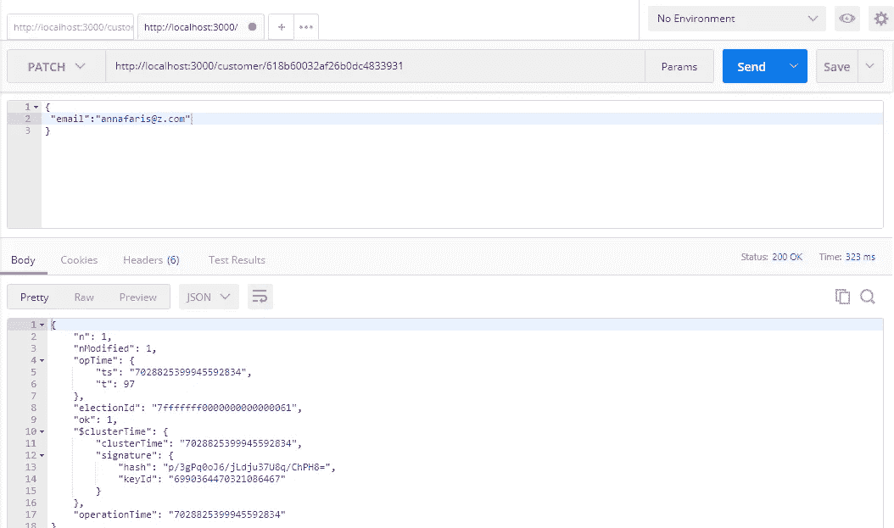

# 带有 NodeJS 的 MongoDB

> 原文：<https://levelup.gitconnected.com/mongodb-with-nodejs-b4b01d6c725c>


照片由[詹姆斯·哈里森](https://unsplash.com/@jstrippa?utm_source=unsplash&utm_medium=referral&utm_content=creditCopyText)在 [Unsplash](https://unsplash.com/s/photos/code?utm_source=unsplash&utm_medium=referral&utm_content=creditCopyText) 上拍摄

MongoDB 是 NoSQL 世界中非常流行的面向文档的数据库。它利用集合和文档，而不是关系数据库的表和行。集合由一组文档组成。数据将存储在文档中的键值对中。

在这里，我们将研究如何将 MongoDB 与 NodeJS 应用程序集成，并使用它进行基本的 CRUD 操作。让我们直接开始工作吧，不要谈太多的细节。

首先，您需要设置 MongoDB。在这个实现中，使用了 MongoDB Atlas，这是一个云数据库。如果需要，我们也可以在本地安装 MongoDB。

你可以在这里找到设置 MongoDB Atlas [的细节。](https://www.mongodb.com/basics/mongodb-atlas-tutorial)

## 设置 NodeJS 项目

1.  在您的计算机上创建一个文件夹，并在其中打开命令。用 ***npm init -y*** 命令初始化项目。

NodeJS 应用程序中使用了以下依赖项。

*   `express`
*   `mongoose`
*   `nodemon`
*   `dotenv`

2.安装上述依赖项。

```
npm i express mongoose nodemon dotenv
```

3.如下所示在 package.json 上添加启动脚本。

```
"scripts": {   
   "start": "nodemon app.js"  
}
```

**项目结构**

项目的文件夹结构


项目结构

## **实施**

与 MongoDB 的连接在 db.js 中形成。

db.js

可以在中提供连接字符串。这是它看起来的样子。

```
*DB_CONNECTION = mongodb+srv://<username>:<password>@cluster0.z4xzn.mongodb.net/<dbname>?retryWrites=true&w=majority*
```

你可以在 MongoDB cloud 里找到这个。

这是 app.js 文件的外观。

app.js

在命令提示符下键入***node mon app . js***启动项目。如果一切正常，您将看到日志“连接”(如果数据库连接成功)和“监听端口 3000”。那你就可以走了。

首先，我们需要为应用程序创建模式。已创建以下内容来保存客户详细信息。它在 customer_model.js 中。

客户 _ 模型. js

***customer schema***是父模式， ***ordersSchema*** 是子模式。因为订单是一个包含订单细节的对象。

现在我们可以通过应用程序执行数据库操作。为了测试端点，我使用了 Postman。所有端点都在 customer_routes.js 中定义。

**保存数据**

要将数据保存到数据库中，我们可以执行以下操作。

客户 _ 路线. js

让我们用 Postman 测试一下这个 API。


添加客户

我们得到了如上的回应。现在让我们检查数据库。


Mongo 云数据库

成功了！。数据已经保存在 mongo 云数据库中。我们可以根据需要添加任意多的数据。我已经添加了另一个这样的对象。

```
{
 "name": "Anna Faris",
 "email":"[annafaris@y.com](mailto:annafaris@y.com)",
 "order": {
  "orderId": ["ord002", "ord003"],
  "title": ["OnePlus 9RT", "Realme Bluetooth Speaker"],
  "price": ["$1065","$40"]
 }
}
```

这是现在的数据库。


Mongo 云数据库

**读取数据**

现在让我们尝试从数据库中检索所有记录。代码如下。

客户 _ 路线. js

这是邮递员的回复。


开张

我们还可以检索我们需要的特定对象。例如，这里我通过 id 获取安娜的记录。

代码如下所示。

客户 _ 路线. js

这是结果。


按 Id 获取客户

**更新数据**

这就是我们如何更新数据库中的文档。

客户 _ 路线. js

在这里，我试图更新从 annafaris@y.com 的[到 annafaris@z.com 的](mailto:annafaris@z.com)的电子邮件，安娜·法瑞丝。因为这是一个更新，我已经在邮递员使用补丁。



让我们检查一下数据库，看看它是否更新了。


Mongo 云数据库

正如我们所看到的，annafaris@z.com 的电子邮件地址“安娜·法瑞丝”已经更改为“T8”。

现在让我们进入删除操作。

**删除数据**

要删除数据，我们可以编写如下代码片段。

客户 _ 路线. js

我已经添加了另一个记录作为詹姆斯·安德森。让我们试着删除它。


Mongo 云数据库

而这将是 Postman 中的一个删除操作。删除将按 id 进行。


删除客户

我们得到了预期的回应。数据库里已经没有詹姆斯·安德森的记录了。


同样，我们可以执行任何 CRUD 操作。

Github 链接:[GitHub—kanchana 46/NodeWithMongoDB](https://github.com/Kanchana46/NodeWithMongoDB.git)

希望这对您有所帮助。编码快乐！