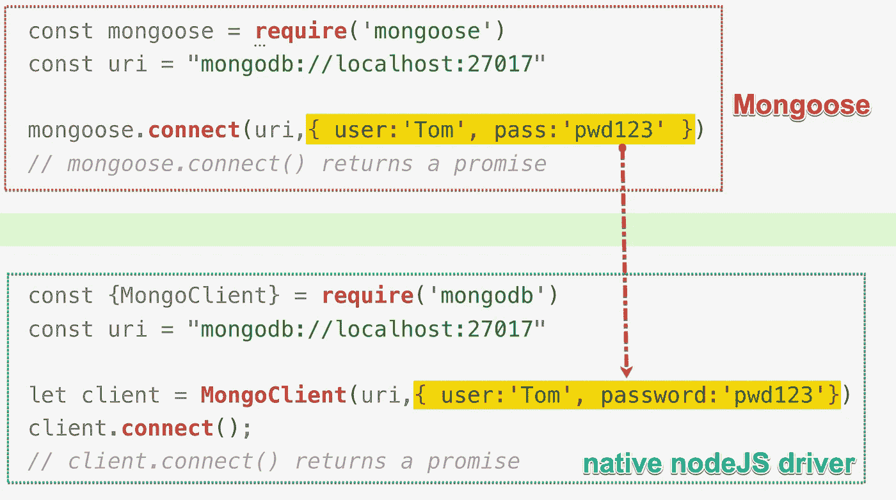

# 猫鼬初学者指南

> 原文：<https://levelup.gitconnected.com/mongoose-beginner-guide-4737b1ed1fe9>

# 学习建议

学习 mongoose 的最好方法是从后端程序员的角度来看待它，而不是从数据库管理员的角度。

Mongoose 专注于帮助我们的后端程序处理需要保存到 mongoDB 数据库和从中检索的数据。它强调对文档的操作，而“淡化”集合和数据库的作用。事实上，如果你检查猫鼬手册的内容表，你不会找到数据库或集合。

原生 mongoDB nodeJS 驱动程序和 mongo shell 方法主要从集合级别操作数据。要操作任何文档，我们首先选择目标数据库，然后获取目标集合。

Mongoose 采用了一种完全不同的方法，大多数操作都发生在文档级。对于初学者来说，使用猫鼬可能感觉像用非惯用手写字。适应猫鼬可能需要一段时间。

# 什么是猫鼬

Mongoose 角色的技术术语是 ODM:对象数据建模。它将 mongoDB 文档映射到 JS 对象，使我们的 nodeJS 程序能够操作连接的 mongoDB 数据库。

简单来说，Mongoose 是连接后端程序和 mongoDB 服务的桥梁。原生 mongoDB nodeJS 驱动程序是连接 nodeJS 程序和 mongod 进程的“官方桥梁”。

Mongoose 构建在原生 mongoDB nodeJS 驱动之上。当我们通过 mongoose 操作 mongoDB 时，我们的数据库相关操作实际上是由原生 nodeJS mongoDB 驱动来执行的。

如果检查 mongoose 包的 package.json 文件，会发现原生 mongoDB nodeJS 驱动被列为依赖项。


mongoose 包的 package.json

在学习 mongoose 之前，最好先学习如何使用原生 nodeJS mongoDB 驱动程序。

[](https://onlykiosk.medium.com/mongodb-nodejs-driver-8eae0ac84cb5) [## MongoDB NodeJS 驱动程序

### 我们在这里有一个 mongoDB 部署。它是一个独立的 mongod 进程，托管在端口 45000 上。目前，这…

onlykiosk.medium.com](https://onlykiosk.medium.com/mongodb-nodejs-driver-8eae0ac84cb5) 

# **为什么是猫鼬**

既然我们已经有了原生的 mongoDB nodeJS 驱动，那么重新发明轮子又有什么意义呢，尤其是考虑到新轮子是建立在旧轮子之上的？除此之外，mongoose 也比原生的 mongoDB nodeJS 驱动更难学。

这是 mongoose 开发者必须回答的问题。为了让他们的产品物有所值，赢得更多用户，他们必须提供更多更好的服务。简单来说，mongoose 是一个比原生 mongodb nodeJS 驱动“更大更好的桥”。mongoose 不仅为我们搭建了桥梁，还为我们提供了处理、存储和检索数据的工具。

原生 mongoDB nodeJS 驱动程序只构建桥，这意味着它只将 nodeJS 程序连接到 mongod 进程。对于我们现实生活中的项目来说，这远远不够。我们需要创建一个后端程序来操作 nodeJS 驱动程序。

在某种程度上，mongoose 就像一个半成品的后端程序。它将预定义的后端程序与原生 mongoDB nodeJS 驱动程序相结合。它为我们奠定了基础，这样我们的项目开发可以用更少的时间和精力来完成。

# 安装 Mongoose 并连接

安装 Mongoose 就像安装原生 mongoDB nodeJS 驱动一样。你先通过 NPM 安装它。然后，您需要 mongoose 包，并将其分配给一个变量。最好把变星命名为猫鼬。

你只需要安装 mongoose 包本身。您不需要安装本机驱动程序。

```
let mongoose = require('mongoose')
```

在我们收到 mongoose 包之后，我们可以开始准备连接字符串，并将其传递给*mongose . connect()*方法。

*mongose . connect()*有两个参数。第一个是连接字符串，第二个是选项对象。与连接相关的选项在这里设置，并传递给本地 nodeJS 驱动程序。

例如，在下面的示例中，用户名、密码和数据库名存储在 options 对象中。这三条信息将被传递给本地驱动程序的 MongoClient 方法，以帮助建立连接。

```
**// get connected using mongoose**mongoose.**connect**('mongodb://localhost:33333', {useNewUrlParser:true, useUnifiedTopology:true,**dbName:'cars', user:'rootUser', pass:'pwd123'**})**// mongoose.connect() returns a promise
// the fulfilled value resolves to THIS**
```

现在，我们通过 mongoose 连接到一个 mongod 进程。connect 方法返回一个承诺。完成的值解析为这个值，这意味着 connect 方法返回一个“修改的”mongoose 对象。

就像我们之前说过的，mongoose 构建在原生 mongoDB nodeJS 驱动之上。所以我们这里的连接实际上是由 MongoClient 和来自本地 MongoDB nodeJS 驱动程序的 connect 方法构建的。



# 猫鼬图案

Mongoose 是从帮助 nodeJS 程序操作 mongoDB 的角度来设计的。它侧重于解决现实生活中的需求。大多数与数据相关的操作都发生在文档级别。所以 mongoose 的设计强调文档，“淡化”了数据库和集合的作用。如果你看一下 mongoose 手册的内容表，你甚至找不到数据库或集合这个词。

建立连接时会预先选择数据库。因此，在我们连接后，我们不再需要担心选择数据库。

棘手的部分是 mongoose 如何看待 mongoDB 集合。

Mongoose 将集合视为一组满足相同文档需求的文档。这些要求包括字段名、字段值范围和类型等。这些需求由模式描述。图式通过模型起作用。这里有两个基本的猫鼬概念:模式和模型。

使用 mongo shell 或原生 mongoDB nodeJS 驱动程序，我们首先创建一个数据库和一个集合。大多数与文档相关的操作都是使用集合对象中的方法执行的。

但是对于 mongoose，我们从在文档上设置需求开始。我们首先设计文档模式，然后基于它创建一个模型。然后，我们根据模型创建文档。我们通过文档的模型来访问集合。

**Mongo Shell & nodeJS 驱动:db→集合→文档**

**mongose:文档需求(模式)→模型→文档**

# 模式和模型

MongoDB 以无模式而闻名。一个集合可以接受不同种类的文档，因此给了我们很大的灵活性。但这并不意味着您应该将任何文档都塞进同一个集合中。

为了保证数据安全，必须仔细检查所有的写操作，尤其是文档插入和更新。集合应该只接受合格的文档。您还可以选择使用后端程序或使用 mongoDB 的内置验证器来验证文档。

MongoDB 允许我们在更新和插入期间设置执行模式验证。验证规则是按集合级别设置的。这意味着 MongoDB 集合可以决定它接受哪种类型的文档。

使用原生 mongoDB nodeJS 驱动程序，您可以使用 createCollection 方法创建一个集合。在其 options 对象中，设置 validator 属性来设置模式规则。

```
**// native mongoDB nodeJS driver**let client = MongoClient(uri,{options_obj})
await client.connect()
client.**createCollection**('*coll_name*',{ **validator:{}** })
```

 [## Node.js 的 MongoDB 驱动程序 API

### 检索 MongoDB 的当前分析信息。不推荐使用的方法是直接查询 system.profile 集合。添加一个…

mongodb.github.io](http://mongodb.github.io/node-mongodb-native/3.6/api/Db.html#createCollection) 

猫鼬非常重视图式。**猫鼬的一切都必须从一个模式开始。**连接后您要做的第一件事是创建一个新的模式对象。

要创建一个新的模式，您需要实例化**模式构造器** r 并传递一个模式对象给它。模式对象规定了可接受的文档字段和字段值。

```
**// mongoose**const schema_example = new **Schema**({ **brand**:String, **model**:String })
```

上面的模式要求文档必须至少有两个列出的属性之一:brand 和 model。两个字段值都必须是字符串。

Mongoose schema 可以做**许多其他事情**，包括定义实例方法、静态模型方法、复合索引和中间件。目前，我们只关注使用模式来定义文档结构和属性的转换。我们当前的首要任务是弄清楚如何使用 mongoose 插入和读取文档。

# Mongoose 模型和 MongoDB 集合

与我们使用原生 NodeJS MongoDB 驱动程序所做的不同，我们不能直接从模式对象转到新的集合。这中间多了一个环节:模型。事实上，mongoose 并不直接访问一个集合。它通过集合的模型来操作集合。

为了构建模型，我们使用 mongoose.model 方法。它有两个参数。第一个是模型名，第二个是模式。您可以直接使用 schema 对象作为第二个参数值。

```
mongoose.**model**('**model_name**',schema or {schema_obj})
```

模型是建立在模式对象上的。你可以把它想象成一个文档模板。它从模式中继承文档需求，并在新文档中实施这些需求。

模型名称将用于命名新集合。这里注意，型号名称不会直接作为集合名称。Mongoose 附录在模型名称后面加上字母 S，并使用“复数”模型名称作为集合名称。

例如，在下面的例子中，我们将模型命名为 car_list，最终的集合名称将是 car_list **s** 。

```
const **Car** = mongoose.**model**('**car_list**',schema_obj)
```

mongoose.model 方法返回给我们一个构造函数。我们称之为模型构造器。在下面的课程中，术语模型构造函数特指由 mongoose.model()方法返回的构造函数。

构造函数名字的第一个字母应该大写。这就是为什么您应该大写接收模型方法返回值的变量的第一个字母。

那么模型构造器能为我们做什么呢？

# **通过实例化模型构造器来创建文档。**

在我们创建了模型构造器之后，我们可以开始创建新的文档。我们首先使用 JS objet 文本准备新文档。然后我们需要将这个对象文字转换成一个 mongoDB 文档。

这种转换是通过将这个对象文字传递给模型构造函数并实例化该构造函数来完成的。

模型构造器返回给我们最终的文档。不符合架构要求的字段将从文档中删除。

```
const **Car** = mongoose.**model**('**car_list**',schema)const car_1 = new **Car**({ brand:'Toyota', model:'Supra' })
```

在上面的例子中，我们成功地创建了一个带有两个定制字段的新文档:品牌和型号。将自动添加文档 ID。新文档将由模型构造器返回。

创建新文档只是第一步，最重要的一步是将其保存到 mongoDB 集合中。这需要 save 方法。这个方法来自模型构造函数返回的文档对象。

```
car_1.save() // the save method returns a promise
```

现在，新文档已经保存到基于 **car_list** 模型创建的**car _ list**集合中。

这就是我们如何创建一个新文档并将其保存到 mongoDB 中。

# 从集合中读取文档

如果我们需要查找保存的文档，只需将 find 方法连接到相应的模型构造函数。find 方法是模型构造函数的静态方法。这次不需要实例化模型构造函数。

例如，我们想读取 car_lists 集合。我们将 find 方法连接到汽车构造器。find 方法返回一个承诺。解析的值是保存检索到的文档的数组。

```
const schema = new Schema({ brand:String, model:String })const **Car** = mongoose.**model**('**car_list**',schema)*// new* ***Car****({brand:'Toyota', model:'Camry'}).****save()*** *// adding new doc***Car**.find(( err, results )=>{ console.log(results) }) 
```

# 摘要:插入和阅读文档

以下是完整的代码:

```
const mongoose  = **require**('mongoose')**// mongoose.connect() returns a promise**mongoose.**connect**('mongodb://localhost:33333', { useNewUrlParser:true, useUnifiedTopology:true, dbName:'cars', user:'rootUser', pass:'pwd123' })
.**then**( ()=>{ console.log('Connected!') } )
.**catch**( ()=>{ console.log('Cannot Connect!') } )let schema_obj = { brand:String, model:String }const **Car** = mongoose.**model**('car_list',schema_obj)let **car1** = new **Car**({brand:'Lexus', engine:'Petrol'})**car1**.**save**() // .save() returns a promise as well**Car**.find((err, results)=>{ console.log(result) })// Found any problems?
```

上面的程序可以完美地工作。但是你发现它有什么问题吗？看 save 方法的位置，有什么问题吗？

# 不需要“等待”mongoose.connect()

save 方法来自模型构造函数的实例。模型构造函数是由 mongoose 对象的 model 方法创建的。所以最后，save 方法间接地来自 mongoose 对象。这意味着 mongoose 对象的状态会影响保存方法。


我们只能在连接到 mongod 进程后保存文档。这意味着当 save 方法被执行时，连接必须已经建立。

这意味着我们应该从 mongoose connect 方法的回调中运行模型并保存方法。

如果我们不想使用回调，我们应该在 connect 方法前面加上 await，以便在连接建立之前保持模型和保存方法的执行。

所以我们这里的代码应该不起作用，因为我们把连接、建模和保存方法放在了**相同的作用域**中，而**没有给**加上前缀**等待**。所以这个程序不应该工作，因为在执行 model 和 save 方法时，连接还没有建立。在执行 save 方法之前，JS 引擎将**而不是**等待连接建立。

但这不是我们得到的结果。新文档已成功保存。那么这是怎么发生的呢？为什么一个不正确的程序可以产生正确的结果？

答案可以在手册里找到。

 [## mongose v 5 . 10 . 15:连接到 MongoDB

### 可以用 mongoose.connect()方法连接到 MongoDB。这是连接 myapp 数据库的最低要求…

mongoosejs.com](https://mongoosejs.com/docs/connections.html) 

默认情况下，mongose 会缓冲模型函数，这意味着 mongose 会在连接建立之前暂停模型方法的执行。这就是为什么 save 方法可以在 connect 方法的回调之外工作。

您可以通过全局关闭 bufferCommands 来关闭缓冲功能。

```
mongoose.set('**bufferCommands**', false);
```

这是一个非常有用的功能。这让我们在安排代码时更加灵活。我们可以避免嵌套回调或者使用异步 await。

顺便说一下，从手册的描述中，我们也可以看出，我们早在运行 model 方法时就需要连接，而不是 save 方法。建模方法还负责创建新的集合。所以它需要一个已建立的连接。

# 手动创建新收藏

猫鼬淡化了收藏的作用。它更喜欢使用模型的概念来指代集合。默认情况下，在我们创建了一个新模型之后，mongoose 会自动为我们创建一个新的集合。我们可以关闭这个特性，手动创建一个新的收藏。

在设计模式时，我们将 false 赋给 autoCreate。

然后，我们将模式传递给 mongoose.model()方法，以创建一个新的模型构造函数。

然后我们从模型构造函数调用 createCollection 方法。createCollection 方法返回一个承诺，有两个参数。第一个是选项对象，第二个是回调。

在这个例子中，我们已经手动创建了一个封顶的集合。新系列仍以型号名称命名。

```
const schema = new Schema( { **autoCreate: false** } )const New_model = mongoose.model('model_name', schema)New_model.**createCollection**(**{capped:true, size:5120}**, ()=>{})
```

从这个设计也可以看出，mongoose 淡化了集合的作用，想用模型代替集合。模型是一组满足相同模式的文档。本质上还是一个文档级的概念。

