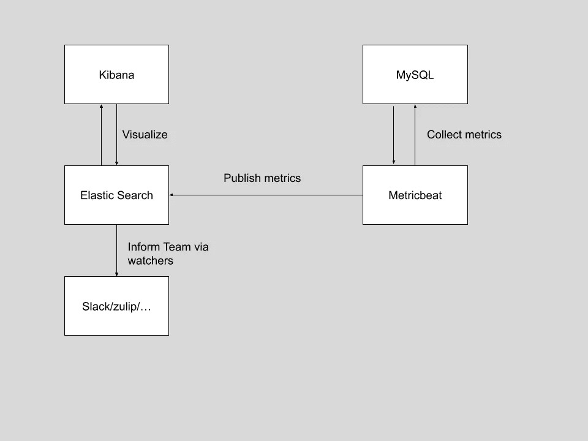
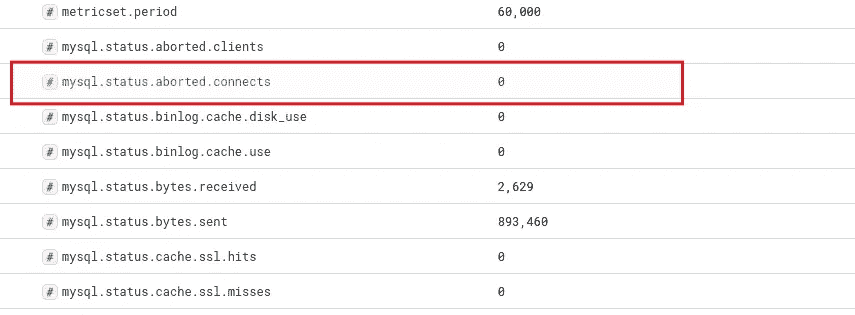
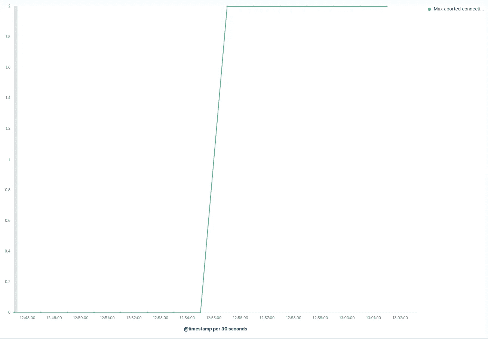
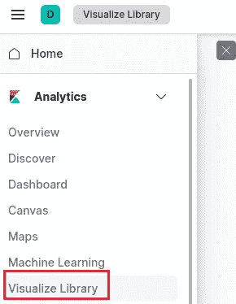
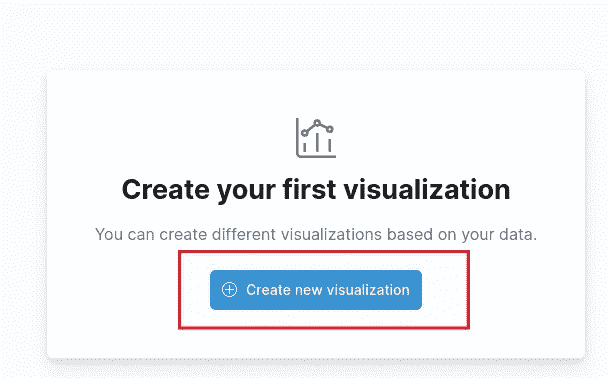
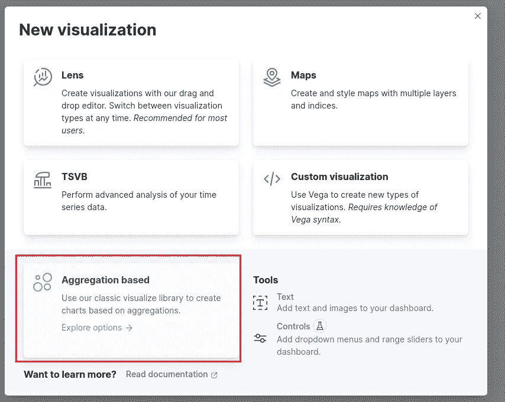
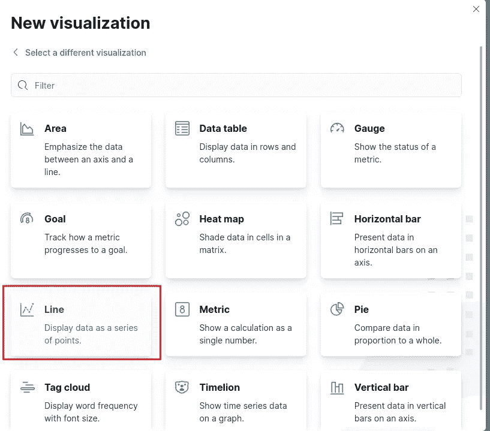
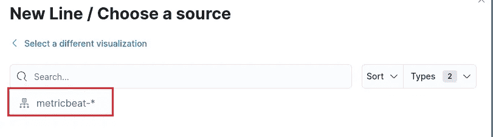
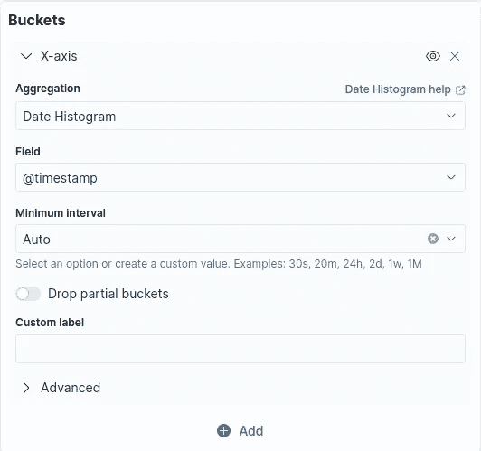
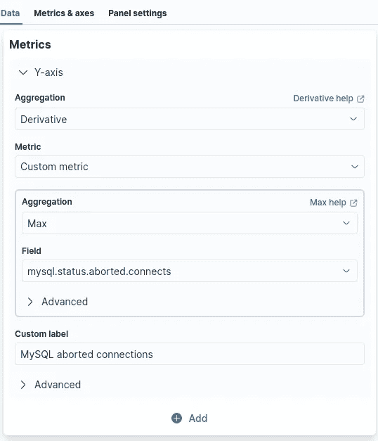

# 使用 metricbeat 监控中止的 MySQL 连接

> 原文：<https://levelup.gitconnected.com/monitor-aborted-mysql-connections-using-metricbeat-4f184f6a3dbf>

## [现场可靠性工程](https://medium.com/@anasanjaria/list/site-reliability-engineering-fd4dc0eabf12)


由[卢克·切瑟](https://unsplash.com/@lukechesser?utm_source=medium&utm_medium=referral)在 [Unsplash](https://unsplash.com?utm_source=medium&utm_medium=referral) 拍摄的照片

我们的生产系统中有监视程序，当系统出现问题时，它会通知我们。突然，其中一个系统变得不正常，尽管有有效的凭证，它还是无法连接 MySQL。

经过调查，我们注意到 MySQL 由于磁盘空间已满而拒绝连接。通过增加磁盘空间解决了该问题。

我们的团队决定收集中止的 MySQL 连接和磁盘空间指标。这个故事只关注收集中止的 MySQL 连接指标。

# 基本工作流程

工作流程如下

1.  我们使用 metricbeat 的模块[1]收集 MySQL 指标
2.  Metricbeat 向 elasticsearch 发布收集的指标。
3.  使用 Kibana，我们可以将这些信息可视化。
4.  我们可以使用观察者[2]通知我们的团队



收集 MySQL 指标的基本工作流程

# 概念证明

源代码—[https://github . com/anasanjaria/monitoring-course/tree/main/monitor-MySQL-aborted-connection](https://github.com/anasanjaria/monitoring-course/tree/main/monitor-mysql-aborted-connection)

# 收集 MySQL 指标

我们使用 metricbeat 收集 MySQL 指标，如下所示:

```
metricbeat.modules:
- module: mysql
  metricsets:
  - "status"
  period: 1m
  hosts: ["tcp(localhost:3306)/"]
  username: root
  password: secret
```

使用以下代码将指标发布到弹性搜索。

```
output.elasticsearch:
  hosts: ["http://localhost:9200"]
```

您可以使用 kibana 中的`Discover`在 [http://localhost:5601/](http://localhost:5601/) 查看收集的指标。`mysql.status.aborted.connects`是感兴趣的度量。



通过 metricbeat 收集的 MySQL 指标

# 了解如何使用收集的指标

收集完指标后，理解如何使用这些信息至关重要。让我们看一个例子。

如果没有中止的连接，该值保持不变。但是如果有中止的连接，它将继续增加。重要的是要注意，当没有中止的连接时，该度量不会回到零，而是保持在相同的水平。



随着时间的推移中止的连接

这意味着我们感兴趣的是检测中止连接随时间的行为变化，即*中止连接的瞬时变化*。因此，我们使用导数聚合[3][4]。

再者，我们都知道常数的导数是 0。如果没有中止的连接，该值将保持不变。因此，导数将是 0，也就是说，没有中止的连接。

# 通过 Kibana 可视化中止的连接

选择`Visualize Library`



创建可视化



选择基于聚合的可视化



选择线形图



选择度量基准指数



按照以下步骤调整 x 轴和 y 轴



按下`Update`按钮查看结果。


随着时间的推移中止的 MySQL 连接

如你所见，我们只有中止的连接~12:55。

# 将问题告知团队

您可以使用 watcher API [5]通知您的团队。观察器将定期检索数据，并在条件满足时通知我们的团队。收到通知后，团队会采取相应的行动。

假设我们想每隔 1 小时触发一次观察器。

```
"trigger": {
  "schedule": {
    "interval": "1h"
  }
}
```

由于我们将指标存储在`metricbeat`索引中，因此

```
"indices": [
  "<metricbeat-*-{now/d}>"
]
```

我们可以使用以下查询来查询 MySQL 指标。

**提示:**您可以通过检查 Chrome 或 Firefox 中的元素来生成弹性搜索查询。例如，我做了同样的事情，并调整了查询，使其更具可读性。

```
"input": {
  "search": {
   "request": {
    "search_type": "query_then_fetch",
    "indices": [
     "<metricbeat-*-{now/d}>"
    ],
    "body": {
     "size": 0,
     "query": {
      "bool": {
       "must": [
        {
         "range": {
          "[@timestamp](http://twitter.com/timestamp)": {
           "gte": "now-1h"
          }
         }
        },
        {
         "term": {
          "service.type": "mysql"
         }
        },
        {
         "term": {
          "metricset.name": "status"
         }
        }
       ]
      }
     },
     "aggs": {
      "aborted_connections_over_time": {
       "date_histogram": {
        "field": "[@timestamp](http://twitter.com/timestamp)",
        "calendar_interval": "1h"
       },
       "aggs": {
        "max_aborted_connections": {
         "max": {
          "field": "mysql.status.aborted.connects"
         }
        },
        "instantaneous_change": {
         "derivative": {
          "buckets_path": "max_aborted_connections"
         }
        }
       }
      }
     }
    }
   }
  }
 }
```

如果聚合中至少有一个存储桶有瞬时更改(> 0)，以下条件将返回 true。

```
"condition": {
  "array_compare": {
   "ctx.payload.aggregations.aborted_connections_over_time.buckets": {
    "path": "instantaneous_change",
    "gt": {
     "value": 0
    }
   }
  }
 }
```

通过 slack 通知团队

```
-- copied from [https://www.elastic.co/guide/en/elasticsearch/reference/7.17//actions-slack.html](https://www.elastic.co/guide/en/elasticsearch/reference/7.17//actions-slack.html) "actions" : {
  "notify-slack" : {
    "transform" : { ... },
    "throttle_period" : "5m",
    "slack" : {
      "message" : {
        "to" : [ "#admins", "@chief-admin" ], 
        "text" : "Encountered  {{ctx.payload.hits.total}} errors in the last 5 minutes (facepalm)" 
      }
    }
  }
}
```

感谢阅读。

# 资源

[1][https://www . elastic . co/guide/en/beats/metric beat/7.17/metric beat-module-MySQL . html](https://www.elastic.co/guide/en/beats/metricbeat/7.17/metricbeat-module-mysql.html)

[https://www.elastic.co/guide/en/kibana/7.17/watcher-ui.html](https://www.elastic.co/guide/en/kibana/7.17/watcher-ui.html)

[https://www.youtube.com/watch?v=lowavG2SXsQ](https://www.youtube.com/watch?v=lowavG2SXsQ)

[4][https://www . elastic . co/guide/en/elastic search/reference/7.17/search-aggregations-pipeline-derivative-aggregation . html](https://www.elastic.co/guide/en/elasticsearch/reference/7.17/search-aggregations-pipeline-derivative-aggregation.html)

[5][https://www . elastic . co/guide/en/elastic search/reference/7.17//watcher-API-put-watch . html](https://www.elastic.co/guide/en/elasticsearch/reference/7.17//watcher-api-put-watch.html)

如果你喜欢这篇文章，你可能也会喜欢我的网站可靠性工程系列。


[阿纳斯·安贾里亚](https://medium.com/@anasanjaria?source=post_page-----4f184f6a3dbf--------------------------------)

## 现场可靠性工程

[View list](https://medium.com/@anasanjaria/list/site-reliability-engineering-fd4dc0eabf12?source=post_page-----4f184f6a3dbf--------------------------------)6 stories

```
**Want to connect?** [http://anasanjaria.bio.link/](http://anasanjaria.bio.link/)
```