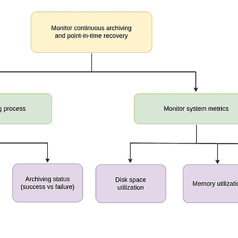

# 监控可行的剧本执行

> 原文：<https://levelup.gitconnected.com/monitor-ansible-playbook-executions-bf92ce16d100>

## [现场可靠性工程](https://medium.com/@anasanjaria/list/site-reliability-engineering-fd4dc0eabf12)


由[马库斯·温克勒](https://unsplash.com/@markuswinkler?utm_source=medium&utm_medium=referral)在 [Unsplash](https://unsplash.com?utm_source=medium&utm_medium=referral) 上拍摄

我计划在生产系统中使用一个配置管理工具。当涉及到生产系统时，了解哪些配置应用成功，哪些没有应用成功是很重要的。

在互联网上花了一些时间后，我无法找到一种简单的方法来监控失败的执行。因此我想出了这个解决方案。

# 基本工作流程

1.  使用 [log_plays](https://docs.ansible.com/ansible/latest/collections/community/general/log_plays_callback.html) 将剧本输出转储到特定于主机的文件中。
2.  使用 [filebeat](https://www.elastic.co/beats/filebeat) 将这些日志发送到 elasticsearch。
3.  最后，使用 [kibana](https://www.elastic.co/kibana/) 可视化信息。


监控剧本执行的基本工作流程

# 概念证明

源代码:[此处](https://github.com/anasanjaria/monitor-ansible-playbook-executions)

Ansible 提供了一个回调函数，通过使用下面的配置将剧本输出写到每个主机的一个文件中。

```
-- ansible.cfg[defaults]   
stdout_callback = log_plays
```

这将转储以下格式的剧本执行日志。

```
time - path-to-playbook - task-name - task-command - task-status - task-outputtime - path-to-playbook - task-name - task-command - task-status - task-output
```

这些日志通过[解析](https://www.elastic.co/guide/en/elasticsearch/reference/7.17/dissect-processor.html)处理器使用 filebeat 进行解析。由于两个消息之间有一个空行，因此解析是有条件地完成的。

```
processors:  
- dissect:  
    when:  
      not:  
        equals:  
          message: ""  
    tokenizer: "%{time} - %{playbook_path} - %{task_name} - %{task_cmd} - %{task_status} - %{task_output}"  
    field: "message"  
    target_prefix: "ansible"
```

为了用主机信息丰富日志，使用了[脚本](https://www.elastic.co/guide/en/elasticsearch/reference/7.17/script-processor.html)处理器。

```
- script:  
    lang: javascript  
    source: >  
      function process(event) {  
          var ansible_path = event.Get("log.file.path");  
          var host = ansible_path.split("/").pop();  
          event.Put('ansible.host', host)  
      }
```

最后，日志被发布到 elasticsearch。

```
output.elasticsearch:  
  enabled: true  
  hosts: ["elasticsearch-1:9200"]
```

现在，人们可以通过 kibana 可视化这些信息，并添加观察器，以便在出现故障时通知团队。


可行的执行状态—成功与失败

感谢阅读。

如果你喜欢这篇文章，你可能也会喜欢我的网站可靠性工程系列。


阿纳斯·安贾里亚

## 现场可靠性工程

[View list](https://medium.com/@anasanjaria/list/site-reliability-engineering-fd4dc0eabf12?source=post_page-----bf92ce16d100--------------------------------)6 stories

```
**Want to connect?** [http://anasanjaria.bio.link/](http://anasanjaria.bio.link/)
```