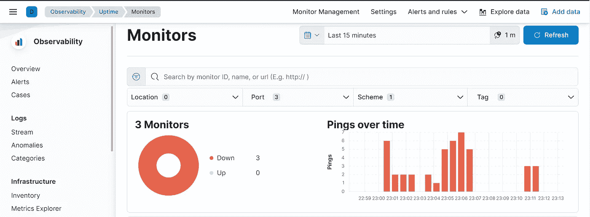
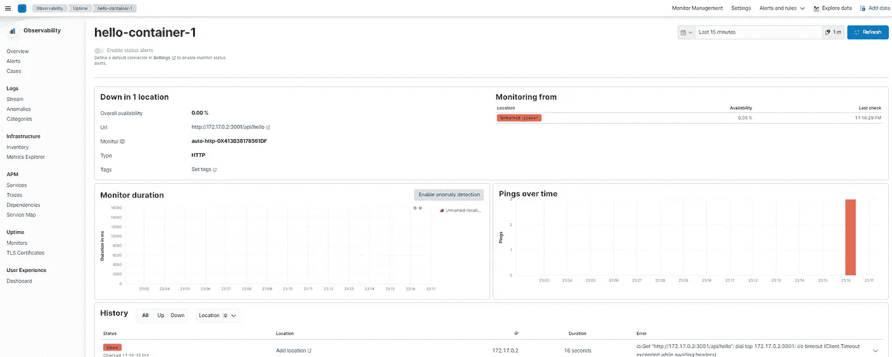

# 使用 Heartbeat 和本地 Elasticsearch 和 Kibana 监控多个容器实例

> 原文：<https://levelup.gitconnected.com/monitor-multiple-container-instances-with-heartbeat-and-local-elasticsearch-and-kibana-3ea384bb703a>


由[卢克·切瑟](https://unsplash.com/@lukechesser?utm_source=unsplash&utm_medium=referral&utm_content=creditCopyText)在 [Unsplash](https://unsplash.com/s/photos/monitoring?utm_source=unsplash&utm_medium=referral&utm_content=creditCopyText) 上拍摄的照片

很高兴在这个弹性堆栈系列中再次见到您😊。今天我们继续我们的心跳冒险，介绍**自动发现**。

在上一篇文章中，我们看到了如何将 Heartbeat 与 local Elasticsearch 和 Kibana 结合使用，我们还谈到了监视器。点击[此链接](https://blog.devgenius.io/heartbeat-with-local-elasticsearch-and-kibana-69b99f7e23a6)并阅读文章，以了解最新讨论情况。*监视器*被定义为我们创建的那些小配置，用来告诉 Heartbeat 如何收集系统和服务可用性数据。

在我们的`heartbeat.yml`配置文件中，我们要求 Heartbeat 每隔 5s 从 URL 参数中描述的端点收集正常运行时间数据。

通常，您会为想要收集可用性数据的每个应用程序或服务创建一个监视器，但如果您处理的是作为 Docker 容器部署的应用程序，这可能会很不方便，因为您可能不知道它们的端点以及有多少实例正在运行。

挑战在于从一个映像监控多个容器实例，以收集可用性数据。我们需要找到一种方法来配置 Heartbeat，以自动发现这些容器实例，并将动态监视器与这些实例中的每一个相关联。这个问题是通过使用一个叫做**自动发现**的特性解决的。让我们看看它是如何工作的！

让我们首先在文件夹的根目录下创建一个配置文件，并将其命名为`config.yml`。我们将通过使用提供者来配置 Autodiscover，以匹配来自特定映像的任何容器实例。

自动发现**提供程序**的操作方式是密切关注系统事件，并以通用格式将它们转换为内部自动发现事件。Heartbeat 支持三种不同的提供者: **Docker** ， **Kubernetes** *(用于监视 Kubernetes 节点)*和 **Amazon ELBs** *(这个是实验性的)*。这里只说 Docker。查看本页了解更多关于其他人的信息。

对于每个提供者，我们需要配置一个*模板*，即一个*条件*和一个*配置*的组合。*条件*将告诉 Heartbeat 如何匹配和检测容器实例。这里我们要求 Heartbeat 从调用的 docker 映像"*Abdel hk/hello-microservice "*中识别任何容器实例。

在*配置*中，我们告诉 Heartbeat 如何实例化将与检测到的容器实例相关联的动态监视器。我们这里的监视器是 *http* 类型，每 5 秒检查一次*，并将指向动态收集的主机*(主机+端口)*。我们还可以添加一个*名称*，以便在读取 Kibana 上的正常运行时间数据时容易识别容器。*输出*不需要额外的信息，它总是在安全禁用的情况下保持弹性搜索。生成的代码如下:*

```
heartbeat.autodiscover:
  providers:
    - type: docker
      host: 'npipe:////./pipe/docker_engine'
      templates:
        - condition:
          contains:
            docker.container.image: abdelhk/hello-microservice
          config:
            - type: http
              name: "${data.docker.container.name}"
              hosts: ["${data.host}:${data.port}/api/hello"]
              schedule: "@every 5s"output.elasticsearch:
  hosts: localhost:9200
```

注意:本教程是在 Windows 系统上创建的，这就是主机被修改的原因，因为默认情况下，Docker 自动发现会尝试连接到`unix:///var/run/docker.sock`

现在让我们通过运行以下命令启动 Heartbeat，该命令使用`-c`标志将配置文件指定为一个参数。

```
./heartbeat -c config.yml -e
```

Heartbeat 现在可以识别任何符合标准的容器实例了。

我们的 NodeJS 应用程序的图像已经可供您使用，以使任务更容易。您只需要使用以下命令从 docker hub 中提取它:

```
docker pull abdelhk/hello-microservice
```

如果您正在处理一个不同的框架或应用程序，您总是可以构建它的映像。现在让我们创建我们的容器。您可以运行以下命令来检查有多少容器正在运行:`docker ps`目前我们只有两个容器， *Elasticsearch* 和 *Kibana* 。通过运行下面的命令，一个名为 *hello-container-1* 的容器将被链接到我们主机的端口 *9090* 并被启动。

```
docker run --name hello-container-1 -p 9090:3001 -d abdelhk/hello-microservice
```

使用**不同端口** ( *主机端口*)和**名称**重复该命令以创建其他容器。之后开基巴纳。渲染如下所示:



按照配置自动为每个实例创建一个监视器*(这里，我们创建了 3 个容器)*。您可能已经注意到我们的容器正在运行，但是 Heartbeat 告诉我们它们都关闭了。这可能是因为每个容器运行在不同的网络上，主机上运行的 Heartbeat 不能访问这些网络。这个问题很容易通过在运行容器的同一网络上运行 Heartbeat 来解决。

对于每个监视器，Kibana 为我们提供了关于监视器执行的更多信息和一些元数据，如*监视器持续时间*，*随时间执行的 pings】，以及*检查历史*。*



我们今天就到这里。请查看关于这个主题的官方文档，以了解更多细节..感谢您的阅读，如果您对本文有任何问题或评论，请在下面留下您的评论。

我们下次再见，看更多的帖子🚀。

阿卜杜尔-巴吉