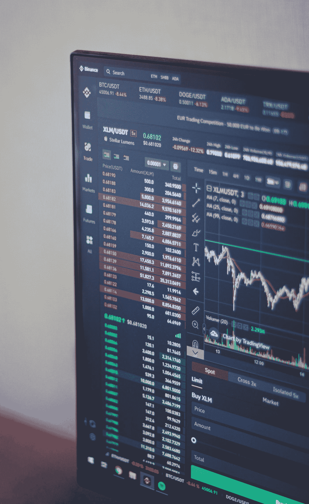

# 监控和警报 101

> 原文：<https://levelup.gitconnected.com/monitoring-alerting-101-ac21ab8c5635>

## 由专业软件工程师讲解监控和警报的基础知识

贝南·诺鲁齐在 [Unsplash](https://unsplash.com?utm_source=medium&utm_medium=referral) 上的照片

监控是了解系统状态的过程。有两种类型的监控，主动监控和被动监控。本质上，您可以在图形板上观察可视化效果，并自己进行分析。当关于系统状态的某些条件被触发时，您将需要通知，例如，如果错误请求的数量超过 x，这最后一部分称为警报。

监控和警报的一个重要部分是速度和准确性。你想知道这件事发生的确切时间，并想尽可能多地了解它的细节。您希望始终了解的系统状态的一些非常重要的方面是系统的可用性。更多的停机时间意味着更多的金钱损失。请注意，这与系统性能不同。虽然较慢的性能在技术上确实意味着更多的金钱损失，因为用户可能会远离应用程序(这是人们的注意力范围变得比以往任何时候都小的副产品)。

监控的一个非常重要的部分是积累数据。在做决策时，数据可能是最重要的因素。如今的企业越来越注重构建高质量的系统，尽可能多地收集数据。监控系统从技术上收集了大量有用的数据，这些数据将有助于开发人员做出最佳的商业和工程决策。

监控的一个有趣副产品是自动化。有时开发人员会发现一项任务花费的时间比预期的要长，可以通过某种方式实现自动化和简化。虽然有些情况肯定需要人工干预，但这就是所谓的准入控制。一种特定类型的准入控制是大红色按钮(BRB)(需要“点击大红色按钮”)。

如果您从数据科学的角度来看监控数据，您会注意到这些数据主要是时间序列数据。分析时间序列数据有时很有挑战性。每个数据输入都有许多描述它的属性和收集它的确切时间。这也称为指标，从根本上说是一种针对数字输入的存储和检索而优化的数据结构。可以收集、汇总一组指标，并进一步分析成“汇总统计”，这是我们开始从软件工程转向数据科学的起点。

监控系统是一个全天候运行的系统，它可以查询系统的当前状态、收集数据、汇总数据、将其放在仪表板上，并在必要时发出警报。这可能非常昂贵！有时可能很难判断这个成本是否合理。但通常，从该系统收集的数据中做出的决策将证明成本是合理的，否则就不会做出这些决策。

监控系统中一个有趣的部分就是问题跟踪。问题跟踪系统是以票据形式记录的已报告问题的数据库。这些票证是开发人员需要解决的基本任务。典型的软件工程团队会考虑处理这些事件和票据的能力。这被认为是一项常规任务，因为它实际上是维护系统，而不是引入新功能。

在本文中，我们介绍了警报和监控的基础知识。了解这两个概念是成为一名成功的软件工程师的基础。你不仅要构建功能齐全的软件应用，还要构建允许有效警报和监控的系统。

这篇文章的灵感来自这本[书](https://ebay.us/NIvUcQ)(你可以通过这个附属链接购买)。说实话，奥雷利的书的质量令人惊叹。

更多软件工程概念解释、教程等等，添加你的邮箱[这里](https://artisanal-motivator-8249.ck.page/5524b8f934) &订阅！